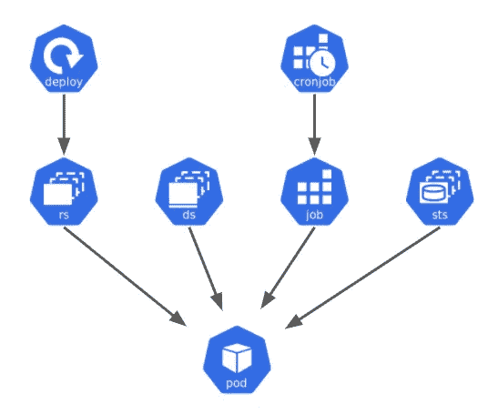
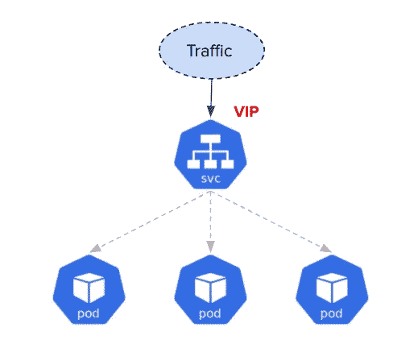
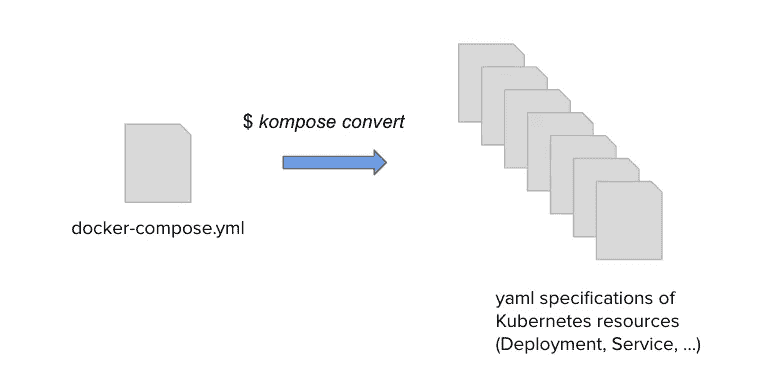
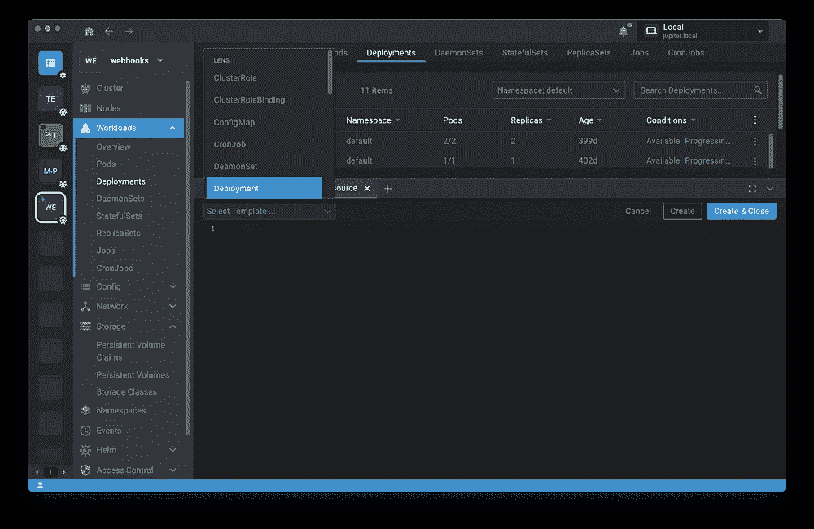
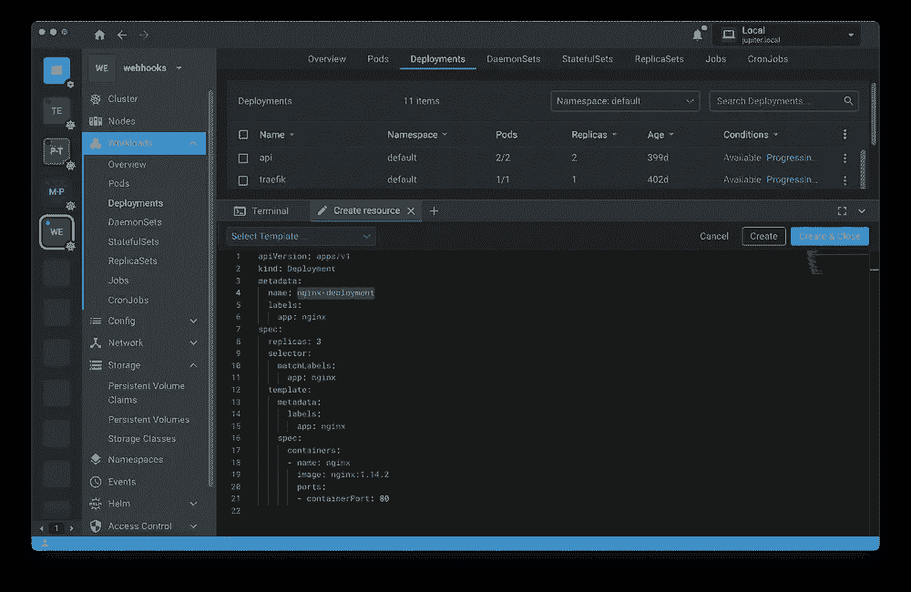
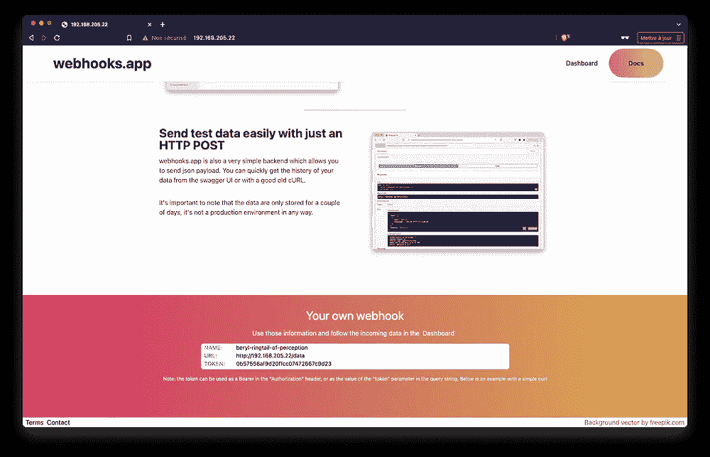
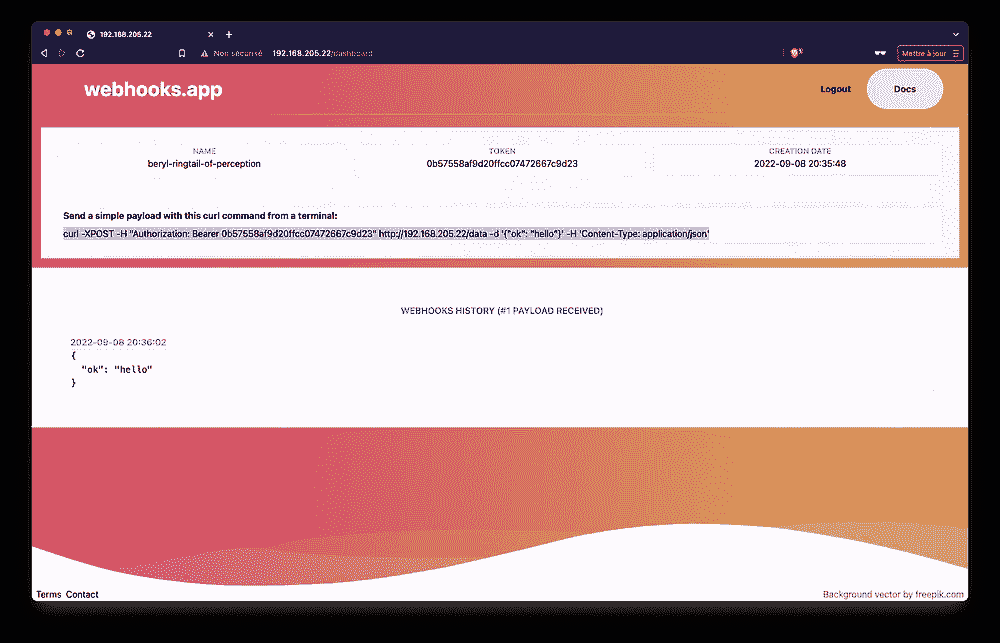

# Kubernetes 世界的微服务应用之旅

> 原文：<https://itnext.io/journey-of-a-microservice-application-in-the-kubernetes-world-3c2a9e701e9f?source=collection_archive---------0----------------------->

## 在 k3s 上本地运行应用程序


普里西拉·杜·普里兹在 [Unsplash](https://unsplash.com/s/photos/local?utm_source=unsplash&utm_medium=referral&utm_content=creditCopyText) 上的照片

## TL；速度三角形定位法(dead reckoning)

在[的上一篇文章](/journey-of-a-microservice-application-in-the-kubernetes-world-bdfe795532ef)(本系列的第一篇)中，我们介绍了 [webhooks](https://webhooks.app) 应用程序，并了解了如何使用 Docker Compose 在本地运行它。我们现在将在本地 Kubernetes 集群上部署相同的应用程序。

## 本系列文章

*   [web hooks . app 的展示](/journey-of-a-microservice-application-in-the-kubernetes-world-bdfe795532ef)
*   使用 Helm 在 Kubernetes 上运行应用程序(当前文章)
*   [在 Civo Kubernetes 集群上运行应用](/journey-of-a-microservice-application-in-the-kubernetes-world-e800579f0be3)
*   [使用 GitOps 和 ArgoCD 进行连续部署](/journey-of-a-microservice-application-in-the-kubernetes-world-d9493b19edff)
*   [使用 Loki 堆栈的可观察性](/journey-of-a-microservice-application-in-the-kubernetes-world-876f72ce1681)
*   [使用 Acorn 定义应用](/journey-of-a-microservice-application-in-the-kubernetes-world-e2f6475ddde1)
*   [安全注意事项:安全相关工具](/journey-of-a-microservice-application-in-the-kubernetes-world-6abd625c60fe)
*   [安全考虑:修复错误配置](/journey-of-a-microservice-application-in-the-kubernetes-world-eb0fb52e1bf0)
*   [安全考虑:策略实施](/journey-of-a-microservice-application-in-the-kubernetes-world-f760cba7600f)
*   安全考虑:漏洞扫描(即将推出)

## 在这篇文章中

既然我们对应用程序有了基本的了解，并且知道如何使用 Docker Compose 在本地运行它，那么是时候更进一步，在 Kubernetes 上运行它了。在本文中，我们将完成以下任务:

*   基于 k3s 创建本地 Kubernetes 集群
*   解释如何将应用程序打包成一个舵图，并将其部署在集群上
*   添加一个入口控制器来暴露应用程序，以便我们可以从浏览器访问它

## 创建本地 k3s 集群

我们将首先使用 [Multipass](https://multipass.run) 创建一个 Ubuntu VM，并在其中安装[k3s](https://k3s.io)(Rancher 的一个轻量级 Kubernetes 发行版)。

注:运行一个本地 Kubernetes 集群有很多解决方案( [Minikube](https://minikube.sigs.k8s.io/docs/) ， [microk8s](https://microk8s.io/) ， [k0s](https://k0sproject.io/) ，…)，[Multipass](https://multipass.run)+[k3s](https://k3s.io)是我的最爱之一。

1.  **配置本地虚拟机**

一旦在本地机器上安装了 Multipass，我们就创建一个名为 kube 的 VM。虚拟机启动并运行只需几十秒钟:

```
$ multipass launch --name kube --cpus 4 --mem 4G --disk 10G
```

注意:默认情况下，Multipass 创建一个具有 1 个 cpu、1G RAM 和 5G HD 的虚拟机。在上面的命令中，我们使用专用标志给了 VM 更多的资源。

我们检索该虚拟机的外部 IP 地址，因为我们稍后会用到它:

```
**$ multipass info kube**
Name:           kube
State:          Running
IPv4:           **192.168.205.22  <- we will use in the test step**
                10.42.0.0
                10.42.0.1
Release:        Ubuntu 20.04.4 LTS
Image hash:     a12805170d70 (Ubuntu 20.04 LTS)
Load:           1.18 1.18 1.12
Disk usage:     3.8G out of 9.5G
Memory usage:   1.2G out of 3.8G
Mounts:         --
```

**2。安装 k3s**

首先，我们在虚拟机上运行一个 shell

```
$ multipass shell kube
```

接下来我们安装 k3s:

```
~$ curl -sfL [https://get.k3s.io](https://get.k3s.io) | sh -s - —-no-deploy=traefik
```

注意:标志 *- no-deploy=traefik* 用于防止 traefik 入口控制器的默认安装。我们将在下一步使用特定的参数安装它

再一次，k3s 应该只需要几十秒就可以启动并运行了(很漂亮，对吧？:) ).我们可以使用以下命令来验证这一点，该命令使用 k3s 中嵌入的 kubectl 客户端:

```
ubuntu@kube:~$ sudo k3s kubectl get no
NAME   STATUS   ROLES                  AGE   VERSION
k3s    Ready    control-plane,master   34s   v1.24.4+k3s1
```

**3。从您的本地机器**访问集群

在上一步中，我们从虚拟机内部运行 kubectl 命令，但是在现实世界中，集群是从节点外部访问的。

一旦我们在本地机器上安装了 [*kubectl*](https://kubernetes.io/docs/tasks/tools/#kubectl) 二进制文件，我们就会获得在集群创建期间创建的 kubeconfig 文件，并将其保存在本地:

```
$ multipass exec kube -- sudo cat /etc/rancher/k3s/k3s.yaml > config
```

接下来，我们将本地 IP 替换为虚拟机的 IP 地址:

```
IP=$(multipass info kube | grep IP | awk '{print $2}')
sed -i.bak "s/127.0.0.1/$IP/" config
```

然后我们通过设置 KUBECONFIG 环境变量来配置我们的本地 kubectl:

```
export KUBECONFIG=$PWD/config
```

我们现在可以列出本地机器上的节点(这里只有一个):

```
$ kubectl get no
NAME   STATUS   ROLES                  AGE     VERSION
k3s    Ready    control-plane,master   3m51s   v1.24.4+k3s1
```

我们的集群已经准备好了，我们可以从本地机器与它通信，现在让我们看看如何准备应用程序，以便它可以在 Kubernetes 中运行。

## 关于容器图像

在上一篇文章中，我们使用 Docker Compose 来运行应用程序。第一次运行 *docker compose up* 命令时，构建容器映像，然后启动容器。

为了在 Kubernetes 中运行应用程序，需要预先创建容器映像并将其托管在容器注册表中，这样 Kubernetes 就可以将它们下载到集群的节点上，并在其中运行容器。

正如我们之前看到的，每个 GitLab 存储库(包括 **api** 、 **ws** 、 **www** )都有自己的容器注册中心。每次将代码更改推送到微服务存储库的主分支时，CI 都会触发构建容器映像并将其推送到注册中心。


已经为 api 微服务构建的容器映像的历史

通向 api 微服务映像的途径是*registry.gitlab.com/web-hook/api:TAG, w*e 将在我们下一步创建的 Kubernetes 部署规范中引用这些映像。

## 从 Docker Compose 到 Kubernetes 规范

Kubernetes 不知道如何运行 Docker Compose 应用程序(至少现在不知道)，所以我们需要将现有的 *docker-compose.yml* 文件转换成 Kubernetes 理解的 yaml 规范。一个 docker-compose.yml 文件可以转换成许多 yaml 文件，这些文件定义了如何运行应用程序的容器以及如何公开这些容器。

让我们快速回顾一下我们可以用来运行应用程序的一些主要 Kubernetes 资源:

Pod 是 Kubernetes 中最小的工作负载单元(读:运行容器的单元)，Pod 通常由更高级别的对象创建和管理。以下模式显示了可用于创建 Pod 的 Kubernetes 资源



可以使用多种资源来管理 pod

每种资源通常用于特定的用例:

*   **部署** : web 服务器，api
*   **DaemonSet** :在集群的每个节点上运行的代理
*   **StatefulSet** :管理有状态应用程序(例如:MySQL 集群)
*   **作业** / **CronJob** :批量作业(例如:ML 模型训练)

在上述资源之上，一旦应用程序被部署在 Pod 中，就需要一个服务来公开应用程序。基本上，服务允许向应用程序单元发送请求。



默认情况下，pod 是不公开的，为此需要创建一个服务对象

简而言之，对于在 *docker-compose.yml* 文件中定义的每个微服务，我们需要创建:

*   一个**部署**资源，负责管理运行微服务的容器映像的 pod
*   一个**服务**资源，负责向应用程序的其他微服务公开 Pod 的容器

有一个名为 [kompose](https://kompose.io) 的便捷工具可以(在一定程度上)将 *docker-compose.yml* 文件翻译成 Kubernetes yaml 规范。



一旦安装了 *kompose* 二进制文件，我们运行下面的命令来获取一些 Kubernetes 规范，它为组成我们的应用程序的每个微服务生成一个**部署**和一个**服务**。

```
$ kompose convert -f docker-compose.yaml
...
INFO Kubernetes file "manifests/api-service.yaml" created
INFO Kubernetes file "manifests/mongo-service.yaml" created
INFO Kubernetes file "manifests/nats-service.yaml" created
INFO Kubernetes file "manifests/ws-service.yaml" created
INFO Kubernetes file "manifests/www-service.yaml" created
INFO Kubernetes file "manifests/api-deployment.yaml" created
INFO Kubernetes file "manifests/mongo-deployment.yaml" created
INFO Kubernetes file "manifests/nats-deployment.yaml" created
INFO Kubernetes file "manifests/ws-deployment.yaml" created
INFO Kubernetes file "manifests/www-deployment.yaml" created
```

注意:Kompose 也生成了与存储相关的规范，但是为了清楚起见，我将它们隐藏起来，因为我们将在本系列的后续文章中回到存储。

Kompose 生成的规范通常不能按原样使用，在它准确地代表我们的应用程序之前，需要对它们进行一些清理(有时是相当多的清理)。然而，它们可以成为更熟悉 Kubernetes 规范的良好起点。

如果我们不想使用 Kompose(除了演示目的，我很少这样做),我们可以使用 IDE 的 Kubernetes 扩展，它可以生成简单的规范模板，所以我们只需要填写空白字段，指定资源的名称，必须使用的图像等



Lens 允许创建一个资源模板(在这个例子中是一个部署)，所以我们只需要根据我们的需要对它进行修改

在 webhooks.app 应用程序的上下文中，我们需要为每个微服务部署和服务，下面的示例显示了 api 的部署和服务规范:

*   api 的部署规范(稍后将对其进行增强):

```
# deploy-api.yaml
apiVersion: apps/v1
kind: Deployment
metadata:
  labels:
    app: api
  name: api
spec:
  selector:
    matchLabels:
      app: api
  template:
    metadata:
      labels:
        app: api
    spec:
      containers:
      - image: registry.gitlab.com/web-hook/api:**v1.0.33** name: api
```

*   用于公开 api 工作负载的服务规范示例:

```
# service-api.yaml
apiVersion: v1
kind: Service
metadata:
  labels:
    app: api
  name: api
spec:
  ports:
  - port: 80
    targetPort: 5000
  selector:
    app: api
  type: ClusterIP
```

一旦我们为每个微服务创建了部署和服务规范，我们就可以运行 *kubectl apply* 并在集群中创建所有相应的 Pods。

当新版本的微服务可用时，我们只需更改部署中的映像标签(例如在上面的示例中用 1.0.34 版替换 1.0.33 版)并再次运行相同的 *kubectl apply* 命令。这将终止基于映像*registry.gitlab.com/web-hook/api:****v 1 . 0 . 33***运行容器的 Pod，并运行基于***registry.gitlab.com/web-hook/api:****v 1 . 0 . 34*的新 Pod。这种方法可行，但不是很有活力。****

**下面我们将使用 Kubernetes 的包管理器 [Helm](https://helm.sh) ，将 yaml 规范组织在一个预定义的文件夹结构中，并在其中添加部分模板语言。**

## **将应用程序打包成舵图**

**Helm 是 Kubernetes 的产品包经理。它是一个需要下载并在 PATH 中可用的二进制文件，也是一个定义应用程序的文件夹结构。**

**Helm 的主要特性之一是可以在 yaml 规范中使用模板语言，从而使规范更加动态。Helm 使用这些模板以及其他一些包含配置值的文件作为输入。从这些输入中， *helm* 生成“真正的”yaml 规范，并将它们发送给 API 服务器。以下模式概述了整个过程:**

****

**Helm 接受几个用于生成 Kubernetes 规范的输入文件**

**首先我们将创建一个空的 Helm 图表(用 Helm 打包的应用程序称为图表)。我们将使用它作为打包 webhooks.app 应用程序的起点:**

```
helm create webhooks
```

**这个命令生成一个名为 webhooks 的文件夹，它定义了一个基于 nginx 的示例应用程序:**

```
webhooks $ tree .
.
├── Chart.yaml
├── charts
├── templates
│   ├── NOTES.txt
│   ├── _helpers.tpl
│   ├── deployment.yaml
│   ├── hpa.yaml
│   ├── ingress.yaml
│   ├── service.yaml
│   ├── serviceaccount.yaml
│   └── tests
│       └── test-connection.yaml
└── values.yaml
```

**让我们仔细看看这个文件夹的内容:**

*   ***Chart.yaml* 包含应用元数据，如其名称、应用版本**
*   ***图表*是一个我们可以用来定义依赖关系的文件夹**
*   ***模板*文件夹包含相应应用程序使用的所有 yaml 规范。我们很快就会看到，这些规范可以嵌入模板语言的某些部分**
*   **在*模板*文件夹中有一个名为 *_helpers.tpl* 的特殊文件，它允许定义一些可以在 yaml 模板中使用的函数**
*   ***values.yaml* 包含一些用于配置应用程序的值**

**由于这个结构目前包含一个示例应用程序(基于 nginx)，我们可以去掉模板，复制我们自己应用程序的模板。同时，我们可以清空 *values.yaml* (稍后我们将在其中添加值)，并使用我们的应用程序名称对 *Chart.yaml* 进行一点点定制。**

**完成后， *webhooks* 文件夹的内容将如下所示:**

```
webhooks $tree .
.
├── Chart.yaml
├── charts
├── templates
│   ├── _helpers.tpl
│   ├── deploy-api.yaml
│   ├── deploy-mongo.yaml
│   ├── deploy-nats.yaml
│   ├── deploy-ws.yaml
│   ├── deploy-[www.yaml](http://www.yaml)
│   ├── secret-mongo.yaml
│   ├── service-api.yaml
│   ├── service-mongo.yaml
│   ├── service-nats.yaml
│   ├── service-ws.yaml
│   └── service-[www.yaml](http://www.yaml)
└── values.yaml
```

**然后，我们可以在 yaml 文件中使用一些简单的模板指令。例如，我们可以用从 *values.yaml* 文件中检索到的值(或者定义一个默认值，如果没有提供的话)替换原始值，使副本数量和容器图像更加动态。下面是对 api 的部署规范所做的更改:**

```
# deploy-api.yaml
apiVersion: apps/v1
kind: Deployment
metadata:
  labels:
    app: api
  name: api
spec:
  replicas: **{{ .Values.api.replicas | default 1 }}**
  selector:
    matchLabels:
      app: api
  template:
    metadata:
      labels:
        app: api
    spec:
      containers:
      - image: registry.gitlab.com/web-hook/api:**{{.Values.api.tag}}**
        name: api
```

**注意:其他微服务也应该做同样的更改( **ws** 、 **www** 以及 **nats** 和 **mongo** )**

**接下来，我们更改 *values.yaml* 文件，为每个微服务的标签定义值。我们现在不定义副本，它将默认为 1。**

```
# values.yaml
api:
  tag: **v1.0.33**
mongo:
  tag: 4.4
nats:
  tag: 2.8.4-alpine3.15
ws:
  tag: v1.0.7
www:
  tag: v1.0.33
```

**然后，我们运行下面的命令，让 helm 从模板和*值中生成真正的规范(读取 Kubernetes API 服务器可以理解的规范)。***

```
**$ helm upgrade --install webhooks . -n webhooks -f values.yaml**
Release "webhooks" does not exist. Installing it now.
NAME: webhooks
LAST DEPLOYED: Thu Sep  8 21:54:33 2022
NAMESPACE: webhooks
STATUS: deployed
REVISION: 1
TEST SUITE: None
```

**经以下命令确认，应用程序已成功创建:**

```
**$ kubectl get deploy,po,svc -n webhooks**
NAME                      READY   UP-TO-DATE   AVAILABLE   AGE
deployment.apps/mongo     1/1     1            1           41s
deployment.apps/www       1/1     1            1           41s
deployment.apps/nats      1/1     1            1           41s
deployment.apps/api       2/2     2            2           41s
deployment.apps/ws        1/1     1            1           41sNAME                           READY   STATUS    RESTARTS      AGE
pod/mongo-74b9ccc56b-22w42     1/1     Running   0             41s
pod/api-84c8f6f46d-24qb2       1/1     Running   0             41s
pod/www-7d689fbb8c-hvcq4       1/1     Running   0             41s
pod/nats-779c5b6646-bj57f      1/1     Running   0             41s
pod/ws-676fbdb677-wl8mp        1/1     Running   0             41sNAME          TYPE       CLUSTER-IP     EXTERNAL-IP  PORT(S)     AGE
service/ws    ClusterIP  10.43.92.163   <none>       80/TCP      41s
service/www   ClusterIP  10.43.187.24   <none>       80/TCP      41s
service/mongo ClusterIP  10.43.192.253  <none>       27017/TCP   41s
service/api   ClusterIP  10.43.194.143  <none>       80/TCP      41s
service/nats  ClusterIP  10.43.80.188   <none>       4222/TCP    41s
```

**如果注册表中有 api 的新容器映像，我们只需更新 *values.yaml* 文件，并再次运行 *helm upgrade* 命令，而无需更改规范模板。**

**更进一步，我们可以使用 [Helmfile](https://github.com/helmfile/helmfile) 在图表文件夹的根目录下添加一个 *helmfile.yaml* 文件，以更具声明性的方式指定我们的掌舵图表。该文件如下所示:**

```
# helmfile.yaml
releases:
- name: webhooks
  namespace: webhooks
  labels:
    app: webhooks
  chart: .
  values:
  - values.yaml
```

**注意:这个例子非常简单，helmfile 提供了很多配置选项，我们可以从 [Helmfile 文档](https://helmfile.readthedocs.io/en/latest/#configuration)中看到**

**使用 Helmfile，我们可以运行以下命令，以便在每次图表文件夹中的内容发生变化时部署和更新您的图表:**

```
helmfile apply
```

## **添加反向代理**

**该应用程序现在正在本地 k3s 集群中运行。下一步是部署入口控制器，这样我们就可以从外部访问应用程序。**

**为此，我经常使用 [Traefik](https://traefik.io/traefik/) (还有许多其他的入口控制器，例如 [Nginx](https://github.com/kubernetes/ingress-nginx) 、 [Contour](https://projectcontour.io/) 、 [HA Proxy](https://haproxy-ingress.github.io/) 等等)。Traefik 可作为[舵轮图](https://artifacthub.io/packages/helm/traefik/traefik)使用，并可通过简单的*舵轮文件应用*命令使用以下*舵轮文件*轻松安装:**

```
repositories:
- name: traefik
  url: [https://helm.traefik.io/traefik](https://helm.traefik.io/traefik)releases:
- name: traefik
  namespace: traefik
  labels:
    app: traefik
  chart: traefik/traefik
  version: ~10.24.2
```

**一旦我们的入口控制器安装完毕，我们就可以用 Traefik 提供的入口路由 CRD 对其进行配置。让我们将以下规范复制到 webhook 应用程序的 templates 文件夹中:**

```
apiVersion: traefik.containo.us/v1alpha1
kind: IngressRoute
metadata:
  name: webhook
spec:
  entryPoints:
  - web
  routes:
  # Api calls
  - match: Host(`{{.Values.domain}}`) && (PathPrefix(`/wh`) ||   PathPrefix(`/data`) || PathPrefix(`/stats`))
    kind: Rule
    services:
    - name: api
      port: 80
  # Websocket server
  - match: Host(`{{.Values.domain}}`) && PathPrefix(`/ws`)
    kind: Rule
    services:
    - name: ws
      port: 80
  # Web site
  - match: Host(`{{.Values.domain}}`)
    kind: Rule
    services:
    - name: www
      port: 80
```

**我们基本上定义了几个规则，以确保到达代理的请求被转发到 **www** 、 **api** 和 **ws** 中正确的微服务。**

**当我们在这个模板中将域设为变量时，我们也更新了 *values.yaml* 文件，在*域*属性中添加了运行 k3s 集群的虚拟机的本地 IP 地址:**

```
domain: 192.168.205.22
api:
  tag: v1.0.33
mongo:
  tag: 4.4
nats:
  tag: 2.8.4-alpine3.15
ws:
  tag: v1.0.7
www:
  tag: v1.0.33
```

**注意:我们还可以在 domain 属性中指定一个域名，并确保更新我们的 local */etc/hosts* ，这样它就可以用 VM 的 IP 进行解析。**

**在 *webhooks* 文件夹中，我们现在可以使用最初创建应用程序时使用的相同命令来更新应用程序:**

```
helmfile apply
```

**这将创建 IngressRoute 资源的 yaml 规范(用在 *values.yaml* 文件中指定的值替换 *.Values.domain* 属性)，并将它发送到 API 服务器。入口控制器(Traefik)现在配置为服务于该应用。让我们确保一切按预期进行。**

## **测试整个事情**

**使用运行 k3s 单节点集群的虚拟机的 IP 地址，我们可以访问应用程序，请求专用的 webhook，并从仪表板使用示例 curl 命令确保实时接收有效负载。**

********

**测试现在部署在 Kubernetes 集群上的应用程序**

**一切按预期运行。**

## **关键要点**

**我们已经做了很多事情，让我们快速回顾一下:**

*   **我们创建了一个虚拟机，并在其中安装了 k3s Kubernetes 发行版**
*   **我们将 webooks 应用程序打包成一个舵图**
*   **我们安装并配置了一个入口控制器来访问应用程序**

**你可以在 GitLab 中应用程序项目的配置库中找到舵图的定义。您将会注意到，在这个存储库中添加了一些额外的项目。使用 Traefik 自动请求和更新的 Let's Encrypt 证书，通过 TLS 公开应用程序需要它们。**

**注意:这个配置存储库是我保存需要在集群中部署的应用程序的规范的地方。可以使用完整的 Helm charts (webhooks)或 Helmfile (Traefik，…)来指定应用程序。在下一篇专门讨论 CI/CD 管道中的 GitOps 方法的文章中，我们将回到这个存储库。**

**在本系列的下一篇文章中，我们将解释如何创建一个托管生产 Kubernetes 集群并在其上部署应用程序。**