# Kubernetes 世界的微服务应用之旅

> 原文：<https://itnext.io/journey-of-a-microservice-application-in-the-kubernetes-world-6abd625c60fe?source=collection_archive---------1----------------------->

## 安全性考虑:与安全性相关的工具


在 [Unsplash](https://unsplash.com/s/photos/secure?utm_source=unsplash&utm_medium=referral&utm_content=creditCopyText) 上 [Kaffeebart](https://unsplash.com/@kaffeebart?utm_source=unsplash&utm_medium=referral&utm_content=creditCopyText) 拍摄的照片

## TL；速度三角形定位法(dead reckoning)

在本系列的前几篇文章中，我们介绍了 [webhooks 应用程序](https://webhooks.app)，使用 Helm 或 Acorn 将其部署在 Kubernetes 集群上，并实现了一个简单的可观察性堆栈。现在是时候探索一些安全考虑因素，看看我们如何确保(至少在某种程度上)应用程序的规范遵循一些最佳的安全实践。我们将首先列出一些最常用的安全工具。

## 本系列文章

*   [web hooks . app 的展示](/journey-of-a-microservice-application-in-the-kubernetes-world-bdfe795532ef)
*   [使用 Helm 在本地单节点 Kubernetes 上运行应用](/journey-of-a-microservice-application-in-the-kubernetes-world-3c2a9e701e9f)
*   [在 Civo Kubernetes 集群上运行应用](/journey-of-a-microservice-application-in-the-kubernetes-world-e800579f0be3#0174-87b0e3c1fcd3)
*   [使用 GitOps 和 Argo CD 进行连续部署](/journey-of-a-microservice-application-in-the-kubernetes-world-d9493b19edff)
*   [使用 Loki 堆栈的可观察性](/journey-of-a-microservice-application-in-the-kubernetes-world-876f72ce1681)
*   [使用 Acorn 定义应用](/journey-of-a-microservice-application-in-the-kubernetes-world-e2f6475ddde1)
*   安全性考虑:与安全性相关的工具(本文)
*   [安全考虑:修复错误配置](/journey-of-a-microservice-application-in-the-kubernetes-world-eb0fb52e1bf0)
*   [安全考虑:政策执行](/journey-of-a-microservice-application-in-the-kubernetes-world-f760cba7600f)
*   安全考虑:漏洞扫描(即将推出)

## 安全工具

我们可以使用许多与安全相关的工具来审计 Kubernetes 集群。一些工具可以审计集群本身，其他工具可以审计 yaml 规范或集群内部运行的资源。

在本文中，我们将介绍几种工具及其应用领域。有些是竞争对手，有些是互补的，有些有令人印象深刻的特性集，有些则相当简单。

我们不会深入每个工具的细节，所以我鼓励您尝试一下，以获得更深入的理解。

我们将通过在这个非常简单的 yaml 规范上运行一些工具来演示它们。这样做，我们会学到许多改进的机会。


api 微服务的简单 yaml 规范

让我们开始吧…

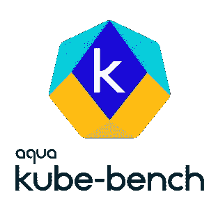

[Kube-bench](https://github.com/aquasecurity/kube-bench) ，由 [Aqua](https://www.aquasec.com/) 负责，检查集群是否按照 [CIS Kubernetes 基准](https://www.cisecurity.org/benchmark/kubernetes)中定义的 CIS 建议进行部署。本文档定义了几个领域的最佳实践:

*   控制平面组件
*   etcd
*   控制平面配置
*   工作节点
*   政策

Kube-bench 在由作业创建的 Pod 中运行。一旦处于完成状态，就可以从日志中检索结果。以下命令显示了如何调整 kube-bench:

```
# Run kube-bench as a Job
$ kubectl apply -f https://raw.githubusercontent.com/aquasecurity/kube-bench/main/job.yaml# Wait for the job to be completed
$ kubectl wait --for=condition=complete job/kube-bench# Get the results from the Pod’s logs
$ kubectl logs $(kubectl get pods -l app=kube-bench -o name)
```

下面的屏幕截图显示了策略检查的结果(CIS Kubernetes 基准文档的第 5 部分)。这些策略的目标是最大限度地减少可能损害其他容器甚至整个集群的容器准入。我们将在本系列的下一篇文章中讨论策略实施。

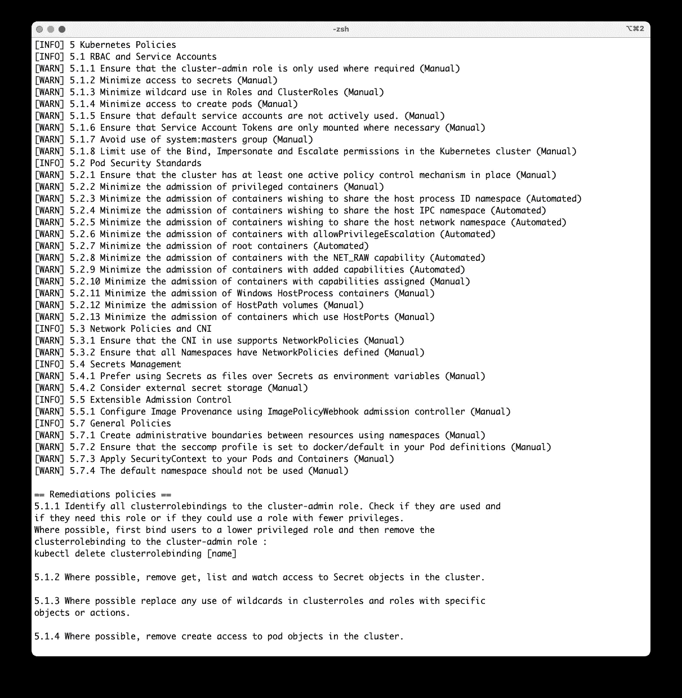

策略检查的结果

kube-bench 关注集群、其内部安全性以及防止在集群中部署恶意应用程序的策略。

如果您使用的是 Kubernetes 托管集群，您将无法更改集群的内部配置，因为云提供商会为您处理此事，但是您可以根据策略部分的结果进行操作。

如果您想了解 kube-bench 提供的所有功能，请访问 https://github.com/aquasecurity/kube-bench。

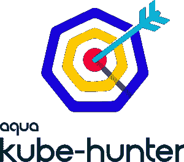

[Kube-hunter](https://github.com/aquasecurity/kube-hunter) ，也来自 [Aqua](https://www.aquasec.com/) ，搜寻 Kubernetes 集群中的安全弱点。它支持库伯内特 ATT & CK 矩阵的新格式，该矩阵定义了从集群内部或外部攻击集群的通用标准化技术类别。

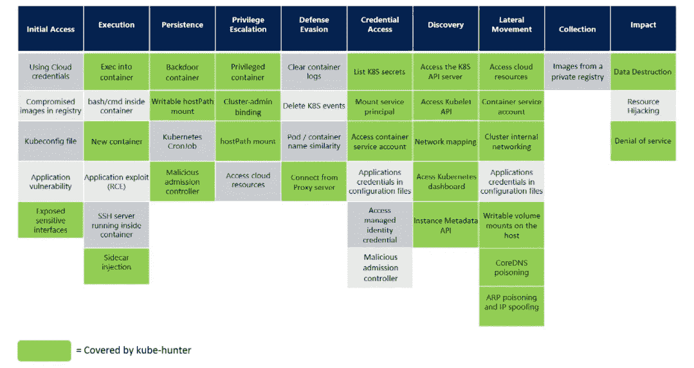

库伯-亨特与米特 ATT&CK 矩阵

Kube-hunter 可以在容器中运行，如下所示:

```
# Run kube-hunter in a Pod
$ kubectl run hunter \
--restart OnFailure \
--image=aquasec/kube-hunter:0.6.8 \
--command -- kube-hunter --pod# Get the results from the Pod’s logs
$ kubectl logs hunter
```

它返回在集群中发现的漏洞列表:

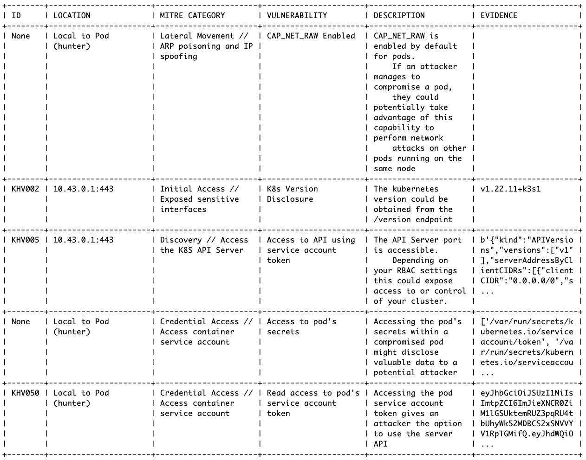

返回的漏洞列表

下表显示了 kube-hunter 进行的所有被动和主动检查:

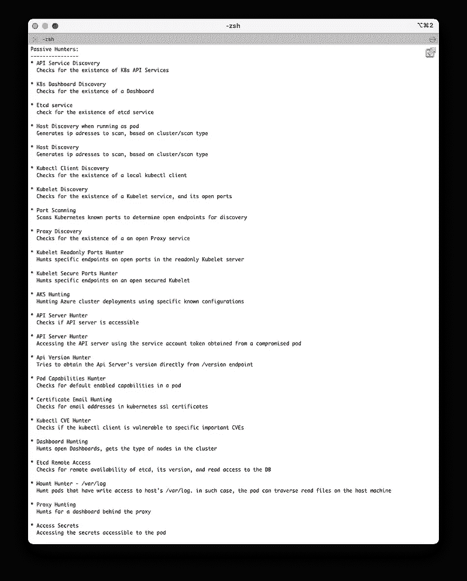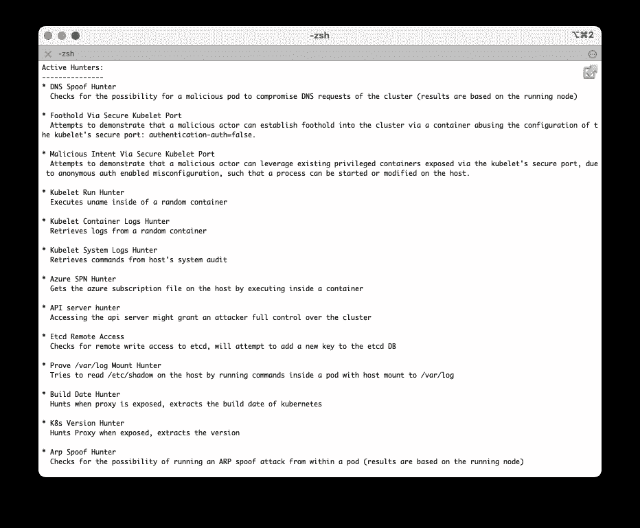

库贝-亨特的被动和主动猎人

正如我们所见，kube-hunter 可以成为 kube-bench 的一个很好的补充工具。

如果你想更多地了解 kube-hunter 提供的所有功能，请访问 https://github.com/aquasecurity/kube-hunter。

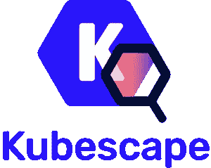

来自 [ARMO](https://www.armosec.io/) 的 Kubescape 检测错误配置、图像漏洞，显示 RBAC 规则，……并提供修复所发现问题的建议。它使用了几个框架:nsa，米特 ATT & CK，DevOpsBest，ArmoBest。Kubescape 可以作为 CLI 工具运行，它可以[安装在任何平台](https://github.com/kubescape/kubescape#install)上，或者集成在 CI/CD 管道中。它还可以在集群内部运行，进行连续扫描。Kubescape 可以扫描集群，也可以扫描 yaml 文件或舵图。

注意:[这篇伟大的文章](https://www.armosec.io/blog/kubernetes-security-frameworks-and-guidance/)比较了每个框架中的控件，并展示了它们之间存在的重叠。

以下命令扫描当前集群，检查所有框架中定义的控制:

```
kubescape scan --submit --enable-host-scan --verbose
```

它以下列格式返回结果:

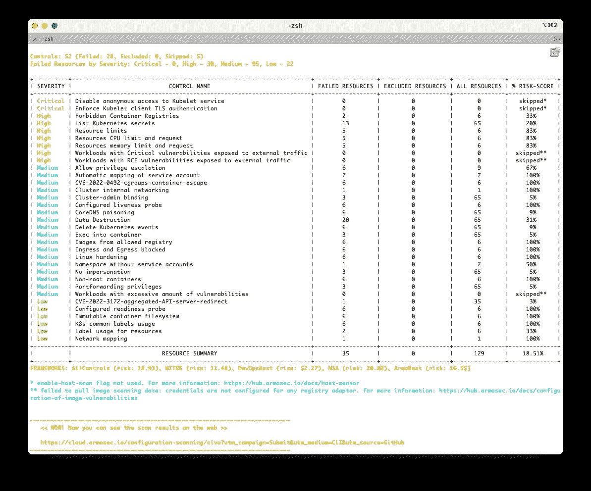

示例配置扫描输出

它还会返回一个指向 kubescape 仪表板的链接(因为有 *- submit* 选项)来在线显示结果:

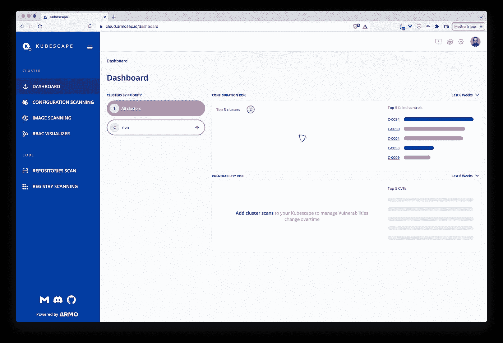

kubescape 仪表板

从该控制面板中，我们可以看到以下 5 个最失败的控制:

*   [C-0034](https://hub.armosec.io/docs/c-0034) :服务账户自动映射
*   [C-0050](https://hub.armosec.io/docs/c-0050) :资源 CPU 限制和请求
*   [C-0004](https://hub.armosec.io/docs/c-0004) :资源内存限制和请求
*   [C-0053](https://hub.armosec.io/docs/c-0053) :访问容器服务帐户
*   [C-0009](https://hub.armosec.io/docs/c-0009) :资源限制

如果我们单击其中一个控制，我们将获得详细信息:控制的描述、测试方式以及补救方式。

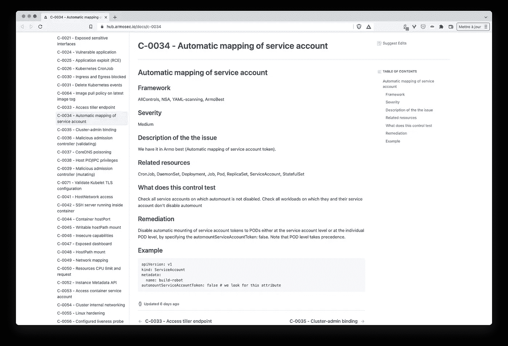

C-0034 控制的细节

从左边的**配置扫描**菜单中，我们可以得到每个控制的状态:


配置扫描的结果

选择其中一项，我们可以获得更多详细信息以及补救选项，如下图所示:

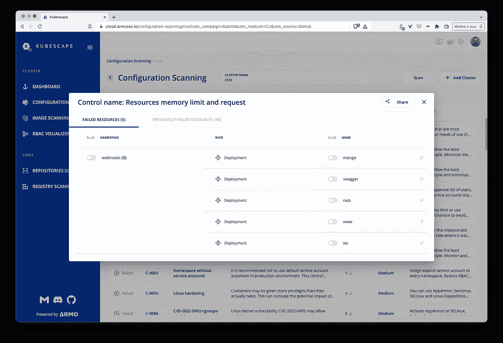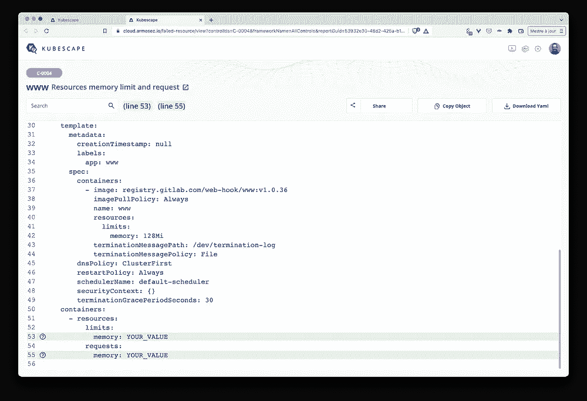

控制失败，因为 www 部署没有定义任何内存请求和限制

我们只是触及了这个伟大工具的表面，它可以在配置扫描的基础上做很多事情:扫描运行 pod 的图像，扫描图像注册表或[代码库](https://hub.armosec.io/docs/repository-scanning)。

如果你想了解更多关于 kubescape 提供的所有功能，请访问 [kubescape.io](https://kubescape.io) 。

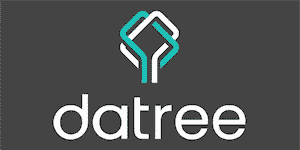

Datree 验证 Kubernetes 对象是否违反规则，确保没有错误配置进入生产环境:

*   在**开发**中，您可以在本地运行命令行来获得即时验证
*   在**持续集成**流水线中进行左移策略检查
*   在**连续部署**管道中，验证准入 webhook 中的配置
*   在**运行时**用 kubectl 插件检查集群中现有资源的状态


Datree scan 对 Kubernetes 对象运行三种验证

*   YAML 验证
*   模式验证(包括 CRD 支持)
*   政策检查

其架构如下:

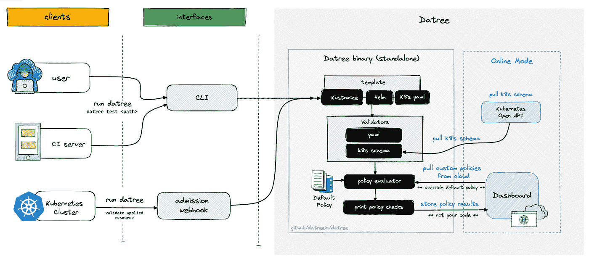

引擎盖下的 datree

下面的屏幕截图显示了根据 api 的 yaml 规范运行 datree 的结果:

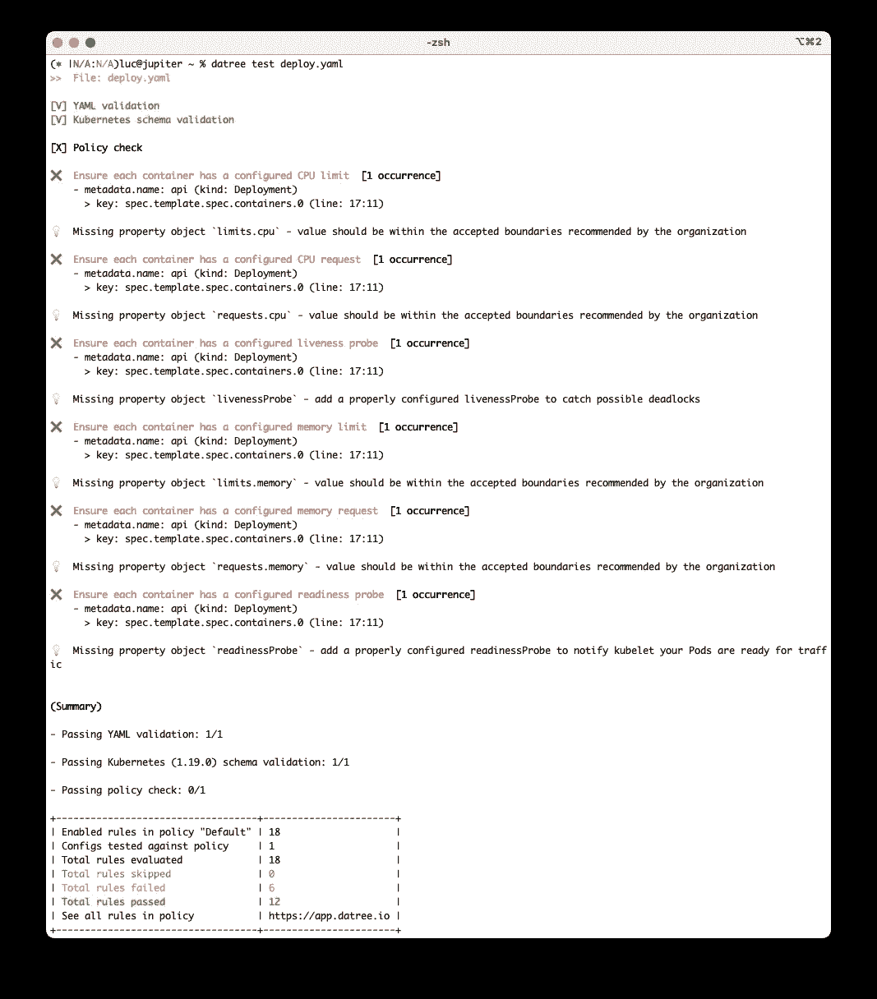

扫描结果

使用结果末尾的 URL，我们可以访问 Datree dashboard 来查看默认策略，如果需要，还可以定义我们自己的策略:

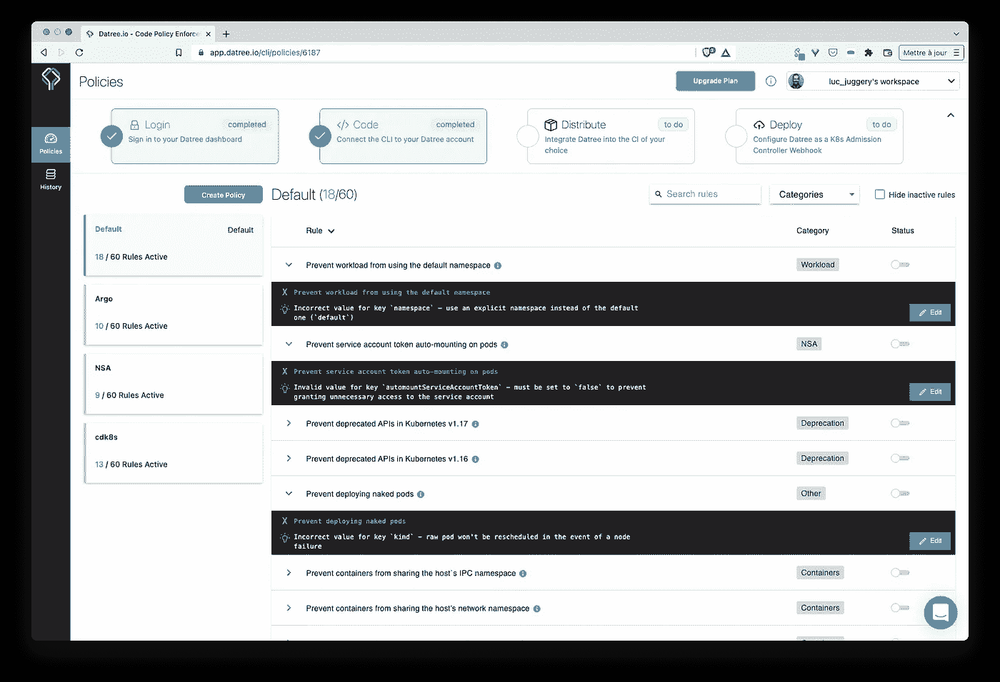

策略定义

Datree 存储了扫描的历史记录，以防我们想要比较连续的结果:

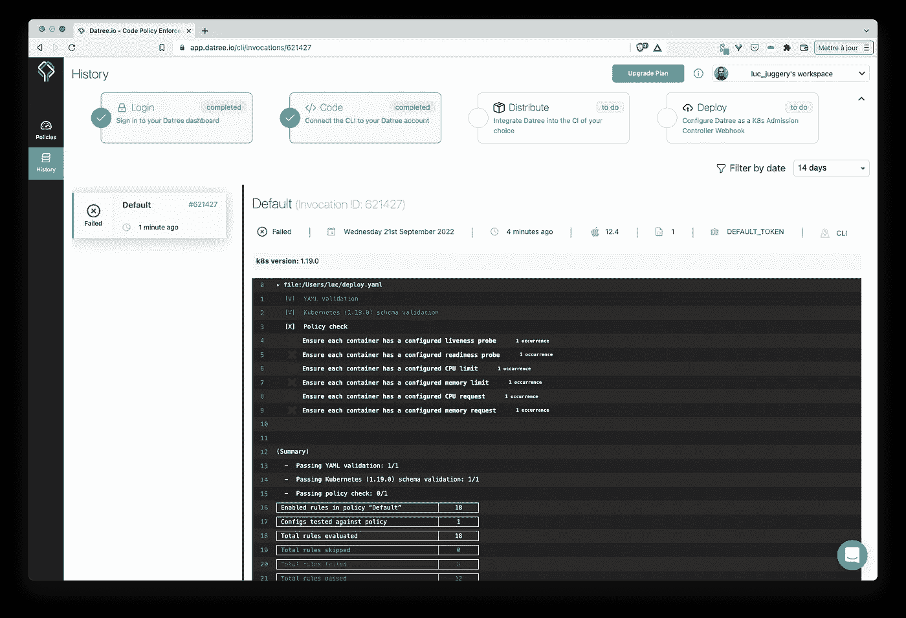

扫描历史记录

如果您想了解 datree 提供的所有功能，请访问 [datree.io](https://datree.io) 。

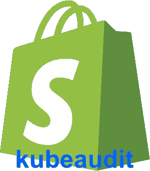

虚拟徽标，因为 kubeaudit 还没有任何虚拟徽标

来自 Shopify 的 Kubeaudit 是一个命令行工具，它审计集群以显示潜在的安全问题。下表显示了可用的审计员:

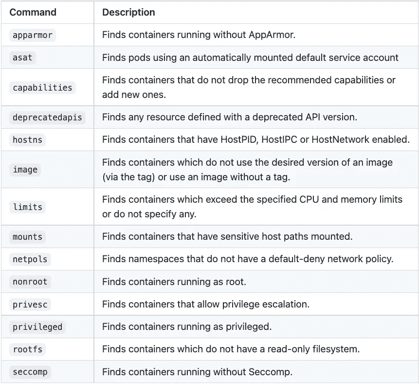

[kubeaudit 的审计师](https://github.com/Shopify/kubeaudit#auditors)

Kubeaudit 可以在 3 种不同的模式下运行:

*   在清单模式下，它对单个清单进行操作，并且可以自动修复遇到的问题(至少在某种程度上)
*   在集群模式下，它审计集群中的资源
*   在本地模式下，它使用本地 kubeconfig 连接到集群

以下命令在整个集群上运行审核:

```
$ kubeaudit all
```

当针对 api 微服务的简单部署运行时，我们得到以下结果:

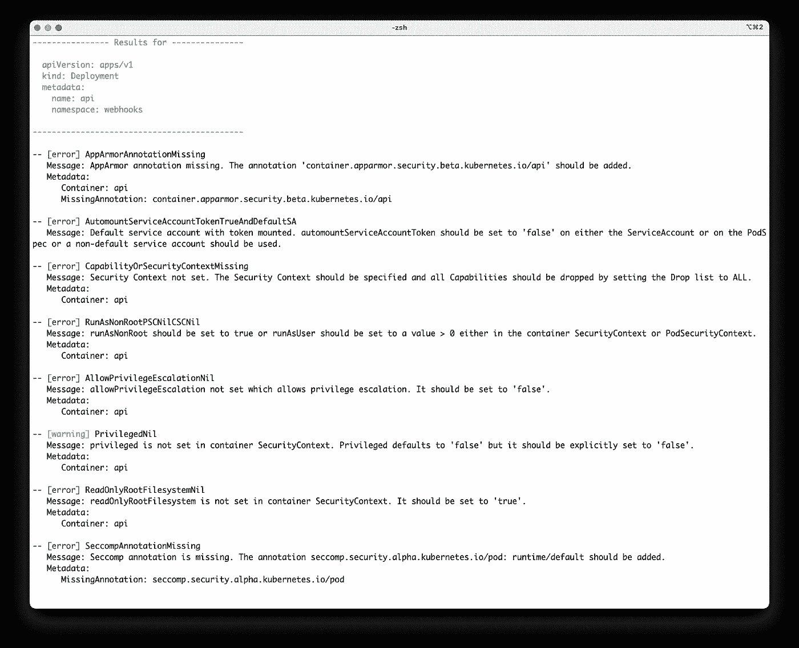

集群中运行的 api 部署的扫描结果

如果你想更多地了解 kubeaudit 提供的所有功能，请访问 https://github.com/Shopify/kubeaudit。


来自 [Fairwinds](https://www.fairwinds.com) 的北极星，是 Kubernetes 的一个开源策略引擎。它验证和修复 Kubernetes 资源，以确保遵循配置最佳实践。它可以在三种不同的模式下运行:

*   作为一个[仪表板](https://polaris.docs.fairwinds.com/dashboard)——根据政策即代码验证 Kubernetes 的资源。
*   作为[准入控制器](https://polaris.docs.fairwinds.com/admission-controller) —自动拒绝或修改不符合您组织策略的工作负载。
*   作为[命令行工具](https://polaris.docs.fairwinds.com/infrastructure-as-code) —将策略即代码整合到 CI/CD 流程中，以测试本地 YAML 文件。

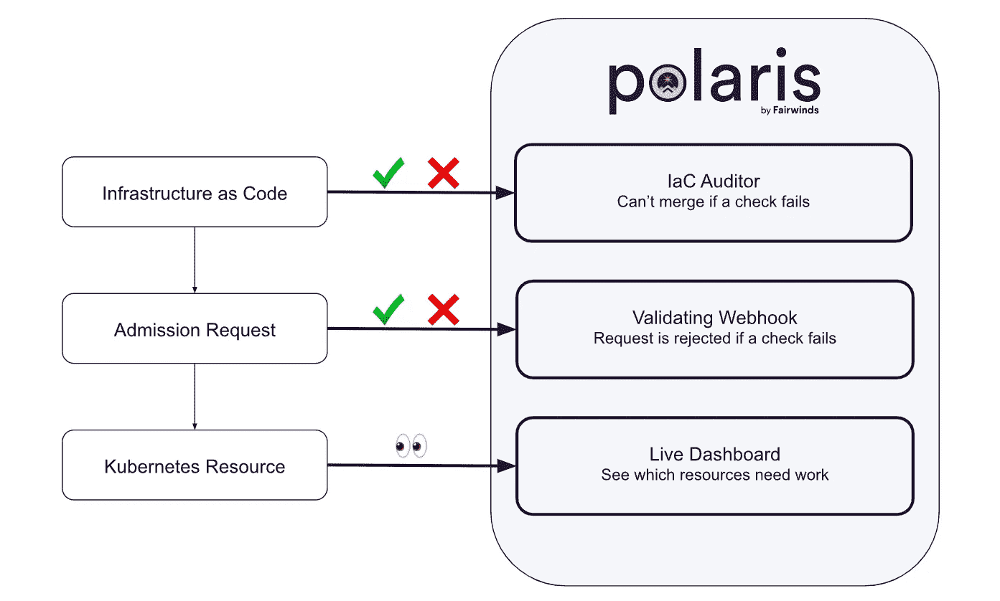

Polaris 可以审核单个文件或特定文件夹中的所有文件:

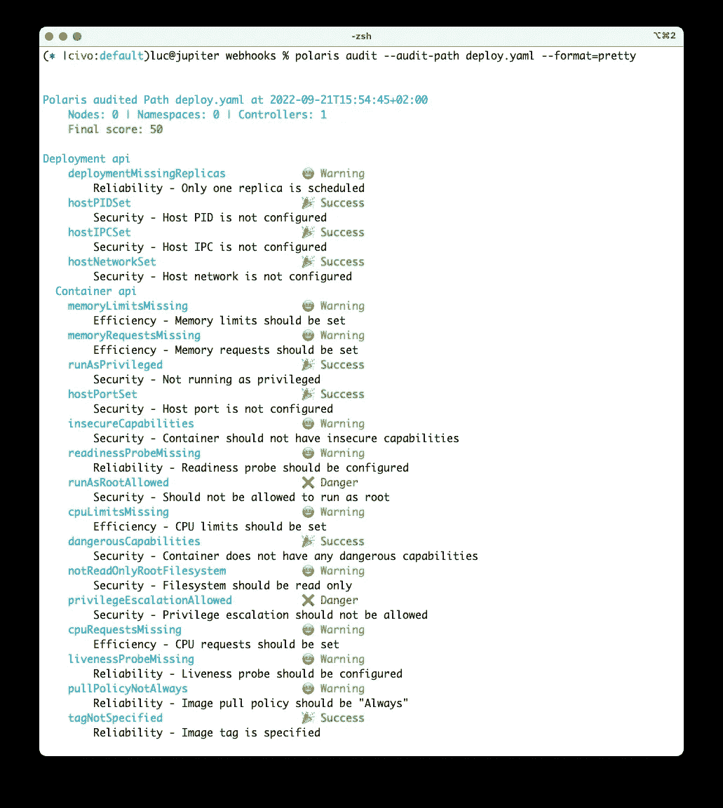

Polaris 结果是根据我们的示例 api 规范运行的

它还可以审核当前部署在集群中的资源:

```
$ polaris audit --format=pretty
```

或者审计掌舵图:

```
$ polaris audit \
  --helm-chart ./deploy/chart \
  --helm-values ./deploy/chart/values.yml
```

如果你想更多地了解北极星提供的所有功能，请访问 https://polaris.docs.fairwinds.com。


由 [Bridgecrew](https://bridgecrew.io) 开发的 Checkov 是一款针对基础设施 as code (IaC)的静态代码分析工具，也是一款针对映像和开源包的软件组合分析(SCA)工具。它可以扫描使用 [Terraform](https://terraform.io/) 、 [Cloudformation](https://github.com/bridgecrewio/checkov/blob/master/docs/7.Scan%20Examples/Cloudformation.md) 、 [Kubernetes](https://github.com/bridgecrewio/checkov/blob/master/docs/7.Scan%20Examples/Kubernetes.md) 、 [Helm charts](https://github.com/bridgecrewio/checkov/blob/master/docs/7.Scan%20Examples/Helm.md) 、 [Kustomize](https://github.com/bridgecrewio/checkov/blob/master/docs/7.Scan%20Examples/Kustomize.md) 、 [Dockerfile](https://github.com/bridgecrewio/checkov/blob/master/docs/7.Scan%20Examples/Dockerfile.md) 、 [Serverless](https://github.com/bridgecrewio/checkov/blob/master/docs/7.Scan%20Examples/Serverless%20Framework.md) 以及许多其他工具配置的云基础架构。

使用 kubernetes 框架，Checkov 可以通过对 Kubernetes 部署进行 150 多次开箱检查来发现 Kubernetes YAML 的安全问题。

它可以在一个简单的 yaml 文件上运行:

```
$ checkov --framework kubernetes -f deploy.yaml
```

或者对照舵图(尽管使用了*模板*命令)

```
$ helm template . > wh.yaml && checkov -f wh.yaml --framework kubernetes
```

下面是我们可以从 Checkov 获得的示例输出:

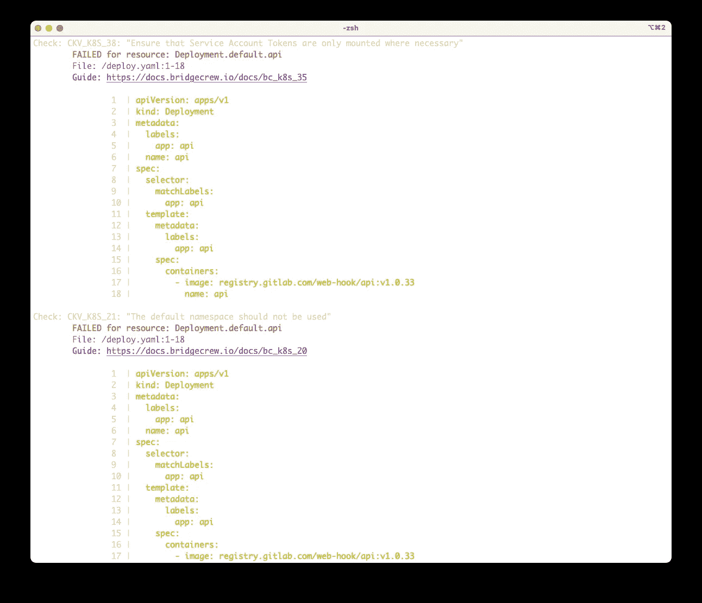

Checkov 对这个 yaml 规范不满意

如果你想了解 Checkov 提供的所有功能，请访问 https://www.checkov.io/。

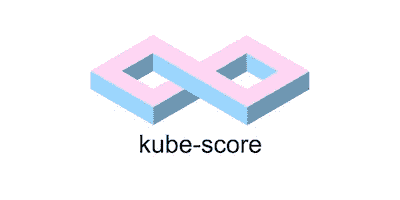

[Kube-score](https://kube-score.com/) 对 yaml 规范进行静态分析。以下屏幕截图显示了针对示例部署规范的扫描结果:

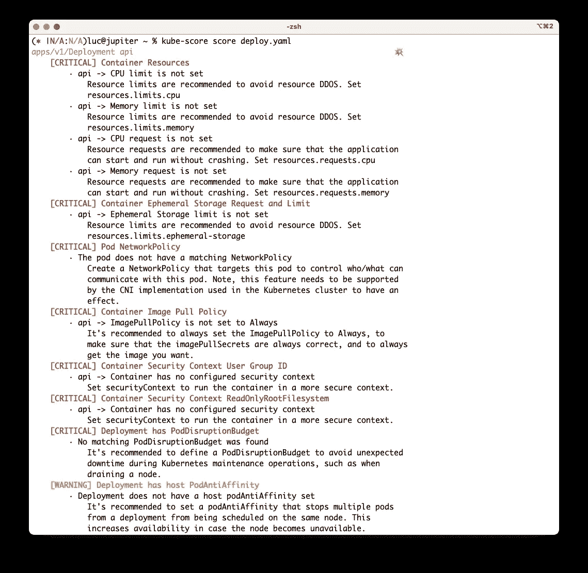

针对(过于)简单的部署规范运行时，kube-score 生成的输出

如果你想更多地了解 kube-score 提供的所有功能，请访问 https://kube-score.com。

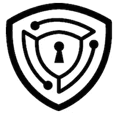

[来自](https://kubesec.io/)[控制平面](https://controlplane.io)的 kubesec 对 Kubernetes 资源进行安全风险分析。它可以从 Docker 映像运行:

```
docker run -i kubesec/kubesec:v2.11.5 scan /dev/stdin < deploy.yaml
```

输出提供了关于 api 部署规范中需要增强的内容的详细信息:

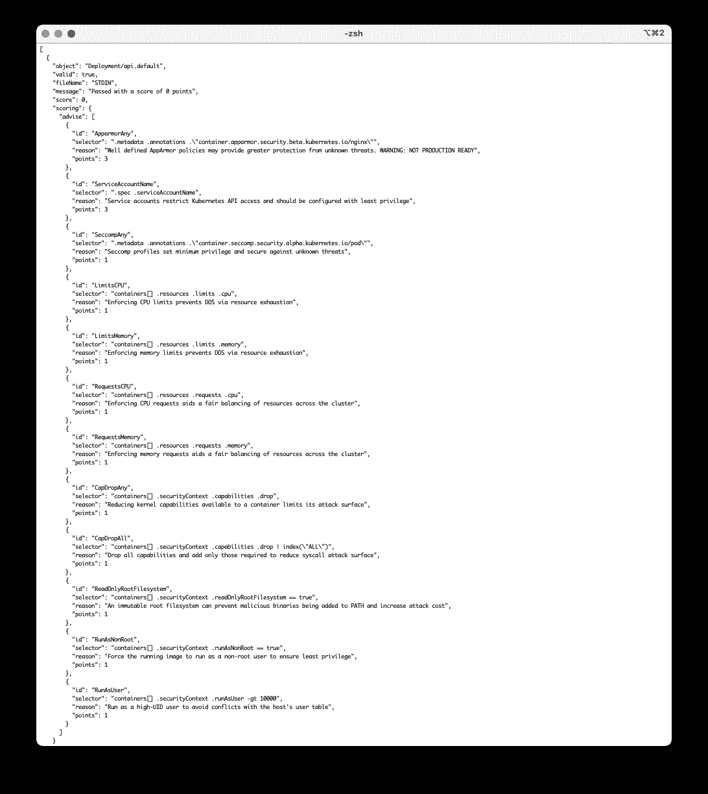

根据 api 部署规范运行时 kubesec 生成的输出

如果您想了解 kubesec 提供的所有功能，请访问 [https://kubesec.io](https://kubesec.io/) 。


[Popeye](https://github.com/derailed/popeye) ，来自脱轨(与构建 [k9s](https://github.com/derailed/k9s) 的是同一批人)，是一个扫描实时 Kubernetes 集群并报告部署的资源和配置的潜在问题的实用程序。它检测错误配置，并帮助您确保最佳实践到位。

Popeye 可以作为 cli 工具运行，也可以作为 kubectl 插件运行(可以很容易地用 [krew](https://krew.sigs.k8s.io/) 安装)。通过插件运行 Popeye 非常简单:

```
$ kubectl popeye
```

注意:我目前在 k3s 集群上运行 Popeye 有问题，因为部署在 webhooks 名称空间中的 Pod 看不到。这可能与 k3s 的内部微妙性有关。此外，我不确定这个项目是否得到了积极的维护，因为我的问题已经很久没有被考虑了。

如果你想更多地了解大力水手提供的所有功能，请访问 https://github.com/derailed/popeye。

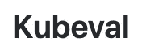

[Kubeval](https://kubeval.instrumenta.dev/) 是一个用于验证 Kubernetes 配置文件的简单工具。它可以作为开发工作流的一部分在本地使用，也可以在 CI 管道中使用。

根据我们的简单 api 规范运行，它返回以下结果:

```
$ kubeval deploy.yaml --strict
PASS - deploy.yaml contains a valid Deployment (api)
```

让我们考虑以下畸形的规范:

```
apiVersion: apps/v1
kind: Deployment
metadata:
  labels:
    app: api
  name: api
spec:
  selector:
    matchLabels:
      app: api
  template:
    metadata:
      labels:
      app: api    <-- wrong indentation here
    spec:
      containers:
        - image: [registry.gitlab.com/web-hook/api:v1.0.33](http://registry.gitlab.com/web-hook/api:v1.0.33)
          name: api
```

在该服务器上运行 kubeval 表明属性出错:

```
$ kubeval deploy.yaml --strict
WARN - deploy.yaml contains an invalid Deployment (api) - app: Additional property app is not allowed
```

注意:该项目没有被积极维护，因为在编写本报告时(2022 年 9 月)最后一次提交是在 2021 年 3 月。

如果您想了解 Kubeval 提供的所有功能，请访问 https://kubeval.instrumenta.dev/。


[valid kube](https://validkube.com)by[komo dor](https://komodor.com/)是一个可以审计不同级别的 Kubernetes 资源规范的网站，它可以:

*   使用 [kubeval](https://kubeval.instrumenta.dev/) 验证您的 Kubernetes 配置文件
*   使用 [kubectl-neat](https://github.com/itaysk/kubectl-neat) 清理Kubernetes 清单
*   使用 [trivy](https://github.com/aquasecurity/trivy) 检查你的 CVE 代码
*   使用[北极星](https://github.com/FairwindsOps/polaris)确保你的清单遵循最佳实践
*   使用[kubiscape](https://github.com/armosec/kubescape)扫描您的 YAML 文件，查找 Devops 最佳实践和安全漏洞
*   使用 [trivy](https://github.com/aquasecurity/trivy) 提供 SBOM(软件材料清单)

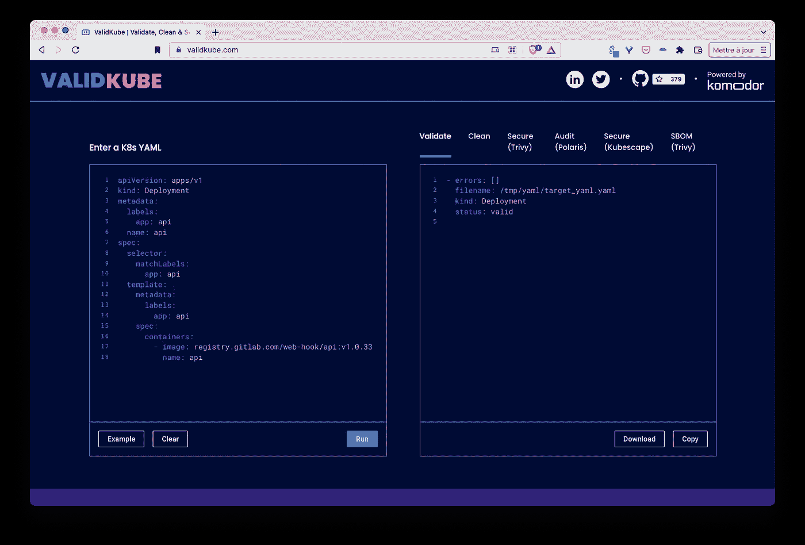

简单部署的验证

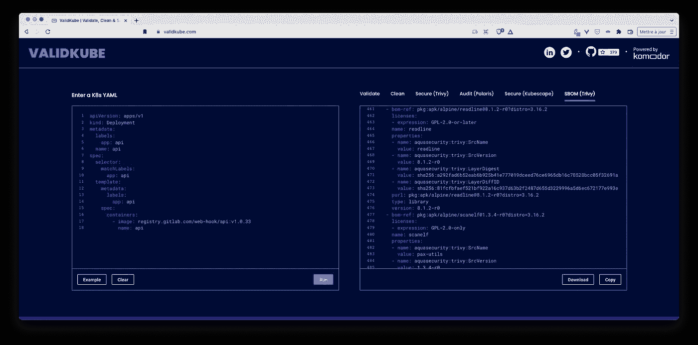

SBOM(图像的内容)

如果你想了解 ValidKube 提供的所有功能，请访问 https://validkube.com。

## 包扎

在本文中，我们介绍了几种可以用来审计 Kubernetes 集群和其中运行的应用程序的工具。在下一篇文章中，我们将重点关注修复错误配置，并展示如何增强 webhooks 应用程序部署的 yaml 规范。