# Kubernetes 世界的微服务应用之旅

> 原文：<https://itnext.io/journey-of-a-microservice-application-in-the-kubernetes-world-876f72ce1681?source=collection_archive---------3----------------------->

## 使用 Loki 堆栈的可观测性


照片由[达文本](https://unsplash.com/es/@davynben?utm_source=unsplash&utm_medium=referral&utm_content=creditCopyText)在 [Unsplash](https://unsplash.com/s/photos/observe?utm_source=unsplash&utm_medium=referral&utm_content=creditCopyText) 上拍摄

## TL；速度三角形定位法(dead reckoning)

在[之前的文章](/journey-of-a-microservice-application-in-the-kubernetes-world-d9493b19edff)中，我们解释了如何使用 [GitOps](https://www.weave.works/technologies/gitops/) 和 [Argo CD](https://argoproj.github.io/) 来设置 CI/CD 管道的持续部署部分。我们现在将部署 Loki 堆栈来获取应用程序日志和指标。

## 本系列文章

*   [web hooks . app 展示](/journey-of-a-microservice-application-in-the-kubernetes-world-bdfe795532ef)
*   [使用 Helm 在本地单节点 Kubernetes 上运行应用](/journey-of-a-microservice-application-in-the-kubernetes-world-3c2a9e701e9f)
*   [在 Civo Kubernetes 集群上运行应用](/journey-of-a-microservice-application-in-the-kubernetes-world-e800579f0be3#0174-87b0e3c1fcd3)
*   [使用 GitOps 和 Argo CD 进行连续部署](/journey-of-a-microservice-application-in-the-kubernetes-world-d9493b19edff)
*   使用 Loki 堆栈的可观察性(本文)
*   [使用 Acorn 定义应用](/journey-of-a-microservice-application-in-the-kubernetes-world-e2f6475ddde1)
*   [安全注意事项:安全相关工具](/journey-of-a-microservice-application-in-the-kubernetes-world-6abd625c60fe)
*   [安全考虑:修复错误配置](/journey-of-a-microservice-application-in-the-kubernetes-world-eb0fb52e1bf0)
*   [安全考虑:策略实施](/journey-of-a-microservice-application-in-the-kubernetes-world-f760cba7600f)
*   安全考虑:漏洞扫描(即将推出)

简而言之，Grafana Labs 的 Loki stack 是一个多组件应用程序，可以安装到 Kubernetes 集群中，允许用户使用 Grafana 查看日志和指标。在这篇短文中，我们不会深入讨论这个堆栈的细节，但是我们将展示如何简单地安装和使用它来监控 webhooks 应用程序。

正如 Kubernetes 世界中的许多应用一样，Loki stack 可作为舵图使用:

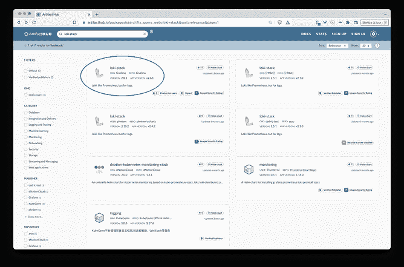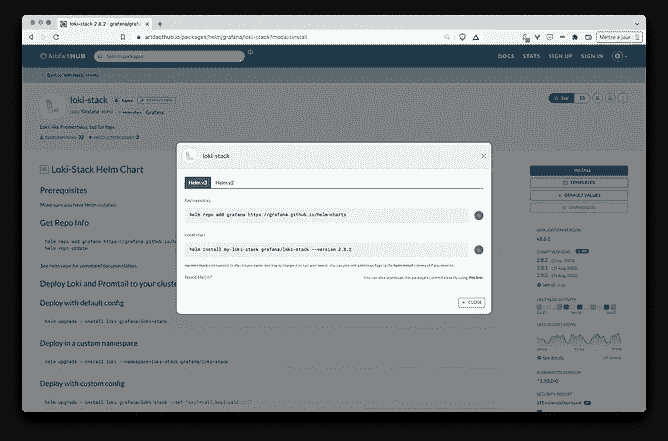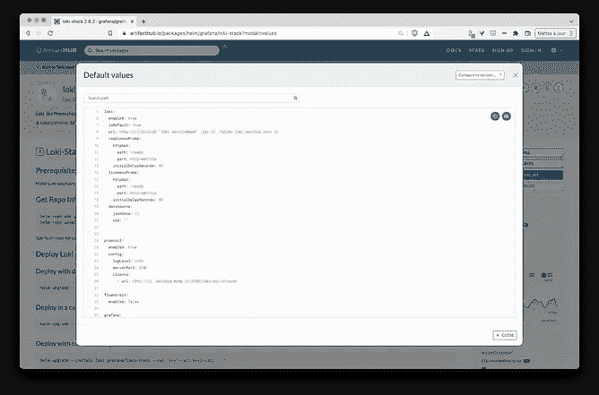

洛基堆栈头盔图可从 [artifacthub](https://artifacthub.io/) 获得

使用 *helm* 二进制文件，可以使用以下命令安装堆栈:

```
# Adding grafana repo
$ helm repo add grafana [https://grafana.github.io/helm-charts](https://grafana.github.io/helm-charts)# Installing the stack
$ helm install my-loki grafana/loki --version 3.0.7 --set grafana.enabled=true --set prometheus.enabled=true
```

在本例中，我们启用了 *grafana* 和 *prometheus* ，因为默认情况下它们在堆栈中没有启用(默认情况下只安装与日志管理相关的组件)。如果需要，还可以启用其他组件:fluent-bit、logstash 和 filebeat。

我通常更喜欢使用 Helmfile 表示，而不是使用 helm 二进制文件来执行安装，因为这是一种更具声明性的指定方式。为此，在配置存储库中创建了一个新的 *apps/loki* 文件夹，并在其中添加了下面的 *helmfile.yaml* 。

```
# config/apps/loki/helmfile.yamlrepositories:
- name: grafana
  url: https://grafana.github.io/helm-chartsreleases:
- name: loki
  namespace: loki
  labels:
    app: loki
  chart: grafana/loki-stack
  version: ~2.8.2
  values:
  - grafana:
      enabled: true
  - prometheus:
      enabled: true
```

接下来，我们使用以下命令安装应用程序:

```
$ helmfile apply
```

然后，我们确保一切运行正常(所有 pod 启动并运行只需几十秒钟):

```
**$ kubectl get po -n loki**
NAME                                     READY STATUS  RESTARTS AGE
loki-prometheus-node-exporter-66hqz      1/1   Running 0        93s
loki-prometheus-node-exporter-x4sd4      1/1   Running 0        93s
loki-kube-state-metrics-5c6b9ddd4f-grv4c 1/1   Running 0        93s
loki-grafana-cbf7c8c47-8dh6k             2/2   Running 0        93s
loki-promtail-q8c9x                      1/1   Running 0        93s
loki-promtail-hsbpb                      1/1   Running 0        93s
loki-prometheus-pushgateway-7cd55958-... 1/1   Running 0        92s
loki-0                                   1/1   Running 0        93s
loki-prometheus-server-757c887449-7wz44  2/2   Running 0        93s
loki-prometheus-alertmanager-588df97-... 2/2   Running 0        93s
```

正如我们从这个结果中看到的，现在有几个组件在 *loki* 名称空间中运行:

一些组件用于管理应用和系统指标:

*   **节点导出器**是一个 DaemonSet，它的每个 Pod 负责收集与它正在运行的节点相关的指标，并将这些指标暴露给 Prometheus。当前集群有 2 个节点，然后我们在集群中运行 2 个节点导出器单元
*   **kube-state-metrics** 根据集群资源的状态生成指标，并将这些指标公开给 Prometheus
*   prometheus-pushgateway 允许短暂的批处理作业向 prometheus 发送它们的度量
*   **prometheus-server** 定期从上述导出器获取指标
*   prometheus-alertmanager 可以处理来自 prometheus 服务器的警报，并将它们路由到指定的后端(电子邮件、slack 等)

其他组件用于管理日志:

*   promtail 是一个 DeamonSet，它的每个 pod 都负责收集它正在运行的节点上的日志，并将它们发送到 loki
*   **loki** 存储从 promtail 收到的日志

grafana 也部署在这些组件之上。这是一个 web 界面，我们将使用它来可视化存储在 Loki 中的日志和存储在 Prometheus 中的指标。Grafana 有一个很棒的插件集合，允许它连接到许多其他数据源。

因为我们的集群运行在 Civo Kubernetes 上，所以我们可以访问默认的 StorageClass，这可以从以下命令的结果中看出:

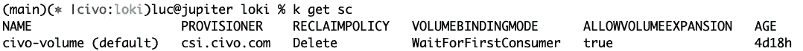

Civo 中的默认存储类

这个 StorageClass 用于为需要持久存储的组件提供持久卷:对于 Loki 堆栈， *prometheus-server* 和 *prometheus-alertmanager* 。以下命令显示了创建的 PVC 和 PV:


创建 PVC 和 PV 以保持普罗米修斯指标

从 Civo dashboard 中，我们可以看到“Volumes”部分中的这两个存储项目:

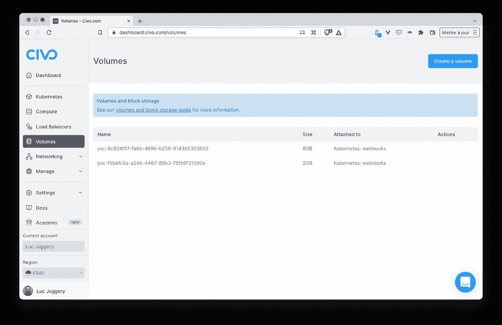

PV 是使用 Civo 的默认存储类自动创建的

要访问 Grafana，我们首先检索在安装步骤中自动生成的密码:

```
$ kubectl get secret loki-grafana --namespace=loki -o jsonpath="{.data.admin-password}" | base64 --decode ; echo
```

接下来，我们通过端口转发暴露 grafana pod:

```
$ kubectl port-forward --namespace loki service/loki-grafana 3000:80
```

然后，我们可以从本地浏览器访问 *localhost:3000* 上的仪表板，并使用 *admin* 作为用户名和之前获取的密码登录

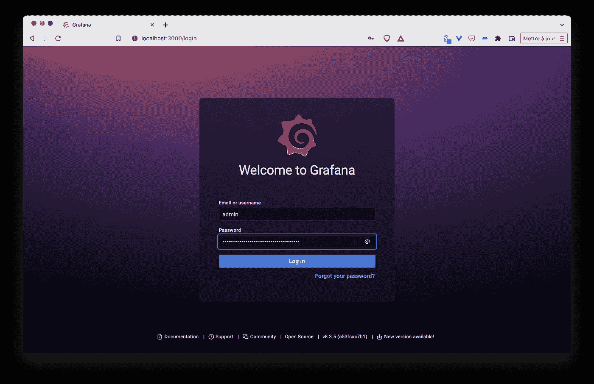

Grafana 登录屏幕

从主页，我们进入“浏览”菜单:

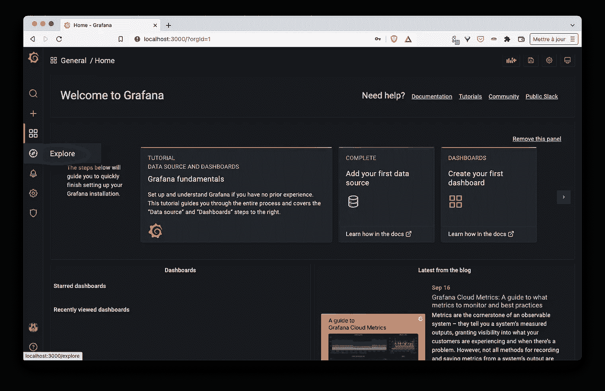

格拉夫纳家园

浏览控制面板允许我们选择不同的数据源:

*   洛基为了让日志可视化
*   普罗米修斯为了形象化度量

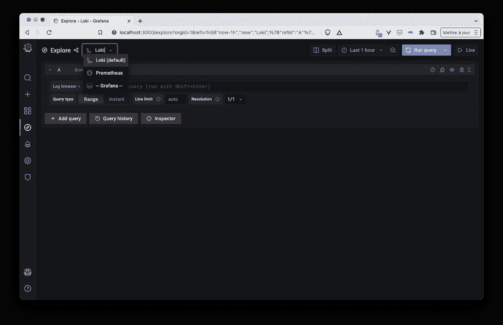

Grafana 中的可用数据源

使用 Loki 数据源，我们可以使用**日志浏览器**过滤日志。由于 Loki 用诸如 Pod 的名称、名称空间等标签索引每个日志条目，所以只显示我们对标签选择感兴趣的日志变得非常容易。

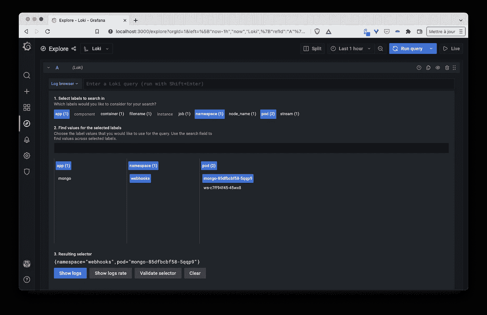

日志可以从洛基贴在上面的标签中检索到

下面的截图显示了从运行在 *webhooks* 名称空间中的 *mongo* Pod 中检索到的日志。

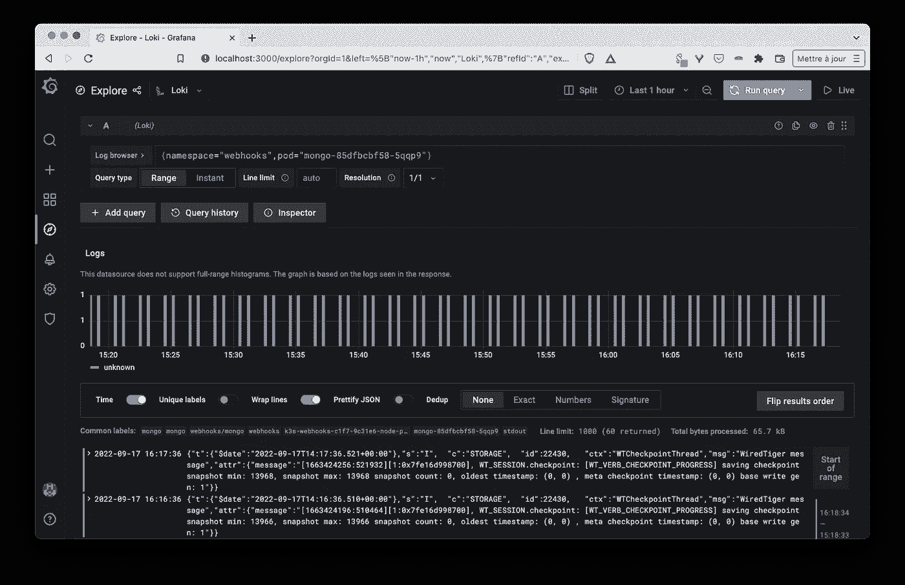

查看 mongo 容器的日志

使用 Prometheus 数据源，我们可以使用**指标浏览器**过滤指标。由于 Prometheus 使用 Pod 名称、名称空间等标签为每个指标条目编制了索引，因此只显示我们对标签选择感兴趣的指标变得非常容易。

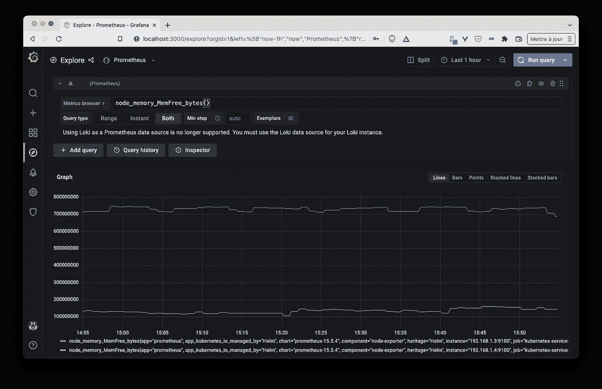

查看节点指标(例如:空闲内存的演变)

几分钟后，我们在集群中安装了 Loki 堆栈，并开始可视化简单的日志和指标。

## 关键外卖

对于任何类型的应用程序来说，监视和日志堆栈都是必不可少的，即使对于附带项目来说，它也是非常有用的。在本文中，我们只是触及了这个提供许多配置选项和功能的堆栈的表面。试着发挥它的全部潜力。

在[下一篇文章](/journey-of-a-microservice-application-in-the-kubernetes-world-e2f6475ddde1)中，我们将后退一步，使用 [Acorn](https://acorn.io) ，一个用于 Kubernetes 的应用部署框架来指定、打包和运行 webhooks 应用。