# Kubernetes 世界的微服务应用之旅

> 原文：<https://itnext.io/journey-of-a-microservice-application-in-the-kubernetes-world-e2f6475ddde1?source=collection_archive---------1----------------------->

## 当 webhooks 应用遇到 Acorn


在 [Unsplash](https://unsplash.com/s/photos/acorn?utm_source=unsplash&utm_medium=referral&utm_content=creditCopyText) 上由 [Caleb Lucas](https://unsplash.com/ja/@calebdlucas?utm_source=unsplash&utm_medium=referral&utm_content=creditCopyText) 拍照

## TL；速度三角形定位法(dead reckoning)

在[的上一篇文章](/journey-of-a-microservice-application-in-the-kubernetes-world-3c2a9e701e9f)中，我们解释了如何使用 Helm / Helmfile 在 Kubernetes 集群中部署 webhooks 应用程序。在本文中，我们将解释如何使用 Kubernetes 的应用程序部署框架 Acorn 运行、打包和分发这个应用程序。

## 本系列文章

*   [web hooks . app 的展示](/journey-of-a-microservice-application-in-the-kubernetes-world-bdfe795532ef)
*   [使用 Helm 在本地单节点 Kubernetes 上运行应用](/journey-of-a-microservice-application-in-the-kubernetes-world-3c2a9e701e9f)
*   [在 Civo Kubernetes 集群上运行应用](/journey-of-a-microservice-application-in-the-kubernetes-world-e800579f0be3#0174-87b0e3c1fcd3)
*   [使用 GitOps 和 Argo CD 进行连续部署](/journey-of-a-microservice-application-in-the-kubernetes-world-d9493b19edff)
*   [使用 Loki 堆栈的可观察性](/journey-of-a-microservice-application-in-the-kubernetes-world-876f72ce1681)
*   使用 Acorn 定义应用程序(本文)
*   [安全注意事项:安全相关工具](/journey-of-a-microservice-application-in-the-kubernetes-world-6abd625c60fe)
*   [安全考虑:修复错误配置](/journey-of-a-microservice-application-in-the-kubernetes-world-eb0fb52e1bf0)
*   [安全考虑:策略实施](/journey-of-a-microservice-application-in-the-kubernetes-world-f760cba7600f)
*   安全考虑:漏洞扫描(即将推出)

## 关于这篇文章

当这个系列的第二篇文章发表后，我在 Twitter 上收到了来自 T2 的一条消息，建议我给 T4 一个机会。当时我只知道 Acorn 的名字，对这项技术了解不多。在 webhooks 应用程序上演示 Acorn 的用法似乎是一个了解更多的好主意。

## 关于橡子

当您开发一个微服务应用程序时，您可能已经熟悉 Docker，并且可能使用 Docker Compose 在您的本地机器上部署整个应用程序。当您需要在 Kubernetes 上部署应用程序时，这可能会令人望而生畏，尤其是如果您不熟悉这个 orchestrator 的话。事实上，在了解如何在 yaml 文件中指定您的应用程序或者甚至将其作为一个导航图之前，首先需要理解许多 Kubernetes 的概念，了解现有的资源(Pod、部署、服务等等)。

Acorn 是一个新项目(在撰写本文时版本为 0.2)，被定义为 Kubernetes 的一个简单的应用程序部署框架。它使用一种简单的格式来指定在容器中运行的应用程序，允许应用程序在任何环境中运行、打包和分发，并部署到 Kubernetes，而不需要了解太多。

来自 [Acorn 文档](https://docs.acorn.io)的以下模式给出了 Acorn 内部的高级视图:

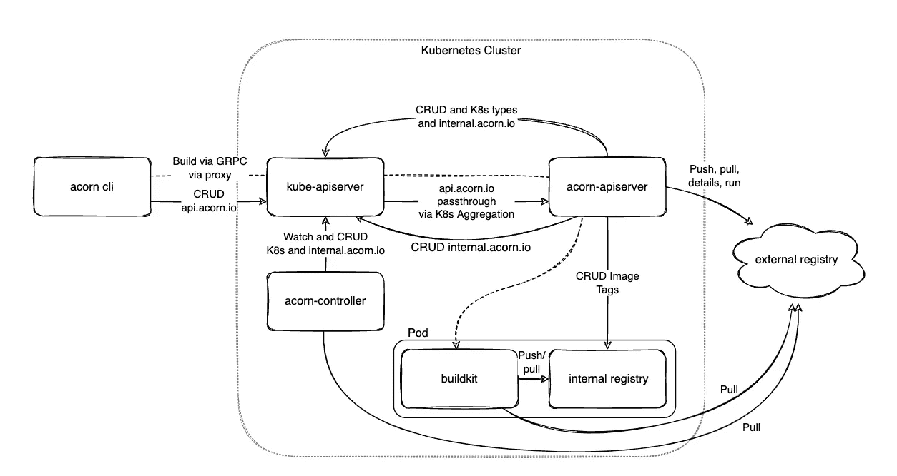

[橡子架构](https://docs.acorn.io/architecture/ten-thousand-foot-view)

它定义了 4 个组件:

*   acorn cli 是针对 acorn 服务器端组件运行命令的客户端二进制文件
*   **api 服务器**根据 CLI 收到的请求管理应用生命周期
*   **控制器**将 Acorn 应用程序转换成 Kubernetes 资源
*   **buildkit 和内部注册表**用于构建图像并将其存储在内部

在用 acorn 部署应用程序之前，我们需要在一个【acorn 文件中指定这个应用程序。这个文件描述了如何构建、开发和运行容器化的应用程序。

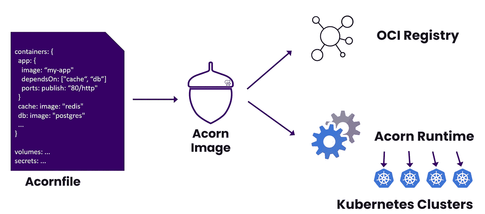

Acorn 工作流

如文档中的[所述，一个*acorn 文件*包含以下顶级元素:](https://docs.acorn.io/authoring/structure)

*   **args** :定义消费者可以提供的参数
*   **概要文件**:为不同的部署类型定义了一组默认参数
*   **容器**:定义运行应用程序的容器
*   **volumes** :定义容器要消耗的持久存储容量
*   **作业**:定义在变更时或通过 cron 运行的任务
*   **acorns** :其他需要和你的 app 一起部署的 Acorn 应用
*   **机密**:定义由用户自动生成或传递的数据的机密位
*   **localData** :默认数据和配置变量

注意:一个新的**路由器**功能已经实现，它可以在**路由器**键下的 *Acornfile* 中获得(我们将在下面看到一个这样的例子),并将很快被记录下来。

创作 Acornfile 文档给出了所有可用字段的例子。一个 *Acornfile* 可以非常简单，例如下面的定义了一个运行 ghost 镜像的简单容器。

```
containers: {
 ghost: {
  image: "ghost:4"
  ports: publish: "2368/http"
 }
}
```

当然， *Acornfile* 格式可以使用上面列出的高级元素轻松包含现实世界多容器应用程序的复杂性。

在接下来的步骤中，我们将安装 Acorn，使用 *Acornfile* 来定义 webhooks 应用程序，并通过 *acorn* cli 来管理它。

## 安装 Acorn

为了说明本文，我们将使用一个安装了 Traefik 入口控制器的单节点 k3s 集群。Acorn 需要一个入口控制器来公开应用程序，Acorn 还需要一个存储类来为需要它的容器提供存储。

首先，我们按照安装文档安装 Acorn CLI。在 MacOS 和 Linux 上，可以使用这个方便的安装脚本:

```
$ curl https://get.acorn.io | sh
```

不带任何参数运行 *acorn* 命令会返回可用于管理 acorn 应用程序的命令的完整列表。我们将在接下来的步骤中使用其中的几个命令。

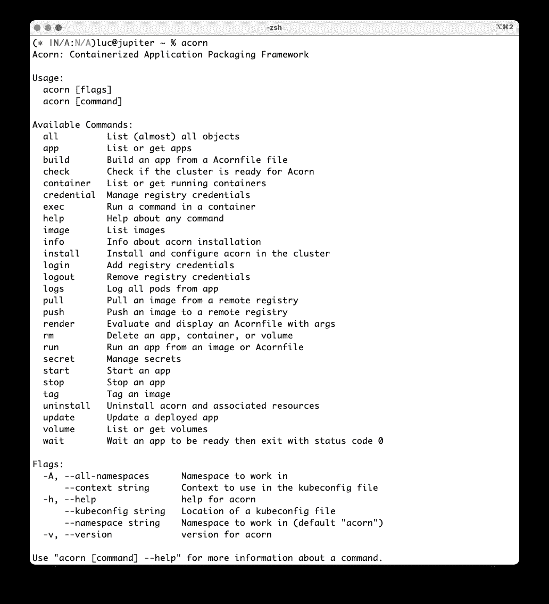

acorn cli 中可用的命令

接下来，我们在集群中安装 Acorn 服务器端组件:

```
$ acorn install
```

这将产生如下所示的结果:

```
 ✔  Running Pre-install Checks
  ✔  Installing ClusterRoles
  ✔  Installing APIServer and Controller (image ghcr.io/acorn-io/acorn:v0.2.1)
  ✔  Waiting for controller deployment to be available
  ✔  Waiting for API server deployment to be available
  ✔  Installation done
```

Acorn 已经安装完毕，可以管理容器化的应用程序了！

下一步，我们将在一个 *Acornfile* 中定义 webhooks 应用程序，在集群中部署它，打包它，并通过 DockerHub 分发它。

## 用 Acorn 指定 webhooks 应用程序

webhooks 应用程序具有以下架构(您可以查看[系列的第一篇文章](/journey-of-a-microservice-application-in-the-kubernetes-world-bdfe795532ef)以了解关于这个示例应用程序的更多细节):


webhooks 应用程序的架构

在以前的文章中，我们展示了如何定义这个应用程序:

*   [与码头工人缀](/journey-of-a-microservice-application-in-the-kubernetes-world-bdfe795532ef)
*   作为[在 Kubernetes 上运行的掌舵图](https://gitlab.com/web-hook/config/-/tree/main/apps/webhooks)

现在是时候看看如何用 Acorn 管理这个应用程序了，这将从描述应用程序的 Acornfile 的定义开始。

以下 *Acornfile* 是[Darren Shepherd](https://medium.com/u/175a56629d3f?source=post_page-----e2f6475ddde1--------------------------------)(k3s 的创造者，现 Acorn Labs 首席架构师兼联合创始人)在 Acorn Slack 频道给我的，感谢 Darren！

```
args: {
    // Run tests
    tests: false
}

containers: {
    api: {
        build: {
            context: "../api"
            if args.dev {
                dockerfile: "../api/Dockerfile.dev"
            }
        }
        if args.dev {
            dirs: "/app": "../api/"
        }
        probe: "http://localhost:5000/app/healthz"
        ports: "5000/http"
        dependsOn: ["nats", "mongo"]
    }

    ws: {
        build: "../ws"
        probes: {}
        ports: "8080/http"
        dependsOn: ["nats", "mongo"]
    }

    mongo: {
        image: "mongo:4.4"
        ports: 27017
        dirs: "/data/db": "mongo-data"
    }

    nats: {
        image: "nats:2.8-alpine"
        ports: 4222
    }

    www: {
        build: "../www"
        dependsOn: ["nats", "mongo"]
        probe: "http://localhost:3000"
        ports: "3000/http"
    }
}

routers: {
    default: {
        routes: {
            "/": "www:3000"
            "/ws": "ws:8080"
            "/wh": "api:5000"
            "/data": "api:5000"
            "/stats": "api:5000"
        }
    }
}

if args.tests {
    jobs: test: {
        build: {
            context: "../api"
            dockerfile: "../api/Dockerfile.test"
        }
        dependsOn: ["www", "api", "ws"]
    }
}
```

在*容器*顶层键下，它定义了组成应用程序的容器。每个容器可以定义:

*   要使用的图像或构建图像的 docker 文件的路径
*   它所依赖的其他容器
*   检查其状态的探测器
*   暴露集群内部容器的端口
*   必须持久化的文件夹列表(例如:mongo 容器的 */data/db* )

在 *routers* 键下定义了用于将传入请求路由到正确容器的条目。这将用于通过入口资源配置入口控制器(稍后将详细介绍)。

在运行应用程序时，也有可以传递给 acorn 的参数的引用。

注意:我已经将这个文件添加到了 webhooks 库的根目录下(在 *docker-compose.yaml* 旁边)，并将确保它能够跟上 webhooks 应用程序的未来发展。

从这个 acorn 文件中，我们可以运行应用程序:

```
acorn run -n webhooks .
```

几秒钟后，我们返回访问应用程序的 URL。这是一个自动生成的域，可解析为集群入口控制器正在侦听的 IP 地址。


应用程序的 URL

使用 *acorn all* 命令，我们可以看到流程中创建的组件:

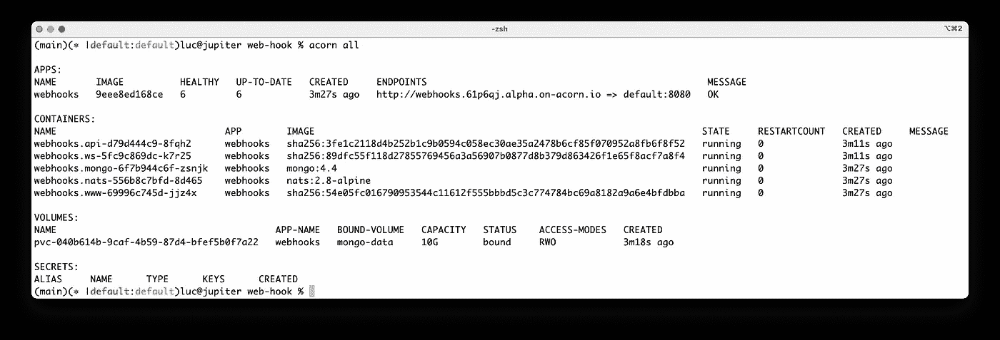

列出应用程序的组件

检查在幕后创建的 Kubernetes 资源，我们可以看到一个根据应用程序名称命名的新名称空间:

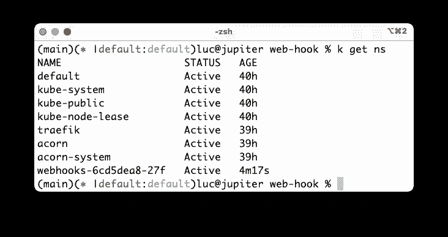

查看该命名空间，我们可以看到应用程序的每个微服务的部署和服务。此外，还创建了一个额外的 PVC 来存储 Mongo 数据库的数据:

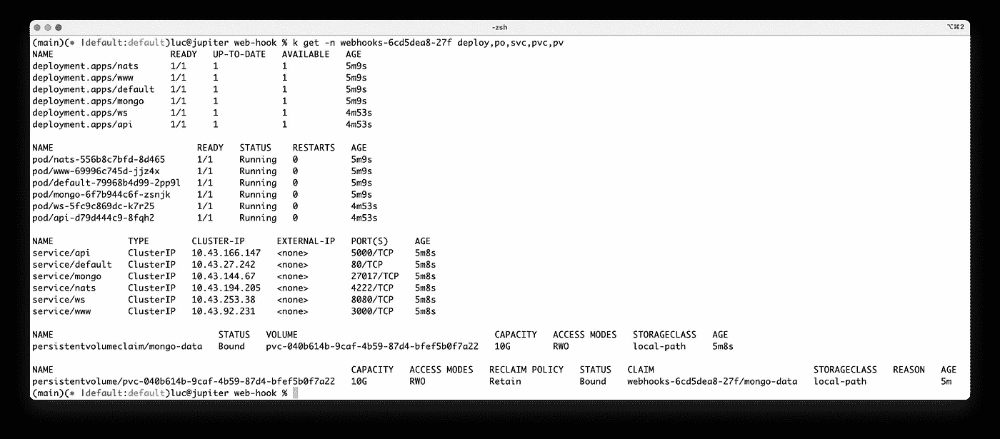

由 Acorn 的控制器在幕后创建的 Kubernetes 资源

为了公开应用程序，Acorn 创建了一个入口资源用于配置集群的入口控制器(在我们的示例中为 Traefik):

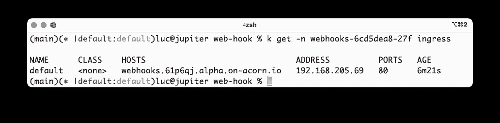

创建了一个入口资源来公开应用程序

这个入口资源是从 *Acornfile* 的*路由器*部分中定义的条目配置的:

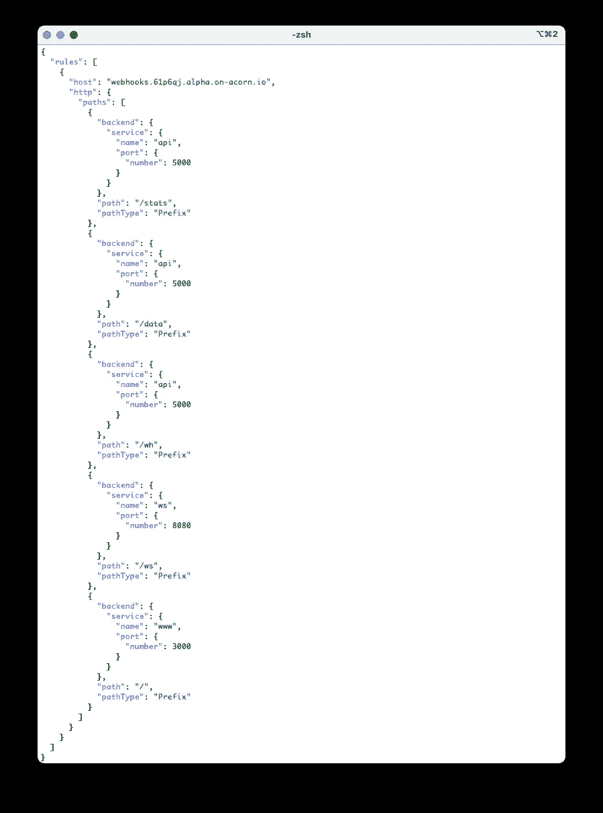

入口资源中定义的规则

为了访问应用程序，我们首先在 */etc/hosts* 中添加以下条目，这样我们的浏览器就可以将域名解析为入口控制器监听的 IP 地址:

```
192.168.205.69 webhooks.61p6qj.alpha.on-acorn.io
```

接下来，我们可以使用以下域名访问 webhooks 应用程序:

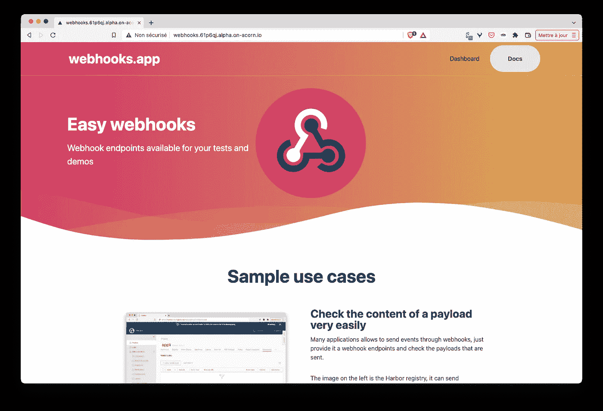

该应用程序可通过专用域名访问

然后，我们确保应用程序运行良好:

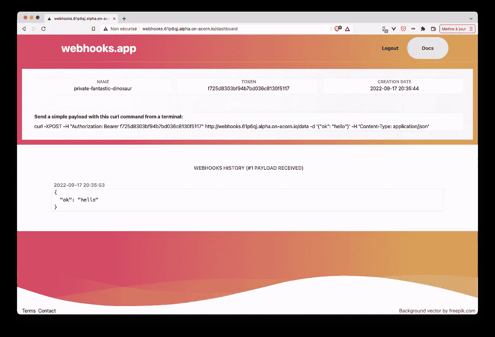

作为 Acorn 应用程序创建的 webhooks 应用程序运行良好

从 acorn cli 中，我们可以使用几个命令来管理应用程序，仅举几个例子:

*   列出正在运行的应用程序

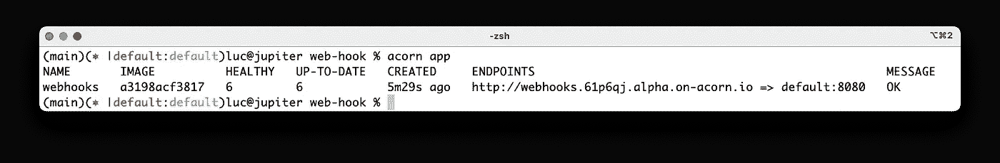

*   列出正在运行的容器

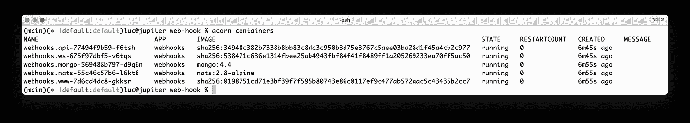

*   在容器中运行外壳(如用于调试目的)

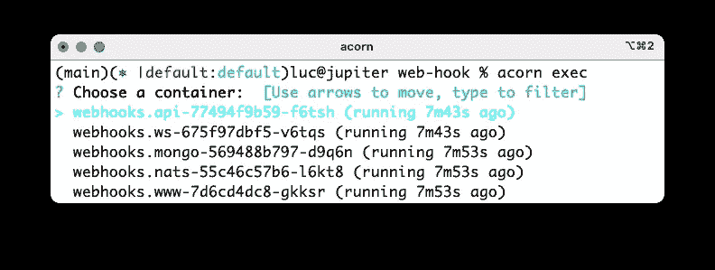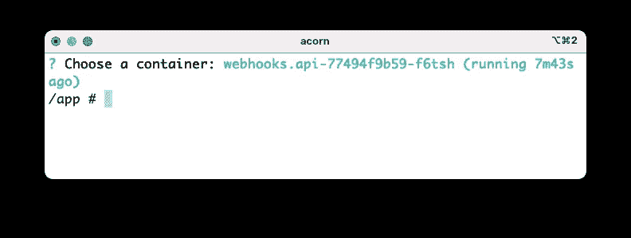

*   获取应用程序容器的日志

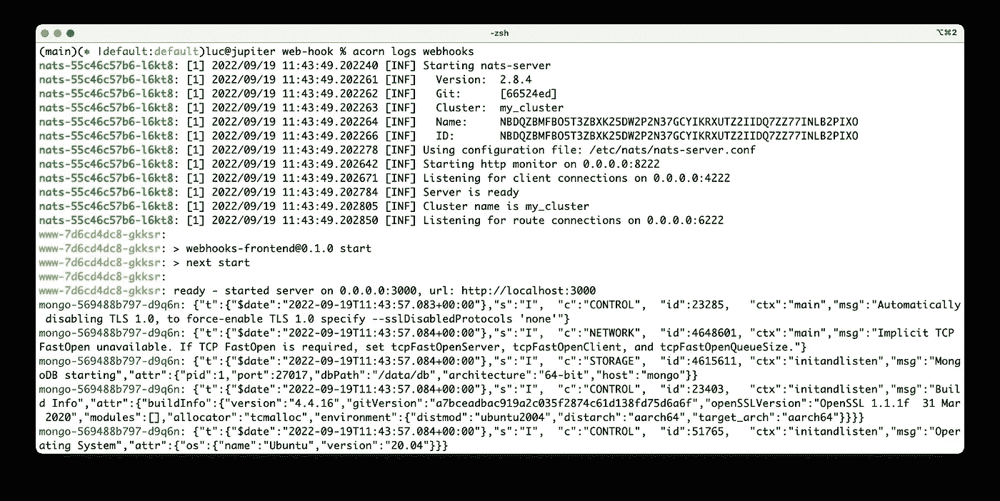

一旦我们使用完应用程序，我们就可以停止它:

```
$ acorn stop webhooks
```

并完全移除了它:

```
$ acorn rm webhooks
```

我们还需要确保删除在此过程中创建的关联卷:


删除为保存 mongo 容器的数据而创建的卷 Acorn

既然我们已经看到该应用程序与 Acorn 配合得很好，我们将使用 Acorn 的另一个特性，它允许我们将应用程序打包成一个单独的工件，并将其推送到 Docker Hub。

首先，我们登录 Docker Hub:

```
$ **acorn login docker.io**
? Username lucj
? Password **************
index.docker.io
```

接下来，我们构建应用程序，这将导致创建单个 OCI 图像:

```
$ acorn build -t docker.io/lucj/webhooks:v1.0.0 .
```

然后我们将它推送到注册中心(docker.io 与 Docker Hub 相关)

```
$ acorn push docker.io/lucj/webhooks:v1.0.0
```

从 Docker Hub，我们验证新映像是否存在:

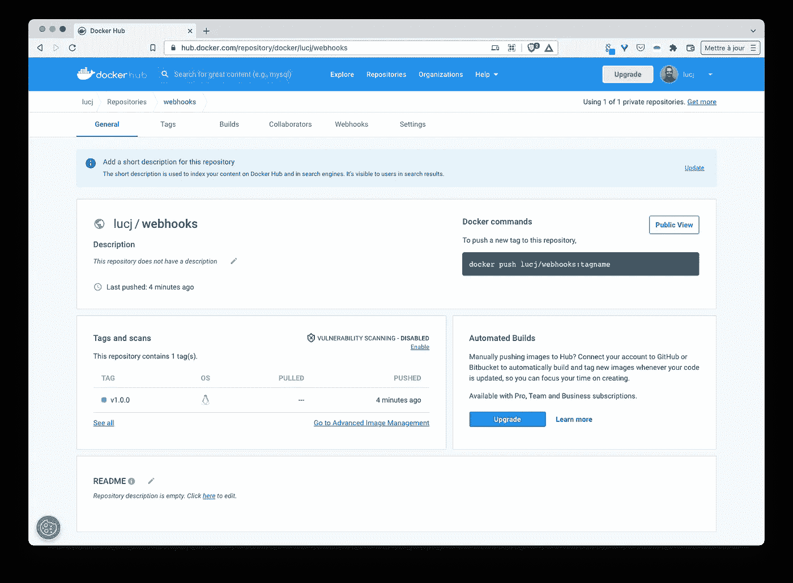

webhooks 应用程序打包成 Docker Hub 中的单个映像

现在，任何人都可以使用以下命令运行 webhooks 应用程序:

```
acorn run --name webhooks docker.io/lucj/webhooks:v1.0.0
```

当我开始这一系列与 webhooks 应用程序相关的文章时，我并不知道 Acorn。我现在真的很高兴认识了 Acorn，因为它真的是一个伟大的项目。从现在起，我将密切关注 Acorn，并在未来的文章中分享我的想法。使用 webhooks 应用程序测试它真的很有趣，对于更好地理解它在 Kubernetes 生态系统中的作用非常有用。

在本系列的下一篇文章中，我们将看看如何改进 webhooks 应用程序，确保安全最佳实践到位。