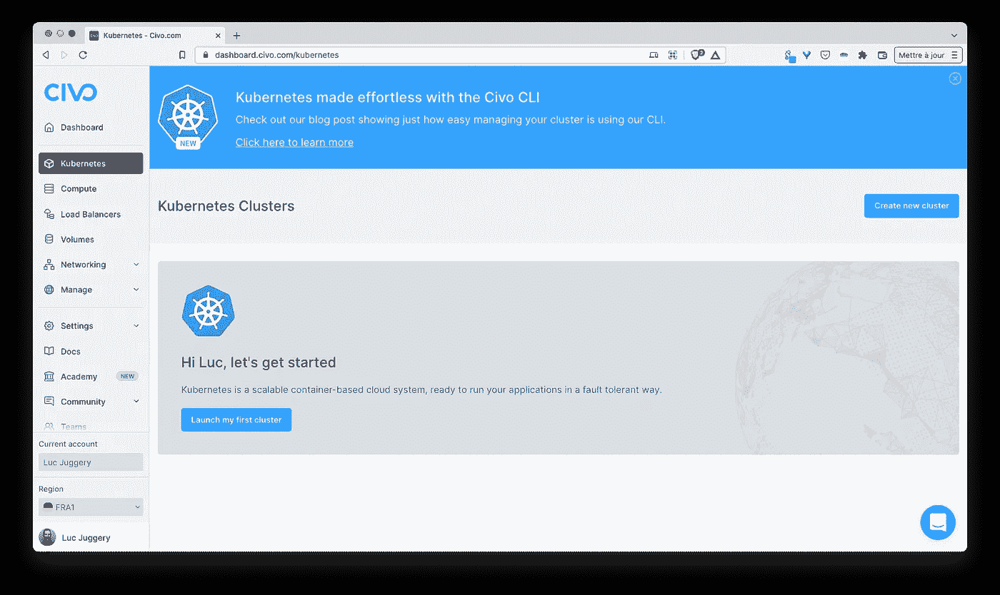
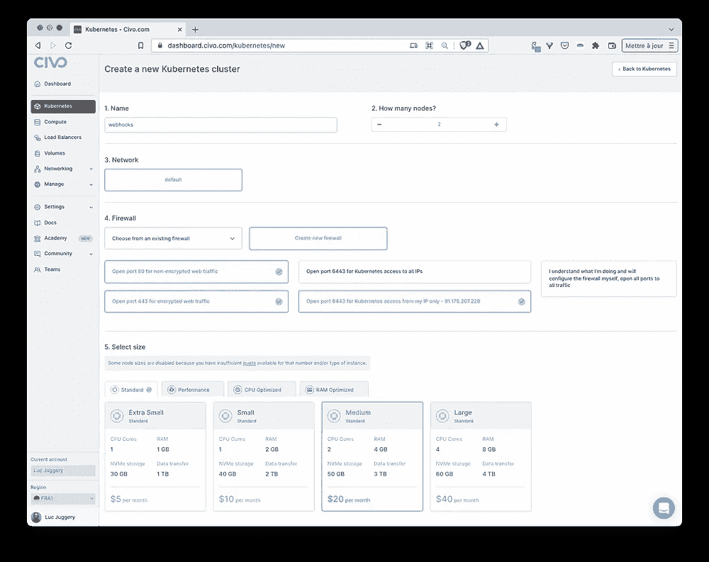
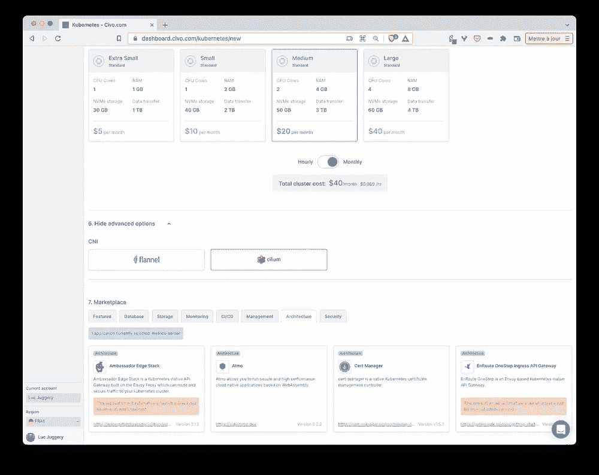
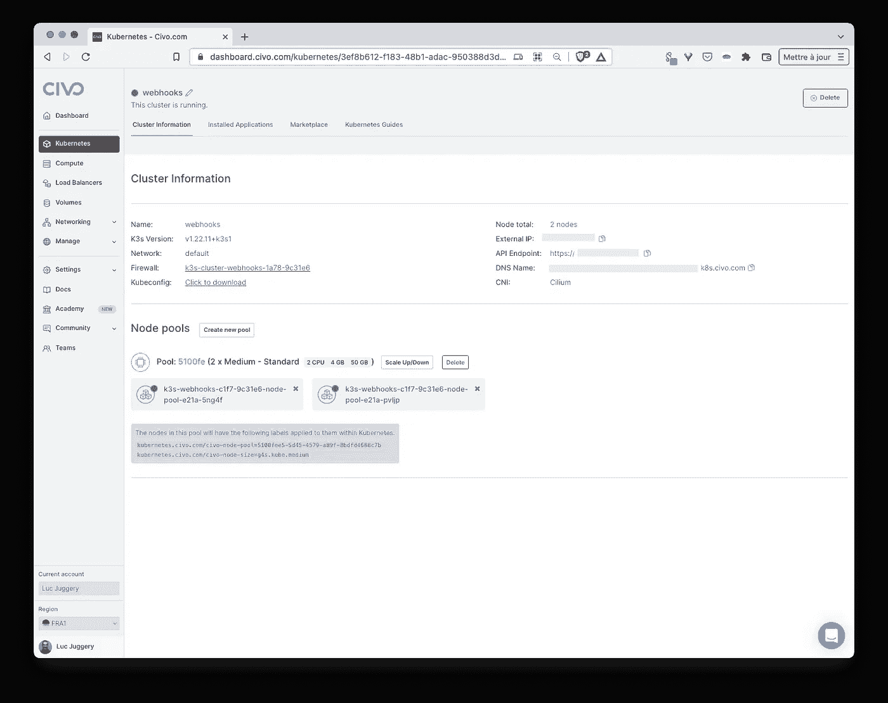
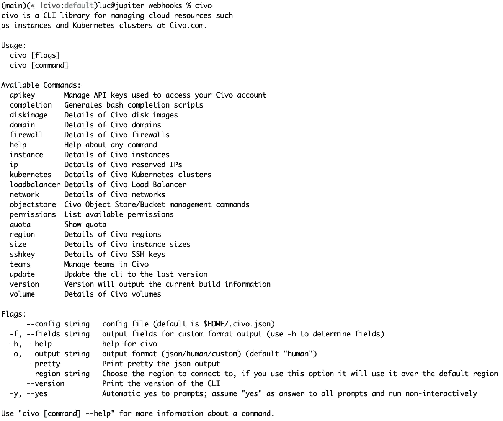
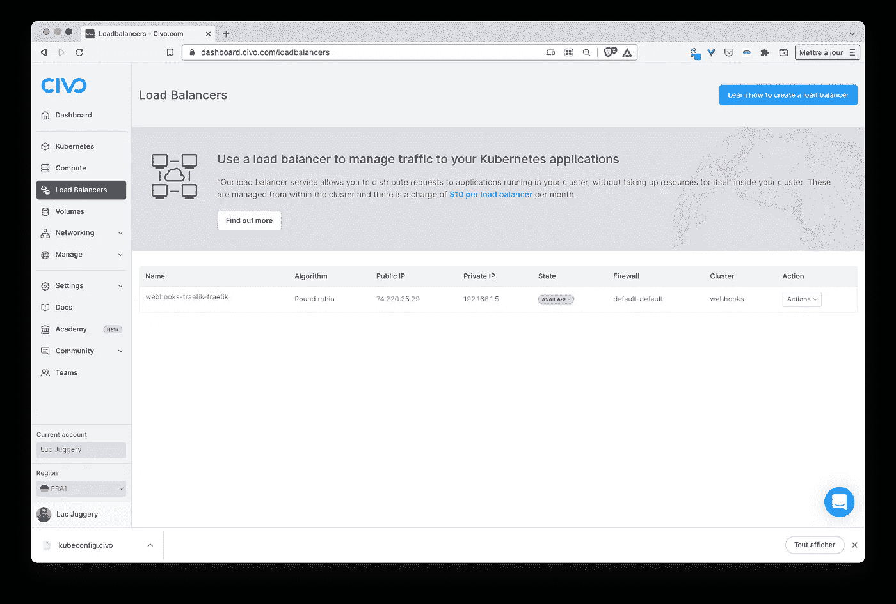
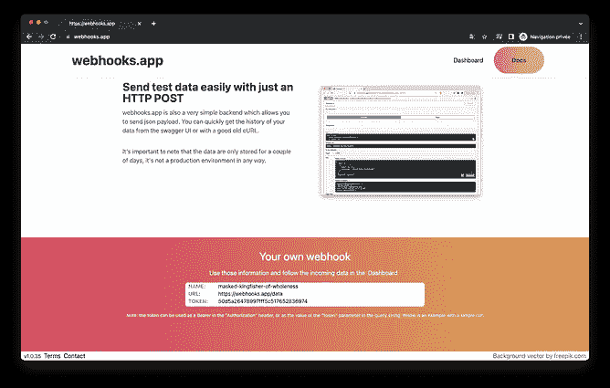
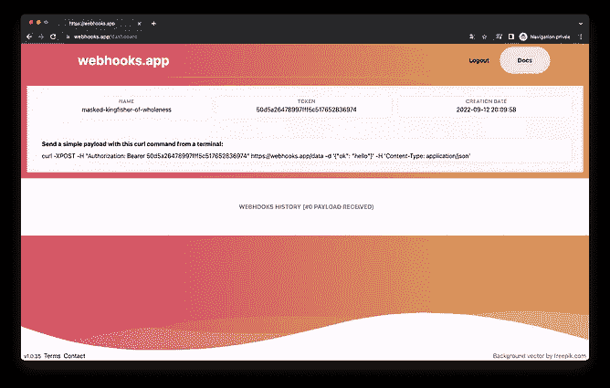
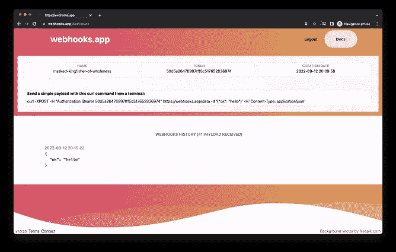

# Kubernetes 世界的微服务应用之旅

> 原文：<https://itnext.io/journey-of-a-microservice-application-in-the-kubernetes-world-e800579f0be3?source=collection_archive---------0----------------------->

## 在 Civo Kubernetes 上运行应用程序


[GR Stocks](https://unsplash.com/@grstocks?utm_source=unsplash&utm_medium=referral&utm_content=creditCopyText) 在 [Unsplash](https://unsplash.com/?utm_source=unsplash&utm_medium=referral&utm_content=creditCopyText) 上拍照

## TL；速度三角形定位法(dead reckoning)

在之前的文章中，我们介绍了 [webhooks](https://webhooks.app/) 应用程序，用 Docker Compose 运行它，并将其部署到本地 Kubernetes 集群中(基于 k3s)。现在是时候给这个应用程序一个新的房子，并在真正的生产集群上运行它了。我们将在 [Civo](https://civo.com) 创建这个集群。

澄清一点:在本文之前 [webhooks.app](https://webhooks.app) 被部署在一个运行单节点 k3s 集群的虚拟机上(是的……我知道)，在本文结束时，它将运行在一个由 [Civo](https://civo.com) 管理的全新 k3s 集群上。

## 本系列文章

*   [web hooks . app 展示](/journey-of-a-microservice-application-in-the-kubernetes-world-bdfe795532ef)
*   [使用 Helm 在 Kubernetes 上运行应用](/journey-of-a-microservice-application-in-the-kubernetes-world-3c2a9e701e9f)
*   在 Civo Kubernetes 集群上运行应用程序(本文)
*   [使用 GitOps 和 ArgoCD 进行连续部署](/journey-of-a-microservice-application-in-the-kubernetes-world-d9493b19edff)
*   [使用 Loki 堆栈的可观察性](/journey-of-a-microservice-application-in-the-kubernetes-world-876f72ce1681)
*   [使用 Acorn 定义应用](/journey-of-a-microservice-application-in-the-kubernetes-world-e2f6475ddde1)
*   [安全注意事项:安全相关工具](/journey-of-a-microservice-application-in-the-kubernetes-world-6abd625c60fe)
*   [安全考虑:修复错误配置](/journey-of-a-microservice-application-in-the-kubernetes-world-eb0fb52e1bf0)
*   [安全考虑:策略实施](/journey-of-a-microservice-application-in-the-kubernetes-world-f760cba7600f)
*   安全考虑:漏洞扫描(即将推出)

## 关于 Civo

[Civo](http://civo.com) 是一家云提供商，提供独特的基于 k3s 的托管 Kubernetes 集群。他们提供全面的产品，如下图所示:



在 Civo 中，我们可以创建

*   库伯内特星团
*   虚拟机
*   要放在这些虚拟机前面的负载平衡器
*   托管数据库应该在不久的将来可用

我知道 Civo 已经有一段时间了，因为几年前我是#KUBE100 计划的一部分，当时该公司正在构建其 k3s 集群产品。

在上一篇文章中，我们已经看到了如何将 webhooks 应用程序部署到本地 k3s 集群，Civo Kubernetes 是在生产环境中继续使用 k3s 的理想选择。

## 创建 k3s 集群

在 Civo 上创建 Kubernetes 集群有几种方法:

*   使用 web 仪表板
*   使用 [Civo cli](https://github.com/civo/cli)
*   使用基础设施作为代码工具，如 [Terraform](https://registry.terraform.io/providers/civo/civo/latest/docs) 或 [Pulumi](https://www.pulumi.com/registry/packages/civo/)

当我们使用控制面板创建集群时，我们需要提供一些信息，例如:

*   我们全新集群的名称( *webhooks* )
*   它将包含的节点数( *2* )
*   网络(网络是用来隔离虚拟机的)，我们坚持这里的默认网络
*   这些节点的类型(*中*)
*   一种防火墙，可用于防止从整个互联网访问 API 服务器
*   要安装的网络插件(默认为*法兰绒*，但我们在这里选择*纤毛*
*   将要安装的来自市场的组件(*度量-服务器*)。我明确取消选择 Traefik 入口控制器(默认情况下安装),因为稍后我将使用特定选项安装它。



集群配置选项

集群启动并运行只需不到 2 分钟的时间(真的那么快！)



集群创建非常快

从仪表板中，我们可以检索 admin *kubeconfig* 文件。一旦我们配置了我们的本地库，我们就可以与我们新创建的集群通信，并列出它包含的节点和当前正在运行的 Pods:

```
$ kubectl get no
NAME                         STATUS   ROLES    AGE     VERSION
k3s-webhooks-...-d0b7-rwon6  Ready    <none>   4m12s   v1.22.11+k3s1
k3s-webhooks-...-d0b7-4pz4a  Ready    <none>   3m56s   v1.22.11+k3s1$ kubectl get po -A
NAMESPACE   NAME                        READY STATUS  RESTARTS   AGE
kube-system cilium-operator-865ff-q6cq8 1/1   Running 0          3m
kube-system cilium-52k9h                1/1   Running 0          3m
kube-system civo-ccm-7cb9c4b58f-x5pth   1/1   Running 0          3m
kube-system cilium-operator-865ff-6q2c  1/1   Running 0          3m
kube-system coredns-7796b77cd4-5t2f7    1/1   Running 0          3m
kube-system metrics-server-ff96c-kx79z  1/1   Running 0          3m
kube-system civo-csi-node-frrmh         2/2   Running 0          2m
kube-system civo-csi-controller-0       4/4   Running 0          3m
kube-system cilium-m8rd9                1/1   Running 0          2m
kube-system civo-csi-node-7knf4         2/2   Running 0          2m
```

注意:Civo 集群还附带了一个 StorageClass，我们将在下一篇文章中使用它向应用程序的数据库添加持久存储。

我们直接从仪表板创建了集群，但是 Civo 也提供了一个 *civo* 二进制文件来从命令行管理底层基础设施。按照[的安装说明](https://github.com/civo/cli#set-up)，它可以安装在 MacOS、Linux 和 Windows 上。

不带任何参数运行这个二进制文件会提供所有可用命令的列表:



Civo 的 cli 选项

要使用这个二进制文件，我们首先需要添加一个 API 密钥，这可以按照[这些指令](https://github.com/civo/cli#api-keys)来完成。

一旦配置了 API 密钥， *civo* 二进制文件就可以用于从命令行轻松管理基础设施。例如，以下命令使用 Cilium 作为 CNI 插件创建一个 2 节点集群:

```
$ civo kubernetes create webhooks \
  --size=g4s.kube.medium \
  --nodes=2 \
  --cni-plugin=cilium
```

## 入口控制器的安装

群集已启动并运行，我们现在将安装入口控制器。这将用于(向外界)公开我们将要在集群上部署的应用程序。

*配置*库的 *apps/traefik* 文件夹包含使用以下 *helmfile.yaml* 将 traefik 入口控制器部署为舵图的规范:

```
# config/apps/traefik/helmfile.yamlrepositories:
- name: traefik
  url: https://helm.traefik.io/traefikreleases:
- name: traefik
  namespace: traefik
  labels:
    app: traefik
  chart: traefik/traefik
  version: ~10.24.2
  values:
  - ./values.yaml.gotmpl
```

注意:如果你不知道 [Helmfile](https://github.com/helmfile/helmfile) ，我真的建议你看看这个伟大的项目，它允许以一种更声明性的方式安装 Helm chart

因为我们希望 Traefik 处理 TLS，所以这个 Helmfile 引用了一个名为 *values.yaml.gotmpl.* 的值文件，它有一个时髦的扩展名，因为它包含 Go 模板，需要该模板来获取当前 shell 中设置的以下环境变量的内容:

*   ACME_EMAIL_ADDRESS:提供给 Let's Encrypt 的电子邮件地址
*   CF_DNS_API_TOKEN:请求 TLS 证书时用于检查 DNS01 质询的 CloudFlare API 令牌

```
# config/apps/traefik/values.yaml.gotmpl# Configuration options
additionalArguments:
- --accesslog
- --certificatesresolvers.le.acme.email={{ requiredEnv "ACME_EMAIL_ADDRESS" }}
- --certificatesresolvers.le.acme.storage=/data/acme.json
- --certificatesresolvers.le.acme.dnschallenge=true
- --certificatesresolvers.le.acme.dnschallenge.provider=cloudflare
- --certificatesresolvers.le.acme.dnschallenge.delaybeforecheck=0
- --log.level=INFO# Environment variables to be passed to Traefik
env:
- name: CF_DNS_API_TOKEN
  value: {{ requiredEnv "CF_DNS_API_TOKEN" }}
```

从 *config/apps/traefik* 中，我们安装 traefik 入口控制器:

```
$ helmfile apply
```

接下来，我们验证 Traefik Pod 是否运行正常:

```
**$ kubectl get po -n traefik** NAME                          READY   STATUS    RESTARTS   AGE
pod/traefik-b56cb5bf6-mz8rm   1/1     Running   0          13s
```

Traefik 公开了一个负载平衡器服务，它提供了一个外部 IP，可用于访问将在集群中运行的应用程序。

```
**$ kubectl -n traefik get svc** NAME              TYPE           CLUSTER-IP     EXTERNAL-IP    PORT(S)                      AGE
service/traefik   LoadBalancer   10.43.138.18   74.220.24.13   80:31190/TCP,443:30636/TCP   13s
```

从 Civo 的仪表板上，我们也可以看到这个负载平衡器的特征。



Traefik 通过 LoadBalancer 类型的服务公开

现在 Traefik Ingress 控制器正在运行，我们可以在新创建的集群上部署 webhooks 应用程序了。

## 运行应用程序

配置库*中的 *apps/webhooks* 文件夹包含了定义 webhooks 应用程序的导航图。正如我们之前所做的，我们使用 Helmfile 来定义图表需要如何部署:*

```
# config/app/webhooks/helmfile.yamlreleases:
- name: webhooks
  namespace: webhooks
  labels:
    app: webhooks
  chart: .
  values:
  - values.yaml
```

*values.yaml* 定义了图像标签以及应用程序将暴露的域。Traefik 还将使用该域名向 Let's Encrypt 请求 TLS 证书。

```
# config/app/webhooks/values.yamltls: true
domain: webhooks.app
api:
  tag: v1.0.33
mongo:
  tag: 4.4
nats:
  tag: 2.8.4-alpine3.15
ws:
  tag: v1.0.7
www:
  tag: v1.0.34
```

从 *config/apps/webhooks* 中，我们安装 webhooks 应用程序:

```
$ helmfile apply
```

接下来，我们验证 pod 是否运行正常

```
**$ kubectl get po -n webhooks** NAME                       READY   STATUS    RESTARTS   AGE
nats-594ff94b94-42jxx      1/1     Running   0          21s
ws-c7ff94f45-45wx8         1/1     Running   0          21s
api-54c78799d4-qbhjz       1/1     Running   0          21s
www-6dbb6d848f-ffrcf       1/1     Running   0          21s
mongo-85dfbcbf58-5qqp9     1/1     Running   0          21s
```

## 测试整个事情

当我们将应用从运行 k3s 的单个虚拟机迁移到 Civo Kubernetes 集群时，我们需要确保 DNS 条目(该项目使用 CloudFlare 作为 DNS 提供商)得到更新，以便域名 *webhooks.app* 现在指向暴露 Traefik 入口控制器的负载平衡器的 IP 地址。

一旦 DNS 更改完成(这可能需要几分钟才能传播)，我们将能够访问运行在 Civo 上的 webhooks 应用程序。



webhooks.app 现在在 Civo Kubernetes 上运行

应用程序现在运行在由 [Civo](https://civo.com) 管理的生产集群上。这是否意味着应用程序本身已经可以生产了？不…不是的！在以后的文章中，我们将考察几个方面，并做出可以显著增强应用程序的更改。

在基础设施方面，我们目前使用一个 2 中型节点集群和一个额外的负载平衡器来展示我们的 Traefik 入口控制器。这总共花费 50 美元/月，对于所提供的服务来说并不算贵。

在本系列的下一篇文章[中，我们将解释如何在我们的 CICD 管道中使用 GitOps 方法。](/journey-of-a-microservice-application-in-the-kubernetes-world-d9493b19edff)