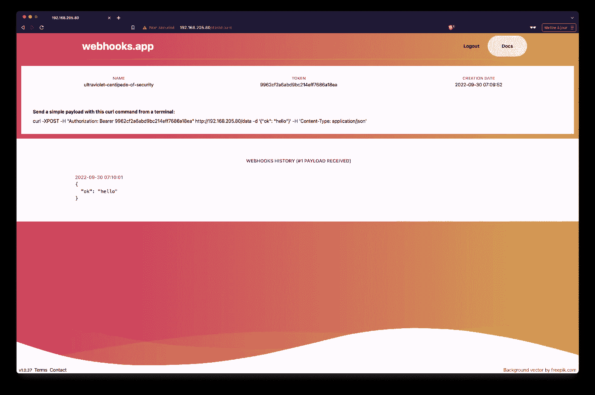

# Kubernetes 世界的微服务应用之旅

> 原文：<https://itnext.io/journey-of-a-microservice-application-in-the-kubernetes-world-eb0fb52e1bf0?source=collection_archive---------7----------------------->

## 安全考虑:修复错误配置


在 [Unsplash](https://unsplash.com/s/photos/fixing?utm_source=unsplash&utm_medium=referral&utm_content=creditCopyText) 上由 [Kilian Seiler](https://unsplash.com/@kilianfoto?utm_source=unsplash&utm_medium=referral&utm_content=creditCopyText) 拍摄的照片

## TL；速度三角形定位法(dead reckoning)

在本系列的[上一篇文章](/journey-of-a-microservice-application-in-the-kubernetes-world-6abd625c60fe)中，我们介绍了一些用于审计集群和/或集群内运行的应用程序的安全工具。我们现在将使用其中一些工具的结果来修复配置问题，并确保应用程序的规范遵循一些最佳安全实践。

## 本系列文章

*   [web hooks . app 的展示](/journey-of-a-microservice-application-in-the-kubernetes-world-bdfe795532ef)
*   [使用 Helm 在本地单节点 Kubernetes 上运行应用](/journey-of-a-microservice-application-in-the-kubernetes-world-3c2a9e701e9f)
*   [在 Civo Kubernetes 集群上运行应用](/journey-of-a-microservice-application-in-the-kubernetes-world-e800579f0be3#0174-87b0e3c1fcd3)
*   [使用 GitOps 和 Argo CD 进行连续部署](/journey-of-a-microservice-application-in-the-kubernetes-world-d9493b19edff)
*   [使用 Loki 堆栈的可观察性](/journey-of-a-microservice-application-in-the-kubernetes-world-876f72ce1681)
*   [使用 Acorn 定义应用](/journey-of-a-microservice-application-in-the-kubernetes-world-e2f6475ddde1)
*   [安全注意事项:安全相关工具](/journey-of-a-microservice-application-in-the-kubernetes-world-6abd625c60fe)
*   安全性考虑:修复错误配置(本文)
*   [安全考虑:政策执行](/journey-of-a-microservice-application-in-the-kubernetes-world-f760cba7600f)
*   安全考虑:漏洞扫描(即将推出)

## 强化 webhooks 应用程序

根据上一篇文章中介绍的工具的结果，我们已经可以通过以下更改使 webhooks 应用程序更加安全:

*   添加一个 **securityContext** (在 Pod 和/或容器级别)以防止容器在不遵循安全最佳实践的情况下在集群中运行
*   如果不需要，确保 ServiceAccount 的令牌没有装入容器的文件系统中(阅读:如果 Pod 不需要与 API 服务器通信)
*   确保每个容器都为它需要使用的资源定义了请求和限制
*   使用 AppArmor 配置文件来限制允许容器做什么

注意:我们将关注这些变化，并将在本系列的后续文章中详细介绍其他可能的增强

让我们以 api 微服务的简单部署为起点:

```
apiVersion: apps/v1
kind: Deployment
metadata:
  labels:
    app: api
  name: api
spec:
  selector:
    matchLabels:
      app: api
  template:
    metadata:
      labels:
      app: api
    spec:
      containers:
        - image: registry.gitlab.com/web-hook/api:v1.0.33
          name: api
```

首先，我们在 api 容器下添加内存和 cpu 请求和限制:

```
resources:
  requests:
    memory: 256Mi
    cpu: 200m
  limits:
    memory: 256Mi 
    cpu: 200m
```

注意事项:

*   对*requests . CPU*/*limits . CPU、*和*requests . memory*/*limits . memory*使用相同的值可以确保 Pod 的 QoS 设置为有保证(在主机上发生资源争用的情况下，它不太容易被驱逐)
*   我们在这里为 cpu 和内存指定的值可以在以后根据我们在 Loki 堆栈中观察到的资源消耗进行优化

接下来，我们添加一个 *securityContext* 属性(仍然在 api 容器下):

```
securityContext:
  allowPrivilegeEscalation: false
  readOnlyRootFilesystem: true
  runAsUser: 10000
  runAsNonRoot: true
  seccompProfile:
    type: RuntimeDefault
  capabilities:
    drop:
    - ALL
```

这些设置确保:

*   容器内的进程不能拥有比主进程更多的权限
*   该容器有一个只读文件系统(以避免攻击者在容器中安装额外的包，以防他设法在其中安装一个 shell)
*   容器以非根用户的专用用户运行(指令 *runAsUser* 和 *runAsNonRoot* 都可以使用，因为它们进行不同的检查)
*   设置了一个 seccomp 配置文件，它限制了容器可以使用的系统调用
*   容器无法访问他们不需要的功能

接下来，我们在 pod 规范中添加以下属性，以确保服务帐户的令牌没有安装在容器的文件系统中。不需要与 API 服务器通信的 Pod 不需要访问 ServiceAccount 令牌。

```
automountServiceAccountToken: false
```

接下来，我们添加一个注释，为 api 容器提供容器运行时的默认 AppArmor 配置文件:

```
annotations:
 container.apparmor.security.beta.kubernetes.io/api: runtime/default
```

更新后，api 微服务的部署规范如下所示:

```
apiVersion: apps/v1
kind: Deployment
metadata:
  **labels:
    app.kubernetes.io/name: api
    app.kubernetes.io/part-of: webhooks
    app.kubernetes.io/version: v1.0.33
  annotations:
    container.apparmor.security.beta.kubernetes.io/api: runtime/default**
  name: api
spec:
  selector:
    matchLabels:
      app: api
  template:
    metadata:
      labels:
      app: api
    spec:
      **automountServiceAccountToken: false**
      containers:
        - image: registry.gitlab.com/web-hook/api:v1.0.33
          name: api
          **resources:
            requests:
              memory: 256Mi
              cpu: 200m
            limits:
              memory: 256Mi 
              cpu: 200m
          securityContext:
            allowPrivilegeEscalation: false
            readOnlyRootFilesystem: true
            runAsUser: 10000
            runAsNonRoot: true
            seccompProfile:
              type: RuntimeDefault
            capabilities:
              drop:
              - ALL**
```

注意:同时我们也修改了部署元数据，所以它使用了一些推荐的标签

在第一次尝试中，我们将对其他部署规范(ws、www、mongo 和 nats)执行完全相同的更改。。

为了检查一切是否按预期运行，我们首先在一个本地集群上运行应用程序 helm 图表(我使用 Helmfile，详见[上一篇文章](/journey-of-a-microservice-application-in-the-kubernetes-world-3c2a9e701e9f)):

```
$ helmfile apply
```

接下来，我们确保 pod 运行正常:

```
**$ kubectl get po -n webhooks** NAME                     READY  STATUS             RESTARTS      AGE
nats-6bcb57fc6d-qp5m9    1/1    Running            0             46s
ws-55fb4bc9f7-5b8zp      1/1    Running            0             46s
mongo-7b8b4fb696-cvvjs   0/1    CrashLoopBackOff   2 (30s ago)   46s
api-66869bffc4-nml64     0/1    CrashLoopBackOff   2 (25s ago)   46s
www-548d4b5b8c-59rsc     0/1    CrashLoopBackOff   2 (17s ago)   46s
```

从上面的结果我们可以看到，只有 *ws* 和 *nats* 在无错运行，为什么？嗯……我们在没有考虑每个微服务的特殊性的情况下，对每个部署都增加了限制。让我们逐一回顾一下，并尝试了解为什么有些 pod 没有运行。

*   **api**

这个微服务是用 python / flask 构建的，框架需要一个可写的临时文件夹。为此，我们可以创建一个 *EmptyDir* 卷，并将其挂载到容器的文件系统中(在 */tmp* 中)。除了这个文件夹，容器的文件系统可以是只读的。

api 微服务 nows 的部署规范如下所示:

```
apiVersion: apps/v1
kind: Deployment
metadata:
  labels:
    app: api
  name: api
spec:
  selector:
    matchLabels:
      app: api
  template:
    metadata:
      labels:
      app: api
    spec:
      automountServiceAccountToken: false
      containers:
      - image: registry.gitlab.com/web-hook/api:v1.0.33
        name: api
        resources:
          requests:
            memory: 256Mi
            cpu: 200m
          limits:
            memory: 256Mi 
             cpu: 200m
        securityContext:
          allowPrivilegeEscalation: false
          readOnlyRootFilesystem: true
          runAsUser: 10000
          seccompProfile:
            type: RuntimeDefault
          capabilities:
            drop:
             - ALL
 **volumeMounts:
        - name: tmp
          mountPath: /tmp
      volumes:
      - name: tmp
        emptyDir: {}**
```

*   **www**

当 *readOnlyRootFilesystem* 属性设置为 *true 时，www 部署出现问题。*这好像是下面用的 nodejs / nextjs 框架造成的。对于这一点，我们将暂时删除该属性(当我获得更多信息时，我将更新帖子，这将有助于以更安全、更优雅的方式修复该问题)。

*   **蒙哥**

**第一版保留 mongo 官方形象**

为了让 mongodb Pod 正常运行，我们需要做一些更改。首先我们定义 2 个 *emptyDir* 卷:第一个卷用于存储数据(长期存储将在本系列的另一篇文章中详细介绍)，第二个卷用作 mongo 创建套接字的临时读写文件夹。

```
containers:
- image: mongo:{{ .Values.mongo.tag }}
  name: mongo
  **...**
 **volumeMounts:
  - name: data
    mountPath: /data/db
  - name: tmp
  mountPath: /tmp
volumes:
- name: data
  emptyDir: {}
- name: tmp
  emptyDir: {}**
```

接下来，我们需要删除 *runAsUser: 10000* 和 *runAsNonRoot* 属性，因为在初始化步骤中 mongodb 容器需要成为 Root。初始化后，该进程将被 mongodb 进程替换，该进程由一个专门的非 root 用户运行。为了实现这一点，我们需要在部署规范中提供额外的功能:

```
capabilities:
  drop:
  - ALL
  add:
  - CHOWN
  - DAC_OVERRIDE
  - SETGID
  - SETUID
```

**使用 bitnami/mongodb 图像的第二版**

我们也可以考虑使用 *bitnami/mongodb* 镜像，而不是官方的 *mongo* 镜像，因为 bitnami 的镜像不需要 root 用户。如果我们采用这种解决方案，我们最终会得到以下规范(由于需要进行额外的配置，这有点复杂):

```
apiVersion: apps/v1
kind: Deployment
metadata:
  labels:
    app.kubernetes.io/name: mongo
    app.kubernetes.io/part-of: webhooks
    app.kubernetes.io/version: "{{.Values.mongo.tag}}"
  annotations:
    container.apparmor.security.beta.kubernetes.io/mongo: runtime/default
  name: mongo
spec:
  replicas: 1
  selector:
    matchLabels:
      app: mongo
  template:
    metadata:
      labels:
        app: mongo
    spec:
      automountServiceAccountToken: false
      containers:
      - image: bitnami/mongodb:{{ .Values.mongo.tag }}
        name: mongo
        command:
        - "/opt/bitnami/scripts/mongodb/entrypoint.sh"
        - "/opt/bitnami/scripts/mongodb/run.sh"
        - "--bind_ip_all"
        resources:
          requests:
            memory: 256Mi
            cpu: 200m
          limits:
            memory: 256Mi
            cpu: 200m
        securityContext:
          allowPrivilegeEscalation: false
          readOnlyRootFilesystem: true
          runAsNonRoot: true
          runAsUser: 10000
          seccompProfile:
            type: RuntimeDefault
          capabilities:
            drop:
            - ALL
        volumeMounts:
        - name: data
          mountPath: /bitnami/mongodb/data/db
        - name: tmp
          mountPath: /opt/bitnami/mongodb/tmp
      volumes:
      - name: data
        emptyDir: {}
      - name: tmp
        emptyDir: {}
```

使用 *bitnami/mongodb* 映像，我们可以为 securityContext 中的其他部署指定相同的属性(删除所有功能，runAsUser / runAsNonRoot)。

注意: *bitnami/mongodb* 镜像还不能用于 *arm64* 架构，因此不能在 Mac M1 上运行。

## 测试事物

现在我们已经修改了 *api* 、 *www* 和 *mongo* 部署的规范，让我们更新应用程序:

```
# Update the application (from config/app/webhooks)
**$ helmfile apply**
```

确保所有的吊舱都在运行:

```
# Checking the Pods' status
**$ kubectl get po -n webhooks** NAME                     READY  STATUS   RESTARTS      AGE
nats-6bcb57fc6d-qp5m9    1/1    Running  0             6m44s
ws-55fb4bc9f7-5b8zp      1/1    Running  0             6m44s
mongo-76b7b449dc-8qgvl   1/1    Running  0             32s
www-5b85bc4db8-2qbrm     1/1    Running  0             32s
api-6bc4c96b44-4jsqm     1/1    Running  0             32s
```

然后，我们可以访问应用程序，获得一个专用令牌，并发送一个简单的有效载荷，这确认一切运行良好。



webhooks 应用程序的仪表板

所有更新的规格都可以在 webhooks 应用程序的[舵图中找到。](https://gitlab.com/web-hook/config/-/tree/main/apps/webhooks/templates)

## 包扎

在本文中，我们使用了之前介绍的一些安全工具的结果。我们重点关注错误配置的检测，并展示了如何增强 webhooks 应用程序的每个微服务的 yaml 规范。

除此之外，我们还可以做很多事情，例如:

*   创建网络策略以在网络级别隔离单元
*   添加映像扫描，以确保映像运行不包含漏洞(至少不包含高漏洞或关键漏洞)
*   …

在[的下一篇文章](/journey-of-a-microservice-application-in-the-kubernetes-world-f760cba7600f)中，我们将讨论防止错误配置到达集群的策略执行。