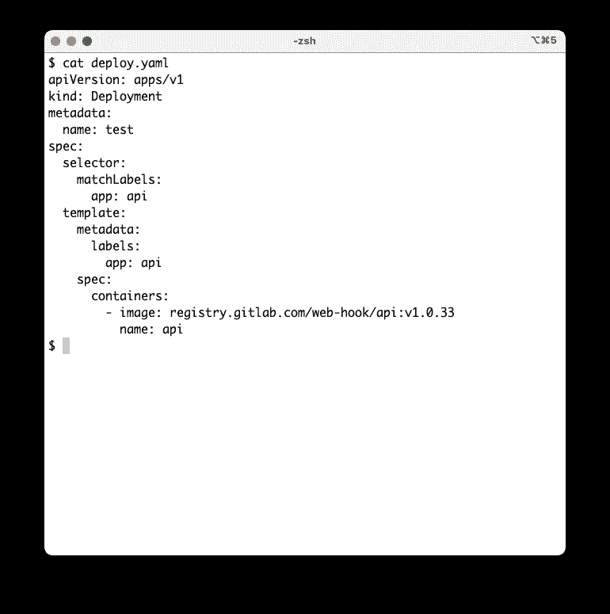
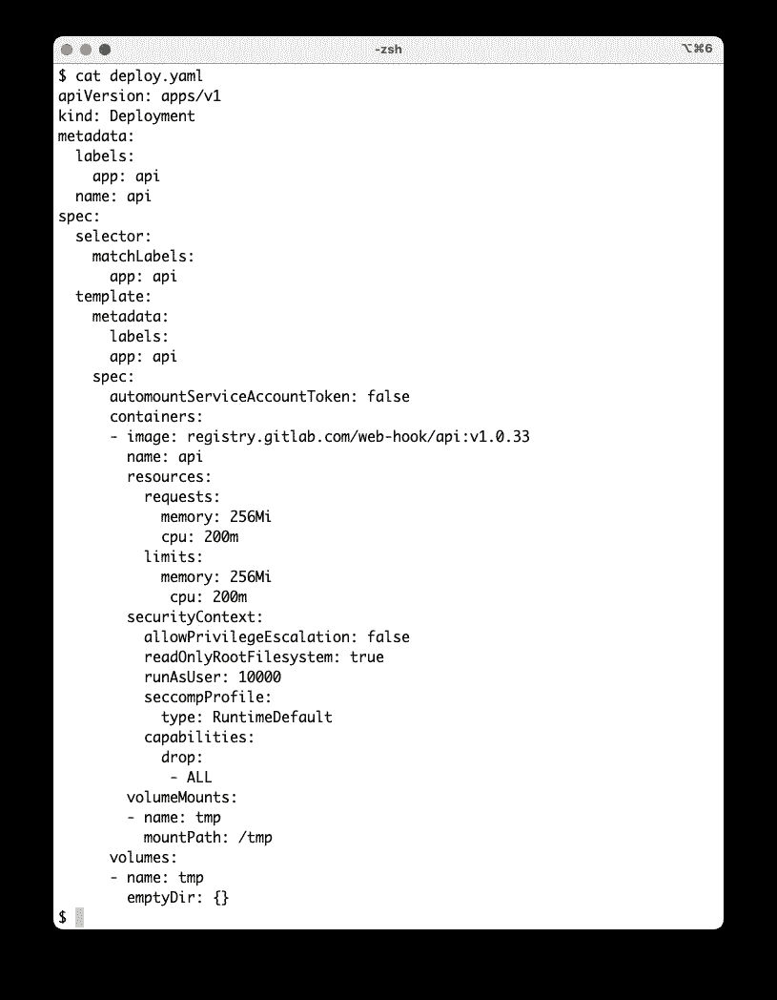
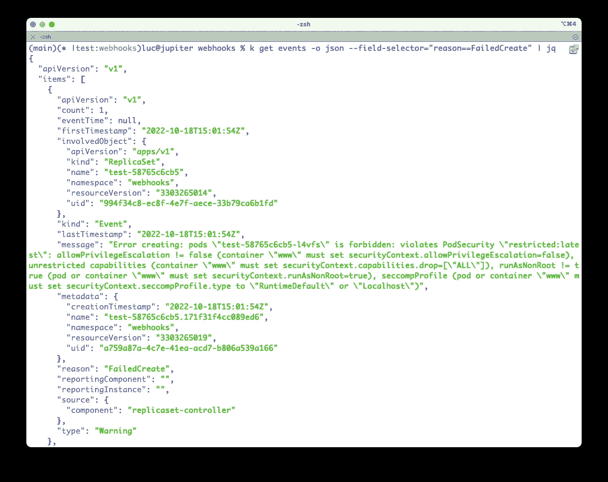
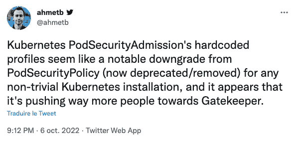
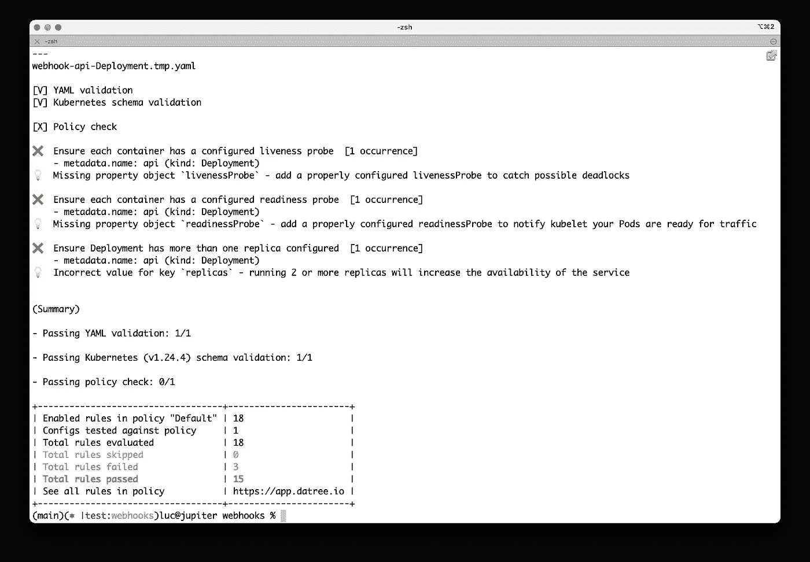
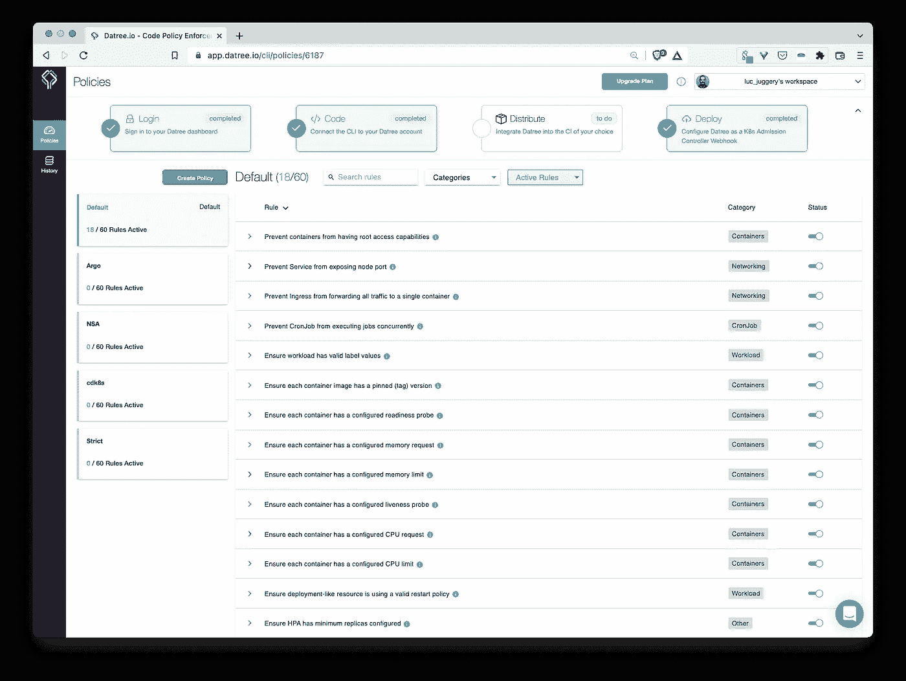
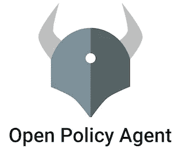
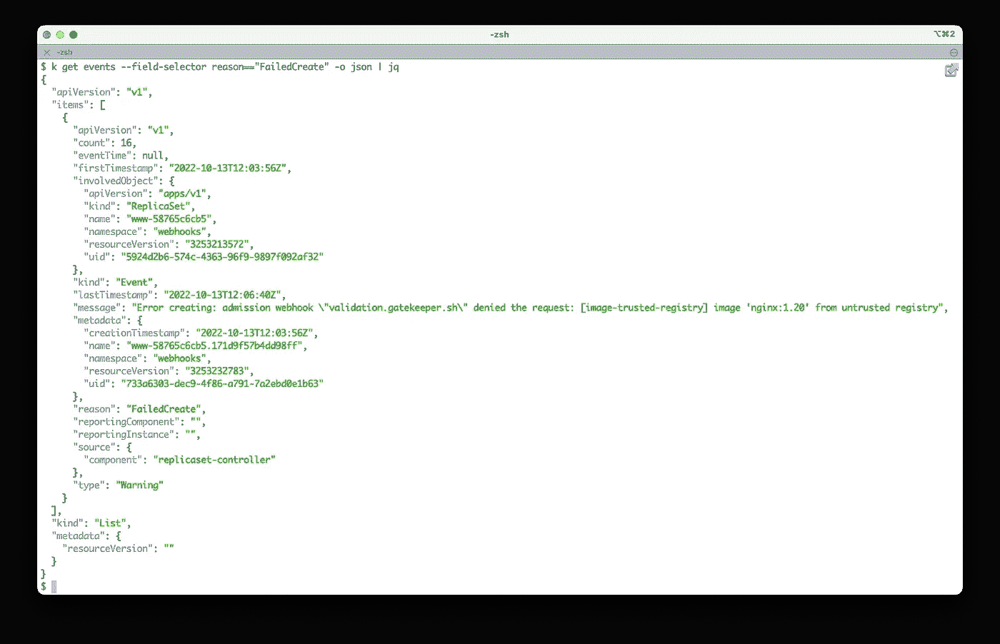
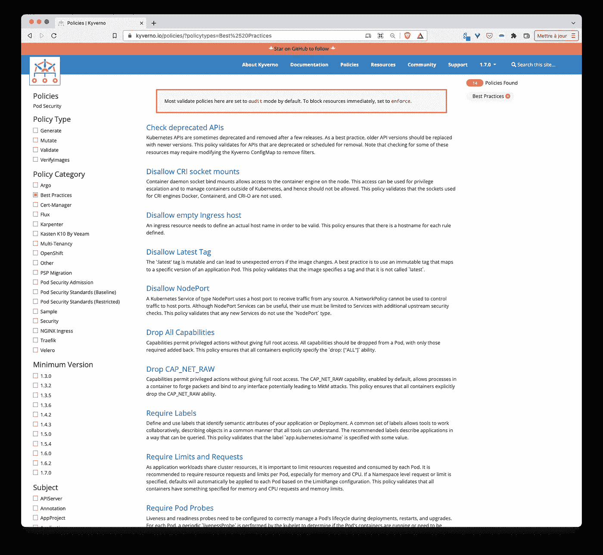

# Kubernetes 世界的微服务应用之旅

> 原文：<https://itnext.io/journey-of-a-microservice-application-in-the-kubernetes-world-f760cba7600f?source=collection_archive---------1----------------------->

## 安全考虑:策略实施


丹尼·米勒在 [Unsplash](https://unsplash.com/s/photos/enforcement?utm_source=unsplash&utm_medium=referral&utm_content=creditCopyText) 上的照片

## TL；速度三角形定位法(dead reckoning)

在[的上一篇文章](/journey-of-a-microservice-application-in-the-kubernetes-world-6abd625c60fe)中，我们从几个安全工具的审计结果中增强了 webhooks 应用的部署规范。在本文中，我们将讨论策略执行工具，其目的是确保集群中不会创建错误配置的规范。

## 本系列文章

*   [web hooks . app 的展示](/journey-of-a-microservice-application-in-the-kubernetes-world-bdfe795532ef)
*   [使用 Helm 在本地单节点 Kubernetes 上运行应用](/journey-of-a-microservice-application-in-the-kubernetes-world-3c2a9e701e9f)
*   [在 Civo Kubernetes 集群上运行应用](/journey-of-a-microservice-application-in-the-kubernetes-world-e800579f0be3#0174-87b0e3c1fcd3)
*   [使用 GitOps 和 Argo CD 进行连续部署](/journey-of-a-microservice-application-in-the-kubernetes-world-d9493b19edff)
*   [使用 Loki 堆栈的可观察性](/journey-of-a-microservice-application-in-the-kubernetes-world-876f72ce1681)
*   [使用 Acorn 定义应用](/journey-of-a-microservice-application-in-the-kubernetes-world-e2f6475ddde1)
*   [安全注意事项:安全相关工具](/journey-of-a-microservice-application-in-the-kubernetes-world-6abd625c60fe)
*   [安全考虑:修复错误配置](/journey-of-a-microservice-application-in-the-kubernetes-world-eb0fb52e1bf0)
*   安全性考虑:策略实施(本文)
*   安全考虑:漏洞扫描(即将推出)

## 策略实施工具

在[之前的文章](/journey-of-a-microservice-application-in-the-kubernetes-world-6abd625c60fe)中，我们增强了 webhooks 应用的微服务的部署规范，以使整个应用更加安全(我们将在未来的帖子中继续增强这些规范)。下面是 api 的原始部署和具有附加安全相关属性的相同部署。



api 微服务的规格:左边是原创的，右边是更安全的

即使我们知道我们必须如何指定一个部署以便它更安全，也没有什么能阻止我们发送原始版本(上面左边的那个)并在集群中创建它。由于各种原因，这可能是有害的，例如:

*   没有*资源.请求*也没有*资源.限制*，因此 api Pod 可能耗尽其他 Pod(嘈杂的邻居)所需的资源
*   没有*安全上下文*来防止损坏的映像以 root 用户身份运行并可能危及主机
*   没有 *seccomp* 配置文件限制容器可以使用的系统调用
*   有一组默认的 Linux 功能，容器可以使用这些功能以提升的权限执行一些操作
*   …

为了确保遵守最佳的安全实践，因此只有增强的 yaml 规范(上面右边的那个)可以在集群中创建，我们需要定义和执行一些安全策略。这样做，API 服务器就不会让一个有潜在危险的规范通过。

有几种工具可以强制实施策略，从而防止潜在的高风险应用程序在集群中运行。这些工具包括:

*   [Pod 策略准入](https://kubernetes.io/docs/concepts/security/pod-security-admission/)是 Pod 安全策略(又名 PSP)的继承者，很长一段时间以来一直被弃用，并在 Kubernetes 1.25 中被删除
*   [Datree](https://www.datree.io/) 是一个防止错误配置的工具(我们已经在[上一篇文章](/journey-of-a-microservice-application-in-the-kubernetes-world-6abd625c60fe)中讨论过 Datree)。它也可以用在准入控制器中，以拒绝错误配置的规范
*   [开放策略代理](https://www.openpolicyagent.org/) / [看门人](https://github.com/open-policy-agent/gatekeeper) : OPA 是一个通用的策略引擎，它不是 Kubernetes 专用的。网守是 Kubernetes 的 OPA 用例，它允许在 Kubernetes 准入控制器中定义策略
*   Kyverno 是一个 Kubernetes 本地策略管理，其中策略被定义为 Kubernetes 资源

基本上，这些工具中的每一个都运行一个准入控制器，负责检查规范，如果它们不遵守一组预定义的规则，就拒绝它们。

现在让我们来看看策略实施工具的使用如何有助于使应用程序更加安全。


[吊舱安全准入](https://kubernetes.io/docs/concepts/security/pod-security-admission/)定义了 3 个[吊舱安全标准](https://kubernetes.io/docs/concepts/security/pod-security-standards/):

*   **特权:**无限制策略，提供尽可能广泛的权限级别。该策略允许已知的权限提升
*   **基线:**防止已知权限升级的最低限制策略。允许默认(最低指定)Pod 配置
*   **受限:**严格受限的策略，遵循当前的 Pod 强化最佳实践。

每个配置文件的详细信息可以在[文档](https://kubernetes.io/docs/concepts/security/pod-security-standards/#profile-details)中找到:对于每个标准，我们可以看到受影响的属性、允许的值…

可以使用几种模式来处理这些标准中的违反策略的情况:

*   **强制执行:**违反政策将导致 pod 被拒绝
*   **审计:**违反策略将触发向审计日志中记录的事件添加审计注释，但在其他情况下是允许的
*   **警告:**违反策略将触发面向用户的警告，但在其他情况下是允许的

从 1.22 版本开始，Kubernetes 提供了一个内置的[准入控制器](https://kubernetes.io/docs/reference/access-authn-authz/admission-controllers/#podsecurity)来执行 [Pod 安全标准](https://kubernetes.io/docs/concepts/security/pod-security-standards)。这个准入控制器可以通过 AdmissionConfiguration 资源进行配置，或者在我们想要限制的名称空间上添加标签。

例如，下面的命令**在 webhooks 名称空间上强制执行**受限的标准，这个名称空间就是我们的 webhooks 示例应用程序运行所在的名称空间:

注意:我们使用- dry-run 选项来模拟这种标记

```
**$ kubectl label --dry-run=server --overwrite ns webhooks pod-security.kubernetes.io/enforce=restricted**
namespace/webhooks labeled
```

没有错误！从该输出中，我们可以看到我们在部署规范中所做的更改(在之前的文章中有更多关于这方面的内容)非常好，因为更严格的策略得到了遵守。似乎我们尊重这里的一些最佳实践。

让我们移除*——试运行*旗帜，真正执行限制性政策:

```
**$ kubectl label --overwrite ns webhooks pod-security.kubernetes.io/enforce=restricted**
```

有了这个约束，如果我们尝试创建一个不包含 securityContext 属性的部署，我们将得到一个包含以下错误的事件。它表示 Pod 无法通过，因为它违反了安全策略。



请注意，Pod 安全许可使用一组预定义的规则，不允许我们指定自己的规则…



Pod 安全许可仍然很年轻，可能会在不久的将来添加一些功能和方法来扩展它的使用。

如果您想了解 pod 安全准入提供的所有功能，请访问[https://kubernetes . io/docs/concepts/Security/Pod-Security-Admission/](https://kubernetes.io/docs/concepts/security/pod-security-admission/)。


[Datree](https://datree.io) 使得检测 yaml 规范中的错误配置变得容易，正如我们在[上一篇文章](/journey-of-a-microservice-application-in-the-kubernetes-world-6abd625c60fe)中看到的。它还提供了集群集成，允许您使用准入 webhook 根据配置的策略验证资源。如果发现配置错误，webhook 将拒绝该操作，并显示详细的输出，说明如何解决每个配置错误。

以下模式说明了 Datree 的体系结构。


引擎盖下的 Datree

Datree admission webhook 可以使用以下 Helmfile 轻松安装:

```
repositories:
- name: datree-webhook
  url: [https://datreeio.github.io/admission-webhook-datree/](https://datreeio.github.io/admission-webhook-datree/)
releases:
- name: datree
  namespace: datree
  labels:
    app: datree
  chart: datree-webhook/datree-admission-webhook
  set:
  - name: datree.token
    value: {{ env "DATREE_TOKEN" }}
```

注意:我们首先需要从 [https://app.datree.io](https://app.datree.io) 中的设置菜单获取认证令牌。在本例中，我在 DATREE_TOKEN 环境变量中设置了令牌，以便 Helmfile 使用它。

一旦它运行良好，让我们看看如果我们尝试使用 api 的增强版本创建部署会发生什么:



准入 webhook 不让规范通过。因此，我们需要进一步细化部署规范(添加探测器和增加副本的数量)。

前往 [https://app.datree.io](https://app.datree.io) 上的 Datree 控制面板，我们可以看到已检查的策略列表。



在此示例中，使用了默认策略的规则(60 个可用规则中的 18 个)，但是可以更改准入 webhook 的设置，以便它使用仪表板中列出的其他策略(更具限制性)。Datree 允许创建我们自己的策略，选择它应该包含的规则。为了更进一步，Datree 还允许定义一些自定义规则。

如果你想了解 datree 提供的所有功能，请访问 [https://datree.io](https://datree.io) 。



[开放策略代理](https://www.openpolicyagent.org/)是通用策略引擎，也是 [CNCF 毕业项目](https://www.cncf.io/projects/open-policy-agent-opa/)。

看门人是 Kubernetes 的 OPA 用例，它允许我们在 Kubernetes 准入控制器中定义策略。Gatekeeper 提供了一个可扩展的参数化策略库，它允许我们使用 Kubernetes CRDs 来扩展策略库(通过 **ConstraintTemplate** 的定义)和实例化策略库(通过**约束的定义)。**

可以使用以下 Helmfile 轻松安装它:

```
repositories:
- name: gatekeeper
  url: [https://datreeio.github.io/admission-webhook-datree/](https://open-policy-agent.github.io/gatekeeper/charts)
releases:
- name: gatekeeper
  namespace: gatekeeper-system
  labels:
    app: gatekeeper
  chart: gatekeeper/gatekeeper
```

OPA /网守使用减压阀语言来定义策略。下面是一个 rego 片段，如果一个 Pod 的容器不使用来自 gitlab 注册表(其 url 是*registry.gitlab.com*)的图像，它会引发一个错误

```
package trustedregistryviolation[{"msg": msg, "details": {}}] {
  container := input_containers[_]
  image := container.image
  not startswith(image, "registry.gitlab.com/")
  msg := sprintf("image '%s' untrusted",[image])
}input_containers[c] {
  c := input.review.object.spec.containers[_]
}
```

为了用这个样本策略配置网守，我们首先需要定义一个 **ConstraintTemplate** ，它描述了实施约束的[减压阀](https://www.openpolicyagent.org/docs/latest/#rego)和约束的模式。

```
apiVersion: templates.gatekeeper.sh/v1beta1
kind: ConstraintTemplate
metadata:
  name: trustedregistry
spec:
  crd:
    spec:
      names:
        kind: TrustedRegistry
  targets:
  - target: admission.k8s.gatekeeper.sh
    rego: |
      package trustedregistry violation[{"msg": msg, "details": {}}] {
        container := input_containers[_]
        image := container.image
        not startswith(image, "registry.gitlab.com/")
        msg := sprintf("image '%s' untrusted",[image])
      } input_containers[c] {
        c := input.review.object.spec.containers[_]
      }
```

接下来，我们创建一个**约束**，以便网守执行策略

```
apiVersion: constraints.gatekeeper.sh/v1beta1
kind: TrustedRegistry
metadata:   
  name: image-trusted-registry
spec:   
  match:     
    kinds:       
    - apiGroups: [""]         
      kinds: ["Pod"]
```

现在我们有了一个约束，让我们创建以下部署:

```
**# www.yaml**apiVersion: apps/v1
kind: Deployment
metadata:
  name: www
spec:
  selector:
    matchLabels:
      app: www
  template:
    metadata:
      labels:
        app: www
    spec:
      containers:
        - image: nginx:1.20
          name: www
```

没有什么可以阻止创建部署资源:

```
**$ kubectl apply -f** [**www.yaml**](http://www.yaml)deployment.apps/www created
```

但是豆荚从未被创造出来:

```
**$ kubectl get deploy www** NAME   READY   UP-TO-DATE   AVAILABLE   AGE
www    0/1     0            0           31s**$ kubectl get po -l app=www** No resources found in default namespace.
```

如果我们看一下群集的事件，我们可以看到网关守护设备的验证 webhook 阻止了 Pod 的创建:



现在让我们使用来自 GitLab 容器注册表的图像创建一个规范:

```
**# api.yaml**apiVersion: apps/v1
kind: Deployment
metadata:
  name: api
spec:
  selector:
    matchLabels:
      app: api
  template:
    metadata:
      labels:
        app: api
    spec:
      containers:
        - image: registry.gitlab.com/web-hook/api:v1.0.33
          name: api
```

没有什么可以阻止创建部署资源:

```
**$ k apply -f api.yaml** deployment.apps/www created
```

但是这一次，Pod 是按照定义的约束创建的。

```
**$ kubectl get po -l app=api** NAME                   READY   STATUS    RESTARTS   AGE
api-65f8799b4b-ms5lq   1/1     Running   0          31s
```

这只是一个简单的例子，说明了我们如何创建 ConstraintTemplate 和 Constraint 来实施策略。

如果您想了解 OPA /网守提供的所有功能，请访问[https://github.com/open-policy-agent/gatekeeper](https://github.com/open-policy-agent/gatekeeper)。


[Kyverno](https://kyverno.io) 是 Kubernetes 本地策略管理，其中策略被定义为 Kubernetes 资源。这也是[一个 CNCF 孵化项目](https://www.cncf.io/projects/)。

它可以通过以下 Helmfile 轻松安装:

```
repositories:
  - name: kyverno
    url: [https://kyverno.github.io/kyverno/](https://kyverno.github.io/kyverno/)releases:
  - name: kyverno
    namespace: kyverno
    labels:
      app: kyverno
    chart: kyverno/kyverno
```

Kyverno 定义了以下 CRD，其中一些可用于定义我们自己的一套政策。

```
admissionreports.kyverno.io               
backgroundscanreports.kyverno.io          
clusteradmissionreports.kyverno.io        
clusterbackgroundscanreports.kyverno.io   
clusterpolicies.kyverno.io                
clusterpolicyreports.wgpolicyk8s.io       
generaterequests.kyverno.io               
policies.kyverno.io                       
policyreports.wgpolicyk8s.io              
updaterequests.kyverno.io
```

开箱即用，它还提供了许多已经定义好的策略。



许多政策已经可供我们使用

为了坚持我们用于 OPA/Gatekeeper 的相同示例，我们将定义一个策略，以确保如果映像不是来自 GitLab 注册表(*registry.gitlab.com*)，则不能创建任何 Pod。

注意:以下内容基于现有的[限制图像注册表](https://kyverno.io/policies/best-practices/restrict_image_registries/restrict_image_registries/)策略

```
apiVersion: kyverno.io/v1 
kind: ClusterPolicy 
metadata:   
  name: restrict-to-gitlab-registry
  annotations:     
    policies.kyverno.io/title: Restrict Image Registries
    policies.kyverno.io/category: Best Practices
    policies.kyverno.io/severity: medium
    policies.kyverno.io/subject: Pod     
spec:   
  validationFailureAction: enforce   
  background: true
  rules:   
  - name: check-registry     
    match:       
      resources:         
        kinds:         
        - Pod     
    validate:       
      message: "registry is not trusted"       
      pattern:        
        spec:           
          containers:          
          - image: "registry.gitlab.com/*"
```

使用与上例相同的 *www.yaml* 和 *api.yaml* ，我们可以看到 www 部署没有通过:

```
**$ kubectl apply -f www.yaml** Error from server: error when creating "[www.yaml](http://www.yaml)": admission webhook "validate.kyverno.svc-fail" denied the request:policy Deployment/webhooks/www for resource violation:restrict-to-gitlab-registry:
  autogen-check-registry: 'validation error: registry is not trusted. rule autogen-check-registry
    failed at path /spec/template/spec/containers/0/image/'
```

api 部署是从可信的 registry.gitlab.com 注册中心创建的。

```
**$ k apply -f api.yaml** deployment.apps/api created
```

如果想了解 kyverno 提供的所有功能，请访问 https://kyverno.io。

## 包扎

在本文中，我们介绍了一些目前用于替代 PodSecurityPolicy (PSP)的工具，这些工具从 Kubernetes 1.21 开始就被弃用，并在 1.25 中被删除。每种工具都有自己的功能集和方法来创建我们想要实施的策略。

对于每个工具，我们只给出了几个例子，我建议您尝试一下，这样您就可以选择一个可以在您的环境中使用的工具。