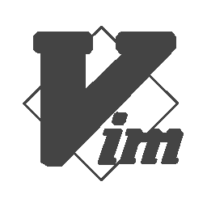

# vim / neovim 中突出显示的 JS 和 React 语法

> 原文：<https://itnext.io/js-and-react-syntax-highlight-in-vim-neovim-1167c1945c84?source=collection_archive---------1----------------------->

这是一系列文章的一部分，涵盖了配置 vim 以用于现代 javascript 应用程序开发所需的不同模块。

# TL；土耳其

安装插件并配置 vim 来设置正确的语法高亮显示。

vim 中的配置文件位于`~./vimrc`中，neovim 的配置文件位于`~/.config/nvim/init.vim`中。从现在开始，我将把配置文件称为`init.vim`。

# 设置语法突出显示

使用你最喜欢的插件管理器来安装以下插件，我喜欢使用[插件](https://github.com/junegunn/vim-plug) :
*以防你没有任何插件管理器按照他们的* [*回购安装指南*](https://github.com/junegunn/vim-plug) *安装插件。*

要安装的插件:

*   mxw/vim-jsx :突出 jsx
*   [pang loss/vim-JavaScript](https://github.com/pangloss/vim-javascript):高亮显示 JS

1.  将插件添加到您的`init.vim`

2.在`init.vim`里输入`:so %`来重新加载你的 vim 配置

3.在`init.vim`型`:PlugInstall`内安装你的封堵

# 设置突出显示主题

你可以从牛逼项目 [vimcolors](https://vimcolors.com/) 中选择自己喜欢的配色方案。你可以在那里选择你最喜欢的。

对于这个例子，我们将安装主题:极简主义。但是你可以选择其中任何一个。

1.  将插件添加到您的`init.vim`

2.设置你在`init.vim`中使用的配色方案(这里是极简主义主题)

3.一些主题允许你个性化一些选项(查看他们的回复)。最后`init.vim`配置文件应该是这样的

6.在`init.vim`中键入`:so %`来重新加载您的 vim 配置

7.在`init.vim`型`:PlugInstall`内安装你的封堵

你已经准备好了！打开一个项目，检查您的新的真棒语法高亮显示🔥。

希望你觉得有用，你可以检查并偷了我的[点文件](https://github.com/Jimeno0/dotfiles)。

如果您喜欢，这是我写关于有用的 vim 配置的系列文章的一部分。如果你有兴趣，你可以在这里查看其他的:

*   [一些 vim 实用技巧🤓](https://medium.com/@jimeno0/some-vim-useful-tips-e45ceaed119a)
*   [维姆的棉绒](https://medium.com/@jimeno0/eslint-and-prettier-in-vim-neovim-7e45f85cf8f9)
*   [在文件和文件夹中搜索](https://medium.com/@jimeno0/search-in-files-and-content-in-vim-neovim-8c1bf74ad5e9) s
*   [vim 中的 Snipets](https://medium.com/@jimeno0/snipets-in-vim-neovim-2ed9ab89befc)

🍻