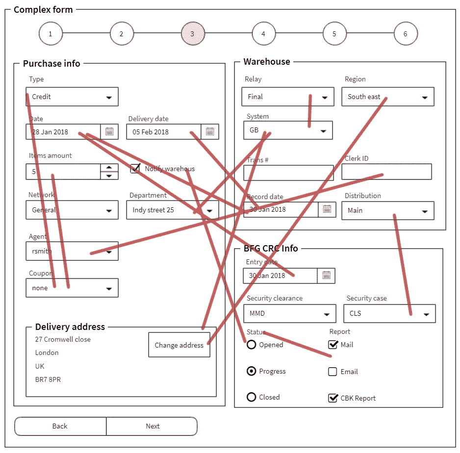
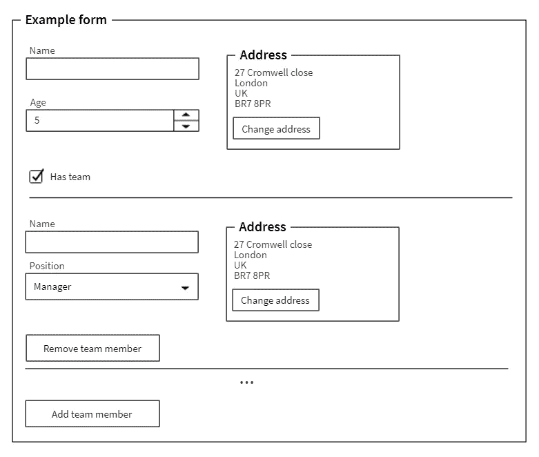

# 用 Forx 进行 JS 数据验证

> 原文：<https://itnext.io/js-data-validation-with-forx-ee06986393af?source=collection_archive---------3----------------------->

几乎每个开发人员在职业生涯中都遇到过验证。它可能只是登录/注册表单中的简单验证，也可能是跨越几个页面的数百个字段的复杂验证。

[*点击这里在 LinkedIn* 上分享这篇文章](https://www.linkedin.com/cws/share?url=https%3A%2F%2Fitnext.io%2Fjs-data-validation-with-forx-ee06986393af)

# 简单案例

假设我们有这个表格。


单形

该表单的数据可能是这样的:

```
{
  email: '',
  emailConfirm: '',
  password: '',
  passwordConfirm: ''
}
```

定义验证的常见方式是:

```
const notEmpty = v => v && v.length > 0,
  emailValid = e => emailRegex.test(e),
  passwordValid = p => passwordRegex.test(p),
  emailSame = e => data.email === e,
  passwordSame = p => data.password === p,
  config = {
    email: [notEmpty, emailValid],
    emailConfirm: [notEmpty, emailSame],
    password: [notEmpty, passwordValid],
    passwordConfirm: [notEmpty, passwordSame]
  }
```

这是一个可行的解决方案，特别是当我们有简单的数据和验证规则时。验证配置对应于它正在验证的数据结构。这可能会产生误导。随着字段数量和复杂性的增长，数据字段之间的规则和依赖关系的复杂性也在增长。

例如:组织结构的类型可能会影响部门数据的有效性；选定的国家影响可用的服务、邮政编码和银行信息；成员的名字和姓氏形成了一个唯一的数据，该数据会影响其他成员的验证。
突然之间，我们可能会陷入这样的境地:对应于数据结构的配置不足以容纳验证规则。另外，如果我们希望一个特定的字段有几个错误字段，那么对象配置是没有用的。



具有依赖性的复杂形式

我们需要更健壮的东西来实现这个表单的验证。

# Forx 验证库

创建这个库是为了解决一些验证问题。假设我们有一个想要验证的数据结构:

```
{
  name: 'Name',
  age: 20,
  address: { line1: 'Line 1', line5: 'UK', postCode: { value: 1 } },
  hasTeam: true,
  team: [
    {
      name: 'Team member 1',
      position: { role: 'Manager' },
      address: [
        { line1: 'Line 1', line5: 'UK', postCode: { value: 1 } },
        { line1: 'Line 2', line5: 'UK', postCode: { value: 2 } }
      ]
    },
    {
      name: 'Team member 2',
      position: { role: 'Manager' },
      address: [
        { line1: 'Line 3', line5: 'UK', postCode: { value: 3 } },
        { line1: 'Line 4', line5: 'UK', postCode: { value: 4 } }
      ]
    }
  ]
}
```

请注意，数据包含许多嵌套。对象和数组相互嵌套，所以数据向下传播几层。
表单的视觉部分可能如下所示:



示例表单

我们需要验证以下字段:
***姓名、年龄、地址、团队；
每个团队成员的姓名、职务、地址*、地址**。
在 **forx** 的情况下，验证配置将如下所示:

```
const config = [
  {
    value: 'name',
    params: ['name', 'age'],
    test: [
      [notEmpty, 'empty'],
      [maxLength(50), () => 'max length'],
      [pattern(/\w*/gim), 'pattern']
    ]
  },
  {
    value: 'age',
    test: [[notEmpty, 'empty'], [min(18), () => 'min']]
  },
  {
    value: 'address',
    test: [[required, 'empty']]
  },
  {
    value: 'address.line1',
    params: ['address', () => 'uk'],
    test: [
      [notEmpty, 'empty'],
      [maxLength(50), () => 'max length'],
      [
        (line1, addr, postCode) =>
          addr &&
          addr.line1 === 'Line 1' &&
          line1 === 'Line 1' &&
          postCode === 'uk',
        'custom'
      ]
    ],
    enabled: [(line1, address) => !!address]
  },
  {
    value: 'hasTeam',
    test: [[required, 'required']]
  },
  {
    value: 'team.name',
    params: ['team'],
    test: [[notEmpty, 'empty']],
    enabled: [(name, team) => !!team]
  },
  {
    value: ['team', 'position', 'role'],
    params: ['team'],
    test: [[notEmpty, () => 'empty']],
    enabled: [(role, team) => !!team]
  },
  {
    value: ['team', 'address'],
    params: ['team'],
    test: [required, 'required'],
    enabled: [(address, team) => !!team]
  },
  {
    value: ['team', 'address', 'line1'],
    params: [
      ['team', '{team}', 'address', '{address}', 'line1'],
      'team.{team}.address.{address}'
    ],
    test: [
      [notEmpty, 'empty'],
      [maxLength(50), () => 'max length'],
      [
        (line1, lineAgain, addr) =>
          line1 === lineAgain &&
          addr &&
          addr.line1 &&
          addr.line1.indexOf('Line') !== -1 &&
          line1.indexOf('Line') !== -1,
        'custom'
      ]
    ],
    enabled: [
      (line1, lineAgain, addr) => !!addr,
      (line1, lineAgain, addr) => !!addr,
      () => true
    ]
  },
  {
    value: ['team', 'address', 'postCode', 'value'],
    params: [
      ['team', '{team}', 'address', '{address}', 'line1'],
      'team.{team}.address.{address}'
    ],
    test: [
      [notEmpty, 'empty'],
      [maxLength(50), () => 'max length'],
      [
        (postCode, line1, addr) =>
          !!(addr && addr.line1 === line1 && postCode),
        'custom'
      ]
    ],
    enabled: [(line1, addr) => !!addr, (line1, addr) => !!address]
  },
  {
    value: 'team',
    to: 'customTeam',
    test: [[team => !!team, 'no team']]
  },
  {
    value: 'team.name',
    params: ['team'],
    test: [[notEmpty, 'empty']],
    to: 'team.{team}.customName',
    enabled: [(name, team) => !!team]
  }
]
```

这个配置应该足以验证提供的所有数据。应用程序数据将通过验证功能，给我们错误对象。

```
{
  "name": ["empty"],
  "age": ["empty", "min"],
  "address": {
    "line1": ["empty", "custom"]
  },
  "team": [
    {
      "name": ["empty"],
      "position": {
        "role": ["empty"]
      },
      "address": [
        {
          "line1": ["empty", "custom"],
          "postCode": { "value": ["empty", "custom"]}
        },
        {
          "line1": ["empty", "custom"],
          "postCode": { "value": ["empty", "custom"]}
        }
      ],
      "customName": ["empty"]
    },
    {
      "name": ["empty"],
      "position": {
        "role": ["empty"]
      },
      "address": [
        {
          "line1": ["empty", "custom"],
          "postCode": { "value": ["empty", "custom"]}
        },
        {
          "line1": ["empty", "custom"],
          "postCode": { "value": ["empty", "custom"]}
        }
      ],
      "customName": ["empty"]
    }
  ]
}
```

有一个小的[演示](https://komlev.github.io/forx.html)你可以测试当前的配置并查看输入数据和输出错误。

# 应用程序接口

主要思想是将配置作为一个项目数组，而不是一个大对象。每个配置项由几个字段组成。

```
{
  value: 'team.name',
  test: [[notEmpty, 'empty']],
  enabled: [(name, team) => !!team],
  params: ['team'],
  to: 'team.{team}.customName'
}
```

## 价值

我们要验证的数据的主路径。一般来说，这是一个字符串数组，但也可以是一个字符串或一个函数。这些都是有效的路径:

```
const path1 = 'path.to.some.value',
  path2 = ['path', 'to', 'some.value'],
  path3 =() => 'path.to.value'
```

该路径将查询提供的数据。但是有一个问题——如果没有提供索引，并且路径中有一个数组，那么查询过程将使用路径的剩余部分遍历这个数组中的每一项。例如

```
const value = {
  //a.b.c.d
  a: {
    //b.c.d
    b: [
      //c.d 
      { c: { d: 'one'},
      { c: { d: 'two'}
    ]
  }
}
```

此路径' a.b.c.d '的数据将为['一'，'二']。

## 试验

是测试数组的数组:

```
[v => v.length > 2, 'Minimum length is 3 symbols']
```

第一个值是验证函数。它验证输入数据，如果输入数据有效，则返回 **true** ，如果数据无效，则返回 **false** ，在这种情况下，将返回数组中的第二个值—错误消息。验证函数也可以返回错误信息本身，在这种情况下，来自测试数组的错误信息将被忽略。

```
test: [
  [v => !!v, 'User name should not be empty'], 
  [v => v.length> 7, 'User name length is too low'],
  [v => /\d/.test(v) ? true : 'User name should contain digits',]
]
```

## 启用—可选

指示是否应启用验证的函数数组。它接收与**测试**函数相同的参数。当我们想要基于某个值禁用一组测试时，这可能是有用的。例如，我们可以禁用所有的**团队。*** 测试知道**团队**为空或不存在。

## 参数-可选

一个路径数组，其中每个路径都与**中的值**相同。这些是额外的参数，可用于测试和启用功能。这些参数将帮助我们从提供的数据中查询额外的值。例如，我们是位于 **team.address.line1** 中的验证值，但是我们还需要获取此人的**邮政编码**以验证 **line1** 和公司基本地址**邮政编码**，这种情况下的参数如下所示:

```
[
  ['team', '{team}', 'address', '{address}', 'postCode'],
  'address.postCode'
]
```

当我们遍历每个团队成员的**团队**数组和**地址**数组时，我们会将这些索引放入花括号中的参数路径中。如果我们目前把目光投向**团队【1】。address[4]** params 将用这些索引填充。

## 至—可选

通常错误被设置为**值**路径，但是如果我们想把错误放在结果对象中的其他地方的话"**到"**会把错误结果放在指定的路径中如果有的话。路径索引规则也同样适用于 params。

# 最后的想法

就可伸缩性和组合而言，这种编写验证的方法非常简单。就生命周期挂钩而言，它不依赖于任何框架。它也不强制任何特定的验证行为:我们可以在任何时候启用或禁用验证:在特定字段模糊时或在提交完整表单时。这也意味着这个工具在集成方面是相当低的水平，这可能是一个采用的问题。

[Forx](https://github.com/komlev/forx) 链接

有什么想法或建议吗？免费评论，让我知道。