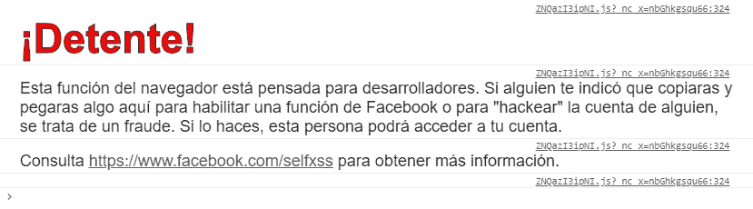
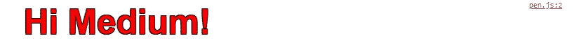

# JS:被低估的特性

> 原文：<https://itnext.io/js-underrated-features-5adc9d30de82?source=collection_archive---------4----------------------->

## 没有广泛使用的 Javascript 函数和特性

我们已经对[被低估的 CSS 特性](/css-underrated-features-859396e29637)和[被低估的 HTML 元素](/html-underrated-tags-119ef3e45b94)做了一点回顾，但是现在，很明显，该轮到我们来谈谈网络之王以及它们的特性和功能，这些特性和功能并没有被充分利用。


# 一组

我们有这么多种可迭代对象来存储数据，比如数组、JSON、映射、字符串……但是为什么我们不经常谈论 **Set()** ？。它们非常类似于它们的数组兄弟，但是使用了一些非常有用的东西。主要的特性是你不能在里面有一个重复的值，因为如果你试图添加一个已经存在的值，它只会无声地失败，并且这个值不会再被添加，另外 **Set()** 提供了一些方法来帮助以一种清晰的方式处理这些值。

```
const set = new Set();
```

我最后一次使用 **Set()** 是为了管理在本地聊天室登录的用户。它非常有效，有一天你应该试一试。

# 。一些()

*有些时候*我们有问题要找的是*有些是否匹配我们数组中的*，嗯方法**。在我们的数组中使用 some()** 来查找是否有任何索引的值与条件匹配。比迭代每个索引更有效，并且使用的代码比针对的*或针对每个*的*少得多。我们的方法**。有些()**只会返回一个布尔值，只期望一个函数作为参数，而不会返回与我们的条件匹配的值的索引，但我认为当我们需要一个快速而清晰的解决方案时，**。有些人能很好地完成这项工作。***

# 。冻结()

了解这个函数是非常重要的，但是我没有从其他开发者那里得到足够的信任。这个方法将一个对象转换成一个不可变的对象，在使用它之后，你将不能更新应用它的对象的任何东西。有些人认为使用 *const* 实例化对象也可以，但是 *const* 的工作方式不同，例如，你可以将值更新到声明为 *const* 的对象中。知道这一点很重要，但最重要的是知道我们有**。冻结()**与我们一起拯救世界。

所以别动！，在你现在的位置上发挥你的价值！…

# 。querySelector()，。querySelectorAll()

也许这是我的文章中更为人所知的方法，但当然，你不会让我撒谎，没有被广泛使用，因为它应该，我们不断看到*文件。但是，他们是做什么的？，这些是我们在 JavaScript 中选择元素的最佳方式，但是使用 CSS 查询选择器。这就像过去的美好时光，那时每个网站都是 jQuery，你可以使用一些像**$(" element . class[attr = value]")；**要同时选择一个或多个元素，那么这个方法就是要把我们从这个老问题中拯救出来。*

这两种方法只是略有不同，**。querySelector()** 将只返回与您作为参数传递的 CSS 查询相匹配的第一个元素，而不是**。querySelectorAll()** 将返回一个数组，其中包含与 CSS 查询匹配的文档节点。

[https://codepen.io/adrian-legaspi/pen/ZEYyGxq](https://codepen.io/adrian-legaspi/pen/ZEYyGxq)

如您所见，非常容易实现，当然也非常高效。如果你只是为了元素选择器而学习 jQuery，你现在应该重新考虑一下。

# **漂亮的 console.log**

我敢肯定，在你的一生中，至少有一次你在脸书打开浏览器开发工具时，你会惊讶地发现控制台日志中有一个大大的警告标志？。



西班牙语脸书警报

嗯，不是一个图像插入或什么的，而只是一个控制台日志样式的许多文本样式的 CSS 属性:

```
// Hi Medium!
console.log(“%c Hi Medium! “, “font-weight: bold; font-size: 55px; font-family: arial; color: red; text-shadow: 1px 1px 0px black, 1px -1px 0px black, -1px 1px 0px black, -1px -1px 0px black”);
```



我的控制台日志

```
// Colors output
console.log(“%c Red! %c Blue! %c Green %c Orange %c Purple”, “color: red; font-size: 14pt;”, “color: blue; font-size: 14pt;”, “color: green; font-size:14pt;”, “color: orange; font-size: 14pt;”, “color: purple; font-size: 14pt;”);
```


颜色控制台日志

这项功能已经存在了这么多年，但并没有被广泛使用，我知道这是因为控制台不是普通用户会使用的东西，但仍然很遗憾，这项功能没有得到应有的重视。等一下，你认为这些年来脸书控制台警报拯救了多少人？。没错，成千上万，所以这个功能即使简单，也不意味着它不太有用，不太好。

如果你想看这个(如果你正在用桌面设备阅读这篇文章)，我就留下这支笔:

[https://codepen.io/adrian-legaspi/pen/PowjZqV](https://codepen.io/adrian-legaspi/pen/PowjZqV)

下一次，当你想向另一个访问你的 web 应用程序的开发者使眼色时，用更有风格的方式打招呼吧！。

# 浏览器模块

npm install module 是一个在 NodeJs 环境中非常常见的命令，但是在现代浏览器中，您可以像使用任何其他简单的 Js 文件一样轻松地使用这些模块包。你可以从一个模块 URL 或者从你的本地项目导入，模块文件也可以工作，不需要任何捆绑器，比如 Webpack 之类的。

您可以像导出 NodeJs 包一样导出自己的模块，如下所示:

导出我的苹果

要在您的应用程序中导入，您应该使用如下脚本:

使用我的苹果

如果你这样做，它将不会工作，因为我们离开了一个重要的步骤，告诉浏览器，在我们的文件中，我们想与模块一起工作。这很简单，只需将**【type = module】**添加到**脚本**标签中，我们希望*导入/导出*我们的模块，如下所示:

```
<script type="module" src="app.js"></script>
```

至此，我们已经完成了在浏览器中工作的所有设置，就像在 NodeJs 后端一样(不那么安全，但你已经有了想法)。

# 结论

JavaScript 是一门真正的大语言，也许要花一生的时间才能 100%地探索它，但这并不意味着你不应该不时地尝试一些新特性，这些新特性可能会改变你下一个项目的游戏规则。

> *参考文献:*
> 
> 斯塔科维奇→[https://stackoverflow.com/](https://stackoverflow.com/questions/44490627/how-to-do-import-export-a-class-in-vanilla-javascript-js)
> 
> 开发社区→[https://dev.to/](https://dev.to/)
> 
> *MDN web 文档*→[*https://developer.mozilla.org/*](https://developer.mozilla.org/)
> 
> *我自己*→[https://twitter.com/ImLuyou](https://twitter.com/ImLuyou)