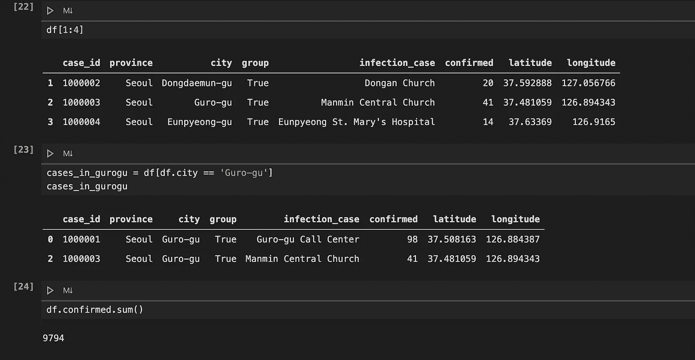

# Jupyter 笔记本重构系列—第 1 部分

> 原文：<https://itnext.io/jupyter-notebook-refactoring-series-part-1-adff1b44dfdb?source=collection_archive---------7----------------------->

# 介绍

世界上所有的人可以很容易地分为三大类:

*   那些喜欢 Jupyter 笔记本的人
*   那些讨厌 Jupyter 笔记本的人
*   那些从未听说过 Jupyter 笔记本的人。

我还记得那一天，我的任务是部署两个机器学习模型。一个[未命名的 4.ipynb](https://twitter.com/vboykis/status/931212461436538881?s=20) 交给我，里面有超过 126 个随机执行的细胞，是一个数据科学家写的，他最近离开了公司。猜猜，当时我属于哪一类？

# 重构系列的目标

分享一些有用的技巧和诀窍，帮助数据科学家在 Jupyter 笔记本上编写干净且可重复的代码。让机器学习、开发、数据和软件工程师的生活变得更简单。

# 步骤 1:健全性检查

在开始重构之前，回答一个简单的问题:**这个笔记本的最终目标是什么？**是简单的特别分析、EDA、特性工程、特性选择、建模、模型评估、模型调整，还是全套服务？根据你的回答，给你的笔记本起一个有意义的名字。

# 第二步:可再现的环境

为了防止出现不愉快的情况“我不知道你的意思，它在我的机器上工作”，请确保您有一个可复制的环境。对于 Python，可以使用 conda、虚拟环境或 docker 容器。

此外，您的代码可能依赖于不同库中的随机数生成器。要多次获得相同的结果，请设置种子值。例如，在 Python 中:

# 第三步:有意义的命名

确保一周后你仍然能够理解你的代码。从给变量起一个信息性的名字开始。

Python 中的不良实践

Python 中的更好实践

# 结论

在本系列的第一部分中，我们创建了 Jupyter 笔记本重构的基础。我们从健全性检查(您笔记本的最终目标)开始。然后转移到可再现的环境，最后，转移到有意义的变量名。

下一部分将完全致力于函数。

# 进一步阅读

*   [将康达环境添加到您的 Jupyter 笔记本中](https://medium.com/@nrk25693/how-to-add-your-conda-environment-to-your-jupyter-notebook-in-just-4-s*teps-abeab8b8d084)
*   [将虚拟环境添加到您的 Jupyter 笔记本电脑中](https://anbasile.github.io/posts/2017-06-25-jupyter-venv/)
*   [如何使用 Keras 获得可重现的 ML 结果](https://machinelearningmastery.com/reproducible-results-neural-networks-keras/)
*   [构建您的数据科学项目](http://drivendata.github.io/cookiecutter-data-science/)
*   [提高 Jupyter 笔记本电脑的工作效率](https://towardsdatascience.com/bringing-the-best-out-of-jupyter-notebooks-for-data-science-f0871519ca29)