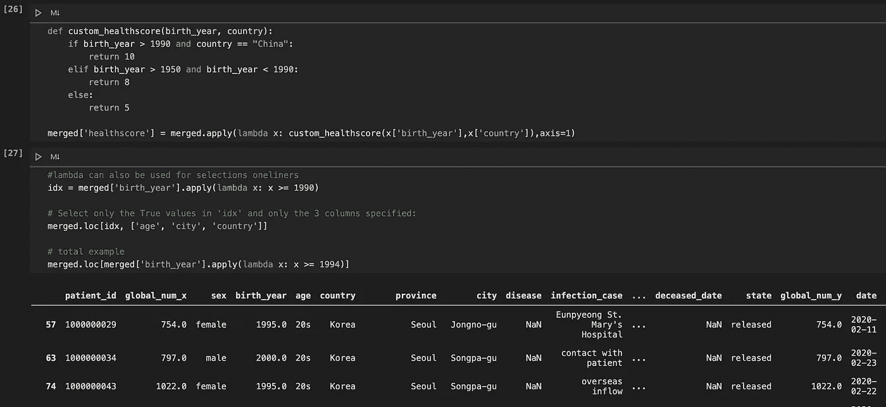

# Jupyter 笔记本重构系列—第 2 部分

> 原文：<https://itnext.io/jupyter-notebook-refactoring-series-part-2-899e40163ead?source=collection_archive---------1----------------------->

# 重构系列的目标

分享一些有用的技巧和诀窍，帮助数据科学家在 Jupyter 笔记本上编写干净且可重复的代码。让机器学习、开发、数据和软件工程师的生活变得更简单。

这里看第一部[。这部分专用于**功能**。](/jupyter-notebook-refactoring-series-part-1-adff1b44dfdb)

# 步骤 1:警惕过早抽象

在深入之前，让我们解释一下 Python 中的函数是什么。**函数**是一组执行特定任务的相关语句。它有助于将您的代码分割成更小的模块化代码块，避免重复，并使您的代码更加可重用。

Jupyter 笔记本分析通常解释和记录**正在发生的事情**和**为什么**。要小心，因为一般的代码重构会大大降低笔记本的可读性。

因此，在重构之前，请三思

*   哪些部分可以在将来的分析中重复使用，并转换成独立的库；
*   哪些部分应该被提取并转换成预处理、训练、后处理脚本或包；
*   哪些部分应该保持原样。

# 第二步:轻松制作视觉效果

EDA(探索性数据分析)通常包含大量的可视化内容。我经常看到许多多余的代码一次又一次地产生相同类型的情节。

例如，您想要绘制分类值和预测中值目标之间的关系。

而不是用 Python 来做:

遵循 DRY 原则(不要重复自己)，定义一个函数，并使用类型提示:

如果你想改变目标列呢？更好的选择是:

# 步骤 3:用 lambda 应用()

熊猫[。apply()](https://pandas.pydata.org/pandas-docs/stable/reference/api/pandas.DataFrame.apply.html) 方法非常强大。它采用一个函数并将其应用于数据框。

然而，如果你的 lambda 太复杂，难以阅读:

用记录的函数替换注释和 lambda:

# 结论

在本系列的第二部分中，我们简要介绍了函数。我们从防止过早抽象的一些预防措施开始。然后转移到轻松产生视觉效果的函数。最后，我们触摸了熊猫。apply()方法。

下一部分将是关于矢量化和单元测试。

# 进一步阅读

*   [Python 中的类型提示](https://realpython.com/python-type-checking/)
*   [pandas.apply():对数据帧中的每一行/列应用一个函数](https://thispointer.com/pandas-apply-apply-a-function-to-each-row-column-in-dataframe/)
*   [在熊猫中应用和使用λ](https://towardsdatascience.com/apply-and-lambda-usage-in-pandas-b13a1ea037f7)
*   [在 Python 中过度使用 lambda 表达式](https://treyhunner.com/2018/09/stop-writing-lambda-expressions/)