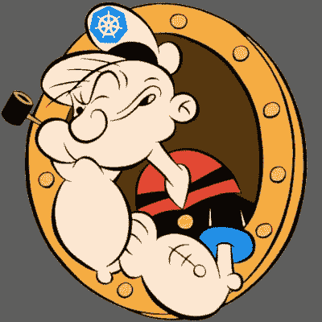
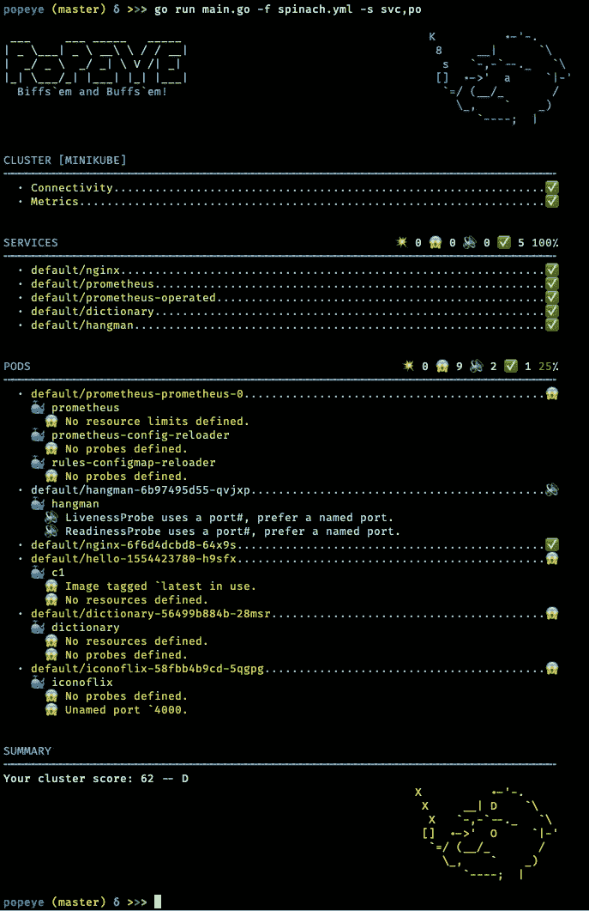
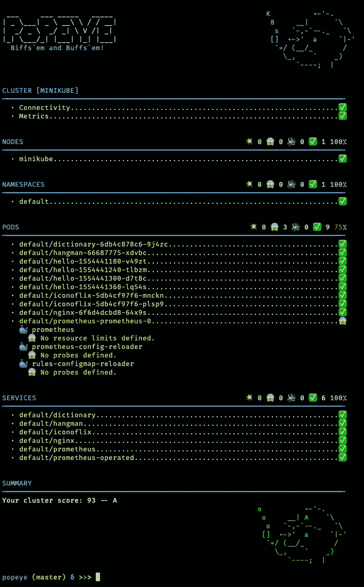

# K8s 星团？噢，干掉他们，大力水手！

> 原文：<https://itnext.io/k8s-clusters-oh-biff-em-popeye-637e9312963?source=collection_archive---------4----------------------->

虽然 Helm、AdmissionControllers 和 CRD 的目标是改进 Kubernetes 的工作负载实例化和管理，但我觉得在减轻一些集群操作员的痛苦方面还有差距。在配置和操作 Kubernetes 集群时，我经常发现自己很快就被认知负荷淹没了。其中一个配置清单中的小错误可能需要几分钟才能解决。多年来，我已经开发出了特殊的调试印章，用最少的咒语/神秘舞蹈来解决典型的库伯内特困境。为什么我的卷没有装入？为什么此 URL 无法解析？为什么我的容器总是崩溃？等等…老实说，在每一个新版本中，试图让我的排骨符合标准，让我的头脑变得越来越有挑战性。我喜欢 Kubernetes 平台高速移动和改进的事实，但有时，在我的低潮期，我承认，我对这种持续的涌入感到有点压力。尽管加倍服用百忧解有所帮助，但我还是不断想起著名的黑客帝国特工史密斯的名言:“他们派人类去做机器的工作！”

几周前，在调试一个死在水中的应用程序的端口映射问题时，这句话突然出现在我的脑海中。我想“拥有某种集群杀毒工具来快速评估实时 Kubernetes 资源的事务状态并基于集群扫描发布建议不是很酷吗？”…

所以，我写了一个工具！它叫做[大力水手](https://github.com/derailed/popeye)，就是做这个的。

大力水手消毒剂报告

大力水手集群！

目前，Popeye 是一个 CLI 工具。它对集群上运行的各种 Kubernetes 资源进行扫描，并报告错误配置、打字错误、CPU/MEM 超过阈值和死亡清单检测等情况...它提供了一个简单的消毒剂报告，强调潜在的问题或最佳实践疏忽，以便您避开一些潜在的 K8s 哑弹来的 D 日。最后，它会给你一个单一的聚类分数，这样你就可以给自己的努力打分了。任何低于 B 的东西，都会被认为是不文明的；)

当然，我觉得这个工具超级有用，想分享一下，看看大家怎么看？这里是链接到[回购](https://github.com/derailed/popeye)和安装说明。

当你准备好了，让大力水手掌舵，分享你的集群分数！

感谢您的宝贵时间！