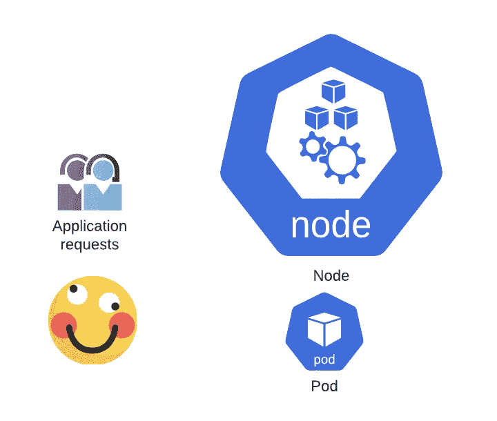
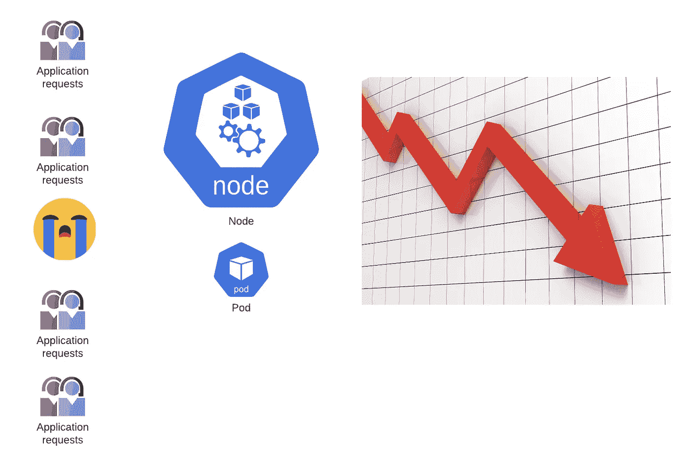
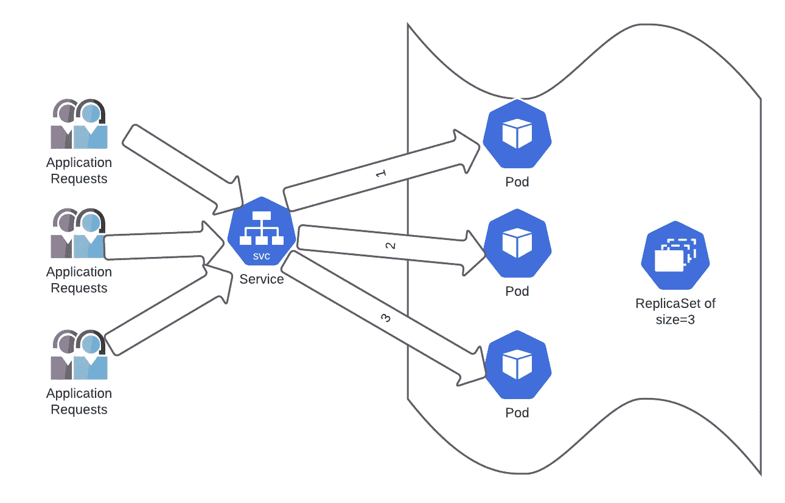

# K8s 部署和副本集—第 1 部分

> 原文：<https://itnext.io/k8s-deployments-replicasets-part1-babdb0215156?source=collection_archive---------4----------------------->


[来源](https://www.freepik.com/)

在这篇博文中，我们将讨论[部署](https://kubernetes.io/docs/concepts/workloads/controllers/deployment/) & [复制集](https://kubernetes.io/docs/concepts/workloads/controllers/replicaset/) K8s 对象。为了理解部署，我们将从副本集开始(我们很快就会知道为什么)。下面是这篇文章的流程。

```
- What are Replicasets & why exactly do we need them?- Practical example with Replicasets- What are Deployments & why exactly do we need them?- Practical example with Deployments
```



单舱应用

假设 Mark 开始在单个 POD 中托管一个业务应用程序。

由于传入请求的数量很少，因此这个单独的 POD 可以轻松处理所有传入请求。Mark 进展顺利，对应用程序的整体性能感到满意。

> 由于业务增长，当 Mark 的应用程序开始收到更多请求时，会发生什么情况？

随着传入请求量的增加，在某个时间点之后，单个 POD 通常将无法处理传入请求的负载。此外，还会涉及可靠性、性能、可扩展性等问题。



应用程序请求增加的单个 pod 似乎带来了许多悲伤。

> 当然，手动添加更多的 pod 怎么样？

想想看，管理我们如何以及何时扩展可能是痛苦的——每次传入的请求增加或减少。我们现在如何管理所有扩展的节点，比如如果它们崩溃了，或者我们需要进一步向上和向下扩展怎么办？

> 当然，那么我们如何管理 pod 的扩展呢？

通常我们在一个叫做[副本集](https://kubernetes.io/docs/concepts/workloads/controllers/replicaset/)的容器中运行应用程序；这些 POD 的副本(原始 POD 的相同副本)可能存在于 K8s 集群中的相同或不同工作节点上。现在将会发生的是，不是传入的请求进入单个 POD，而是它们将分布在副本集中的不同 POD 中。

客户端请求到达一个叫做 [K8s 服务对象](https://medium.com/swlh/kubernetes-services-part-1-399a0dd05211)的东西，它有助于在给定 R [eplicaset](https://kubernetes.io/docs/concepts/workloads/controllers/replicaset/) 中的各种副本 PODs 之间分配应用程序的传入请求负载(以前称为副本控制器)。



用户请求通过 K8s 服务对象路由到应用程序单元。

> 那么当一个 POD 在一个大小为 3 的复制集中倒下时会发生什么呢？

这可能是由多种原因造成的；假设 POD 所在的节点出现故障。作为调度程序，控制器组件的工作是确保始终维护应用程序的 3 个副本。它会自动执行相同的操作，而无需手动操作。

为了在 K8s 集群中的大小为 3 的复制集中重复，控制器将始终确保 PODs/应用程序的 3 个副本始终为该给定的复制集运行，这很棒，因为它以一种自动化的方式完成了许多否则必须手动完成的工作。

> 如果负载增加，replicaset 大小 3 不够好怎么办？

任何时候都可以指示控制器节点将复制集缩放到更大的数字，甚至缩小到更小的数字。Replicaset 还尽可能地将它试图维护的副本跨节点分布。了解副本如何跨节点分布是很有趣的。这篇文章的范围将留给另一篇博客文章，但有一个简短的说明，本地和基于云的 K8s 集群将有不同的方式在节点之间分发副本。

真实集群中的 pod 的扩大和缩小在自动扩展中自动发生(稍后讨论)。

> 那么什么是复制集呢？

Replicaset 是一个 K8s 对象，一组描述一组 Pod 副本的 Pod 模板。它使用一个模板来描述每个 Pod 必须包含的内容。它确保所需数量的副本(运行应用程序的容器)始终保持不变，正如在创建副本集时提到的那样。

> 但是为什么是另一个物体呢？

K8s 中的 Replicaset 对象有助于提高可靠性(始终保持副本大小不变)、负载平衡(使用服务在不同副本之间分配负载)以及以自动化方式扩展应用程序，而用户不必指示控制器。想象一下，对于需求不断变化的现代应用程序，必须手动执行同样的操作。对象就像 K8s 提供的抽象，抽象完成分配给它们的工作，用户不必担心内部细节。

> 复制集到底是如何工作的？

副本集的三个关键组件是

1.  Selector = >如何识别副本集可以获取的单元(使用标签)
2.  number = > replica set 应该维护多少个单元。
3.  模板= >内容(图像、标签、网络等。)要由复制集使用的 pod

Replicaset 通过创建或删除 pod 来实现达到所需数量的目的&它总是试图保持所需的数量。

希望 Replicaset 的理论概念是清楚的；现在，让我们快速跳到一些实际的例子。如果您想在本地拥有一个 K8s 集群，我建议您从这里或类似的地方使用步骤[。](https://github.com/itwonderlab/ansible-vbox-vagrant-kubernetes)

```
cat **replicaset.yml**
apiVersion: apps/v1
kind: ReplicaSet
metadata:
  name: nginxwebserver
spec:
  replicas: 3 **# Desired number of replicas for the given application**
  selector:
        matchLabels:
               app: nginxwebserver **# any pod with this label will be monitored by the replicaset**
  template:
    metadata:
      labels:
        app: nginxwebserver # **label for the image, this should match with the selector image**
    spec:
      containers:
        - name: nginxwebserver
          image: nginx
```

我们使用上面的文件来创建 [Replicaset](https://kubernetes.io/docs/concepts/workloads/controllers/replicaset/#example) ，请密切注意文件中的注释，以将我们之前所学的理论概念连接起来。

```
vagrant@k8s-m-1:~/kubernetes$ **kubectl create -f replicaset.yml**
replicaset.apps/nginxwebserver createdvagrant@k8s-m-1:~/kubernetes$ **kubectl get rs**
NAME             DESIRED   CURRENT   READY   AGE
nginxwebserver   3         3         3       4svagrant@k8s-m-1:~/kubernetes$ **kubectl get pods**
NAME                   READY   STATUS    RESTARTS   AGE
nginxwebserver-4tzf5   1/1     Running   0          9s
nginxwebserver-bjjsd   1/1     Running   0          9s
nginxwebserver-vzkql   1/1     Running   0          9s
```

值得注意的是，这些副本/pod 是副本集的一部分，分布在 k8s 集群中的三个 workers 上。

```
vagrant@k8s-m-1:~/kubernetes$ **kubectl get pods -o wide**
NAME                   READY   STATUS    RESTARTS   AGE   IP                NODE      NOMINATED NODE   READINESS GATES
nginxwebserver-4tzf5   1/1     Running   0          18s   192.x.x.x   **k8s-n-3**   <none>           <none>
nginxwebserver-bjjsd   1/1     Running   0          18s   192.x.x.x     **k8s-n-1**   <none>           <none>
nginxwebserver-vzkql   1/1     Running   0          18s   192.x.x.x   **k8s-n-2**   <none>           <none>
```

要找到一个 POD 属于哪个复制集，我们可以执行以下操作。

```
vagrant@k8s-m-1:~/kubernetes$ **kubectl describe pod nginxwebserver-vzkql | grep  Replica**
Controlled By:  ReplicaSet/nginxwebserver
```

为了找到属于一个复制集的所有 pod(在我们的例子中是 **nginxwebserver** )，我们可以执行以下操作，因为我们可以拥有数千个 pod。

```
vagrant@k8s-m-1:~/kubernetes$ **kubectl get pods -l app=nginxwebserver --show-labels**
NAME                   READY   STATUS    RESTARTS   AGE     LABELS
nginxwebserver-4tzf5   1/1     Running   0          8m47s   app=nginxwebserver
nginxwebserver-bjjsd   1/1     Running   0          8m47s   app=nginxwebserver
nginxwebserver-vzkql   1/1     Running   0          8m47s   app=nginxwebserver
```

如果我们从复制集中删除一个 POD 会怎么样？让我们试试，

```
vagrant@k8s-m-1:~/kubernetes$ **kubectl get pods**
NAME                   READY   STATUS    RESTARTS   AGE
nginxwebserver-bjjsd   1/1     Running   0          10m
nginxwebserver-s62sq   1/1     Running   0          4s
nginxwebserver-vzkql   1/1     Running   0          10mvagrant@k8s-m-1:~/kubernetes$ **kubectl delete pod nginxwebserver-vzkql**
pod "nginxwebserver-vzkql" deletedvagrant@k8s-m-1:~/kubernetes$ **kubectl get pods**
NAME                   READY   STATUS    RESTARTS   AGE
nginxwebserver-bjjsd   1/1     Running   0          10m
nginxwebserver-kvdf7   1/1     Running   0          30s
nginxwebserver-s62sq   1/1     Running   0          47s
```

这里我们看到在删除了名为 **nginxwebserver-vzkql，**的 pod 之后，Replicaset 继续创建另一个名为 **nginxwebserver-kvdf7，**的 pod，即 Replicaset 总是试图保持 3 个副本的期望状态。

博客[帖子](https://medium.com/swlh/kubernetes-services-part-1-399a0dd05211)解释了如何通过一个称为 K8s 服务对象的用户请求接口来连接上述所有单元。

让我们尝试创建一个服务对象来访问这个复制集中的 pod

```
vagrant@k8s-m-1:~/kubernetes$ **kubectl get rs**
NAME             DESIRED   CURRENT   READY   AGE
nginxwebserver   3         3         3       16mvagrant@k8s-m-1:~/kubernetes$ **kubectl expose replicaset** nginxwebserver --port 80
service/nginxwebserver exposedvagrant@k8s-m-1:~/kubernetes$ **kubectl get svc**
NAME             TYPE        CLUSTER-IP      EXTERNAL-IP   PORT(S)   AGE
kubernetes       ClusterIP   10.96.0.1       <none>        443/TCP   2d6h
nginxwebserver   ClusterIP   10.103.76.193   <none>        80/TCP    8s
```

让我们尝试到达由我们创建的服务对象公开的 IP 地址，这意味着服务对象现在正在副本集中的副本/pod 之间分发输入请求。

```
~/kubernetes$ **curl** [**http://10.103.76.193**](http://10.103.76.193) **| tail -4** <p><em>Thank you for using nginx.</em></p>
</body>
</html>
```

现在，让我们尝试将副本集从当前数量的 **3** 缩放到 **5**

```
vagrant@k8s-m-1:~/kubernetes$ **kubectl get rs**
NAME             DESIRED   CURRENT   READY   AGE
nginxwebserver   3         3         3       22mvagrant@k8s-m-1:~/kubernetes$ **kubectl scale replicaset nginxwebserver --replicas=5**
replicaset.apps/nginxwebserver scaledvagrant@k8s-m-1:~/kubernetes$ **kubectl get rs**
NAME             DESIRED   CURRENT   READY   AGE
nginxwebserver   5         5         5       22m
```

类似地，我们可以使用相同的命令将副本缩小到 **2** 。

```
vagrant@k8s-m-1:~/kubernetes$ **kubectl scale replicaset** nginxwebserver --replicas=2
replicaset.apps/nginxwebserver scaledvagrant@k8s-m-1:~/kubernetes$ **kubectl get rs**
NAME             DESIRED   CURRENT   READY   AGE
nginxwebserver   2         2         2       24m
```

您可以使用声明性的方式(使用 YAML 文件)来执行上述所有命令，而不是我们在这里遵循的命令性方式。[K8s 文档](https://kubernetes.io/docs/concepts/workloads/controllers/replicaset/#scaling-a-replicaset)在这一点上非常详细。

既然我们对复制集有了很好的理解，希望我们能深入到这篇博文的[第二部分的](https://sandeepbaldawa.medium.com/k8s-deployments-replicasets-part2-3d9284f72429)[部署 K8s 对象](https://sandeepbaldawa.medium.com/k8s-deployments-replicasets-part2-3d9284f72429)。在那之前，再见！注意安全。