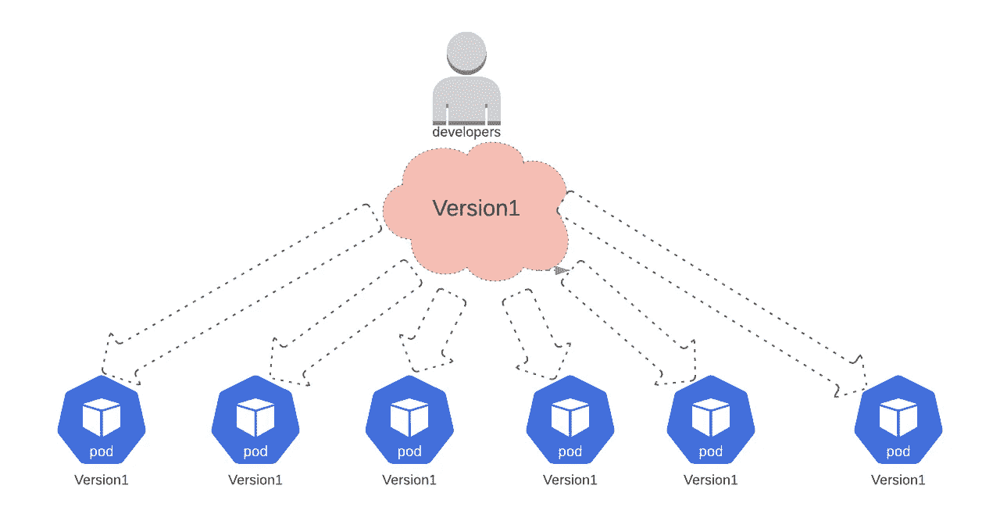
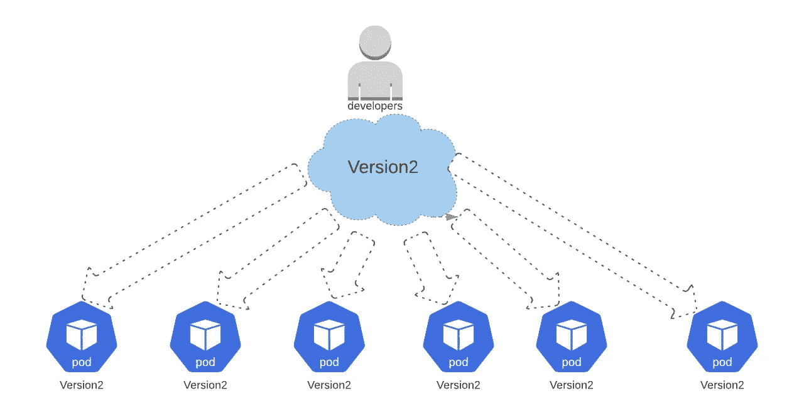
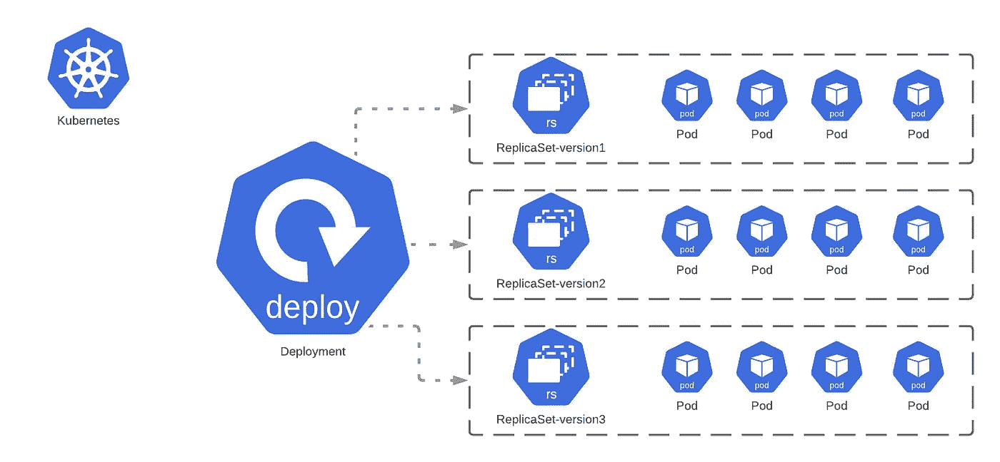
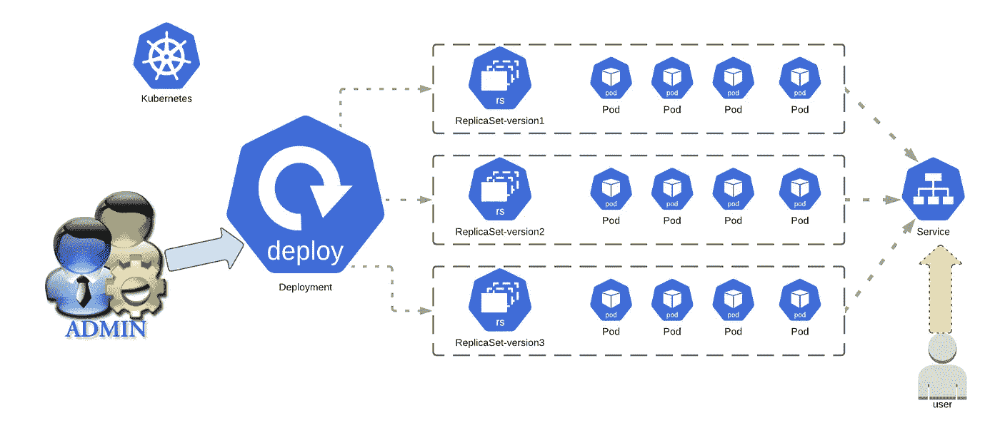

# K8s 部署和副本集—第 2 部分

> 原文：<https://itnext.io/k8s-deployments-replicasets-part2-3d9284f72429?source=collection_archive---------5----------------------->


[来源](https://www.freepik.com/free-vector/programmers-working-project-illustration_10780467.htm#page=1&query=deployments&position=2)

[在我们之前的帖子](/k8s-deployments-replicasets-part1-babdb0215156)中，我们看到了什么是[复制集](https://kubernetes.io/docs/concepts/workloads/controllers/replicaset/)；在本帖中，让我们试着用一些实际的例子一步步理解什么是 K8s [部署](https://kubernetes.io/docs/concepts/workloads/controllers/deployment/)对象。

在 K8s 中，pod 是部署在集群中的基本单元。K8s 部署是 pod 的抽象层。部署 K8s 对象的主要目的是帮助维护部署配置中声明的所需状态资源。

> 但是等等，你刚才不是说 [Replicaset](/k8s-deployments-replicasets-part1-babdb0215156) 也是这么做的吗，那我们为什么还需要另外一个 K8s 对象部署呢？

让我们假设在生产环境中；我们在版本为 1 的 POD 中运行一个应用程序。开发人员已经为这个版本开发了代码，并在 pod 上部署了相同的代码。



部署应用程序版本 1 的开发人员

现在让我们说，当版本 1 在生产中运行时，开发团队有一个可用的版本 2，并且现在想要在生产中运行相同的版本；他们将如何用第一版取代豆荚？



部署应用程序版本 2 的开发人员

此外，如果版本 2 不能像预期的那样工作，回滚到其他版本或类似的东西怎么样？ [Replicasets](https://kubernetes.io/docs/concepts/workloads/controllers/replicaset/) 也能做到吗？不完全是。

这就是 K8s 部署对象的用处。部署对象还可以做许多其他事情；让我们看看它是如何帮助我们的。

> 在上面的例子中，当我们用版本 2 替换版本 1 时，你认为我们应该用版本 2 一次替换所有的 pod 吗？

这可能不是一个好主意，因为如果版本 2 变坏了怎么办？这意味着如果版本 1 没有了，而版本 2 有问题，我们的整个应用程序可能会遇到问题，因为我们一次替换了所有的 pod。其中一种更新策略是 Rollingupdate，其中 pod 可以批量升级；这样，如果升级因任何原因失败，我们可以停下来检查。这也防止了应用程序的停机，因为在少数 pod 停机的情况下，那些仍未更新的 pod 仍在为应用程序请求提供服务。滚动更新意味着每次我们更新 X%的 pod 时，如果它们不能按预期工作或升级失败，我们就停止更新。这保证了应用程序将在 v1 或 v2 上运行，因此避免了停机。

还可以暂停、恢复、回滚等。，带部署。

> 这很好，但是部署如何与 Replicaset 联系起来呢？看起来两者做了相似的事情，例如部署吊舱



部署、副本集和 POD 之间的关系

K8s 部署对象包含 Replicaset K8s 对象。通过在不同的 Replicaset 版本之间移动，部署有助于在上图中不同版本的应用程序之间移动。这些对象中的每一个都是具有不同职责的抽象；大多数时候，我们处理 K8s 管理工作的部署对象。

> 但是从用户的角度来看，这意味着什么呢？例如，图中的哪一块是面向用户的？管理人员到底在处理什么？



K8 对象的管理员和用户视角

从用户的角度来看，他们大多会接触到一个[服务](https://medium.com/swlh/kubernetes-services-part-1-399a0dd05211)，而管理员会处理部署、[复制集](/k8s-deployments-replicasets-part1-babdb0215156) &容器。现在，让我们通过动手来更好地理解这一点。我强烈推荐使用 K8s 的[文档；很有描述性。另外，如果你需要小而精确的笔记，K8s 文档](https://kubernetes.io/docs/concepts/workloads/controllers/deployment/)中的[备忘单非常棒。](https://kubernetes.io/docs/reference/kubectl/cheatsheet/)

我们先从验证初始状态开始；看起来我们现在没什么事情要做，所以我们从头开始。

```
vagrant@k8s-m-1:~/kubernetes$ **kubectl get deployments**
No resources found in default namespace.
vagrant@k8s-m-1:~/kubernetes$ **kubectl get replicaset**
No resources found in default namespace.
vagrant@k8s-m-1:~/kubernetes$ **kubectl get pods**
No resources found in default namespace.
```

让我们从文档[创建一个部署 K8s 对象。让我们使用下面的 YAML 文件。](https://kubernetes.io/docs/concepts/workloads/controllers/deployment/#creating-a-deployment)

```
vagrant@k8s-m-1:~/kubernetes$ cat **deployment.yml**
apiVersion: apps/v1
kind: Deployment
metadata:
  name: webtesting-deployment
  labels:
    app: webtesting
spec:
  replicas: 2
  selector:
    matchLabels:
      app: webtesting
  template:
    metadata:
      labels:
        app: webtesting
    spec:
      containers:
      - name: webtesting
        image: sandeepbaldawa/webserver-testing:v1
        ports:
        - containerPort: 80
        imagePullPolicy: Always
```

如果我们创建一个部署对象，我们会看到它创建了一个 [Replicaset](/k8s-deployments-replicasets-part1-babdb0215156) 对象，该对象反过来又派生出 pod。如果您注意到，这些对象的名称还显示了特定部署、[、复制集](/k8s-deployments-replicasets-part1-babdb0215156)和 pod 之间的关系。

```
vagrant@k8s-m-1:~/kubernetes$ **kubectl create -f deployment.yml**
deployment.apps/webtesting-deployment created
vagrant@k8s-m-1:~/kubernetes$ **kubectl get deployments**
NAME                    READY   UP-TO-DATE   AVAILABLE   AGE
webtesting-deployment   1/2     2            1           3s
vagrant@k8s-m-1:~/kubernetes$ **kubectl get rs**
NAME                              DESIRED   CURRENT   READY   AGE
webtesting-deployment-c496c4dc9   2         2         2       7s
vagrant@k8s-m-1:~/kubernetes$ **kubectl get pods**
NAME                                     READY   STATUS        RESTARTS   AGE
webtesting-deployment-6447659c7d-q572j   0/1     Terminating   0          97s
webtesting-deployment-c496c4dc9-bjw7m    1/1     Running       0          10s
webtesting-deployment-c496c4dc9-d5sz4    1/1     Running       0          10s
```

让我们创建一个[服务](https://medium.com/swlh/kubernetes-services-part-1-399a0dd05211)来使用这个部署对象；如果我们看到尝试访问[服务](https://kubernetes.io/docs/concepts/services-networking/service/)的输出，我们可以看到我们的服务输出显示**“这是一个简单的静态网站版本 1”，**显示应用程序网页的版本 1。

```
vagrant@k8s-m-1:~/kubernetes$ **kubectl get deployments**
NAME                    READY   UP-TO-DATE   AVAILABLE   AGE
webtesting-deployment   2/2     2            2           41s
vagrant@k8s-m-1:~/kubernetes$ **kubectl expose deployments webtesting-deployment --name=webtesting-svc**
service/webtesting-svc exposed
vagrant@k8s-m-1:~/kubernetes$ **kubectl get svc**
NAME             TYPE        CLUSTER-IP     EXTERNAL-IP   PORT(S)   AGE
kubernetes       ClusterIP   10.96.0.1      <none>        443/TCP   53m
webtesting-svc   ClusterIP   10.106.31.41   <none>        80/TCP    8s
vagrant@k8s-m-1:~/kubernetes$ **curl** [**http://10.106.31.41**](http://10.106.31.41)
<html>
<h1>Hello World!</h1>
  <p>This is a simple static website version1!</p>
</html>
```

如果我们看到上面使用的 deployment.yml，我们在 pod 中使用的图像是**“sandeepbaldawa/web server-testing:v1。”**

> 如果我们想升级 pod 以使用 image v2，该怎么办？

我们可以像下面这样运行，其中

1.  **web testing-deployment**=>部署对象名称

2.**web server-testing:v2**=>要升级到的映像版本 2 的名称

3. **webtesting** = >该命令适用的容器的名称

```
vagrant@k8s-m-1:~/kubernetes$ **kubectl set image deployment/webtesting-deployment webtesting=sandeepbaldawa/webserver-testing:v2**
deployment.apps/webtesting-deployment image updated
```

有趣的是，在我们运行上面的代码后，我们看到一个新的副本集被创建，旧的副本集被关闭。这个新的副本集应该包含应用程序版本 2 的所有窗格。

```
vagrant@k8s-m-1:~/kubernetes$ **kubectl get rs**
NAME                               DESIRED   CURRENT   READY   AGE
webtesting-deployment-6447659c7d   2         2         2       3m46s
webtesting-deployment-c496c4dc9    0         0         0       12m
```

更有趣的是，该服务现在使用的是 POD 的最新版本，这意味着升级不会使试图访问该服务的客户端请求停机。

```
vagrant@k8s-m-1:~/kubernetes$ **curl** [**http://10.106.31.41**](http://10.106.31.41)
<html>
<h1>Hello World!</h1>
  <p>This is a simple static website **version2**!</p>
</html>
```

> 如果我们希望扩展部署以拥有更多单元，该怎么办？

让我们尝试将部署从 2 个副本扩展到 5 个副本；现在，创建了 5 个 pod。此外，我们可以通过使用 curl 命令来访问服务。

```
vagrant@k8s-m-1:~/kubernetes$ **kubectl get deployments**
NAME                    READY   UP-TO-DATE   AVAILABLE   AGE
webtesting-deployment   2/2     2            2           17m
vagrant@k8s-m-1:~/kubernetes$ **kubectl scale deployment webtesting-deployment --replicas=5**
deployment.apps/webtesting-deployment scaled
vagrant@k8s-m-1:~/kubernetes$ **kubectl get deployments** NAME                    READY   UP-TO-DATE   AVAILABLE   AGE
webtesting-deployment   2/5     5            2           17m
vagrant@k8s-m-1:~/kubernetes$ **kubectl get pods**
NAME                                     READY   STATUS    RESTARTS   AGE
webtesting-deployment-6447659c7d-5lb6l   1/1     Running   0          84s
webtesting-deployment-6447659c7d-h9phk   1/1     Running   0          84s
webtesting-deployment-6447659c7d-wb8p2   1/1     Running   0          9m52s
webtesting-deployment-6447659c7d-xmvxn   1/1     Running   0          9m55s
webtesting-deployment-6447659c7d-zrrsz   1/1     Running   0          84s
```

> 现在，如果我们想恢复到应用程序的版本 1，该怎么办呢？

通过运行撤销命令，我们回到应用程序的 v1。

```
vagrant@k8s-m-1:~/kubernetes$ **kubectl get deployments**
NAME                    READY   UP-TO-DATE   AVAILABLE   AGE
webtesting-deployment   5/5     5            5           21m
vagrant@k8s-m-1:~/kubernetes$ **kubectl rollout undo deployment/webtesting-deployment**
deployment.apps/webtesting-deployment rolled back
vagrant@k8s-m-1:~/kubernetes$ **curl** [**http://10.106.31.41**](http://10.106.31.41)
<html>
<h1>Hello World!</h1>
  <p>This is a simple static website version1!</p>
</html>
```

> 如果我们想尝试对部署进行滚动更新，该怎么办？

升级期间，部署当前正在重新创建所有单元；在这里，所有的 pod 在新的 pod 被提出之前被终止。让我们尝试执行 [Rollingupdate](https://kubernetes.io/docs/tutorials/kubernetes-basics/update/update-intro/) ，这将允许我们通过编辑当前使用的部署来升级一批 pod。

```
vagrant@k8s-m-1:~/kubernetes$ **kubectl get deployments**
NAME                    READY   UP-TO-DATE   AVAILABLE   AGE
webtesting-deployment   5/5     5            5           27m
vagrant@k8s-m-1:~/kubernetes$ **kubectl edit deployments webtesting-deployment**
deployment.apps/webtesting-deployment edited
```

在执行上面的编辑命令时，我们更改了下面的，表明我们的策略是一次升级两个( **maxSurge** : 2)。我们绝不能有任何吊舱不可用( **maxUnavailable** : 0)。

```
strategy:
     rollingUpdate:
       maxSurge: 2
       maxUnavailable: 0
     type: RollingUpdate
```

如果我们尝试重新运行升级，我们可以看到升级是以两个为一批进行的。

```
vagrant@k8s-m-1:~/kubernetes$ **kubectl set image deployment/webtesting-deployment webtesting=sandeepbaldawa/webserver-testing:v2**
deployment.apps/webtesting-deployment image updated
vagrant@k8s-m-1:~/kubernetes$ **kubectl get deployments**
NAME                    READY   UP-TO-DATE   AVAILABLE   AGE
webtesting-deployment   5/5     5            5           32m
vagrant@k8s-m-1:~/kubernetes$ **kubectl describe deployment webtesting-deployment | tail -10**
  Normal  ScalingReplicaSet  11m (x5 over 11m)  deployment-controller  (combined from similar events): Scaled down replica set webtesting-deployment-6447659c7d to 0
  Normal  ScalingReplicaSet  32s (x2 over 23m)  deployment-controller  Scaled up replica set webtesting-deployment-6447659c7d to 2
  Normal  ScalingReplicaSet  29s                deployment-controller  Scaled down replica set webtesting-deployment-c496c4dc9 to 4
  Normal  ScalingReplicaSet  29s                deployment-controller  Scaled up replica set webtesting-deployment-6447659c7d to 3
  Normal  ScalingReplicaSet  28s                deployment-controller  Scaled up replica set webtesting-deployment-6447659c7d to 4
  Normal  ScalingReplicaSet  28s                deployment-controller  Scaled down replica set webtesting-deployment-c496c4dc9 to 3
  Normal  ScalingReplicaSet  26s (x2 over 15m)  deployment-controller  Scaled up replica set webtesting-deployment-6447659c7d to 5
  Normal  ScalingReplicaSet  26s                deployment-controller  Scaled down replica set webtesting-deployment-c496c4dc9 to 2
  Normal  ScalingReplicaSet  25s (x2 over 23m)  deployment-controller  Scaled down replica set webtesting-deployment-c496c4dc9 to 1
  Normal  ScalingReplicaSet  24s (x2 over 23m)  deployment-controller  Scaled down replica set webtesting-deployment-c496c4dc9 to 0
```

此外，该服务指向版本 2:

```
curl [http://10.106.31.41](http://10.106.31.41)
<html>
<h1>Hello World!</h1>
  <p>This is a simple static website version2!</p>
</html>
```

> 我们如何检查版本首次展示历史？

```
**kubectl rollout history deployment/webtesting-deployment**
```

部署可以执行大量的操作；他们中的大多数在这里被标注为。

希望这能让您了解什么是 K8s 部署对象及其功能。下次见，再见！注意安全。