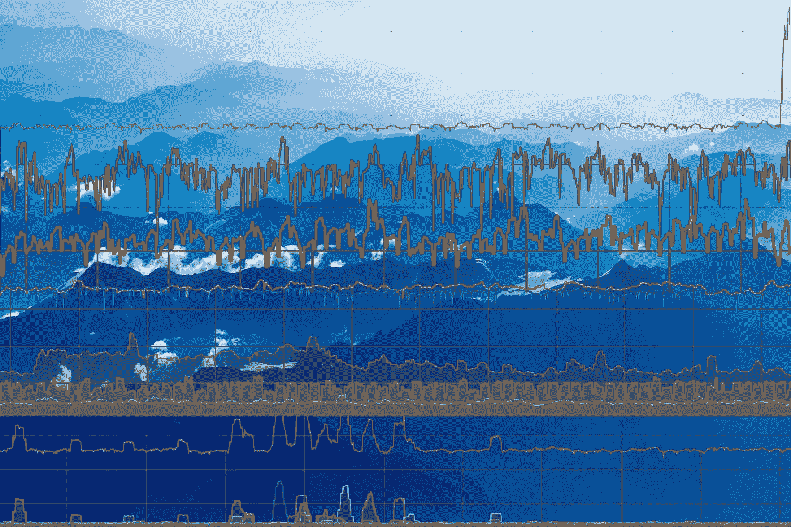
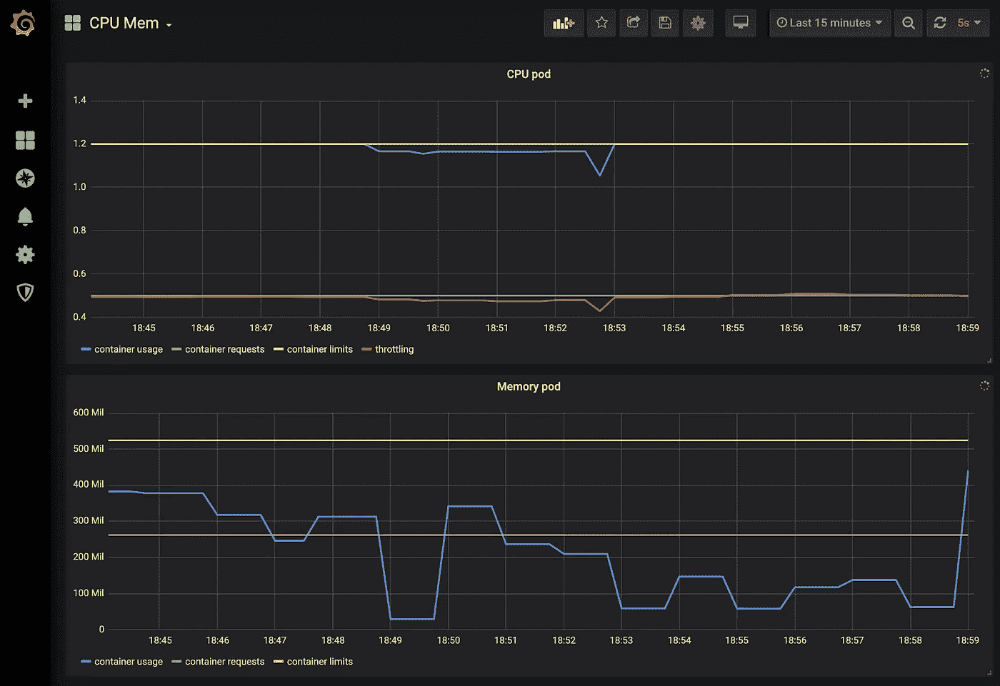
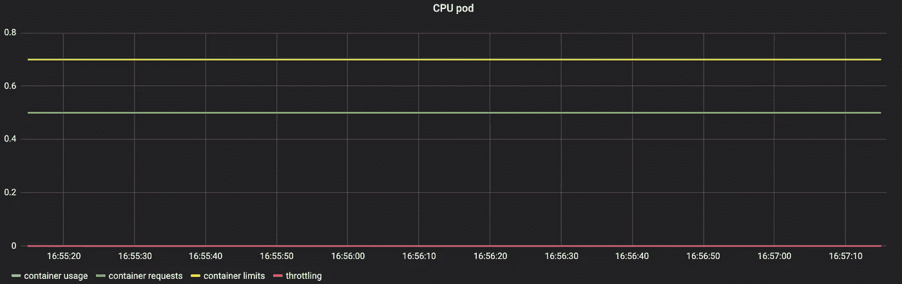
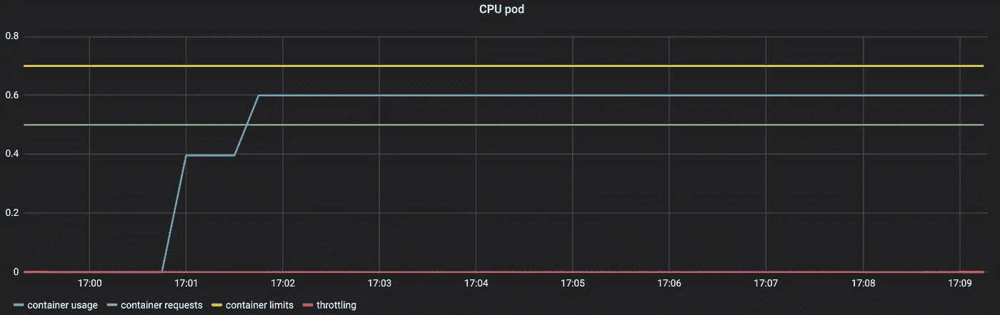
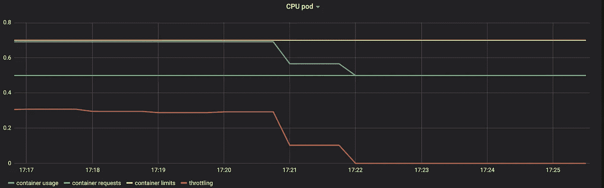
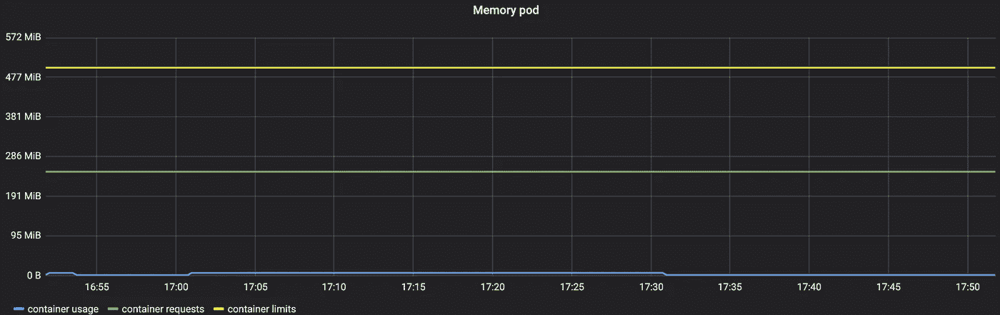
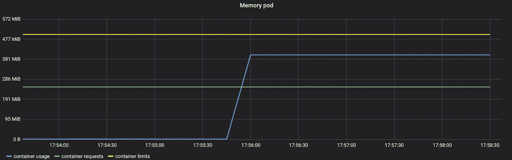
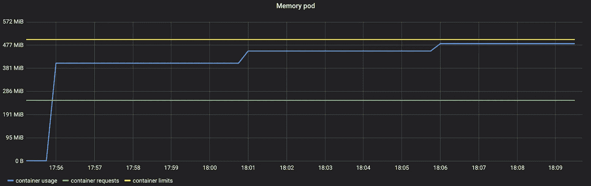
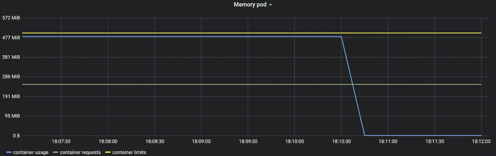

# K8s 使用 Prometheus 监控 Pod CPU 和内存使用情况

> 原文：<https://itnext.io/k8s-monitor-pod-cpu-and-memory-usage-with-prometheus-28eec6d84729?source=collection_archive---------0----------------------->

## 找出你的 Kubernetes 豆荚实际使用多少资源，并可视化 CPU 节流。



[https://unsplash.com/photos/WEQbe2jBg40](https://unsplash.com/photos/WEQbe2jBg40)

## 部件

1.  手动监控 pod 资源(本文)
2.  [通过垂直 pod 自动缩放自动设置 Pod 资源](https://medium.com/@wuestkamp/k8s-vertical-pod-autoscaling-fd9e602cbf81?source=friends_link&sk=df7289cb35bcfdfa7f191546e6d555b6)

## 有关系的

1.  [Kubernetes 卧式容器自动缩放实用指南](https://codeburst.io/practical-guide-to-kubernetes-scaling-1-pods-5a7ed08f4e8b?source=friends_link&sk=22602bf9789af6112fa53e9d20c05ed0)
2.  [Kubernetes 节点自动缩放实用指南](https://codeburst.io/practical-guide-to-kubernetes-node-scaling-5a7fc3499a56?source=friends_link&sk=ac4e04e5bc9a21197871ecdc8ccec911)

# 我们在这里做什么？

我们将逐步完成监控 Kubernetes pod 使用多少资源(CPU 或内存)的必要步骤。因此，我们来看看:

*   CPU 请求/限制/实际使用/节流
*   内存请求/限制/实际使用/终止

我们使用 metrics-server、Grafana 和 Prometheus 来完成这项工作。

# 资源请求和限制

## 这些是什么？

[这篇很棒的博文和视频](https://cloud.google.com/blog/products/gcp/kubernetes-best-practices-resource-requests-and-limits)会让你了解最新情况。

## 我们为什么需要这些？

当您创建一个新的应用程序或将现有的应用程序迁移到 Kubernetes 时，您可能不知道它需要多少资源。尽管 Kubernetes 在每个 pod(更准确地说是每个 pod 中的每个容器)都定义了资源限制和请求的情况下工作得最好。这控制节点上的 pod 调度。

**定义请求+限制将更有效地利用集群内的所有可用资源。**

# 不需要的 CPU 节流错误

设置任何 CPU 限制都会导致不必要的 CPU 节流，即使使用率没有达到其限制。阅读更多关于我的文章 [Kubernetes 生产中的资源管理](/kubernetes-resource-management-in-production-d5382c904ed1?source=friends_link&sk=0c1dd3cb89f524f9d495a196a2cbb44b)。

# 测试报告/应用程序

您可以使用这个 repo:[https://github . com/wuestkamp/k8s-example-resource-monitoring](https://github.com/wuestkamp/k8s-example-resource-monitoring)

## 图像

该应用程序由一个使用映像`gcr.io/kubernetes-e2e-test-images/resource-consumer:1.5`的简单部署组成。它提供了一个 HTTP 端点，可以接收使用资源的命令:

```
curl --data "millicores=400&durationSec=600" 10.12.0.11:8080/ConsumeCPUcurl --data "megabytes=300&durationSec=600" 10.12.0.11:8080/ConsumeMem
```

这允许我们在一个正在运行的 pod 中操纵 CPU 和内存的使用(更多[在这里](https://github.com/kubernetes/kubernetes/tree/d52ecd5f70cdf5f13f919bab56cf08cd556a2e26/test/images/resource-consumer))。

## 查看 Grafana 仪表板

测试应用程序附带安装和配置的 Grafana+Prometheus。还有一个显示 CPU 和内存数据的仪表板(`i/grafana/dashboard.json`)。



测试应用中包含的仪表板

# Kubernetes 1.16 更改了指标

> 移除 cadvisor 公制标签`pod_name`和`container_name`以符合仪器指南。任何匹配`pod_name`和`container_name`标签的 Prometheus 查询(例如 cadvisor 或 kubelet probe metrics)必须更新为使用`pod`和`container`。([来源](https://github.com/kubernetes/kubernetes/blob/master/CHANGELOG/CHANGELOG-1.16.md#removed-metrics))

如果你使用的是 Kubernetes 1.16 及以上版本，你必须使用 **pod** 而不是 **pod_name** 和 **container** 而不是 **container_name** 。

# 中央处理器

我们使用以下 Prometheus 查询:

```
# metrics are for k8s till 1.15
# for >=1.16 use *pod* instead of *pod_name* and *container* instead *container_name*# container usage
rate(**container_cpu_usage_seconds_total**{pod=~"compute-.*", image!="", container_name!="POD"}[5m])

# container requests
avg(**kube_pod_container_resource_requests_cpu_cores**{pod=~"compute-.*"})

# container limits
avg(**kube_pod_container_resource_limits_cpu_cores**{pod=~"compute-.*"})

# throttling
rate(**container_cpu_cfs_throttled_seconds_total**{pod=~"compute-.*", container_name!="POD", image!=""}[5m])
```

关于单位([更](https://kubernetes.io/docs/concepts/configuration/manage-compute-resources-container)):

*   500 米= 500 百万芯= 0.5 芯
*   500 米= 500 毫 cpu = 0.5 cpu

## 没有使用



Pod 不使用任何 CPU

上图显示了 500 米(绿色)的 pod 请求和 700 米(黄色)的限制。它还显示 pod 当前没有使用任何 CPU(蓝色)，因此没有任何东西受到限制(红色)。

## 在极限范围内使用

我们现在将 pod 的 CPU 使用率提高到 600m:



Pod 能够使用 600 毫升，没有节流

上图显示 CPU 使用率(蓝色)上升到 600m。我们低于定义的限制(黄色)，因此看不到节流(红色)。

## 超出限制的使用


Pod 尝试使用 1 个 CPU，但受到限制

上图显示 pod 的容器现在试图使用 1000 米(蓝色)，但这被限制为 700 米(黄色)。由于限制，我们看到节流正在进行(红色)。pod 使用 700m，节流 300m，加起来就是它试图使用的 1000m。



Pod CPU 使用率降至 5 亿

如果我们将 pod 的 CPU 使用率降低到 500m(蓝色)，与请求值(绿色)相同，我们会看到 throttling(红色)再次降低到 0。

**我们希望避免 CPU 节流以获得最佳效率。**

# 记忆

我们使用以下 Prometheus 查询:

```
# metrics are for k8s till 1.15
# for >=1.16 use *pod* instead of *pod_name* and *container* instead *container_name*# container usage
**container_memory_working_set_bytes**{pod_name=~"compute-.*", image!="", container_name!="POD"}

# container requests
avg(**kube_pod_container_resource_requests_memory_bytes**{pod=~"compute-.*"})

# container limits
avg(**kube_pod_container_resource_limits_memory_bytes**{pod=~"compute-.*"})
```

## 没有使用



Pod 不分配任何内存

在上图中，我们看到 pod 请求(绿色)250 英里，限制(黄色)500 英里，使用(蓝色)0 内存。

## 在极限范围内使用

我们现在将内存使用量提高到低于定义限制的值:



400Mi 的内存使用量



内存使用量高达 480 毫升

## 超出限制的使用



Pod 尝试分配 550 英里

当试图分配比设置的限制更多的内存时，Kubernetes 会终止导致这种情况的进程(信号 9)。如果容器作为入口点运行该进程，容器将重新启动。在上图中，主进程没有被终止，而只是一个子进程。因此，我们没有看到容器重启，但是内存使用下降到 0。

这导致一个警告事件(`kubectl get events`):

```
default     22s         Warning   OOMKilling   node/gke-resources-test-default-pool-6cad87bd-bgf4   Memory cgroup out of memory: Kill process 134119 (stress) score 1962 or sacrifice childKilled process 134119 (stress) total-vm:519288kB, anon-rss:508260kB, file-rss:268kB, shmem-rss:0kB
```

要将这些 k8s 事件导入 Prometheus/Grafana，例如设置 Prometheus 警报，可以使用 [event_exporter](https://github.com/caicloud/event_exporter) 。

# 阅读更多

[https://kubernetes . io/docs/tasks/configure-pod-container/assign-memory-resource](https://kubernetes.io/docs/tasks/configure-pod-container/assign-memory-resource/)

[https://kubernetes . io/docs/tasks/configure-pod-container/assign-CPU-resource](https://kubernetes.io/docs/tasks/configure-pod-container/assign-cpu-resource/)

# 下一步是什么？

接下来，我将深入了解垂直扩展 pod 资源的概念，它如何与 Kubernetes 一起工作，以及如何使用 Grafana+Prometheus 来可视化它。

最后，我想让集群根据应用程序的需求自动调整请求和限制会很棒。至少在可能的范围内。

# 成为 Kubernetes 认证

[](https://killer.sh)

[https://killer.sh](https://killer.sh)