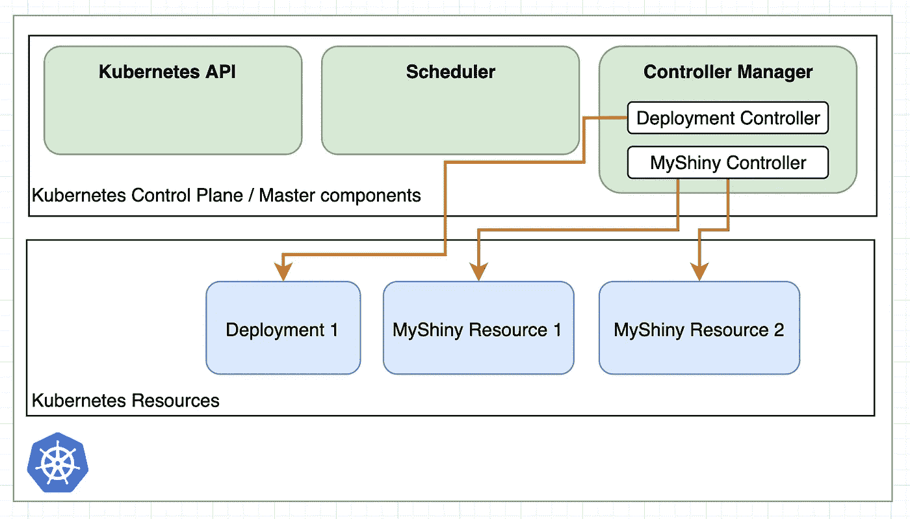
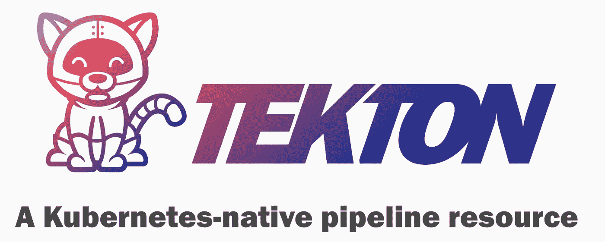
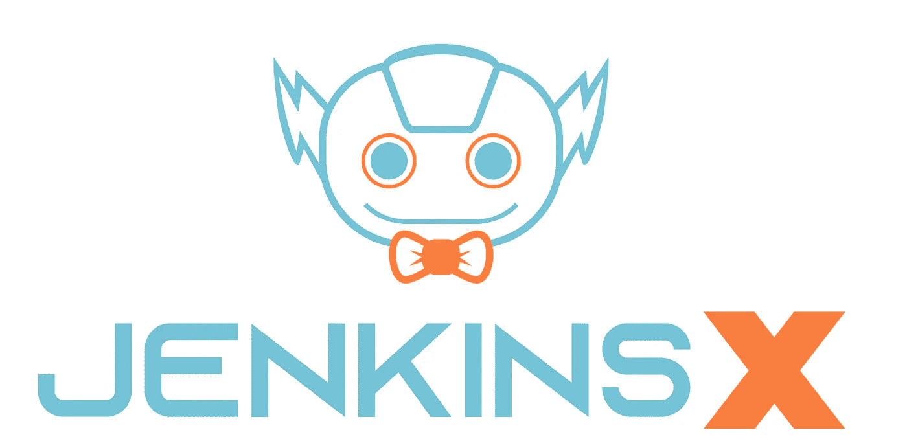
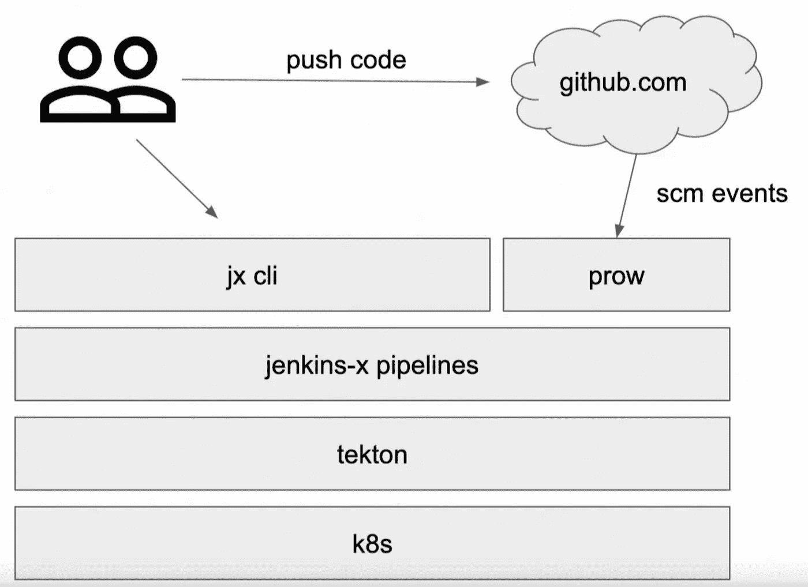
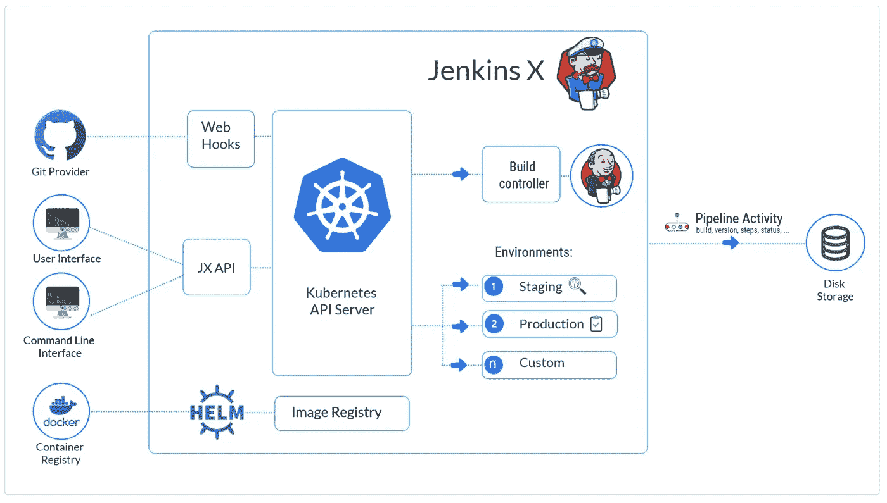
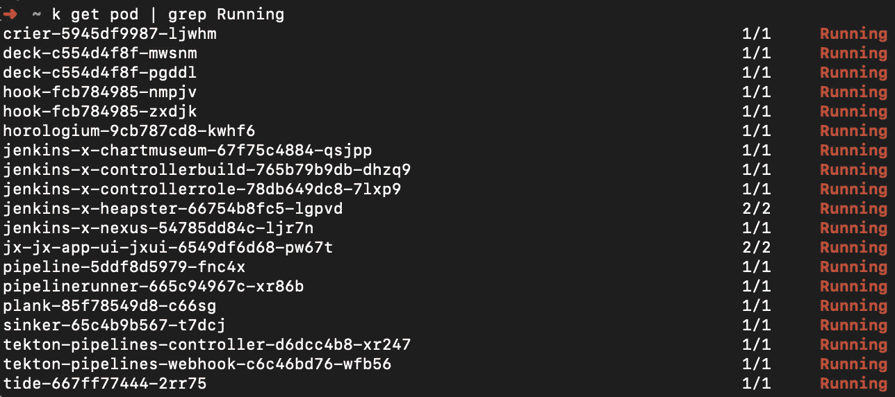

# k8s-原生 Jenkins-X 和 Tekton 管道

> 原文：<https://itnext.io/k8s-native-jenkins-x-and-tekton-pipelines-e2b5a61a1d22?source=collection_archive---------1----------------------->

## 詹金斯 X 是什么，是不是 CI/CD 的未来，能不能对得起詹金斯？


[https://unsplash.com/photos/4NZlogMPIp0](https://unsplash.com/photos/4NZlogMPIp0)

## TL；速度三角形定位法(dead reckoning)

詹金斯 X 是**不是**詹金斯，它完全是从零开始改写的。

詹金斯 X 比詹金斯更具体和“固执己见”。它提供了一种使用特定工具(Kubernetes Helm tek ton ska ffold Flagger…)来构建和部署应用程序的方法。如果你喜欢这种方式，使用它将是一种享受，如果你不喜欢，也许另一种工具更适合。

## 这篇文章是关于什么的？

本文将向您概述 Jenkins X 体系结构。我们将首先描述 Kubernetes native 和 CRDs，这将有助于我们了解 Tekton 是如何工作的以及它是什么。然后我们再来看看 Jenkins X，它是如何在引擎盖下使用 Tekton 的，为什么。

## 詹金斯

Jenkins 是旧的、Java 的、笨重的并且通常难以配置。虽然它非常灵活，可扩展，可能是最广泛使用的 CI 和 CD 工具。詹金斯 X 能继续成名吗？

## 有关系的

[Jenkins-X Istio Flagger 金丝雀部署](https://medium.com/@wuestkamp/jenkins-x-istio-flagger-canary-deployment-9d5e187c2334?source=friends_link&sk=fa0cf82c7051958b0a98e205375cba86)

# 库伯内特土著？CRD？

在我们生活的时代，软件程序和运行这些程序所必需的基础设施正在融合在一起。随着 Kubernetes 的兴起，创建了一种通用语言来描述现代基础设施。

Kubernetes 为创建基础设施时的常见问题提供解决方案，如定期运行容器、出租容器通信、收集日志/事件和附加卷。

## 自定义资源定义

Kubernetes 中的 CRD 提供了一种扩展 API 的方法。在集群中安装 CRD 时，可以使用新的资源类型。与新的资源类型一起，还提供了一个自定义控制器，它在控制器管理器中运行，并处理新资源类型的生命周期。



Kubernetes 控制器管理特定的资源

上图显示了管理部署的普通 k8s 部署控制器和通过 CRD 引入的管理 MyShiny 资源的 MyShiny 控制器。一旦在集群中安装了 CRD，用户就可以像使用任何其他资源一样与它进行正常交互，比如使用 kubectl 或 API。

## 库伯内特土著

Kubernetes 本地应用程序是直接在 Kubernetes 之上开发的。他们使用 k8s API 并为他们的工作流定义 CRD。就像您可以使用 Windows API/SDK 为 Windows 开发应用程序一样，您也可以为 Kubernetes 做同样的事情。

Jenkins X 是一个 Kubernetes 本地人的例子，我们将在本文中探讨这一点并说明原因。

# 泰克顿管道公司



“Tekton 之于 CI/CD，正如 Kubernetes 之于基础设施”。这意味着它为持续集成和持续部署/交付的常见问题提供了通用解决方案。它通过 CRDs 提供任务或管道等新资源来实现这一点:

## 工作

任务是您希望作为持续集成流程的一部分运行的连续步骤的集合。任务将在集群中的 pod 内运行。

```
**apiVersion:** tekton.dev/v1alpha1
**kind:** Task
**metadata:
  name:** example-task-name
**spec:** ...
  **steps:** - **name:** ubuntu-example
      **image:** ubuntu
      **args:** ["ubuntu-build-example", "SECRETS-example.md"]
    - **image:** gcr.io/example-builders/build-example
      **command:** ["echo"]
      **args:** ["$(inputs.params.pathToDockerFile)"]
    - **name:** dockerfile-pushexample
      **image:** gcr.io/example-builders/push-example
      **args:** ["push", "$(outputs.resources.builtImage.url)"]
      **volumeMounts:** - **name:** docker-socket-example
          **mountPath:** /var/run/docker.sock
  **volumes:** - **name:** example-volume
      **emptyDir:** {}
```

如果你看上面的例子，你会发现与豆荚非常相似。每一步都使用特定的图像来执行。Steps 可以像普通 pod 容器一样通过卷共享数据。

## 管道

管道定义了一组要执行的任务。

```
**apiVersion:** tekton.dev/v1alpha1
**kind:** Pipeline
**metadata:
  name:** pipeline-with-parameters
**spec:
  params:** - **name:** context
      **type:** string
      **description:** Path to context
      **default:** /some/where/or/other
  **tasks:** - **name:** build-skaffold-web
      **taskRef:
        name:** build-push
      **params:** - **name:** pathToDockerFile
          **value:** Dockerfile
        - **name:** pathToContext
          **value:** "$(params.context)"
```

在这个例子中，我们创建了一个新的管道来执行一个名为`build-push`的任务。可以向管道和任务传递参数。

## Tekton 概述

本文简要介绍了 Tekton 如何创建 Kubernetes CRDs 来解决常见的 CI/CD 问题。这样，各种不同的 CI/CD 工具可以使用相同的基础来构建它们特定的功能。

Tekton 并不打算直接使用，而是通过 Jenkins X 等顶层工具使用。Tekton 可能会成为 Kubernetes 中处理 CI/CD 的事实上的标准低层。

# 詹金斯 X



在最新版本(从 2.0)中，Jenkins X 是 Golang 的一个完整的重新开发，与经典的 Jenkins 没有任何共同之处。在其他技术中，它使用 Tekton 底层来管理和执行 Kubernetes 上的管道和作业。现在我们深入了解它的一些概念:

## GitOps

Jenkins X 是 GitOps first，这意味着它挂钩到 Git webhooks，并在提交或拉请求时被激活。Jenkins X 将要求每个应用/微服务都有自己的 Git repo。

此外，像生产/暂存这样的每个环境都有自己的 Git repo。环境中的每个部署都将通过(自动创建的)拉请求来完成。

Jenkins X 安装及其所有配置(通过`jx boot`安装)也将/应该驻留在自己的 Git repo 中。这样，应用程序、基础设施或配置的每一项更改都将被保存在 Git 中。

## 高层架构



https://www.youtube.com/watch?v=c7_KThiRKEM[t = 887s](https://www.youtube.com/watch?v=c7_KThiRKEM&t=887s)

## 更深层的架构



【https://jenkins-x.io/docs/concepts 

## 无服务器

对于 Jenkins X 来说，无服务器意味着**没有 Jenkins 服务器一直在运行等待新的构建**。运行在 Kubernetes 控制平面上的 Tekton CRD 控制器正在等待 Git 事件，然后创建处理管道所需的 pod。Jenkins X 中运行的每一条管道都由 Tekton 管理。不需要手工操作。

但是，如果没有管道在运行，就不要期望集群完全是空的:



许多部署/pod 运行在默认的 Jenkins X 安装上

## 使用 Kubernetes 无限扩展

对于每个管道运行，都会创建一个新的 Pod。因此，可伸缩性只受 Kubernetes 集群资源或名称空间配额的限制。不再需要等待工人的空闲位置或管道堵塞的问题。

## YAML 配置

是的，最后 YAML 配置的管道:)

[https://github . com/Jenkins-x/JX/blob/e 7060d 9d 599 f 01465 ca 2d 064 a 505 e 0 e 5e 09 a9 e 15/Jenkins-x . yml](https://github.com/jenkins-x/jx/blob/e7060d9d599f01465ca2d064a505e0e5e09a9e15/jenkins-x.yml)

## 构建包/自动配置

Jenkins X 甚至可以在没有任何 Jenkinsfile 的情况下导入(`jx import`)项目。它将创建默认管道，甚至默认 docker 文件，如果它们不存在的话。它包含许多常见项目类型和语言的构建包，如 Python/JS/Go/Java。

## 运行旧管道/ Jenkinsfile

如果不重新思考工作流程，您将无法轻松使用或转换旧的 Jenkins 管道。如果你喜欢研究转换，你可以查看[这个](https://github.com/jenkins-x/jenkins-x-platform/commit/ca9e0a58a76519193a2c7a0d8cf277dfc11babe4)的 Jenkinsfile 转换的例子。从 classic Jenkins 切换到 Jenkins X 可能意味着您必须调整 CI/CD 工作流程。

## 预览环境

Jenkins X 允许为每个提交或拉取请求自动创建预览环境。预览环境的 URL 作为 Pull 请求的注释发布。只要拉请求没有被合并，预览环境就会存在，并且在环境 Kubernetes 集群中作为单独的名称空间实现。

## 部署/交付

詹金斯 X 自动:

*   构建 Docker 容器并将它们推送到注册中心
*   制作船舵图，并把它们放入海图博物馆
*   通过 Semver 提高舵图版本并创建版本 Git 标签
*   附带为执行 Canary 部署而配置的 Flagger

# 詹金斯 vs 詹金斯 X

Tbh，把詹金斯 X 想成根本不是詹金斯。让我们给它另一个名字，让我们叫它…克劳斯。但是说真的，詹金斯 X 里没有任何经典詹金斯的东西。

经典的詹金斯是多配置和可扩展的工具，可用于一切。Jenkins X 是为一个特定的目的而制造的:运行在 Kubernetes 上的微服务架构。

# 概述

当我开始使用 Jenkins X 时，我立即感觉到它对您来说太多了。我通常喜欢工具不做太多假设，这样我可以一步一步地配置。与詹金斯 X 你必须禁用很多，而不是启用。但最后你应该只是屈服，接受工作流程，开心就好；)

所以我深入研究了 Jenkins X，我认为它非常简洁，确实提供了巨大的优势，并消除了大量重复工作。我将继续跟进，并希望尽快在生产中使用它。如果你是一个 Kubernetes 爱好者，这绝对感觉像是 CI/CD 的未来。

## 詹金斯 X 不够灵活吗？

詹金斯 X 比詹金斯更具体和“固执己见”。它提供了一种使用特定工具(Kubernetes Helm tek ton ska ffold Flagger…)来构建和部署应用程序的方法。如果你喜欢这种方式，使用它将是一种享受，如果你不喜欢，也许另一种工具更适合。

也许今天我们不再需要像经典的 Jenkins 那样的大型多功能工具。我们能够以前所未有的速度开发专业应用。我们希望小工具/微服务使用特定的工作流来解决特定的任务。

你怎么想呢?

# 更大的

我的文章[如何用 Jenkins X 执行金丝雀部署](https://medium.com/@wuestkamp/jenkins-x-istio-flagger-canary-deployment-9d5e187c2334?source=friends_link&sk=fa0cf82c7051958b0a98e205375cba86)

# 成为 Kubernetes 认证

[](https://killer.sh)

[https://killer.sh](https://killer.sh)