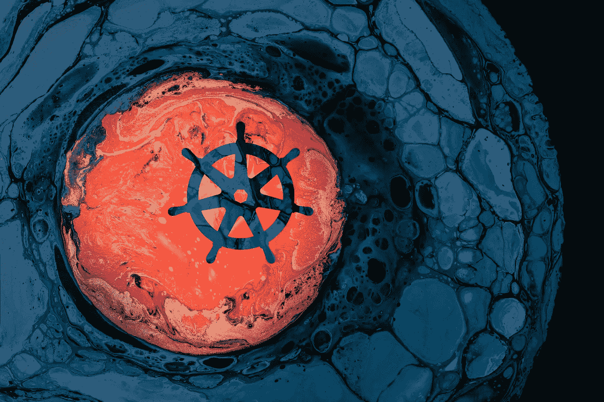

# K8s 防止队列工作 Pod 在部署期间被杀死

> 原文：<https://itnext.io/k8s-prevent-queue-worker-pod-from-being-killed-during-deployment-4252ea7c13f6?source=collection_archive---------0----------------------->

## 如何防止 Kubernetes(如 RabbitMQ)队列工作 Pod 在部署过程中处理消息时被杀死？



https://unsplash.com/photos/_nqApgG-QrY

每当为部署设置新的容器映像时，Kubernetes 都会替换每个 Pod。默认情况下，这是使用滚动策略完成的，其中带有新图像的 pod 被旋转起来，旧图像被一步一步地删除。

这很好，但是如果一个带有旧映像的 Pod 在那个时刻处理一个重要的长期请求或任务呢？在它完成任务之前，有没有可能防止它被终止？

## TL；速度三角形定位法(dead reckoning)

Kubernetes 提供了生命周期挂钩，通过它可以延迟终止。正确实现这一点取决于开发人员。

## 部件

1.  (本文)
2.  [使用 Symfony Messenger 的示例](https://medium.com/@wuestkamp/symfony-messenger-worker-on-kubernetes-77f75725b5ed?sk=c0a38e15d6cca86ffdec1496c075bacc)

# Pod 生命周期

如果一个吊舱被杀死，手动通过`kubectl`或任何 k8s 控制器像在部署期间，它将立即从运行状态变为终止状态。同时，SIGTERM 信号将被发送到该容器内的所有容器。

## 处于终止状态的 Pod

当 Pod 处于终止状态时，它仍然像以前一样被调度，并使用相同的资源(CPU/内存)。但是没有新的请求被 k8s 服务重定向到终结点。在终止状态下，Pod 可以并且应该正确地自行关闭。

当处于终止状态时，如果容器结束，容器不会重新启动。每当 Pod 内的容器在运行状态下停止时，该容器就会重新启动。这样做是因为除非发生错误，否则 Pod 应该一直运行。

Pod 停留在终止状态的最长时间为 terminationGracePeriodSeconds 设置的时间，默认情况下为 30 秒。如果所有 Pod 的容器都自行结束，则可以提前离开终止状态。一旦 Pod 离开终止状态，它将被移除并取消计划。

# 观察到 Pod 生命周期挂钩

可以挂钩到 Pod 的生命周期事件。我们可以用这个简单的例子来看这些事件:

旋转 Pod 并使用`kubectl logs -f runner`检查其日志。然后关闭 Pod 以查看预停止日志输出。

# 控制 Pod 生命周期

我们可以延长 Pod 在被完全杀死之前处于终止状态的时间:

```
apiVersion: v1
kind: Pod
metadata:
  labels:
    run: runner
  name: runner
spec:
 **terminationGracePeriodSeconds: 60 # raise to 60 seconds**
  containers:
  - command:
    - sh
    - -c
    - 'touch /tmp/messaging && tail -f /tmp/messaging'
...
```

这意味着我们可以简单地将**terminationgraceperiodes**设置为一个值，让我们的队列工作人员有足够的时间来完成任务，比如 5 个小时。这将是最简单的解决方案。

**但这意味着，对于每个部署**，只要设置了 terminationGracePeriodSeconds，副本的数量就会再次增加。这会消耗宝贵的资源。

# 只要它还在执行任务，就让它活着

这就是我们想要的。如果我们部署了一个新的镜像版本，我们希望所有不做任何事情的工人舱立即更新，所有其他人应该保持活动。

## 应用程序容器需要监听 SIGTERM 信号

为了实现这一点，在容器中运行的主进程需要监听 SIGTERM 信号并正确地终止自己。当 Pod 处于终止状态时，如果每个容器都发生这种情况，那么 Pod 将会被提前终止，即使 terminationGracePeriodSeconds 仍然处于活动状态。

让我们看看这个例子:

旋转吊舱并用`kubectl logs -f runner`检查其日志，然后杀死它。

在上面的例子中，只要文件`/tmp/kill_me`不存在，容器就会输出文件`/tmp/messaging`的内容。休眠 10 秒后，preStop 生命周期钩子将创建文件`/tmp/kill_me`。

现在，我们可以将 terminationGracePeriodSeconds 设置为一个更大的数字，并相信我们的应用程序会尽早正确地结束。

# 任何工作者的伪代码

以下是任何本身可能不处理 SIGERM 信号的工作进程的 Preudo 代码示例:

上面的例子假设在`/bin/worker`有一个长期运行的工作进程，它从消息队列中接收消息。该过程接受参数来控制它处理多少消息(`--message-count=1`)以及在退出前等待新消息的总时间(`--timeout=1m`)。

这将导致吊舱最多保持活动 1 小时(3600 秒)，只要`/bin/worker`正在处理它的任务，活动时间就最短。

如果您的工作进程不提供这些参数，并且它本身不能正确处理 SIGTERM 信号，那么我现在就没有办法了。

# 有边车集装箱运行怎么办？

为了让一个 Pod 真正从它的终止状态被终止，所有 Pod 的容器的主进程都需要处理 SIGTERM 并正确地终止。如果您有一个不处理 SIGTERM 的 sidecar 容器，请检查以下示例方法:

在这里，sidecar 容器是一个长期运行的 Python 进程。python sidecar 容器规范监听生命周期，如果主工作容器给出了 ok，就终止它的主进程。

通过创建文件`/tmp/share/kill_sidecar`经由共享文件卷传递 ok。这只有在包含辅助进程的主容器自身结束后才会发生。

# 与 HPA /水平 Pod 自动缩放器结合使用

应该可以为工作单元的部署实施 HPA，并使用自定义队列指标来扩展和缩减这些工作单元。例如，度量可能来自 RabbitMQ，这取决于有多少滞后消息。这与正确定义的终止/生命周期处理相结合，可以发挥巨大的作用。

# 为什么不使用工作或临时豆荚？

另一种方法可能是为每个到达队列并需要处理的消息设置单独的 pod。一个作业创建一个 Pod，它不是要无限期地运行，而是只运行到它的主要任务完成为止。对作业的模板容器映像的更改不会影响该作业的任何正在运行的 Pod，只会影响新创建的 Pod。

参见[https://keda.sh/concepts/scaling-jobs](https://keda.sh/concepts/scaling-jobs/)

尽管如果您每秒处理数千条消息，这种方法可能会导致很大开销。为了解决这个问题，您可以定义一个 Pod 在退出之前处理不止一个而是一定数量的消息。

## K8s 运算符

为了避免您的工作人员/跑步者在部署期间被杀害，一个好的方法是 Kubernetes 操作员处理消息的 Pod 创建。我在为 RabbitMQ 找东西，发现了[这篇文章](/kubernetes-workers-autoscaling-based-on-rabbitmq-queue-size-cb0803193cdf)。另外:

[Argo Events](https://github.com/argoproj/argo-events) 看起来很有趣，它可以基于来自 RabbitMQ 等各种来源的事件创建 Kubernetes 对象。

用于流水线作业的 Tekon 还创建了 CRD 来为特定任务旋转 pod。

# 更大的

[https://kubernetes . io/docs/concepts/workloads/pods/pod/# termination-of-pods](https://kubernetes.io/docs/concepts/workloads/pods/pod/#termination-of-pods)

[https://kubernetes . io/docs/concepts/containers/container-life cycle-hooks](https://kubernetes.io/docs/concepts/containers/container-lifecycle-hooks/)

# 成为 Kubernetes 认证

[](https://killer.sh)

[https://killer.sh](https://killer.sh)