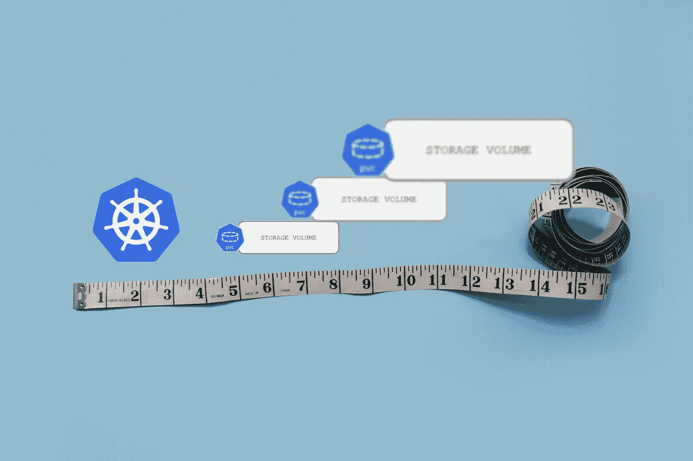
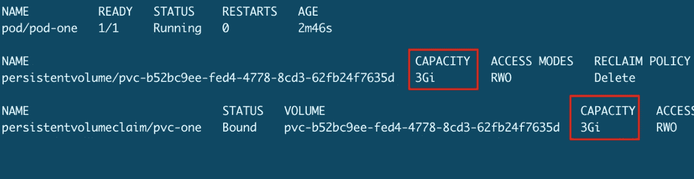
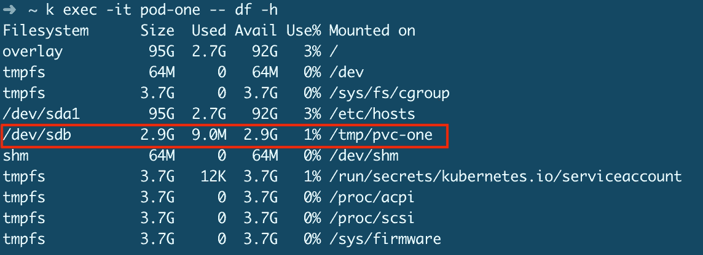
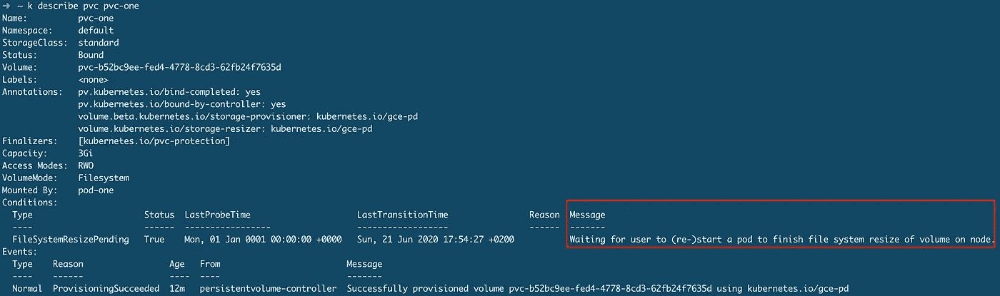
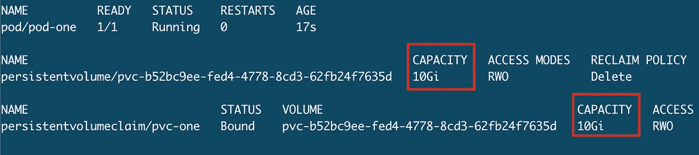
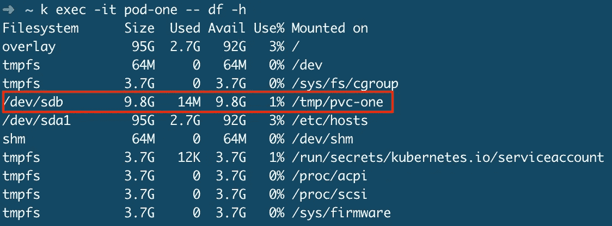
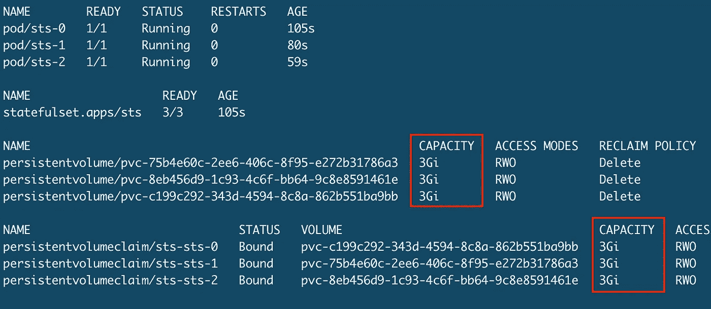
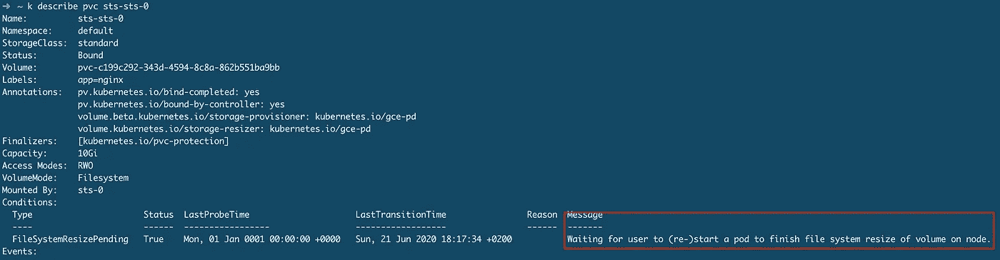
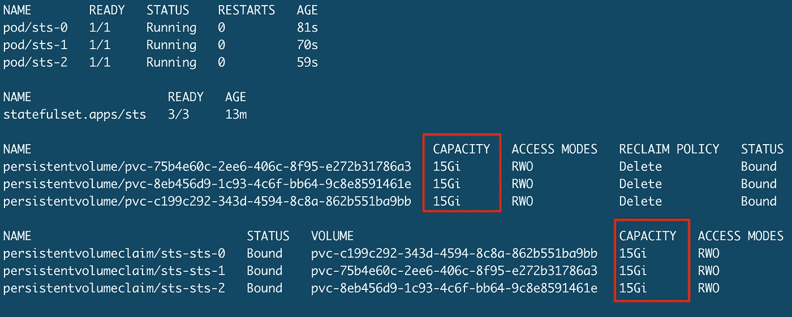
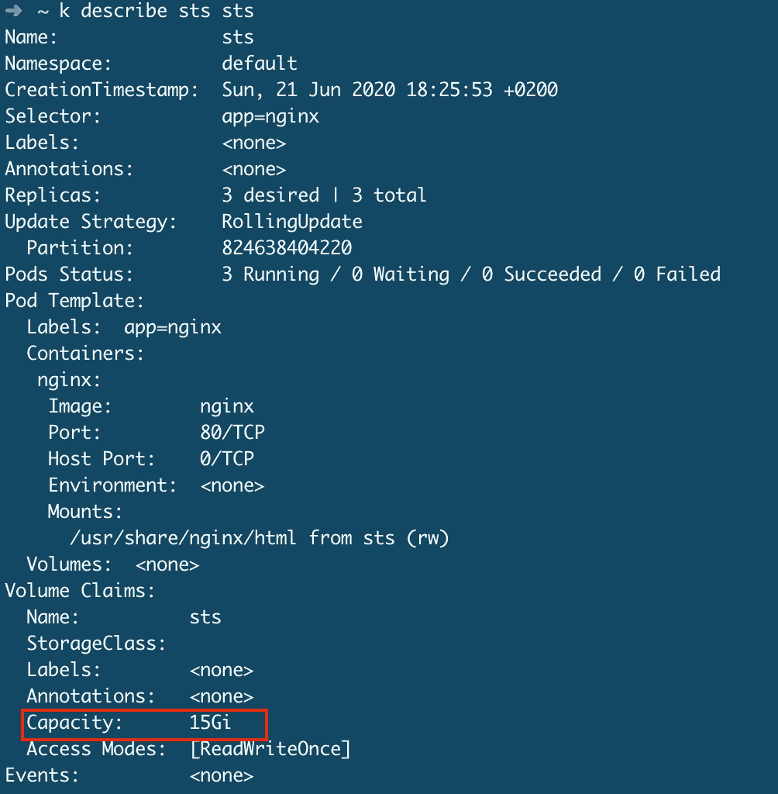

# K8s 在低影响的情况下提高了固定卷的大小

> 原文：<https://itnext.io/k8s-raise-statefulset-volume-size-with-low-impact-33fe1e2576f6?source=collection_archive---------2----------------------->

## 在一个简单的示例应用程序中逐步展示



## TL；速度三角形定位法(dead reckoning)

1.  确保您的 storageclass 提供程序支持调整大小
2.  提高 PVC 的体积大小
3.  优雅地重新启动所有状态设置窗格
4.  删除状态集，但保持窗格运行
5.  使用更新的卷声明模板大小再次创建 StatefulSet

## 创建一个测试集群

为了进行测试，我们使用 GCP 创建了一个示例 k8s 集群:

```
gcloud container clusters create test --num-nodes 3 --zone europe-west3-b --machine-type n1-standard-2 --node-version=1.16 --cluster-version=1.16
```

# 在容器中提升 PVC

在我们开始在一个状态集合中提高 PVC 之前，最好先在一个简单的单个 pod 上进行测试。

## 设置

这将导致:



我们看到，由于 k8s 的自动资源调配，PV 是自动创建的



pod 安装了卷

## 提高 PVC

首先我们更新 PVC ( `kubectl edit pvc pvc-one`):

```
# kubectl edit pvc pvc-one
apiVersion: v1
kind: PersistentVolumeClaim
metadata:
...
spec:
  accessModes:
  - ReadWriteOnce
  resources:
    requests:
 **storage: 10Gi**
  storageClassName: standard
  volumeMode: Filesystem
  volumeName: pvc-b52bc9ee-fed4-4778-8cd3-62fb24f7635d
status:
  accessModes:
  - ReadWriteOnce
  capacity:
    storage: 3Gi
  phase: Bound
```

等到`kubectl describe pvc pvc-one`显示它正在等待 pod 重启:



kubectl 描述 pvc pvc-one

现在删除并重新创建 pod，然后应该完成以下神奇操作:



PVC 和 PV 有新尺寸



Pod 显示已装载卷的新大小

# 在规定的时间内提高 PVC

## 设置

让我们创建一个非常简单的 StatefulSet 示例:

这导致:



## 提高 PVC

我们修补 PVCs 的速度比手工编辑更快:

```
kubectl patch pvc sts-sts-0 -p '{ "spec": { "resources": { "requests": { "storage": "15Gi" }}}}'kubectl patch pvc sts-sts-1 -p '{ "spec": { "resources": { "requests": { "storage": "15Gi" }}}}'kubectl patch pvc sts-sts-2 -p '{ "spec": { "resources": { "requests": { "storage": "15Gi" }}}}'
```

现在，等到每条 PVC 都有了正确的状态:



检查每个 PVC 的状况

然后，我们必须重新启动每个状态设置舱:

```
**### since k8s 1.15**
kubectl rollout restart sts sts**### before k8s 1.15** # recreate every pod gracefully after each other
kubectl delete pod sts-0
kubectl delete pod sts-1
kubectl delete pod sts-2# OR we could use scaling down+up real fast but this
# might cause downtime!
kubectl scale sts sts --replicas 0 && kubectl scale sts sts --replicas 3
```



PVC 和 PV 有新尺寸

## 更新 StatefulSet volumeClaimTemplate

如果我们在这里停下来，只增加 PVC 大小，而不增加 StatefulSet volumeClaimTemplate，那么增加 StatefulSet 将导致新的 pod 具有错误大小的 PVC。

因此，我们更新了本地 YAML 文件中的 StatefulSet:

```
# sts.yaml
apiVersion: apps/v1
kind: StatefulSet
metadata:
  name: sts
spec:
  selector:
    matchLabels:
      app: nginx
  serviceName: nginx
  replicas: 3
  template:
    metadata:
      labels:
        app: nginx
    spec:
      terminationGracePeriodSeconds: 10
      containers:
      - name: nginx
        image: nginx
        ports:
        - containerPort: 80
          name: web
        volumeMounts:
        - name: sts
          mountPath: /usr/share/nginx/html
  volumeClaimTemplates:
  - metadata:
      name: sts
    spec:
      accessModes: [ "ReadWriteOnce" ]
      resources:
        requests:
          **storage**: **15Gi**
```

现在，我们删除 StatefulSet，而不删除 pods，以降低影响。然后我们再次创建 StatefulSet:

```
kubectl delete sts sts --cascade=false **# keep pods running**
kubectl -f sts.yaml create
```



# 结束

在未来的 k8s 版本中，我们也许能够更新正在运行的 StatefulSet 的 volumeClaimTemplates。

你有改进建议吗？请留言评论。

# 成为 Kubernetes 认证

[](https://killer.sh)

[https://killer.sh](https://killer.sh)