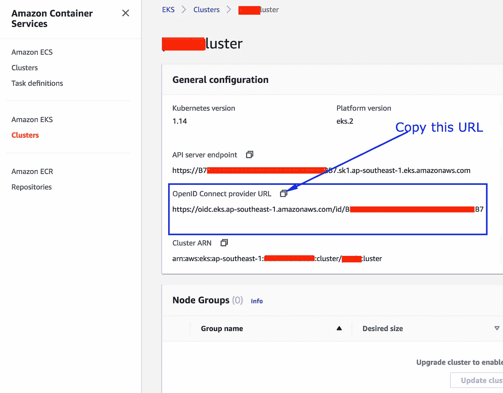
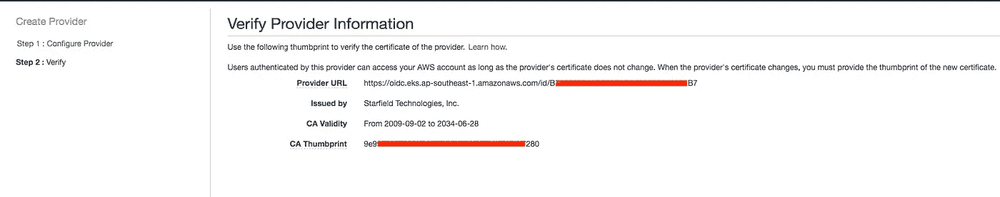

# EKS·RBAC:如何为服务帐户使用 IAM 角色

> 原文：<https://itnext.io/k8s-rbac-how-to-use-iam-roles-for-service-accounts-b77f91505f79?source=collection_archive---------4----------------------->


# 介绍

在本文中，我将解释如何为 EKS 集群中的服务帐户使用 IAM 角色，以便为 pods 提供细粒度的权限并安全地访问 AWS API。让我们来详细看看如何实现这一点。

# 为服务帐户启用 IAM 角色

*   从 EKS 群集中复制 OpenID 连接提供程序 URL。



如果您喜欢使用 AWS CLI，可以运行以下 AWS CLI 命令。用您的群集名称替换 CLUSTER_NAME。

```
aws eks describe-cluster --name CLUSTER_NAME --query "cluster.identity.oidc.issuer" --output text
```

*   创建 IAM OIDC 身份提供者。
    1。导航至 IAM 控制台
    2。选择**身份提供者**，然后选择**创建提供者** 3。为提供者类型
    4 选择 **OpenID** Connect。粘贴上述
    5 中复制的**提供者 URL** 。底下的观众类型 sts.amazonaws.com
    6。验证并创建提供者



**注意:** IAM 服务帐户角色功能适用于使用 1.14 创建或在 2019 年 9 月 3 日或之后升级到 1.13 或 1.14 的 EKS 集群。如果您的 EKS 集群不满足这一要求，那么就应该更新版本以利用这一特性。

# 为服务帐户创建 IAM 角色

现在，我们的集群已经准备好将 IAM 用于服务帐户。让我们创建一个 IAM 角色，以便我们可以将此 IAM 角色分配给 pod。

根据您的要求，使用以下信任策略和 IAM 策略创建一个只能从特定命名空间承担的 IAM 角色。遵循信任策略允许给定命名空间中的任何服务帐户。如果您希望限制到某个特定的服务帐户，请用一个服务帐户名称替换*以仅允许该服务帐户承担此角色。

```
{"Version": "2012-10-17","Statement": [{"Effect": "Allow","Principal": {"Federated": "arn:aws:iam::1111111111:oidc-provider/oidc.eks.ap-southeast-1.amazonaws.com/id/XXXXXXX"},"Action": "sts:AssumeRoleWithWebIdentity","Condition": {"StringLike": {"oidc.eks.ap-southeast-1.amazonaws.com/id/XXXXXXX:sub": "system:serviceaccount:NAMESPACE:*"}
}
}
]
}
```

替换:
`1111111111` — AWS 帐户 ID
`XXXXXXX` —OpenID 连接提供者 URL 的 URI 路径，
`NAMESPACE` —运行 pod 的名称空间名称。

或者，您可以使用以下 AWS CLI 脚本来创建角色。

让我们创建一个名称空间(演示)并部署一个 pod，然后验证它是否能够承担这个角色。

## 创建名称空间

namespace.yaml

```
kubectl apply -f namespace.yaml
```

## 创建服务帐户

serviceaccount.yaml

```
kubectl apply -f serviceaccount.yaml
```

## 创建部署

在 pod 规范中定义服务帐户并部署。

部署. yaml

```
kubectl apply -f deployment.yaml
```

## 验证:

Exec 进入容器并运行 AWS CLI 命令进行验证。

```
kubectl get pods -n demo
```

将任何 pod 名称和 exec 复制到其中(替换 pod Name)。

```
kubectl -n demo exec -it <podname> — bash
```

我在 pod 定义中使用了默认的`httpd`映像，默认情况下没有安装 AWS CLI。安装 [AWS CLI](https://docs.aws.amazon.com/cli/latest/userguide/install-linux.html) 并验证。

# 其他资源:

[1] [发行说明](https://aws.amazon.com/about-aws/whats-new/2019/09/amazon-eks-adds-support-to-assign-iam-permissions-to-kubernetes-service-accounts/)

[2] [EKS 文献](https://docs.aws.amazon.com/eks/latest/userguide/iam-roles-for-service-accounts.html)

[3] [官方博文](https://aws.amazon.com/blogs/opensource/introducing-fine-grained-iam-roles-service-accounts/)