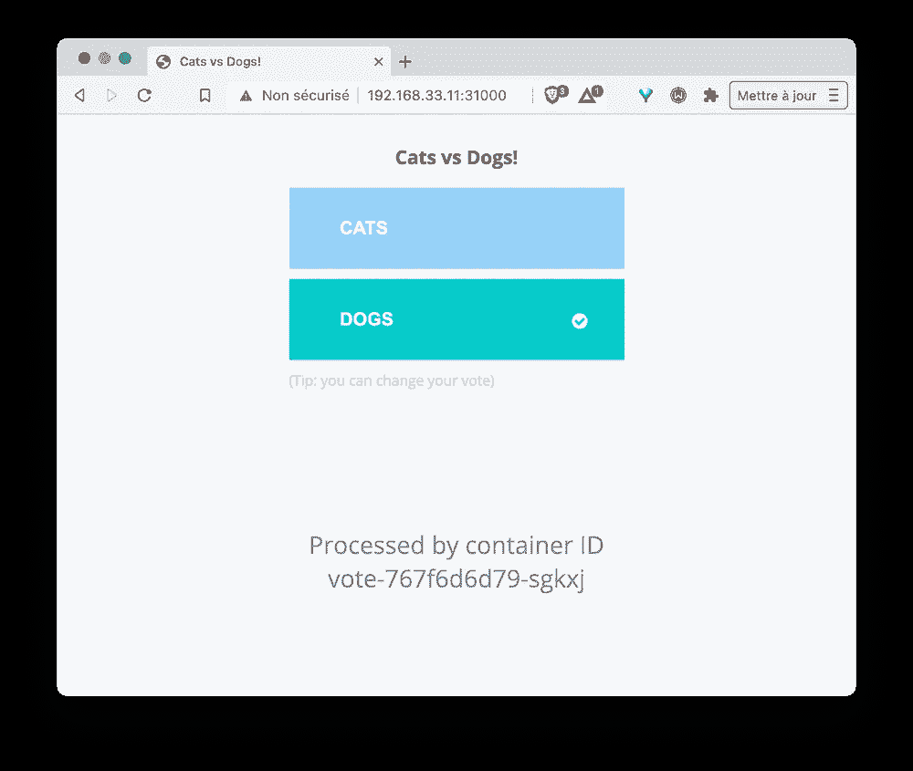
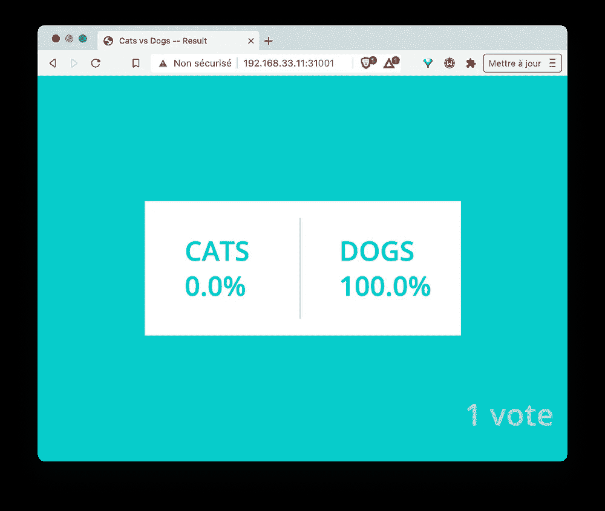
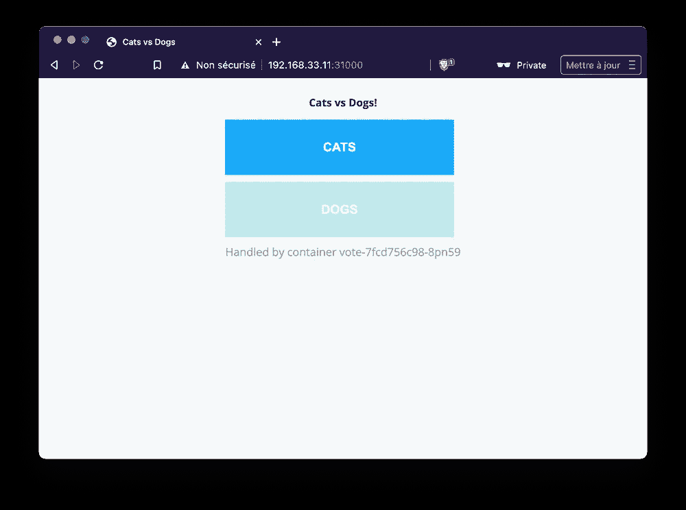
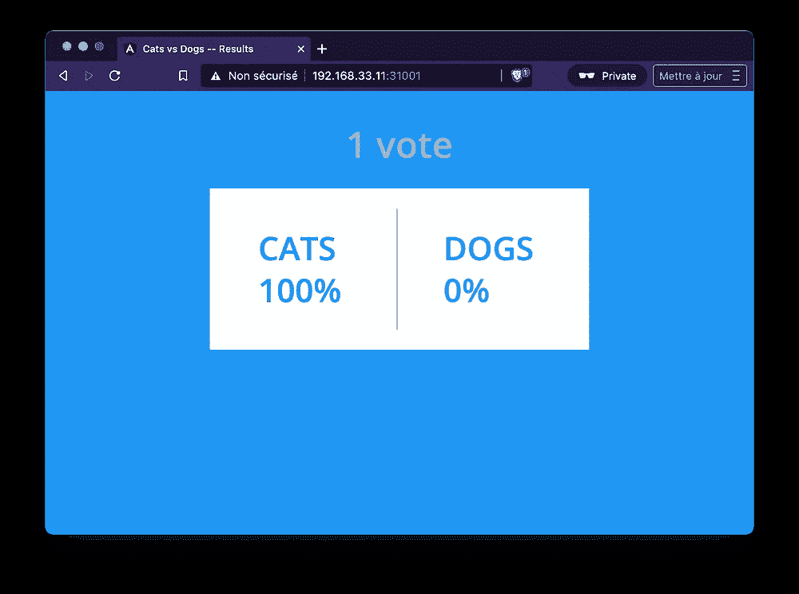

# 原始清单，头盔，Kustomize

> 原文：<https://itnext.io/k8s-tips-manifests-helm-kustomize-12f72f878022?source=collection_archive---------0----------------------->

## 在 Kubernetes 中部署应用程序的几种方式


照片由[埃琳娜·莫日维洛](https://unsplash.com/@miracleday?utm_source=unsplash&utm_medium=referral&utm_content=creditCopyText)在 [Unsplash](https://unsplash.com/s/photos/installation?utm_source=unsplash&utm_medium=referral&utm_content=creditCopyText) 上拍摄

在本文中，我们将使用示例微服务应用程序 [VotingApp](https://gitlab.com/voting-application/votingapp) ，并使用不同的方法和工具将其部署在 Kubernetes 中。我们将看到每一个的特点，这样你就可以有一个好主意，哪一个是最适合你的需求。

*   使用 yaml 规范
*   通过[掌舵](https://helm.sh)图表
*   使用 [Kustomize](https://kustomize.io/)

ℹ️如果你不知道 VotingApp，请查看这篇介绍该应用程序及其不同版本的短文[。](https://lucjuggery.medium.com/the-votingapp-reloaded-e4f237b8f3bf)

在下面的部分中，我们将设置一个单节点 [k0s](https://k0sproject.io/) Kubernetes 集群，并展示如何使用原始清单、 [helm](https://helm.sh) 和 [kustomize](https://kustomize.io) 部署不同版本的 VotingApp。

# k0s 单节点集群的设置

首先，我们将在本地机器上快速设置一个 Kubernetes 集群。在本地运行 Kubernetes 真的很容易，因为有很多可用的解决方案。仅举几个例子:

*   [k0s](https://k0sproject.io/)
*   [k3s](https://k3s.io)
*   [microK8s](https://microk8s.io/)
*   迷你库比
*   [种类](https://kind.sigs.k8s.io/docs/)

在本文中，我们使用 [k0s](https://k0sproject.io/) 并使用[流浪汉](https://vagrantup.com)和 [VirtualBox](https://virtualbox.org) 进行安装。

首先，我们创建一个新文件夹，并在其中添加下面的`Vagrantfile`。

```
Vagrant.configure("2") do |config|
 config.vm.box = "hashicorp/bionic64"
 config.vm.network "private_network", ip: "192.168.33.11"
 config.vm.provision "shell", inline: <<-SHELL
  export K0S_VERSION=v0.12.0
  curl -sSLf https://get.k0s.sh | sudo --preserve-env=K0S_VERSION sh
  sudo k0s install controller --single
  sudo systemctl start k0scontroller.service
 SHELL
end
```

接下来，在该文件夹中，我们运行以下命令，创建一个虚拟机并在其中安装 k0s:

```
$ vagrant up
```

接下来，我们在这个新创建的虚拟机中运行一个根 shell:

```
$ vagrant sshvagrant@vagrant:~$ sudo su -
```

使用 k0s 附带的`kubectl`客户机(非常方便的 BTW ),我们可以用下面的命令看到我们的单节点集群(节点处于就绪状态大约需要一分钟):

```
# k0s kubectl get nodes
NAME      STATUS   ROLES    AGE   VERSION
vagrant   Ready    <none>   40s   v1.20.5-k0s1
```

然后，我们克隆 VotingApp 的[配置库](https://gitlab.com/voting-application/config.git)，并在其中导航:

```
# git clone https://gitlab.com/voting-application/config.git
# cd config
```

在**配置**中有几个文件夹:每个文件夹都专用于一个我们可以用来部署 VotingApp 的工具:

```
# tree -L 1 .
.
├── README.md
├── compose
├── helm
├── kustomize
├── manifests
└── utils
```

在下一步中，我们将首先使用包含在**manifest**文件夹中的原始 yaml 规范来部署 VotingApp。

# 使用原始 yaml 规范进行部署

*manifests* 文件夹包含几个子文件夹，每个子文件夹包含给定版本的 VotingApp (v1、v2 和 v3)的规范:

```
# tree manifests
manifests
├── v1
│   ├── db-deployment.yaml
│   ├── db-service.yaml
│   ├── redis-deployment.yaml
│   ├── redis-service.yaml
│   ├── result-deployment.yaml
│   ├── result-service.yaml
│   ├── vote-deployment.yaml
│   ├── vote-service.yaml
│   └── worker-deployment.yaml
├── v2
│   ├── db-deployment.yaml
│   ├── db-service.yaml
│   ├── redis-deployment.yaml
│   ├── redis-service.yaml
│   ├── result-deployment.yaml
│   ├── result-service.yaml
│   ├── result-ui-deployment.yaml
│   ├── result-ui-service.yaml
│   ├── vote-deployment.yaml
│   ├── vote-service.yaml
│   ├── vote-ui-deployment.yaml
│   ├── vote-ui-service.yaml
│   └── worker-deployment.yaml
└── v3
    ├── nats-deployment.yaml
    ├── nats-service.yaml
    ├── result-deployment.yaml
    ├── result-service.yaml
    ├── result-ui-deployment.yaml
    ├── result-ui-service.yaml
    ├── vote-deployment.yaml
    ├── vote-service.yaml
    ├── vote-ui-deployment.yaml
    └── vote-ui-service.yaml
```

**manifest**的每个子文件夹都包含定义相应版本组件的 yaml 文件。这里我们可以注意到的第一件事是:有相当多的重复，因为一些资源是几个版本共有的。

如果我们想在 v1 版本中部署 VotingApp，我们可以使用下面的命令:

```
# k0s kubectl apply -f manifests/v1
```

> 注意:当用于文件夹时，命令`kubectl apply -f`会考虑该文件夹的所有规格

像往常一样，我们确保一切正常:

```
# k0s kubectl get deploy,po
NAME                     READY   UP-TO-DATE   AVAILABLE   AGE
deployment.apps/redis    1/1     1            1           19s
deployment.apps/db       1/1     1            1           20s
deployment.apps/worker   1/1     1            1           18s
deployment.apps/vote     1/1     1            1           19s
deployment.apps/result   1/1     1            1           19sNAME                          READY   STATUS    RESTARTS   AGE
pod/db-5db4758ff-48h2p        1/1     Running   0          20s
pod/redis-7784f964f6-dfnwg    1/1     Running   0          19s
pod/worker-5c44d48c6c-s57ss   1/1     Running   0          18s
pod/vote-6c5bc5687f-m6th6     1/1     Running   0          19s
pod/result-cd89cd84c-rm469    1/1     Running   0          19s
```

然后，我们可以使用虚拟机的 IP 和在 *vote-service.yaml* 和 *result-service.yaml* 中指定的节点端口访问 web 接口:`vote`在端口 31000 上可访问，`result`在端口 31001 上可访问。我们可以为一个项目投票并查看结果，这证实了整个应用程序运行良好。



使用原始清单部署的 VotingApp v1

然后可以使用以下命令删除该应用程序:

```
# k0s kubectl delete -f manifests/v1
```

如果我们需要部署 VotingApp 的另一个版本，我们必须运行与之前请求的版本相同的命令:

```
# k0s kubectl apply -f manifests/VERSION
```

直接使用 yaml 清单部署应用程序很简单，但它没有提供方便的功能来完全管理应用程序的生命周期或动态配置应用程序，这是 [Helm](https://helm.sh) 真正发挥作用的领域。

# 带舵展开

Helm 允许我们管理(定义、安装、升级)复杂的 Kubernetes 应用程序。这个工具通过 Chart(一个包含整个应用程序规范的包)的概念，使得创建、版本化、共享和发布整个应用程序变得容易。Helm 还提供了一种模板语言来动态配置应用程序。

在[配置存储库](https://gitlab.com/voting-application/config)中， *helm* 文件夹包含 VotingApp 的图表。

```
# tree helm
helm
├── Chart.yaml
├── templates
│   ├── _helpers.tpl
│   ├── db-deployment.yaml
│   ├── db-service.yaml
│   ├── nats-deployment.yaml
│   ├── nats-service.yaml
│   ├── redis-deployment.yaml
│   ├── redis-service.yaml
│   ├── result-deployment.yaml
│   ├── result-service.yaml
│   ├── result-ui-deployment.yaml
│   ├── result-ui-service.yaml
│   ├── vote-deployment.yaml
│   ├── vote-service.yaml
│   ├── vote-ui-deployment.yaml
│   ├── vote-ui-service.yaml
│   └── worker-deployment.yaml
└── values.yaml
```

*模板*文件夹包含每个微服务的规范。这些文件不能被 Kubernetes 直接使用，因为它们包含一些模板语言的元素，使得规范更加动态。让我们看几个例子。

*   投票部署的规范使用动态值来定义必须使用的图像(注册表+标记)。

注意:每个 **.Value.xyz** 都是对 *values.yaml* 中定义的一个值的引用(稍后会详细介绍)

```
**# cat templates/vote-deployment.yaml**
apiVersion: apps/v1
kind: Deployment
metadata:
  labels:
    app: vote
  name: vote
spec:
  replicas: 1
  selector:
    matchLabels:
      app: vote
  template:
    metadata:
      labels:
        app: vote
    spec:
      containers:
        - image: **{{ .Values.registry }}/vote:{{ .Values.version }}**
          name: vote
          imagePullPolicy: Always
          ports:
            - containerPort: 80
              name: vote
```

*   `vote`和`result`服务使用模板语言来确保只有在部署了版本 v1 的情况下才通过节点端口服务公开它们(对于 v2 和 v3，它们应该是 ClusterIP 类型)。

```
**# cat templates/vote-service.yaml** apiVersion: v1
kind: Service
metadata:
  labels:
    app: result
  name: result
spec:
 **{{ if eq .Values.version "v1" }}**
 **type: NodePort
  {{ end }}**  ports:
    - name: "result-service"
      port: 80
      targetPort: 80
      **{{ if eq .Values.version "v1" }}
      nodePort: 31001
      {{ end }}**
  selector:
    app: result**# cat templates/result-service.yaml**apiVersion: v1
kind: Service
metadata:
  labels:
    app: result
  name: result
spec:
 **{{ if eq .Values.version "v1" }}**
 **type: NodePort
  {{ end }}**
  ports:
    - name: "result-service"
      port: 80
      targetPort: 80
      **{{ if eq .Values.version "v1" }}
      nodePort: 31001
      {{ end }}**
  selector:
    app: result
```

*   模板语言在`worker`中也有两个用途:

-确保只为版本 1 和 2 部署工作进程(版本 3 使用 NATS)

-指定应使用的图像标签，因为每个工人的口味有一个标签(`java`、`go`和`.dotnet`):

```
**# cat templates/worker-deployment.yaml
{{ if ne .Values.version "v3" }}** apiVersion: apps/v1
kind: Deployment
metadata:
  labels:
    app: worker
  name: worker
spec:
  replicas: 1
  selector:
    matchLabels:
      app: worker
  template:
    metadata:
      labels:
        app: worker
    spec:
      containers:
        - image: **{{.Values.registry}}/worker:{{.Values.worker.lang}}**
          name: worker
          imagePullPolicy: Always
**{{ end }}**
```

以上模板中引用的所有值都在 *values.yaml:* 中定义

```
**# cat values.yaml**
# Image registry
registry:  registry.gitlab.com/voting-application# Version of the VotingApp among v1, v2 and v3
version: v2# Version of the worker among Java, .NET and Go
worker:
  lang: go
```

现在让我们使用 Helm 部署 VotingApp(需要按照这些指令首先安装 *helm* 二进制文件[)。](https://helm.sh/docs/intro/install/)

```
# helm upgrade voting --install --values values.yaml .
```

我们得到类似于下面的结果:

```
Release "voting" does not exist. Installing it now.
NAME: voting
LAST DEPLOYED: Wed Mar 31 21:02:07 2021
NAMESPACE: default
STATUS: deployed
REVISION: 1
TEST SUITE: None
```

在幕后，helm 读取`templates`文件夹中的规范，使用 *values.yaml* 中的值创建真正的 yaml 清单(Kubernetes 可以理解),并请求 API 服务器创建相应的资源。因此，前面的命令部署了应用程序的版本 2。

我们确保一切运行良好，检查所有的吊舱都处于**运行**状态:

```
# k0s kubectl get deploy,pod
NAME                        READY   UP-TO-DATE   AVAILABLE   AGE
deployment.apps/redis       1/1     1            1           3m37s
deployment.apps/db          1/1     1            1           3m37s
deployment.apps/worker      1/1     1            1           3m37s
deployment.apps/vote        1/1     1            1           3m37s
deployment.apps/vote-ui     1/1     1            1           3m37s
deployment.apps/result      1/1     1            1           3m37s
deployment.apps/result-ui   1/1     1            1           3m37sNAME                             READY   STATUS    RESTARTS   AGE
pod/redis-7784f964f6-pst85       1/1     Running   0          3m37s
pod/db-5db4758ff-mqzhk           1/1     Running   0          3m37s
pod/worker-5c44d48c6c-jqnf5      1/1     Running   0          3m37s
pod/vote-7fcd756c98-rckhm        1/1     Running   0          3m37s
pod/vote-ui-78c77c7b8b-s6svv     1/1     Running   0          3m37s
pod/result-6dcc7677fd-r4m25      1/1     Running   0          3m37s
pod/result-ui-67d5445774-6xl9d   1/1     Running   0          3m37s
```

然后我们可以访问`vote-ui`和`result-ui`界面:



使用 Helm 部署 VotingApp 版本 2

注意:第 1 版和第 2/3 版之间的前端只有微小的变化:一些标签有轻微的修改。

默认情况下，使用 worker 的`Go`版本(在 values.yaml 的 *worker.lang* 属性中定义)。我们可以确保查看工人规范:

```
# k0s kubectl get deploy/worker \
  -o jsonpath="{ .spec.template.spec.containers[0].image }"registry.gitlab.com/voting-application/**worker:go**
```

如果我们想尝试一下`dotnet`版本，我们只需要修改 values.yaml 文件，

```
...
# Version of the worker among java, dotnet and go
worker:
  lang: **dotnet**
```

和升级应用程序，Helm 将更新受*值变化影响的资源。*

```
# helm upgrade voting --install --values values.yaml .
```

我们确保部署已正确更新，现在使用的是映像的`dotnet`版本:

```
# k0s kubectl get deploy/worker \
  -o jsonpath="{ .spec.template.spec.containers[0].image }"registry.gitlab.com/voting-application/**worker:dotnet**
```

通过访问`vote-ui`和`result-ui`网络界面，我们可以很容易地验证这个新版本是否如预期的那样工作。

如果我们想回到以前的版本，Helm 也可以通过`rollback`命令帮助我们，该命令使用以前的值创建一个新版本:

```
# helm rollback voting
Rollback was a success! Happy Helming!
```

同样，我们可以验证工人的`Go`图像现在被使用，并且应用程序工作正常。

如果我们想安装版本 3 的 VotingApp，这没有问题。我们只需要更改 values.yaml 中的版本属性

```
...
# Version of the VotingApp among v1, v2 and v3
version: v3
...
```

并升级应用程序:

```
# helm upgrade voting --install --values values.yaml .
```

然后我们可以看到`vote`和`result`窗格已经更新，新的`nats`窗格已经创建。此外，`redis`、`db`和`worker`窗格已被删除，因为它们在 VotingApp 版本 3 中不再使用。

```
# k0s kubectl get deploy,po
NAME                        READY   UP-TO-DATE   AVAILABLE   AGE
deployment.apps/result-ui   1/1     1            1           11m
deployment.apps/vote-ui     1/1     1            1           11m
deployment.apps/result      1/1     1            1           11m
deployment.apps/vote        1/1     1            1           11m
deployment.apps/nats        1/1     1            1           42sNAME                            READY   STATUS    RESTARTS   AGE
pod/result-ui-6b4b6bdb9-xrjvj   1/1     Running   0          11m
pod/vote-ui-856ddf9d5-px9tl     1/1     Running   0          11m
**pod/result-7f6b5d9bb9-c42p5     1/1     Running   0          41s
pod/vote-56db6bd44f-d4dpx       1/1     Running   0          41s
pod/nats-b8dfd96c6-sgqvd        1/1     Running   0          41s**
```

然后我们可以删除该应用程序:

```
# helm uninstall voting
```

正如我们在这些例子中看到的，我们使用了同一套 yaml 文件，添加了一些模板，然后能够动态配置我们的 VotingApp。很酷，对吧？

我们只通过一个简单的例子来说明 Helm，但是这个工具绝对能够做更多的事情，正如你在[文档](https://helm.sh)中看到的那样。下一步，我们将说明如何使用 [Kustomize](https://kutomize.io) 部署我们的应用程序。

# 使用 Kustomize 进行部署

[Kustomize](https://kustomize.io/) 引入了一种无模板的方式来定制应用配置。它既可以作为独立的二进制文件，也可以作为`kubectl`的原生特性。它基本上从 yaml 规范列表中定义了一个基线，并允许我们使用额外的资源来过载这个基线。让我们看看这在 VotingApp 的上下文中是如何工作的。

在[配置库](https://gitlab.com/voting-application/config)中， *kustomize* 文件夹包含几个子文件夹:

```
# tree kustomize
kustomize
├── base
│   ├── kustomization.yaml
│   ├── result-deployment.yaml
│   ├── result-service.yaml
│   ├── vote-deployment.yaml
│   └── vote-service.yaml
└── overlays
    ├── v1
    │   ├── db-deployment.yaml
    │   ├── db-service.yaml
    │   ├── kustomization.yaml
    │   ├── redis-deployment.yaml
    │   ├── redis-service.yaml
    │   └── worker-deployment.yaml
    ├── v2
    │   ├── db-deployment.yaml
    │   ├── db-service.yaml
    │   ├── front-services.yaml
    │   ├── kustomization.yaml
    │   ├── redis-deployment.yaml
    │   ├── redis-service.yaml
    │   ├── result-ui-deployment.yaml
    │   ├── result-ui-service.yaml
    │   ├── vote-ui-deployment.yaml
    │   ├── vote-ui-service.yaml
    │   └── worker-deployment.yaml
    └── v3
        ├── kustomization.yaml
        ├── nats-deployment.yaml
        ├── nats-service.yaml
        ├── result-ui-deployment.yaml
        ├── result-ui-service.yaml
        ├── vote-ui-deployment.yaml
        └── vote-ui-service.yaml
```

*   `base`子文件夹包含一些不同版本的 VotingApp 通用的规范(所有版本中只使用`vote`和`result`)。这个文件夹还包含`kustomization.yaml`，它基本上列出了构成这个基线的规范。

```
**# cat base/kustomization.yaml** apiVersion: kustomize.config.k8s.io/v1beta1
kind: Kustomization
resources:
- result-deployment.yaml
- result-service.yaml
- vote-deployment.yaml
- vote-service.yaml
```

在`base`文件夹的旁边，有一个`overlays`文件夹，其中包含了 VotingApp 每个版本的子文件夹。这些子文件夹中的每一个都包含额外的文件，这些文件用于重载存在于`base`文件夹中的内容。

*   `overlays/v1`是需要用来部署 VotingApp 版本 1 的文件夹。它在基本文件夹中的版本 1 的基础上定义了版本 1 所需的资源。通过一个 *kustomization.yaml* 文件，它还定义了要应用于`vote`和`result`部署的补丁，因此投票和结果图像使用 **v1** 标签。

```
**# cat overlays/v1/kustomization.yaml** bases:
  - ../../base
resources:
  - redis-deployment.yaml
  - redis-service.yaml
  - worker-deployment.yaml
  - db-deployment.yaml
  - db-service.yaml
patches:
  - target:
      group: apps
      version: v1
      kind: Deployment
      name: vote
    patch: |-
      - op: replace
        path: /spec/template/spec/containers/0/image
        value: registry.gitlab.com/voting-application/vote:v1
  - target:
      group: apps
      version: v1
      kind: Deployment
      name: result
    patch: |-
      - op: replace
        path: /spec/template/spec/containers/0/image
        value: registry.gitlab.com/voting-application/result:v1
```

补丁部分看起来相当复杂，但基本上每个补丁“只是”引用一个资源，并沿其层次结构更改属性值。在这个例子中，投票和结果容器的图像被修改。

*   `overlays/v2`是需要用来部署 VotingApp 版本 2 的文件夹。它在基本文件夹中的资源基础上定义了版本 2 所需的资源。通过一个 *kustomization.yaml* 文件，它还定义了应用于基本文件夹中定义的资源的补丁。基本上，这些补丁允许为`vote`和`result`部署指定 **v2** 标签，它还将`vote`和`result`服务的类型更改为**集群 IP** 而不是**节点端口**。

```
**# cat overlays/v2/kustomization.yaml** bases:
  - ../../base
resources:
  - result-ui-deployment.yaml
  - result-ui-service.yaml
  - vote-ui-deployment.yaml
  - vote-ui-service.yaml
  - redis-deployment.yaml
  - redis-service.yaml
  - worker-deployment.yaml
  - db-deployment.yaml
  - db-service.yaml
patches:
  # Use v2 as image tag for vote Deployment
  - target:
      group: apps
      version: v1
      kind: Deployment
      name: vote
    patch: |-
      - op: replace
        path: /spec/template/spec/containers/0/image
        value: registry.gitlab.com/voting-application/vote:v2
  # Use v2 as image tag for result Deployment
  - target:
      group: apps
      version: v1
      kind: Deployment
      name: result
    patch: |-
      - op: replace
        path: /spec/template/spec/containers/0/image
        value: registry.gitlab.com/voting-application/result:v2
  # Change vote Service to ClusterIP type
  - target:
      kind: Service
      name: vote
    patch: |-
      - op: replace
        path: /spec/type
        value: ClusterIP
      - op: remove
        path: /spec/ports/0/nodePort
  # Change result Service to ClusterIP type
  - target:
      kind: Service
      name: result
    patch: |-
      - op: replace
        path: /spec/type
        value: ClusterIP
      - op: remove
        path: /spec/ports/0/nodePort
```

*   `overlays/v3`是需要用来部署 VotingApp 版本 3 的文件夹。它在基本文件夹中的资源基础上定义了版本 3 所需的资源。通过一个 *kustomization.yaml* 文件，它还定义了应用于基础文件夹中定义的资源的补丁。这些补丁与上面版本 2 中定义的补丁非常相似。

有了上下文设置，现在让我们试一试，用 Kustomize 部署 VotingApp 的第 2 版。这可以用下面的命令来完成，这个命令是标准的`kubectl apply`，只是它使用了`-k`标志:

```
# k0s kubectl apply -k overlays/v2/
```

然后，我们可以访问 VotingApp，再次为我们最喜欢的动物投票。

完成后，我们可以使用创建时使用的相同的`-k`标志删除应用程序。

```
# k0s kubectl delete -k overlays/v2
```

这种方法非常简洁，避免了太多的重复。正如我们所看到的，基本资源从不被修改，只有补丁被应用于它们以生成新的资源。

> Kustomize 通常用于在不同的环境中部署相同的应用程序，每个环境都有一个覆盖层的子文件夹。

## 关键要点

在本文中，我们概述了在 Kubernetes 中部署应用程序的主要方式:

*   使用原始的 yaml 规范是管理应用程序最简单但可配置性较差的方法
*   Helm 是一种更加可配置的方法。它使用一种模板语言，动态值，并使管理应用程序的整个生命周期变得简单。除此之外，舵图可以很容易地分发，许多应用程序都可以通过舵图获得
*   Kustomize 是另一种方法，它允许通过一个基本文件夹定义同一个应用程序的几个版本，该基本文件夹可以通过使用额外的资源而过载。Kustomize 可以通过多个覆盖子文件夹轻松管理一个应用程序的多个版本

🔥VotingApp 已经知道了过去几周的许多变化。不要犹豫，看看 [GitLab repo](https://gitlab.com/voting-application/config) 。在这个演示应用程序的上下文中，你会找到更多关于 Helm 和 Kustomize 的信息和高级用法。