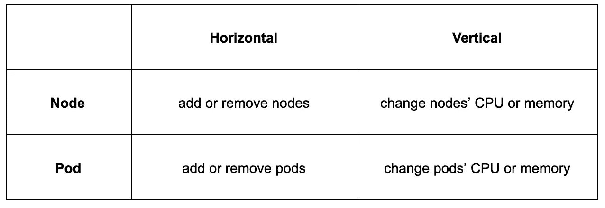
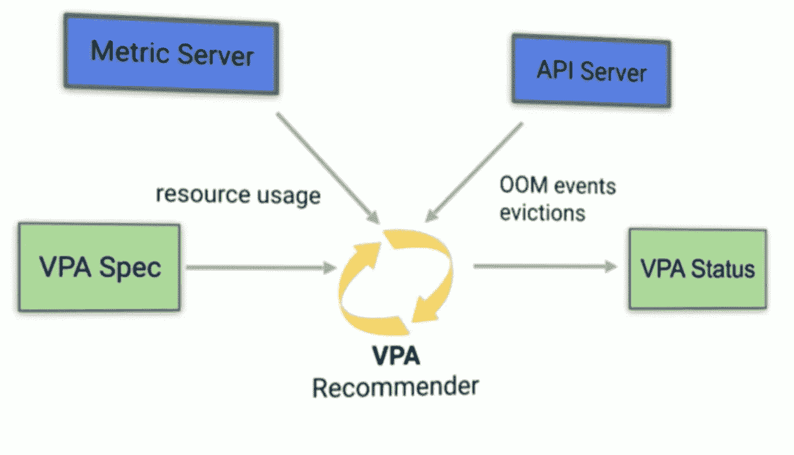
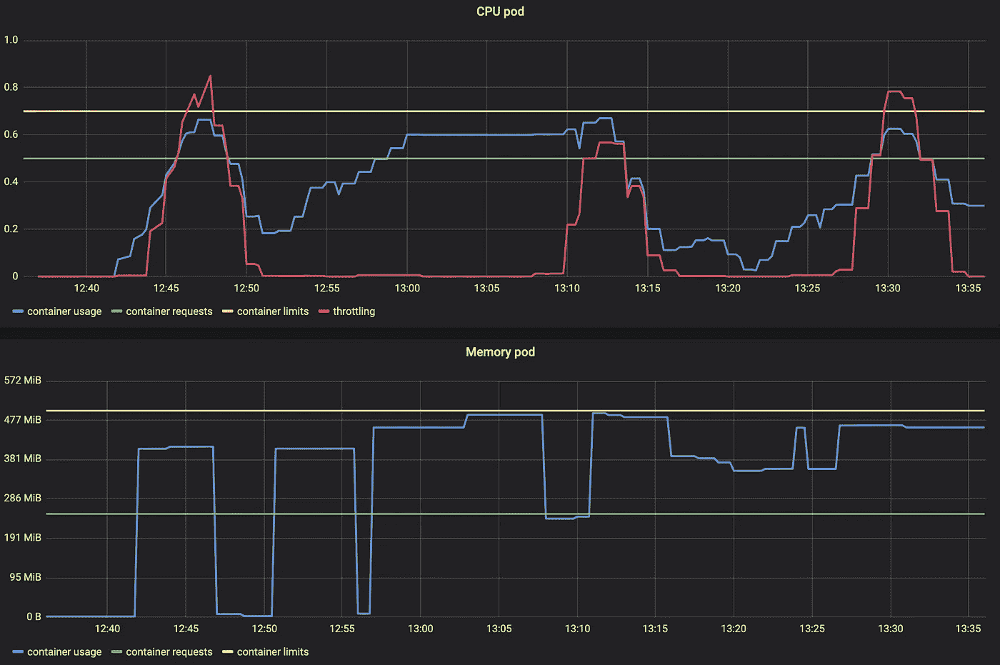

# K8s 垂直 Pod 自动缩放

> 原文：<https://itnext.io/k8s-vertical-pod-autoscaling-fd9e602cbf81?source=collection_archive---------0----------------------->

## 我们配置 Kubernetes VPA，并在一个示例应用程序上使用 Prometheus 监控效果


[https://unsplash.com/photos/WEQbe2jBg40](https://unsplash.com/photos/WEQbe2jBg40)

## 部件

1.  [手动监控吊舱资源](/k8s-monitor-pod-cpu-and-memory-usage-with-prometheus-28eec6d84729?source=friends_link&sk=b498011bceb730596ee93d56869a2f5c)
2.  使用垂直 pod 自动缩放功能自动设置 Pod 资源(本文)

## 有关系的

1.  [Kubernetes 卧式容器自动缩放实用指南](https://codeburst.io/practical-guide-to-kubernetes-scaling-1-pods-5a7ed08f4e8b?source=friends_link&sk=22602bf9789af6112fa53e9d20c05ed0)
2.  [Kubernetes 节点自动缩放实用指南](https://codeburst.io/practical-guide-to-kubernetes-node-scaling-5a7fc3499a56?source=friends_link&sk=ac4e04e5bc9a21197871ecdc8ccec911)

# TL；速度三角形定位法(dead reckoning)

VPA(垂直单元自动扩展)将建议甚至自动设置集群内单元的资源请求和限制值。

# 资源请求和限制

## 什么？

什么是资源请求和限制？[这篇很棒的博文和视频](https://cloud.google.com/blog/products/gcp/kubernetes-best-practices-resource-requests-and-limits)会让你了解最新情况。

## 为什么？

当所有 pods 的所有容器都有资源请求 CPU 限制+分配的内存时，Kubernetes 集群工作得最好。这会影响 pod 调度、寿命、终止和优先级。

尽管通常很难知道应用程序的资源。如果您将这些设置得太低，您的应用程序可能会受到限制，甚至被终止。如果您将这些设置得太高，可能会浪费昂贵的资源。可以像我们在[第 1 部分](/k8s-monitor-pod-cpu-and-memory-usage-with-prometheus-28eec6d84729?source=friends_link&sk=b498011bceb730596ee93d56869a2f5c)中所做的那样监控 pod 的资源使用情况。

**但是，如果您的集群可以自动为您设置请求和限制，那会怎么样呢？**

# 水平与垂直缩放



**水平缩放**意味着增加实例的数量。例如向集群/池添加新节点。或者通过增加副本数量来添加新的单元(水平单元自动缩放)。

**垂直扩展**意味着提高集群(或池)中每个节点的资源(如 CPU 或内存)。如果不创建全新的节点池，这几乎是不可能的。然而，就 Pod 而言，垂直扩展意味着根据当前应用需求动态调整资源请求和限制(垂直 Pod 自动缩放)。

# VPA 组件

VerticalPodAutoscaler (VPA)是一个可以创建的 Kubernetes 资源。它在`spec:`部分引用了一个特定的部署和一些更多的选项。`status:`部分将包含有关扩展过程的信息和建议。



[https://www.youtube.com/watch?v=Y4vnYaqhS74](https://www.youtube.com/watch?v=Y4vnYaqhS74)

## VPA 推荐者

推荐器查看指标历史记录、OOM 事件和部署的 VPA 规范，并建议适合请求的值。基于*限值提高/降低的限值:要求*(进一步降低)定义的比例。因此，如果不确定应用程序实际需要什么，推荐器可以自己使用。再往下，我们可以看到示例应用程序的资源建议。

## VPA 自动调整器

如果定义了`updateMode: Auto`，那么无论推荐者推荐什么，调整器都会执行。

> 由于 Kubernetes 的限制，修改正在运行的 Pod 的资源请求的唯一方法是重新创建 Pod。如果您创建了一个`updateMode`为“Auto”的 VerticalPodAutoscaler，那么当 VerticalPodAutoscaler 需要更改 Pod 的资源请求时，它会收回 Pod。([来源](https://cloud.google.com/kubernetes-engine/docs/concepts/verticalpodautoscaler))

据我所知，计划就地更新 pod 资源[。在此之前，需要删除并重新创建 pod 来实现自动调整。](https://github.com/kubernetes/enhancements/pull/686)

# 示例应用程序

我们使用 Prometheus、Grafana 附带的示例 repo[https://github.com/wuestkamp/k8s-example-vpa](https://github.com/wuestkamp/k8s-example-vpa)和示例部署来强调资源。

## 应用程序图像

该应用程序使用图像`gcr.io/kubernetes-e2e-test-images/resource-consumer:1.5`。它提供了一个 HTTP 端点，可以接收使用资源的命令:

```
curl --data "millicores=400&durationSec=600" 10.12.0.11:8080/ConsumeCPUcurl --data "megabytes=300&durationSec=600" 10.12.0.11:8080/ConsumeMem
```

# 使用 VPA 查找合适的资源请求

## 设置 VPA 推荐模式 YAML

我们只想在“建议”模式下使用 VPA。很高兴看到我们是否愿意使用它:

```
**apiVersion:** autoscaling.k8s.io/v1beta2
**kind:** VerticalPodAutoscaler
**metadata:
  name:** vpa
**spec:
  targetRef:
    apiVersion:** "extensions/v1beta1"
    **kind:** Deployment
    **name:** compute
  **updatePolicy:
    updateMode:** "Off"      # only recommodation mode
```

## 测试应用程序中的资源使用

我们创建了一些资源使用情况，并使用 Prometheus 和 Grafana 对其进行监控:



我们可以看到 CPU 有几次被抑制(红色)。不容易看到的是，内存使用导致了 13:07 和 13:16 的 OOM kills。

## VPA 观点建议

为了查看 VPA 请求建议，我们等待几分钟，然后运行:

```
kubectl describe vpa vpa
```


VPA 对资源请求的建议

**下界**:下面的东西都不够用。

**上限**:接近或超过的都是浪费。

**目标**:这是我们要求的最大价值

我们看到，对于我们的示例应用程序，查看指标的当前状态，VPA 建议将 CPU 请求设置为 813 兆，内存请求设置为 628 兆。

## 极限呢？

我们只得到一个值来设置请求，但是限制呢？这些限制将根据我们在 Pod 规范中定义的初始*限制:请求*比率进行设置。

在我们的示例应用中，我们定义了:

```
resources:
  limits:
    cpu: "700m"
    memory: "500Mi"
  requests:
    cpu: "500m"
    memory: "250Mi"
```

这意味着我们有一个 CPU *限制:请求*比率 1.4，VPA 使用这个比率:

```
# VPA raises limits based on ratio
limits=700
requests=500
ratio = limits / requests = 1.4=> requests * ratio = limits
=> 500 * 1.4 = 700
```

因此，如果 VPA 将我们的 CPU 请求提高到 800m，它会将限制提高到(800*1.4) = 1120m。

# 使用 VPA 设置配件资源请求

我们更新 VPA 资源:

```
apiVersion: autoscaling.k8s.io/v1beta2
kind: VerticalPodAutoscaler
metadata:
  name: vpa
spec:
  targetRef:
    apiVersion: "extensions/v1beta1"
    kind: Deployment
    name: compute
  updatePolicy:
 **updateMode: "Auto"**
```

如果 pod 的资源请求与建议的目标不同，这将终止并重新创建 pod。虽然我没有测试这么多。这将考虑 [Pod 中断预算](https://kubernetes.io/docs/tasks/run-application/configure-pdb/)集。

# 如果 pod 出现 CPU 或内存泄漏怎么办？

您仍然可以定义 pod 资源将扩大到的最大值。这样，您的垂直缩放窗格就不能请求所有可用的 CPU，并且仍然受到限制。就像您为复制副本数量的 HPA 定义最小/最大值一样。优点是通过 VPA 自动设置的请求更加动态。

# 我能把 VPA 和 HPA 一起用吗？

号码

> 此时，垂直 Pod 自动缩放器不应与 CPU 或内存上的[水平 Pod 自动缩放器](https://kubernetes.io/docs/tasks/run-application/horizontal-pod-autoscale/) (HPA)一起使用。但是，您可以将 VPA 与 [HPA 一起用于自定义和外部指标](https://kubernetes.io/docs/tasks/run-application/horizontal-pod-autoscale/#support-for-custom-metrics)。([来源](https://github.com/kubernetes/autoscaler/tree/master/vertical-pod-autoscaler))

# 我能把 VPA 和 Istio 一起用吗？

是的，但你需要禁用 VPA 的 Istio 边车代理。我可能会研究并撰写另一篇关于使用 VPA 来控制 Istio 组件资源的文章，因为默认情况下这些组件需要大量资源，而这些资源是可以优化的。

# 概述

VPA 的想法很棒，尽管我认为它仍然需要一些经验和反馈。我很想知道 VPA 对生产集群的建议，并将其与当前实现的值进行比较。此外，一旦 pod 资源可以就地更新，这将是一个很大的改进。

你对 VPA 和资源限制了解更多吗？请在评论中告诉我！

# 更多阅读/来源

[https://cloud . Google . com/blog/products/containers-kubernetes/using-advanced-kubernetes-auto scaling-with-vertical-pod-auto scaler-and-node-auto-provisioning](https://cloud.google.com/blog/products/containers-kubernetes/using-advanced-kubernetes-autoscaling-with-vertical-pod-autoscaler-and-node-auto-provisioning)

[https://cloud . Google . com/kubernetes-engine/docs/concepts/verticalpodatautoscaler](https://cloud.google.com/kubernetes-engine/docs/concepts/verticalpodautoscaler)

[https://github . com/kubernetes/auto scaler/tree/master/vertical-pod-auto scaler](https://github.com/kubernetes/autoscaler/tree/master/vertical-pod-autoscaler#known-limitations-of-the-alpha-version)

# 成为 Kubernetes 认证

[](https://killer.sh)

[https://killer.sh](https://killer.sh)