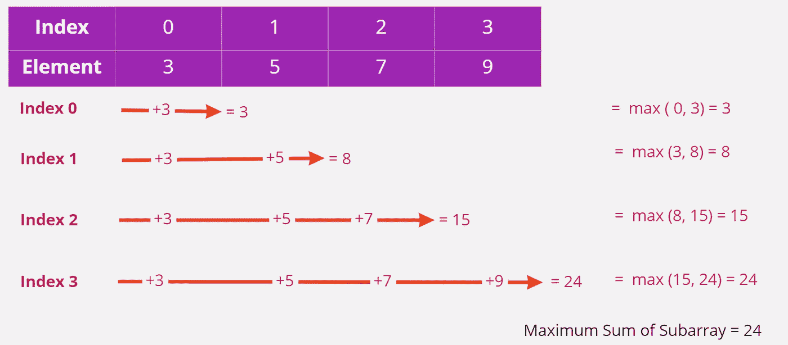
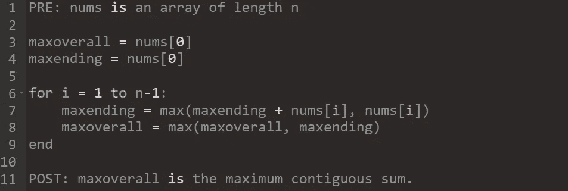

# 卡丹算法——识别模式

> 原文：<https://itnext.io/kadanes-algorithm-identify-pattern-12d96ea3de24?source=collection_archive---------1----------------------->

# 介绍

卡丹的算法是解决 **O(n)** 中问题的一种不可靠的方法。基本的推论是基于动态规划的概念。在动态编程中，思想是在通过一个过程迭代时尽可能多地使用以前的学习。每当最大子阵列问题的名称出现时，就会使用 Kadane 的算法。它遍历给定的数组 *arr[1…从左到右。在第 I 步中，它计算结束于 *i* 的具有最大和的子阵列。*

> 将 **Mi** 定义为结束于索引 **i** 且包含索引**0****≤I≤n1**的最大连续和。然后我们有 **M0 = A[0]** 和**Mi = max(Mi 1+A[I]，A[i])** 。



图 1:使用 Kadane 算法的子阵列的最大和

## 伪代码



图 Kadane 算法的伪代码

## 识别 Kadane 问题的关键字或术语

以下关键词或术语将会出现或需要从给定的问题陈述中识别:

*   连续子阵列
*   最大子阵列
*   连续递增子阵列
*   子序列和

示例:

*求邻接子阵列的最大和。*

# 基于 Kadane 算法的问题及解决方案

使用 Kadane 算法可以解决许多问题。

## 最大子阵列/最大连续子阵列总和

给定一个整数数组，找到具有最大和的连续子数组(至少包含一个数字)，并返回其和*。*

一个**子数组**是一个数组的**连续**部分。

```
**Input:** nums = [-2,1,-3,4,-1,2,1,-5,4]
**Output:** 6
**Explanation:** [4,-1,2,1] has the largest sum = 6.
```

**解决方案**

```
def getLargestSum(nums):
    maxSoFar = float('-inf')
    maxEndingHere = 0

    for i in range(len(nums)):
        maxEndingHere += nums[i]

        if (maxSoFar < maxEndingHere):
            maxSoFar = maxEndingHere

        if (maxEndingHere < 0):
            maxEndingHere = 0

    return maxSoFar# Executionnums = [-2,1,-3,4,-1,2,1,-5,4]
getLargestSum(nums)
```

## 二进制字符串中 0 和 1 的最大差值

给定一个二进制串**0**和**1**。任务是找出在**0**的数目和 1 的数目之间具有最大差值的子串的长度(0 的数目**0 的数目**—1 的数目)。在所有**1**打印-1 的情况下。

```
**Input :** S = "11000010001"
**Output :** 6
From index 2 to index 9, there are 7
0s and 1 1s, so number of 0s - number
of 1s is 6.
```

**解决方案**

```
def getMaxDifference(s):
    maxSoFar = float('-inf')
    maxEndingHere = 0

    for i in range(len(s)):
        if s[i] == '0':
            maxEndingHere += 1
        else:
            maxEndingHere -= 1

        if maxSoFar < maxEndingHere:
            maxSoFar = maxEndingHere

        if maxEndingHere < 0:
            maxEndingHere = 0

    return maxSoFars = "11000010001"
getMaxDifference(s)
```

## 最大和圆形子阵列

给定一个长度为`n`的**循环整数数组** `nums`，返回*一个非空* ***子数组****`nums`的最大可能和。*

一个**循环数组**意味着数组的末尾连接到数组的开头。形式上，`nums[i]`的下一个元素是`nums[(i + 1) % n]`,`nums[i]`的前一个元素是`nums[(i - 1 + n) % n]`。

一个**子数组**最多只能包含一次固定缓存`nums`的每个元素。形式上，对于一个子阵`nums[i], nums[i + 1], ..., nums[j]`，不存在`i <= k1`、`k2 <= j`与`k1 % n == k2 % n`。

```
**Input:** nums = [1,-2,3,-2]
**Output:** 3
**Explanation:** Subarray [3] has maximum sum 3.
```

**解决方案**

```
class Solution(object):
    def maxSubarraySumCircular(self, nums):
        """
        :type nums: List[int]
        :rtype: int
        """
        n = len(nums)
        if n == 0:
            return 0

        # If the list contains all negative values, return the maximum element
        maximum = max(nums)
        if maximum < 0:
            return maximum

        # Make all elements negative in the list
        for i in range(len(nums)):
            nums[i] = -nums[i]

        negativeMaxSum = self.kadane(nums)

        # Restore the list
        for i in range(len(nums)):
            nums[i] = -nums[i]

        return max(self.kadane(nums), sum(nums) + negativeMaxSum)

    def kadane(self, nums):
        maxSoFar = 0
        maxEndingHere = 0

        for i in range(len(nums)):
            maxEndingHere += nums[i]

            if maxSoFar < maxEndingHere:
                maxSoFar = maxEndingHere

            if maxEndingHere  < 0:
                maxEndingHere = 0

        return maxSoFar
```

## 最小和连续子阵列

给定包含 **n** 个整数的数组。问题是找到具有最小和的相邻子阵列的元素的和。

```
**Input** : nums = [3, -4, 2, -3, -1, 7, -5]
**Output** : -6**Explanation:**
Subarray is [**-4, 2, -3, -1]** = -6
```

**解决方案**

```
def getSmallestSum(nums):
    minEndingHere = float('inf')
    minSoFar = float('inf')

    for i in range(len(nums)):
        if minEndingHere <= 0:
            minEndingHere += nums[i]
        else:
            minEndingHere = nums[i]

        if minSoFar > minEndingHere:
            minSoFar = minEndingHere

    return minSoFar# Execution
nums = [3, -4, 2, -3, -1, 7, -5]
getSmallestSum(nums)
```

## 最大和连续递增子阵列

给定 n 个正整数的数组。问题是在 O(n)时间复杂度内找到一个连续递增子阵列的最大和。

```
**Input** : nums = [2, 1, 4, 7, 3, 6]
**Output** : 12**Explanation:**
Contiguous Increasing subarray [1, 4, 7] = 12
```

**解决方案**

```
def getLargestSum(nums):
    n = len(nums)
    maxSoFar = float('-inf')
    maxEndingHere = 0

    for i in range(n):
        maxEndingHere = nums[i]

        while ((i + 1) < n and (nums[i+1] > nums[i])):
            maxEndingHere += nums[i+1]
            i += 1

        if maxEndingHere > maxSoFar:
            maxSoFar = maxEndingHere

    return maxSoFar# Execution
nums = [1, 1, 4, 7, 3, 6]
getLargestSum(nums)
```

## 最大乘积子阵列

给定一个整数数组，在数组中找到一个具有最大乘积的连续非空子数组，并返回乘积*。*

测试用例的生成是为了让答案符合一个 32 位的整数。

一个**子数组**是该数组的一个连续子序列。

```
**Input:** nums = [2,3,-2,4]
**Output:** 6
**Explanation:** [2,3] has the largest product 6.
```

**解决方案**

```
class Solution(object):
    def maxProduct(self, nums):
        """
        :type nums: List[int]
        :rtype: int
        """
        maxVal = 1
        minVal = 1
        maxProd = float('-inf')

        for n in nums:
            maxVal, minVal = max(maxVal * n, minVal * n, n), min(minVal * n, maxVal * n, n)
            maxProd = max(maxProd, maxVal, minVal) 

        return maxProd
```

## 只有非负元素的最大和连续子阵列

给定一个整数数组，任务是找到非负元素的最大和连续子数组，并返回其和。

```
**Input:** nums = [1, 4, -3, 9, 5, -6]
**Output:** 14 
**Explanation:** 
Subarray [9, 5] is the subarray having maximum sum with all non-negative elements.
```

**解决方案**

```
def getLargestSum(nums):
    n = len(nums)
    maxSoFar = float('-inf')
    maxEndingHere = 0
    s = 0

    for i in range(n):
        if nums[i] < 0:
            maxEndingHere = 0
        else:
            maxEndingHere += nums[i]

        if maxSoFar < maxEndingHere:
            maxSoFar = maxEndingHere

    return maxSoFar# Execute
nums = [1, 4, -3, 9, 5, -6]
getLargestSum(nums)
```

## 具有唯一元素的最大和连续子阵列

给定一个由 **N** 个正整数组成的数组，任务是在所有具有唯一元素的子数组中找出具有最大和的子数组，并打印其和。

```
**Input** nums = [1, 2, 3, 3, 4, 5, 2, 1]
**Output:** 15
**Explanation:**
The subarray having maximum sum with distinct element is [3, 4, 5, 2, 1].
Therefore, sum is = 3 + 4 + 5 + 2 + 1 = 15
```

**解决方案**

```
def getLargestSum(nums):
    d = {}
    maxSoFar = float('-inf')
    maxEndingHere = 0

    for i in range(len(nums)):
        if nums[i] not in d:
            maxEndingHere += nums[i]
            d[nums[i]] = 1

            if maxEndingHere > maxSoFar:
                maxSoFar = maxEndingHere

            if maxEndingHere < 0:
                maxEndingHere = 0

    return maxSoFar# Executionnums = [ 1, 2, 3, 1, 5 ]
getLargestSum(nums)
```

## 最大交替子序列和

一个 **0 索引**数组的**交替和**被定义为在**偶数**索引**处元素的**和**减去在**奇数**索引处元素的**和**。**

*   比如`[4,2,5,3]`的交替和是`(4 + 5) - (2 + 3) = 4`。

给定一个数组`nums`，返回 `nums` *任意子序列的* ***最大交替和*** *(在* ***之后重新索引*** *子序列的元素)*。

数组的**子序列**是通过删除一些元素(可能一个都没有)而不改变剩余元素的相对顺序，从原始数组生成的新数组。例如，`[2,7,4]`是`[4,2,3,7,2,1,4]`(带下划线的元素)的子序列，而`[2,4,2]`不是。

```
**Input:** nums = [4,2,5,3]
**Output:** 7
**Explanation:** It is optimal to choose the subsequence [4,2,5] with alternating sum (4 + 5) - 2 = 7.
```

**解决方案**

```
class Solution(object):
    def maxAlternatingSum(self, nums):
        """
        :type nums: List[int]
        :rtype: int
        """
        dpEven, dpOdd = 0, -float('inf')                                                                 
        for num in nums:
            dpEven, dpOdd = max(dpEven, dpOdd-num), max(dpOdd, dpEven+num, num)                          
        return max(dpEven, dpOdd)
```

## 买卖股票的最佳时机

给你一个数组`prices`，其中`prices[i]`是给定股票在`ith`日的价格。

你想通过选择一个**单日**买入一只股票，并选择未来的**不同日**卖出该股票，从而实现利润最大化。

返回*你从这笔交易中可以获得的最大利润*。如果你不能获得任何利润，返回`0`。

```
**Input:** prices = [7,1,5,3,6,4]
**Output:** 5**Explanation:** Buy on day 2 (price = 1) and sell on day 5 (price = 6), profit = 6-1 = 5.
Note that buying on day 2 and selling on day 1 is not allowed because you must buy before you sell.
```

**解决方案**

```
class Solution(object):
    def maxProfit(self, prices):
        """
        :type prices: List[int]
        :rtype: int
        """
        maxSoFar = 0
        maxEndingHere = 0

        for i in range(1, len(prices)):
            maxEndingHere += prices[i] - prices[i-1]

            if maxEndingHere < 0:
                maxEndingHere = 0

            if maxSoFar < maxEndingHere:
                maxSoFar = maxEndingHere

        return maxSoFar
```

## 递增元素之间的最大差异

给定一个大小为`n`的 **0 索引的**整数数组`nums`，求`nums[i]`和`nums[j]`(即`nums[j] - nums[i]`)之间的**最大差值**，使得`0 <= i < j < n`和`nums[i] < nums[j]`。

返回****最大差值*** *。*如果没有此`i`和`j`则返回`-1`。*

```
***Input:** nums = [7,**1**,**5**,4]
**Output:** 4
**Explanation:**
The maximum difference occurs with i = 1 and j = 2, nums[j] - nums[i] = 5 - 1 = 4.
Note that with i = 1 and j = 0, the difference nums[j] - nums[i] = 7 - 1 = 6, but i > j, so it is not valid.*
```

***解决方案***

```
*class Solution(object):
    def maximumDifference(self, nums):
        """
        :type nums: List[int]
        :rtype: int
        """
        numSoFar = nums[0]
        maxDifference = 0

        for i in range(1, len(nums)):
            maxDifference = max(maxDifference, nums[i] - numSoFar)
            numSoFar = min(numSoFar, nums[i])

        if maxDifference == 0:
            return -1

        return maxDifference*
```

# *时间复杂度*

*Kadane 的算法在 **O(n)** 时间内解决问题。如果不使用 Kadane 的算法来解决这类问题，那么它的复杂度将是 **O(n 的平方)。***

# *结论*

*Kadane 的算法是一种迭代动态规划算法。它通过使用在先前位置的最大和子阵列结束来计算在特定位置的最大和子阵列结束。*