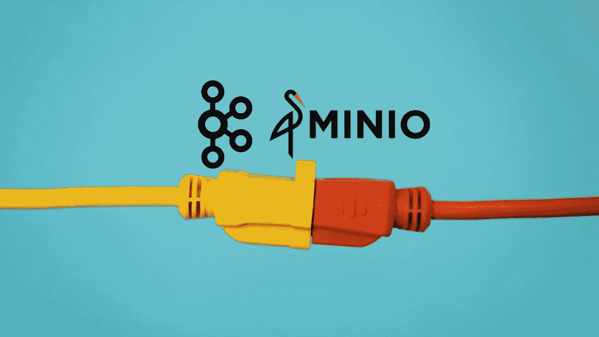
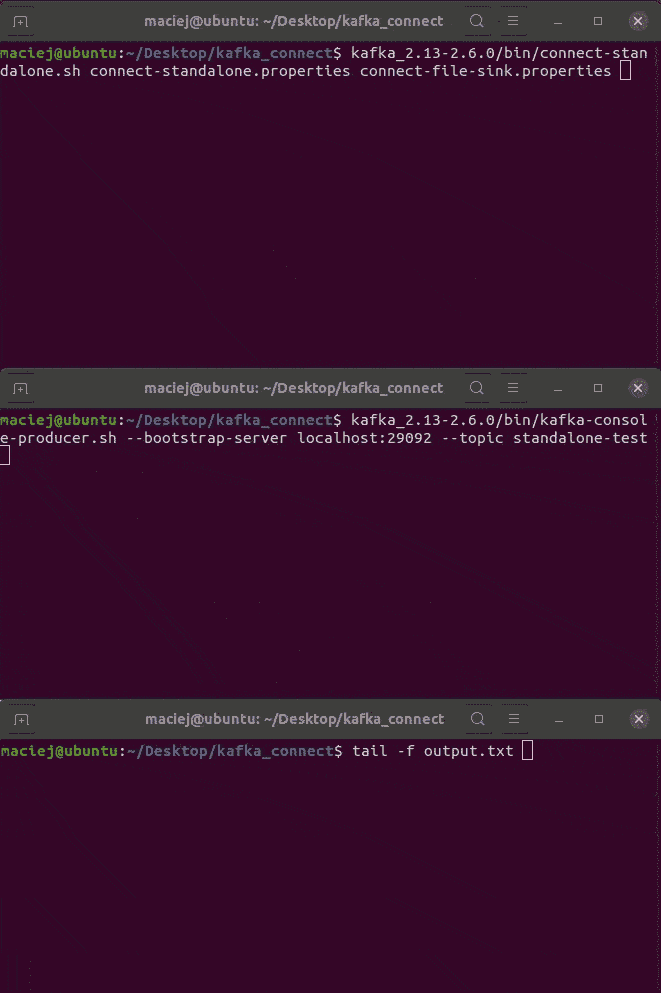
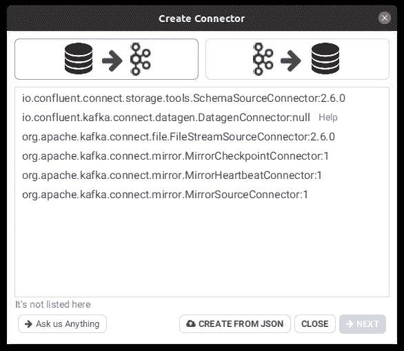
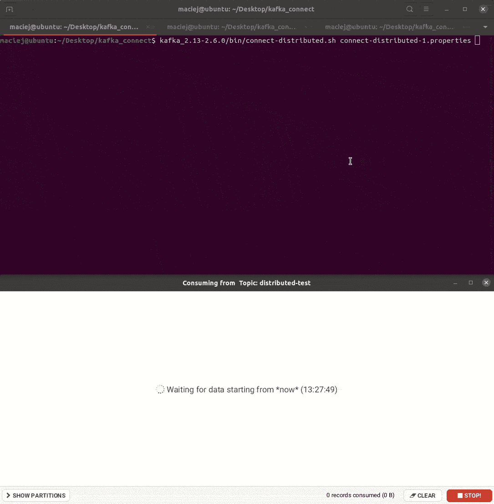
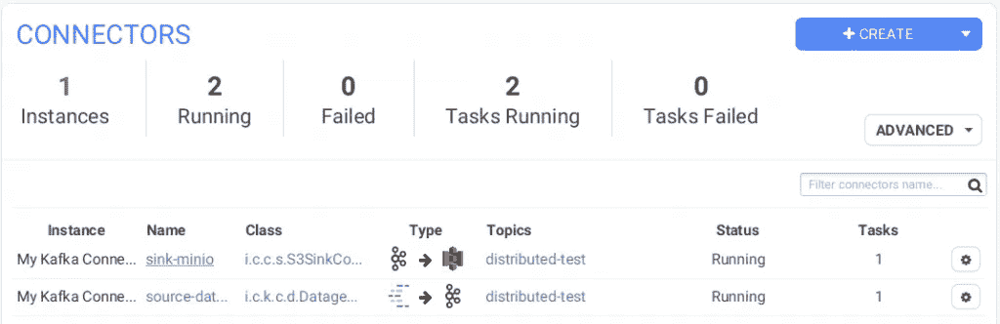
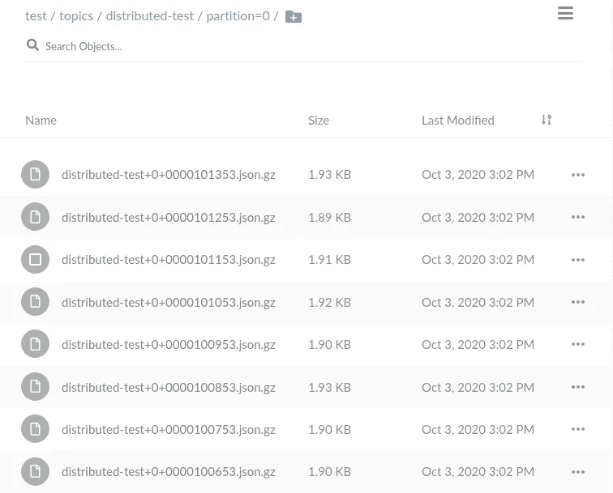
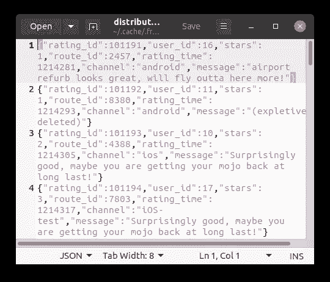

# 卡夫卡《一言以蔽之》

> 原文：<https://itnext.io/kafka-connect-in-a-nutshell-e0a0f57e7cdb?source=collection_archive---------0----------------------->



Kafka Connect 是 Apache Kafka 平台的一部分。它用于连接 Kafka 与外部服务，如文件系统和数据库。在这个故事中，你将学习它解决什么问题以及如何运行它。

# 为什么卡夫卡连接？

Apache Kafka 用于微服务架构、日志聚合、变更数据捕获(CDC)、集成、流平台和数据采集层到数据湖。无论你用 Kafka 做什么，数据都是从**源**流向**接收器**。

需要**时间**和**知识**才能**恰当地**实现一个卡夫卡式的消费者或生产者。关键是输入和输出经常重复。许多公司将卡夫卡的数据转移到 HDFS/S3 和 Elasticsearch。如果我们可以用一个尺寸适合所有人的实现会怎么样？

**没有重新发明轮子的意义**。Kafka Connect 解决了这个问题。它是一个连接卡夫卡和外部组件的平台。我们可以用**连接器**配置输入和输出。它可以独立运行，也可以分布式运行。因此，我们拥有了可扩展的容错平台。

# 可供选择的事物

我想到的替代方案是:

*   [阿帕奇 goblin](https://gobblin.apache.org/)
*   [日志存储](https://www.elastic.co/logstash)
*   [流动的](https://www.fluentd.org/)
*   阿帕奇尼菲

# 连接器

连接器可在[汇流毂](https://www.confluent.io/hub/)网站上找到。它们既可以免费获得，也可以付费获得，可以在合流平台中获得。例如:Cassandra 连接器有一个[付费版本](https://www.confluent.io/hub/confluentinc/kafka-connect-cassandra)(来自 Confluent)，但也有一个[免费版本](https://www.confluent.io/hub/datastax/kafka-connect-cassandra-sink)来自 DataStax。如果您没有找到现成的解决方案，您可以[自行实施连接器](https://docs.confluent.io/current/connect/devguide.html)。

# 环境

在这种情况下，Kafka、Zookeeper 和 Minio 将在 Docker 上运行。Kafka Connect 将在主机上运行。它是 Apache Kafka 的一部分，所以只需下载并解压二进制文件。Conduktor 是一个非常方便的 GUI Kafka 工具。

```
version: '2'

services:
  zookeeper:
    image: 'bitnami/zookeeper:3'
    ports:
      - '2181:2181'
    volumes:
      - 'zookeeper_data:/bitnami'
    environment:
      - ALLOW_ANONYMOUS_LOGIN=yes

  kafka:
    image: 'bitnami/kafka:2'
    ports:
      - '9092:9092'
      - '29092:29092'
    volumes:
      - 'kafka_data:/bitnami'
    environment:
      - KAFKA_CFG_ZOOKEEPER_CONNECT=zookeeper:2181
      - ALLOW_PLAINTEXT_LISTENER=yes
      - KAFKA_CFG_LISTENERS=PLAINTEXT://:9092,PLAINTEXT_HOST://:29092
      - KAFKA_CFG_LISTENER_SECURITY_PROTOCOL_MAP=PLAINTEXT:PLAINTEXT,PLAINTEXT_HOST:PLAINTEXT
      - KAFKA_CFG_ADVERTISED_LISTENERS=PLAINTEXT://kafka:9092,PLAINTEXT_HOST://localhost:29092
    depends_on:
      - zookeeper

  minio:
    image: 'bitnami/minio:latest'
    ports:
      - '9000:9000'
    environment:
      - MINIO_ACCESS_KEY=minio-access-key
      - MINIO_SECRET_KEY=minio-secret-key

volumes:
  zookeeper_data:
    driver: local
  kafka_data:
    driver: local
```

# 独立模式—写入文件

Apache Connect 可以以两种模式运行:独立模式和分布式模式。第一个用于测试和开发。要运行它，你需要配置文件。

```
bootstrap.servers=localhost:29092

key.converter=org.apache.kafka.connect.storage.StringConverter
value.converter=org.apache.kafka.connect.storage.StringConverter

offset.storage.file.filename=/tmp/connect.offsets
```

键和值转换器定义了 Kafka 读写数据的格式。

```
name=standalone-file-sink
connector.class=FileStreamSink
tasks.max=1
file=output.txt
topics=standalone-test
```

这些领域似乎很明显。行刑的 GIF 下面。

```
kafka_2.13-2.6.0/bin/connect-standalone.sh connect-standalone.properties connect-file-sink.properties
```



# 分布式模式

这种模式提供了可伸缩性和容错能力。你只需要用同一个 group.id 运行多个 workers，任务编排是平台自己提供的。在 DataGen 示例中，您将看到当您杀死一个工人时 Kafka Connect 的行为。下面是其中一个工人的配置文件。

```
bootstrap.servers=localhost:29092
group.id=connect-cluster
key.converter=org.apache.kafka.connect.json.JsonConverter
value.converter=org.apache.kafka.connect.json.JsonConverter

key.converter.schemas.enable=false
value.converter.schemas.enable=false

offset.storage.topic=connect-offsets
offset.storage.replication.factor=1

config.storage.topic=connect-configs
config.storage.replication.factor=1

status.storage.topic=connect-status
status.storage.replication.factor=1

#rest.host.name=
rest.port=8083

plugin.path=/tmp/plugins/
```

*   group.id =像消费者组一样工作。集群中的工作线程必须具有相同的 group.id。
*   Kafka Connect 将数据保存在… Kafka。您必须指出主题的名称和预期的复制因子。
*   我们将连接器放入 plugin.path 提供的目录中。所有工人都应该可以访问相同的连接器。

我们要做的就是运行 Kafka Connect

```
kafka_2.13-2.6.0/bin/connect-distributed.sh connect-distributed-1.properties
```

## 数据生成—数据生成源

我们将使用 Kafka Connect Datagen。它是生成数据的连接器。这对于一些概念验证是有用的。只需下载它，解压并放入 plugin.path 中给出的目录。

Kafka Connect 中的任务是使用 REST API 运行的。首先，您需要准备连接器的配置。

```
{
    "connector.class": "io.confluent.kafka.connect.datagen.DatagenConnector",
    "kafka.topic": "distributed-test",
    "quickstart": "ratings",
    "key.converter": "org.apache.kafka.connect.storage.StringConverter",
    "value.converter": "org.apache.kafka.connect.json.JsonConverter",
    "max.interval": 100,
    "tasks.max": "1"
}
```

然后将其发送到…/connectors/name/config URL

```
curl -X PUT -H 'Content-Type:application/json' http://localhost:8083/connectors/source-datagen/config -d @connect-datagen-source.json
```

但是我们也可以使用其他工具，例如[导管](https://www.conduktor.io/)。



下面你可以看到我运行 Datagen 连接器，然后启动和停止 Kafka Connect workers 的 GIF。



## 将数据移出— AWS S3 接收器(MinIO)

数据已经生成，让我们继续将它发送到其他系统。最初我想在这里使用 Elasticsearch Sink，但我无法回避卡夫卡图书馆缺乏番石榴的问题。你可以在这里找到 AWS S3 连接器。与 Datagen 相同的步骤。

```
{
    "name":"sink-minio",
    "connector.class":"io.confluent.connect.s3.S3SinkConnector",
    "tasks.max":"1",
    "topics":"distributed-test",
    "s3.bucket.name":"test",
    "s3.part.size":"5242880",
    "s3.compression.type":"gzip",
    "flush.size":"100",
    "aws.secret.access.key": "minio-secret-key",
    "aws.access.key.id": "minio-access-key",
    "store.url":"http://localhost:9000",
    "value.converter": "org.apache.kafka.connect.json.JsonConverter",
    "format.class": "io.confluent.connect.s3.format.json.JsonFormat",
    "storage.class": "io.confluent.connect.s3.storage.S3Storage",
    "schema.compatibility": "NONE",
    "schemas.enable":false
}
```

*   store.url 用 MinIO 指向本地容器
*   flush.size —将包含在一个包中的记录数
*   s3.compression.type —每个包都将被压缩(或不被压缩)
*   value.converter 记录可以是特定的格式。这里我们用 JSON。

```
curl -X PUT -H 'Content-Type:application/json' http://localhost:8083/connectors/sink-minio/config -d @connect-minio-sink.json
```



MinIO 任务已添加。我们可以检查数据是否真的进入了桶中。



# 摘要

如果数据是直接往返于 Kafka，Kafka Connect 可能是个不错的选择。对于更高级的操作，我更倾向于在流环境中看到解决方案，如 Logstash 或 Spark 结构化流。

# 被卖方收回的汽车

[https://github . com/zorteran/wia dro-dany ch-Kafka-connect-null](https://github.com/zorteran/wiadro-danych-kafka-connect-nutshell)