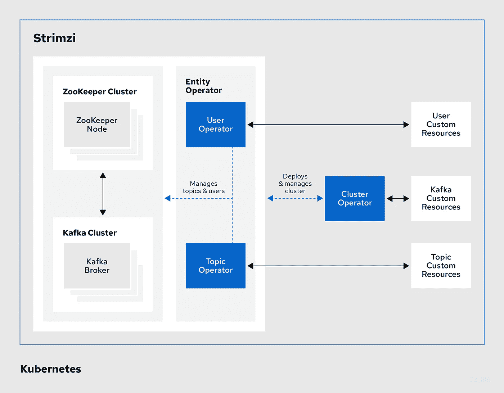

# Kafka Connect on Kubernetes，简单的方法！

> 原文：<https://itnext.io/kafka-connect-on-kubernetes-the-easy-way-b5b617b7d5e9?source=collection_archive---------0----------------------->

这是一个教程，通过一个例子展示了如何在 Kubernetes 上使用`[Strimzi](https://strimzi.io/)`设置和使用 [Kafka Connect](https://kafka.apache.org/documentation/#connect) 。

Kafka Connect 是一个工具，使用源和接收器连接器在 Apache Kafka 和其他系统之间可伸缩和可靠地传输数据。虽然在 Kubernetes 上部署一个 Kafka Connect 集群并不太难([只需“DIY”！](https://en.wikipedia.org/wiki/Do_it_yourself))，我喜欢的是，`Strimzi`在[自定义资源定义](https://kubernetes.io/docs/concepts/extend-kubernetes/api-extension/custom-resources/)的帮助下，使用[操作符模式](https://kubernetes.io/docs/concepts/extend-kubernetes/operator/)实现了一种 Kubernetes 本地的方式。

> 除了引导/安装 Kafka Connect 之外，这也适用于扩展 Connect 集群、部署和管理连接器等操作。(在这篇博客的过程中，你会看到这一点)

我们将经历在 Kubernetes 上部署 Kafka Connect 集群、安装连接器和测试的过程——所有这些都使用了`kubectl`和一些`YAML`(当然！).我将使用 [Azure Event Hubs](https://docs.microsoft.com/azure/event-hubs/?WT.mc_id=medium-blog-abhishgu) 作为 Kafka broker，使用 [Azure Kubernetes Service](https://docs.microsoft.com/azure/aks/?WT.mc_id=medium-blog-abhishgu) 作为 Kubernetes 集群——请随意使用其他替代方案(例如，在您的笔记本电脑上使用本地`minikube`集群)

> *GitHub*上所有的 [*神器都有*](https://github.com/abhirockzz/strimzi-kafka-connect-eventhubs)

`Strimzi`负责所有的重物搬运..如果你还不知道，这里有一个要点

# Strimzi 概述

> Strimzi 文档很详细，但组织得很好，也很清晰！以下段落的大部分内容直接取自文件


`Strimzi`简化在 Kubernetes 集群中运行 Apache Kafka 的过程。它提供了在 Kubernetes 上运行 Kafka 的容器映像和操作符。它是作为`[Sandbox](https://www.cncf.io/sandbox-projects/)` [项目](https://www.cncf.io/sandbox-projects/)`[Cloud Native Computing Foundation](https://strimzi.io/blog/2019/09/06/cncf/)`的一个[部分(在撰写本文时)](https://strimzi.io/blog/2019/09/06/cncf/)

`Strimzi Operators`是项目的基础。这些操作人员具有专业的操作知识，能够有效地管理 Kafka。运营商简化了以下过程:部署和运行 Kafka 集群和组件，配置和保护对 Kafka 的访问，升级和管理 Kafka，甚至负责管理主题和用户。

以下是对操作员角色的 10，000 英尺概述:



> 在这篇文章中，我不打算深入讨论使用 Strimzi 部署 Kafka 的细节——这可能是我将在未来的博客中处理的事情

# 先决条件

https://kubernetes.io/docs/tasks/tools/install-kubectl/`kubectl`-

如果你选择使用 Azure Event Hubs、Azure Kubernetes 服务(或者两者都用)，你将需要一个[微软 Azure 账户](https://docs.microsoft.com/azure/?WT.mc_id=medium-blog-abhishgu)。去吧[报名免费一个！](https://azure.microsoft.com/free/?WT.mc_id=medium-blog-abhishgu)

`Azure CLI`或`Azure Cloud Shell` -如果你还没有安装 [Azure CLI](https://docs.microsoft.com/cli/azure/install-azure-cli?view=azure-cli-latest&WT.mc_id=medium-blog-abhishgu) ，你可以选择安装它(应该很快！)或者直接从你的浏览器使用 [Azure 云壳](https://azure.microsoft.com/features/cloud-shell/?WT.mc_id=medium-blog-abhishgu)。

## 舵

我将使用`Helm`来安装`Strimzi`。这里是安装【https://helm.sh/docs/intro/install/】[`Helm`本身的文档](https://helm.sh/docs/intro/install/)

> 你也可以使用`YAML`文件直接安装`Strimzi`。点击此处查看快速入门指南-[https://strim zi . io/docs/quick start/latest/# proc-install-product-str](https://strimzi.io/docs/quickstart/latest/#proc-install-product-str)

让我们从设置所需的 Azure 服务开始(如果您没有使用 Azure，请跳过这一部分，但请确保您有 Kafka 集群的详细信息，即代理 URL 和身份验证凭据，如果适用)

> 我建议将下面的服务作为单个 [Azure 资源组](https://docs.microsoft.com/azure/azure-resource-manager/management/overview?WT.mc_id=medium-blog-abhishgu#resource-groups)的一部分安装，这样可以很容易地清理这些服务

## Azure 活动中心

[Azure Event Hubs](https://docs.microsoft.com/azure/event-hubs/event-hubs-about?%5BWT.mc_id=medium-blog-abhishgu) 是一个数据流平台和事件摄取服务。它每秒可以接收和处理数百万个事件。[它还提供了一个 Kafka 端点](https://docs.microsoft.com/azure/event-hubs/event-hubs-for-kafka-ecosystem-overview?WT.mc_id=medium-blog-abhishgu)，现有的基于 Kafka 的应用程序可以使用它作为运行自己的 Kafka 集群的替代方案。Event Hubs 支持 Apache Kafka protocol 1.0 和更高版本，并与 Kafka 生态系统中现有的 Kafka 客户端应用程序和其他工具配合使用，包括`Kafka Connect`(在本博客中演示过)、`MirrorMaker`等。

要设置 Azure Event Hubs 集群，你可以从各种选项中进行选择，包括[Azure 门户](https://docs.microsoft.com/azure/event-hubs/event-hubs-create?WT.mc_id=medium-blog-abhishgu)、 [Azure CLI](https://docs.microsoft.com/azure/event-hubs/event-hubs-quickstart-cli?WT.mc_id=medium-blog-abhishgu) 、 [Azure PowerShell](https://docs.microsoft.com/azure/event-hubs/event-hubs-quickstart-powershell?WT.mc_id=medium-blog-abhishgu) 或[ARM 模板](https://docs.microsoft.com/azure/event-hubs/event-hubs-resource-manager-namespace-event-hub?WT.mc_id=medium-blog-abhishgu)。一旦设置完成，您将需要连接字符串(将在后续步骤中使用)用于[认证到事件中心](https://docs.microsoft.com/azure/event-hubs/authenticate-shared-access-signature?WT.mc_id=medium-blog-abhishgu) — [使用本指南](https://docs.microsoft.com/azure/event-hubs/event-hubs-get-connection-string?WT.mc_id=medium-blog-abhishgu)完成此步骤。

> *请确保您还创建了一个事件中心(与 Kafka 主题相同),作为我们 Kafka Connect 连接器的目标(详情见后续章节)*

## 蓝色库伯内特服务

[Azure Kubernetes 服务(AKS)](https://docs.microsoft.com/azure/aks/intro-kubernetes?WT.mc_id=medium-blog-abhishgu) 让在 Azure 中部署托管的 Kubernetes 集群变得简单。它通过将大部分责任转移给 Azure，降低了管理 Kubernetes 的复杂性和运营开销。以下是如何使用 [Azure CLI](https://docs.microsoft.com/azure/aks/kubernetes-walkthrough?WT.mc_id=medium-blog-abhishgu) 、 [Azure portal](https://docs.microsoft.com/azure/aks/kubernetes-walkthrough-portal?WT.mc_id=medium-blog-abhishgu) 或 [ARM 模板](https://docs.microsoft.com/azure/aks/kubernetes-walkthrough-rm-template?WT.mc_id=medium-blog-abhishgu)设置 AKS 集群的示例

# 基础安装

首先，我们将安装`Strimzi`和 Kafka Connect，然后是文件流源连接器

## 安装 Strimzi

使用`Helm`安装 Strimzi 非常简单:

```
//add helm chart repo for Strimzi
helm repo add strimzi https://strimzi.io/charts///install it! (I have used strimzi-kafka as the release name)
helm install strimzi-kafka strimzi/strimzi-kafka-operator
```

这将安装`Strimzi`操作符(它只是一个`Deployment`)、自定义资源定义和其他 Kubernetes 组件，如`Cluster Roles`、`Cluster Role Bindings`和`Service Accounts`

更多详情，请点击此链接

> *删除，只需*

为了确认 Strimzi 操作器已经被部署，检查它的`Pod`(它应该在一段时间后转换到`Running`状态)

```
kubectl get pods -l=name=strimzi-cluster-operatorNAME                                        READY   STATUS    RESTARTS   AGE
strimzi-cluster-operator-5c66f679d5-69rgk   1/1     Running   0          43s
```

还要检查自定义资源定义:

```
kubectl get crd | grep strimzikafkabridges.kafka.strimzi.io           2020-04-13T16:49:36Z
kafkaconnectors.kafka.strimzi.io        2020-04-13T16:49:33Z
kafkaconnects.kafka.strimzi.io          2020-04-13T16:49:36Z
kafkaconnects2is.kafka.strimzi.io       2020-04-13T16:49:38Z
kafkamirrormaker2s.kafka.strimzi.io     2020-04-13T16:49:37Z
kafkamirrormakers.kafka.strimzi.io      2020-04-13T16:49:39Z
kafkas.kafka.strimzi.io                 2020-04-13T16:49:40Z
kafkatopics.kafka.strimzi.io            2020-04-13T16:49:34Z
kafkausers.kafka.strimzi.io             2020-04-13T16:49:33Z
```

我想叫出代表 Kubernetes 中卡夫卡集群的`kafkas.kafka.strimzi.io`。我们将重点关注分别代表 Kafka Connect 集群和连接器的`kafkaconnects.kafka.strimzi.io`和`kafkaconnectors.kafka.strimzi.io`。

> *我将跳过其他组件，但您可以从中找出，例如集群角色* `*kubectl get clusterrole | grep strimzi*`

现在我们有了“大脑”(Strimzi 操作符)，让我们使用它吧！

# 卡夫卡连接

在部署 Kafka Connect 本身之前，我们需要创建一些 helper Kubernetes 组件。

在继续之前，克隆 [GitHub 项目](https://github.com/abhirockzz/strimzi-kafka-connect-eventhubs)

```
git clone https://github.com/abhirockzz/strimzi-kafka-connect-eventhubs
cd strimzi-kafka-connect-eventhubs
```

Kafka Connect 将需要引用现有的 Kafka 集群(在本例中是 Azure Event Hubs)。我们可以将集群的认证信息存储为一个 [Kubernetes](https://kubernetes.io/docs/concepts/configuration/secret/) `[Secret](https://kubernetes.io/docs/concepts/configuration/secret/)`，稍后可以在 Kafka Connect 定义中使用。

更新`eventhubs-secret.yaml`文件以包含 Azure 事件中心的凭证。在`eventhubspassword`属性中输入连接字符串。

例如

```
apiVersion: v1
kind: Secret
metadata:
  name: eventhubssecret
type: Opaque
stringData:
  eventhubsuser: $ConnectionString
  eventhubspassword: Endpoint=sb://<eventhubs-namespace>.servicebus.windows.net/;SharedAccessKeyName=RootManageSharedAccessKey;SharedAccessKey=<access-key>
```

> *保持* `*eventhubsuser: $ConnectionString*` *不变*

创建`Secret`:

```
kubectl apply -f eventhubs-secret.yaml
```

默认情况下，Kafka Connect 被配置为向`stdout`发送日志。我们将使用一个定制配置(`log4j`)来确保日志被存储到`/tmp/connect-worker.log`(除了`stdout`)——您马上就会明白为什么要这样做

> *配置本身存储在*T4 中

日志配置可以存储在`ConfigMap`中，稍后 Kafka Connect 定义将引用该配置。详情请查看[https://strim zi . io/docs/latest/# con-Kafka-connect-logging-deployment-configuration-Kafka-connect](https://strimzi.io/docs/latest/#con-kafka-connect-logging-deployment-configuration-kafka-connect)

```
kubectl create configmap connect-logging-configmap --from-file=log4j.properties
```

在我们部署 Kafka Connect 之前，让我们看看它的定义。你可以在这里看到它的全部，但我会浏览重要的部分。

注意，资源`kind`是`KafkaConnect`——它是一个定制的资源定义。另一个有趣的部分是`annotations`(我稍后会对此进行解释)

```
apiVersion: kafka.strimzi.io/v1beta1
kind: KafkaConnect
metadata:
  name: my-connect-cluster
  annotations:
    strimzi.io/use-connector-resources: "true"
```

`bootstrapServers`指向一个卡夫卡经纪人。对于 HA 群集中的节点，这可能是一个逗号分隔的值。在这种情况下，它是 Azure Event Hubs 的一个 Kafka 端点(是的，这就是你所需要的！)

```
spec:
  version: 2.4.0
  replicas: 1
  bootstrapServers: <eventhubs-namespace>.servicebus.windows.net:9093
```

`config`是一个不错的老式 Kafka Connect 配置，类似于您在`[connect-distributed.properties](https://kafka.apache.org/documentation/#connect_configuring)`中使用的配置

```
config:
    group.id: connect-cluster
    offset.storage.topic: connect-cluster-offsets
    config.storage.topic: connect-cluster-configs
    status.storage.topic: connect-cluster-status
```

认证部分简单地引用了 Kubernetes 的秘密。在本例中，我们之前创建了一个名为`eventhubssecret`的服务，它的键`eventhubspassword`包含 azure 事件中心的连接字符串

```
authentication:
    type: plain
    username: $ConnectionString
    passwordSecret:
      secretName: eventhubssecret
      password: eventhubspassword
```

这是引用带有`log4j`配置的`ConfigMap`的地方。这将自动配置 Kafka Connect 使用此配置

```
logging:
    type: external
    name: connect-logging-configmap
```

`tls`部分用于配置 TLS 证书(咄！).在事件中心的情况下，虽然我们使用`SASL`而不是`PLAINTEXT`，但是[要求您使用 SSL](https://docs.microsoft.com/azure/event-hubs/event-hubs-for-kafka-ecosystem-overview?WT.mc_id=medium-blog-abhishgu#shared-access-signature-sas) (即设置`security.protocol`为`SASL_SSL`)。我最初面对的[是这个](https://strimzi.io/docs/latest/#sasl_based_plain_authentication)的一个问题，这个问题很快就被澄清了！因此添加了这段配置:

```
tls:
    trustedCertificates: []
```

酷！我们准备创建一个 Kafka Connect 实例。在此之前，确保用 Azure Event Hubs 主机名(例如

```
spec:
  version: 2.4.0
  replicas: 1
  bootstrapServers: <replace-with-eventhubs-namespace>.servicebus.windows.net:9093
```

要创建 Kafka Connect 实例，请执行以下操作:

```
kubectl apply -f kafka-connect.yaml
```

要确认:

```
kubectl get kafkaconnectsNAME                 DESIRED REPLICAS
my-connect-cluster   1
```

这将创建一个`Deployment`和一个相应的`Pod`

```
kubectl get pod -l=strimzi.io/cluster=my-connect-clusterNAME                                          READY   STATUS    RESTARTS   AGE
my-connect-cluster-connect-5bf9db5d9f-9ttg4   1/1     Running   0          1h
```

您在 Kubernetes 拥有 Kafka Connect 集群！使用`kubectl logs <pod name>`查看日志

# 安装文件流源连接器

让我们部署一个连接器！为了简单起见，我们将使用默认情况下与 Kafka Connect 捆绑在一起的文件流源连接器。安装和管理连接器的一种常见方式是使用 Kafka Connect REST API，但是`Strimzi`提供了另一种方式。这是一种以 Kubernetes 为中心的方法，其中 Kakfa Connect 连接器由一个名为`KafkaConnector`的定制资源定义来表示。我们所需要做的就是创建/更新/删除带有连接器细节的`KafkaConnector`定义，剩下的事情由`Strimzi`来完成！

> *详见* `*Strimzi*` *文档*[*https://strim zi . io/docs/latest/# con-creating-managing-connectors-str*](https://strimzi.io/docs/latest/#con-creating-managing-connectors-str)

这里我们的连接器的定义是:

```
apiVersion: kafka.strimzi.io/v1alpha1
kind: KafkaConnector
metadata:
  name: my-source-connector
  labels:
    strimzi.io/cluster: my-connect-cluster
spec:
  class: org.apache.kafka.connect.file.FileStreamSourceConnector
  tasksMax: 2
  config:
    file: "/tmp/connect-worker.log"
    topic: strimzi
```

就像我们之前做的一样，让我们了解每个组件的含义:

```
apiVersion: kafka.strimzi.io/v1alpha1
kind: KafkaConnector
metadata:
  name: my-source-connector
```

这是一个名为`my-source-connector`的`KafkaConnector`资源(由`kind`指定)

```
labels:
    strimzi.io/cluster: my-connect-cluster
```

这就是我们提到 Kafka Connect 集群的地方——还记得上面显示的 Kafka Connect 定义中的注释吗？

```
annotations:
    strimzi.io/use-connector-resources: "true"
```

这只是“激活”了这个特性，并确保我们能够使用`KafkaConnector` CRD 部署连接器，我们只是使用`strimzi.io/cluster`标签来引用我们的`kafkaconnect`资源的名称

```
spec:
  class: org.apache.kafka.connect.file.FileStreamSourceConnector
  tasksMax: 2
  config:
    file: "/tmp/connect-worker.log"
    topic: strimzi
```

最后，在连接器规范中，我们定义了连接器的属性。注意指向`/tmp/connect-worker.log`文件的`config`属性？回想一下，我们修改了 Kafka Connect 实例，将日志推送到这个文件中。现在，我们已经配置了我们的文件源连接器来传输这个(日志)文件的内容，并将其发送到一个名为`strimzi`的 Kafka 主题。这是一个很好的演示，因为文件会不断更新，我们应该能够在目的地 Kafka 主题中看到每一行不同的消息(在 Azure Event Hubs 中)

> *我已经用了* `*strimzi*` *作为题目名称。这需要与上一节中创建的事件中心相同(在设置 Azure 事件中心时)*

为了看到这一点，让我们部署连接器

```
kubectl apply -f filestream-source-connector.yaml
```

要进行确认，只需列出连接器:

```
kubectl get kafkaconnectorsNAME                  AGE
my-source-connector   70s
```

> *您也可以安装其他连接器。实现这一点的方法之一(也是最简单的 IMO)是扩展* `*Strimzi*` *基础映像，并在其上添加所需的连接器构件。查看文档*[*https://strim zi . io/docs/latest/# using-Kafka-connect-with-plug-ins-str*](https://strimzi.io/docs/latest/#using-kafka-connect-with-plug-ins-str)

# 卡夫卡连接在行动…

首先，让我们确认 Kafka Connect 日志正在通过管道传输到预定的位置。这很重要，因为我们使用日志文件作为文件流连接器的来源。为此，我们需要窥视卡夫卡连接的内部。

```
kubectl exec -it <kafka_connect_pod_name> -- tail -f /tmp/connect-worker.log
```

要简化这一过程，只需使用下面的命令:

```
kubectl exec -it $(kubectl get pod -l=strimzi.io/cluster=my-connect-cluster -o jsonpath='{.items[0].metadata.name}') -- tail -f /tmp/connect-worker.log
```

现在，你应该看到 Kafka 连接日志…

在不同的终端窗口中，启动连接到 Azure Event Hubs 主题的消费者流程。[我使用了](https://github.com/Azure/azure-event-hubs-for-kafka/tree/master/quickstart/kafkacat) `[kafkacat](https://github.com/Azure/azure-event-hubs-for-kafka/tree/master/quickstart/kafkacat)`，但也有其他选项，如 Kafka CLI 本身的[控制台消费者](https://github.com/Azure/azure-event-hubs-for-kafka/tree/master/quickstart/kafka-cli)或使用 Java 的[编程消费者。网，围棋等。](https://docs.microsoft.com/azure/event-hubs/apache-kafka-developer-guide?WT.mc_id=medium-blog-abhishgu#quickstarts-in-github)(尽管在这种情况下可能有点矫枉过正)

您应该在这里看到相同的日志！例如

```
...
{"schema":{"type":"string","optional":false},"payload":"[2020-04-16 04:59:25,731] INFO WorkerSourceTask{id=my-source-connector-0} flushing 0 outstanding messages for offset commit (org.apache.kafka.connect.runtime.WorkerSourceTask)"}
{"schema":{"type":"string","optional":false},"payload":"[2020-04-16 04:59:25,785] INFO WorkerSourceTask{id=my-source-connector-0} Finished commitOffsets successfully in 55 ms (org.apache.kafka.connect.runtime.WorkerSourceTask)"}
...
```

> *日志本身作为* `*payload*` *的一部分被捕获，例如* `*[2020-04-16 04:59:25,785] INFO WorkerSourceTask{id=my-source-connector-0} Finished commitOffsets successfully in 55 ms (org.apache.kafka.connect.runtime.WorkerSourceTask)*`

## 管理 Kafka Connect 资源

要横向扩展 Kafka Connect，只需更新`spec`中的副本数量，例如从`1`到`2`，在本例中:

```
spec:
  version: 2.4.0
  replicas: 2
```

Appy 更新后的清单

```
kubectl apply -f kafka-connect.yaml
```

> *请确保通过更新清单而不是使用* `*kubectl scale*` *更新* `*Deployment*` *来增加副本的数量。这是因为，* `*Strimzi*` *运算符协调循环将检查* `*KafkaConnect*` *资源，发现* `*replicas*` *计数是* `*1*` *并缩放* `*Deployment*` *回*

现在应该有两个`Pods`:

```
kubectl get pod -l=strimzi.io/cluster=my-connect-cluster NAME                                          READY   STATUS    RESTARTS   AGE
my-connect-cluster-connect-5bf9db5d9f-9ttg4   1/1     Running   0          45m
my-connect-cluster-connect-5bf9db5d9f-pzn95   1/1     Running   0          1m5s
```

> `*my-connect-cluster-connect-5bf9db5d9f-pzn95*` *是新的* `*Pod*`

您可以更新连接器规格。例如，为了分配更多的任务，将`tasksMax`从`2`更新为`5`

```
...
spec:
  class: org.apache.kafka.connect.file.FileStreamSourceConnector
  tasksMax: 5
...
```

> *注意:这将重启连接器*

# 打扫

要删除连接器和 Kafka Connect 实例，请执行以下操作:

```
kubectl delete -f filestream-source-connector.yaml
kubectl delete -f kafka-connect.yaml
```

要清理 AKS 集群和 Azure 事件中心，只需删除资源组:

```
az group delete --name $AZURE_RESOURCE_GROUP --yes --no-wait
```

这篇博文到此结束！

正如我提到的，Strimzi 文档很详细，但是非常清晰，易于浏览。作为总结，除了我在文章中提到的内容之外，我还会从 Strimzi 文档中找到一些有用的参考资料:

# Strimzi 文档参考

*   配置 Kafka Connect—[https://strim zi . io/docs/latest/# proc-configuring-Kafka-Connect-deployment-configuration-Kafka-Connect](https://strimzi.io/docs/latest/#proc-configuring-kafka-connect-deployment-configuration-kafka-connect)
*   `KafkaConnect`模式[https://strimzi.io/docs/latest/#type-KafkaConnect-reference](https://strimzi.io/docs/latest/#type-KafkaConnect-reference)
*   `KafkaConnector`模式引用[https://strim zi . io/docs/latest/# type-KafkaConnector-reference](https://strimzi.io/docs/latest/#type-KafkaConnector-reference)
*   Kafka `SASL`认证配置[https://strim zi . io/docs/latest/# sasl _ based _ plain _ authentic ation](https://strimzi.io/docs/latest/#sasl_based_plain_authentication)

我希望它对您在 Kubernetes 上开始使用 Kafka Connect 很有用:)