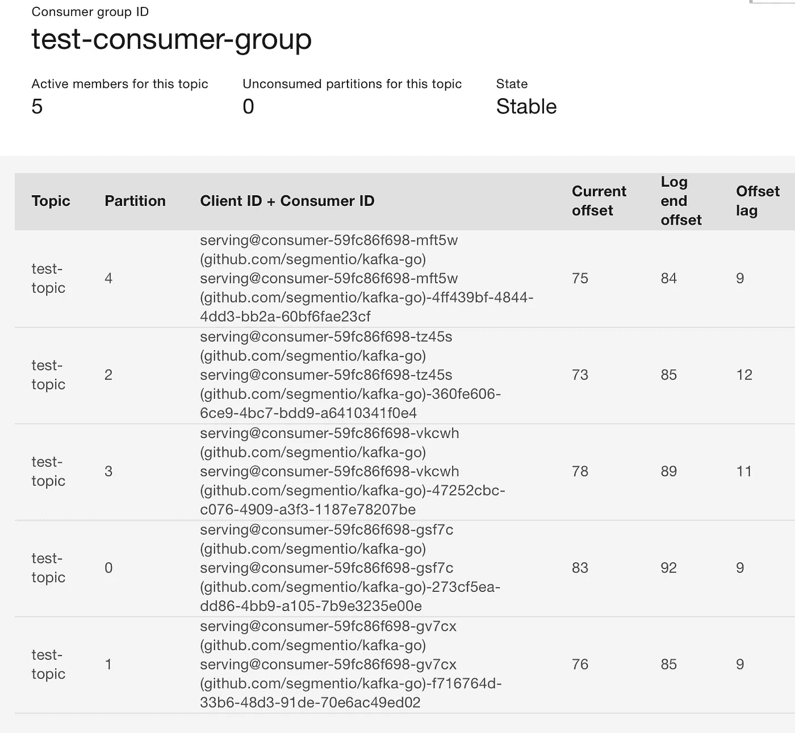
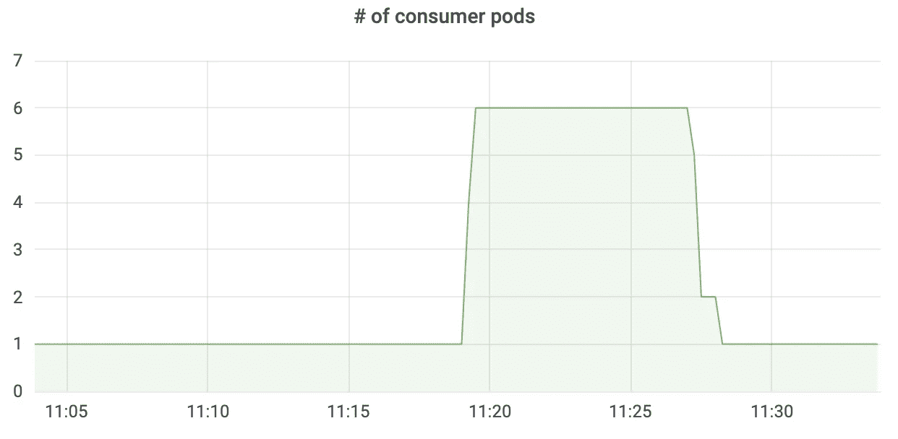

# 卡夫卡消费与 KEDA 的自动缩放

> 原文：<https://itnext.io/kafka-consumer-autoscaling-with-keda-41310f80a62a?source=collection_archive---------2----------------------->


图片来自 [Pixabay](https://pixabay.com/?utm_source=link-attribution&utm_medium=referral&utm_campaign=image&utm_content=2397805)

让我们在 Kubernetes 中探索卡夫卡式的消费者自动缩放。

如果消费者的当前读取偏移落后于分区中的实际偏移(Log End Offset)太多，超过某个阈值，那么将创建额外的消费者副本来加速 Kafka 主题的处理。如果滞后下降到阈值以下，那么消费者的数量也应该下降。

这是一个典型的水平 Pod 自动扩展用例，可以通过自定义指标来实现。我们没有这样做，而是使用 KEDA，它有一个现成的 Kafka 缩放器来实现 Kafka 消费者的自动缩放。让我们来测试一下。

关于测试环境，Kubernetes 引擎是 OpenShift 容器平台(OCP)。我正在为 Kafka 使用 IBM 事件流(基于 Strimizi 操作符)。

## 安装 KEDA

我们让 KEDA 在 OCP 当接线员。

首先创建一个名为`keda`的名称空间。创建以下 OperatorGroup 和订阅，

```
apiVersion: operators.coreos.com/v1
kind: OperatorGroup
metadata:
  name: keda-og
  namespace: keda
spec:
  targetNamespaces:
---
apiVersion: operators.coreos.com/v1alpha1
kind: Subscription
metadata:
  name: keda-operator
  namespace: keda
spec:
  name: keda
  source: community-operators
  sourceNamespace: openshift-marketplace
```

操作符将被安装在 keda 名称空间上，并将管理所有的名称空间( *targetNamespaces 被设置为空*)。

一旦安装了操作符，创建下面的 Keda 控制器 CRD，跳过所有带有默认值的字段。

```
apiVersion: keda.sh/v1alpha1
kind: KedaController
metadata:
  name: keda
  namespace: keda
spec:
  watchNamespace: ""
  logEncoder: console
  logLevel: info
  logLevelMetrics: '0'
```

KEDA 控制器现在正在监视 KEDA CRDs 的任何名称空间。KEDA 部署已完成。

## 卡夫卡生产者和消费者

使用 Kafka 库`github.com/segmentio/kafka-go`在 Golang 中创建了 Kafka 生产者和消费者。

生成器作为 HTTP 处理程序运行。一旦收到请求，处理程序就会触发一个 goroutine 向一个 Kafka 主题写入一些伪造的 JSON 数据。goroutine 的生命周期是不受管理的，因为我们是在一个长期运行的 web 处理程序中。下面显示了一些代码摘录，

```
func write_messages(writer *kafka.Writer, count int) {
 for i := 0; i < count; i++ {
  payload, err := dataset.NewDataAsBytes()
  if err != nil {
   log.Printf("Failed to create payload:%v", err)
   continue
  }
  err = writer.WriteMessages(context.Background(), kafka.Message{
   // Key:   []byte("key"),
   Value: payload,
  }) if err != nil {
   log.Printf("Failed to write message:%v", err)
   continue
  }
 }
}func handle_producer(writer *kafka.Writer) http.HandlerFunc {
 return func(w http.ResponseWriter, r *http.Request) {
  count := r.FormValue("count")
  n, err := strconv.Atoi(count)
  if err != nil {
   log.Printf("Failed to convert count:%v", err)
   http.Error(w, "count value is not a valid number", http.StatusBadRequest)
   return
  } go write_messages(writer, n) //fire and forget
  fmt.Fprintf(w, "request submitted: count=%d\n", n)
 }
}
```

在消费者程序中，`ibmes.RunCGReadLoop`是一个等待卡夫卡消息的循环。当消息可用时，它将调用一个函数来处理它。该函数将消息发送到 go 通道进行进一步处理。该函数应该是一个 goroutine，但是在我们的测试场景中，我们同步运行它来模拟延迟，以便消息可以堆积在分区中。

```
func main() {
 ... msgCh := make(chan []byte)
 go ibmes.RunCGReadLoop(strings.Split(brokers, ","), scramUser, scramPass, pemFile, topic, group, func(m kafka.Message) {
  // go func() {
  log.Printf("Sleep 10 seconds to simulate delay...")
  time.Sleep(10 * time.Second)
  msgCh <- m.Value
  log.Printf("Wake up...")
  // }()
 }) for {
  select {
  case msg := <-msgCh:
   fmt.Printf("msg: %s\n", string(msg))
  }
 }
}
```

生产者和消费者作为 K8s 部署在名称空间`keda-kafka`中运行

## 使用 KEDA 自动缩放

一旦创建了 KEDA 控制器，我们就可以创建一个 ScaledObject 来监视和缩放。

ScaledObject 将需要一些目标的身份验证信息，我们可以将它们存储在一个秘密中。如下所示，

```
apiVersion: keda.sh/v1alpha1
kind: TriggerAuthentication
metadata:
  name: keda-trigger-auth-kafka-credential
  namespace: keda-kafka
spec:
  secretTargetRef:
  - parameter: sasl
    name: keda-kafka-secrets
    key: sasl
  - parameter: username
    name: keda-kafka-secrets
    key: username
  - parameter: password
    name: keda-kafka-secrets
    key: password
  - parameter: tls
    name: keda-kafka-secrets
    key: tls
  - parameter: ca
    name: keda-kafka-secrets
    key: ca
```

创建一个 TriggerAuthentication CR。例如，参数值 username 将引用名为`keda-kafka-secrets`的秘密中的密钥字段 username。

相应的秘密如下所列，

```
apiVersion: v1
kind: Secret
metadata:
  name: keda-kafka-secrets
  namespace: keda-kafka
stringData:
  sasl: scram_sha512
  username: ...redacted...
  password: ...redacted...
  tls: enable
  ca: |-
    -----BEGIN CERTIFICATE-----
    ...redacted...
    -----END CERTIFICATE-----
```

ScaledObject 的列表

```
apiVersion: keda.sh/v1alpha1
kind: ScaledObject
metadata:
  name: kafka-scaledobject
  namespace: keda-kafka
spec:
  scaleTargetRef:
    name: consumer
  pollingInterval: 30 minReplicaCount: 1
  triggers:
  - type: kafka
    metadata:
      bootstrapServers: es-kafka-bootstrap-es.apps.dev-ocp49.ibmcloud.io.cpak:443
      consumerGroup: test-consumer-group
      topic: test-topic
      lagThreshold: "5" #must be a string
      offsetResetPolicy: latest
    authenticationRef:
      name: keda-trigger-auth-kafka-credential
```

扩展目标是名为“消费者”的 K8s 部署。扩展的触发器是用设置为 Kafka 的类型定义的，后面是引导服务器、主题、要监控的消费者组、滞后阈值和认证参考。

应用 YAML 文件，我们现在可以看到创建了一个 HPA 资源，

```
$ kubectl -n keda-kafka get hpa
NAME                          REFERENCE             TARGETS     MINPODS   MAXPODS   REPLICAS   AGE
keda-hpa-kafka-scaledobject   Deployment/consumer   0/5 (avg)   1         100       1          25h
```

## 测试

检查吊舱的初始数量。我们只有生产者和消费者的豆荚，每一个都有。

```
$ oc get pods
NAME                        READY   STATUS    RESTARTS   AGE
consumer-59fc86f698-tz45s   1/1     Running   0          24h
producer-7bc59d8bc7-6zcht   1/1     Running   0          24h
```

用生产者泵入 100 条信息，

```
curl "http://producer-service-keda-kafka.apps.dev-ocp49.ibmcloud.io.cpak/pump?count=100"
```

由于延迟，你会很快看到缩放，

```
$ oc get pods
NAME                        READY   STATUS    RESTARTS   AGE
consumer-59fc86f698-2xcvs   1/1     Running   0          2m23s
consumer-59fc86f698-gsf7c   1/1     Running   0          2m8s
consumer-59fc86f698-gv7cx   1/1     Running   0          2m23s
consumer-59fc86f698-mft5w   1/1     Running   0          2m23s
consumer-59fc86f698-tz45s   1/1     Running   0          24h
consumer-59fc86f698-vkcwh   1/1     Running   0          2m8s
producer-7bc59d8bc7-6zcht   1/1     Running   0          24h
```

HPA 资源显示，

```
$ oc get hpa
NAME                          REFERENCE             TARGETS         MINPODS   MAXPODS   REPLICAS   AGE
keda-hpa-kafka-scaledobject   Deployment/consumer   4167m/5 (avg)   1         100       6          25h
```

同时，我们可以从事件流控制台检查滞后，



一旦波通过，在默认的 5 分钟冷却时间后，豆荚的数量将下降到 1。

如果我们用下面的 PromSQL 创建一个 Grafana 仪表板

```
count(kube_pod_info{namespace="keda-kafka", pod=~"consumer.*"})
```

我们可以清楚地看到豆荚的自动伸缩。



*讨论:题目有 5 个分区。KEDA 正在将副本扩展到分区数量。然而，似乎 KEDA 没有计算初始吊舱。在卡夫卡的例子中，在 6 个复制品中，有一个复制品在空转。*

*参考* [*我后来的故事*](https://zhimin-wen.medium.com/running-kafka-exporter-in-openshift-81c62d45bd8d) *关于如何在 Grafana 仪表盘中查看和观察消费群体滞后。*

## 结论

KEDA 带来了大量的定标器，使 HPA 更容易。