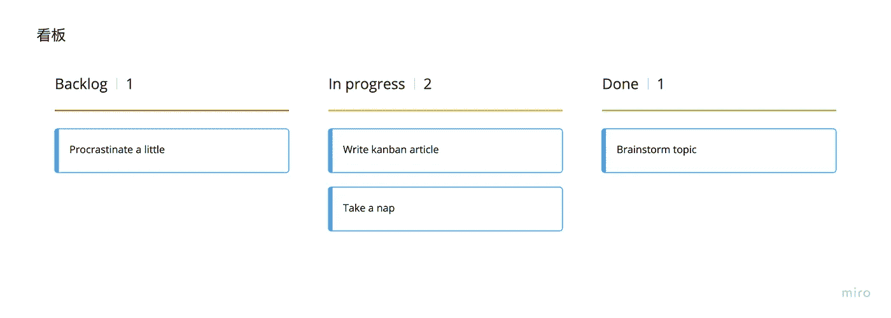

# 看板:在 3 分钟内处理策略

> 原文：<https://itnext.io/kanban-process-policies-in-3-minutes-e1a370817a49?source=collection_archive---------1----------------------->

## 使用看板的目标是创建一个稳定的工作流，但是要建立稳定性，需要一致的策略实现。

基本看板板

如果你正在运行一个看板团队，你将需要定义一些关于你的团队如何工作的政策。这些策略帮助你的团队变得更加流畅，这是一个成功看板团队的必要工具。设置这些策略有助于您和您的团队理解看板方法的设置。

许多人认为政策是严格的规则或大型员工手册。这里的情况不是这样，想法是让你的团队想出对团队有用的政策。

我们在看板框架中需要这些策略的原因是，看板没有定义过程的不同阶段；它允许团队决定什么是最有效的工作方式。最重要的是，您希望所有的流程策略都是可见和明确的。

## 看板流程策略示例

以下是我过去实施过的一些有效的例子。这并不是一个完整的列表，而是作为一个如何制定政策的概念。在特定的里程碑之后，定期与您的团队开会，重新审视您的策略，以便您可以添加和删除它们。

*   **可视化工作流程(和策略)**
    对于这个例子，你希望你的团队和你的利益相关者确切地知道你在工作中的位置。这可以通过物理电路板来实现，但电子板也能很好地工作——比如[特雷罗](https://trello.com/)或[俱乐部](https://clubhouse.io/)。
*   **限制 WIP** 我们在某些看板列中限制正在进行的工作，如正在进行或正在审核。限制特定列中的票证有助于提高质量和性能。
*   **处理关键请求** 看板的本质允许你的团队和利益相关者定期引入新的工作。这可能是破坏性的，因此该策略的思想是定义当新的关键请求进来时会发生什么。有人要死了吗？然后停下你正在做的事情，关注它。如果事情没有那么紧急，完成你正在做的事情，然后再去处理它。
*   **梳理** **您的待办事项**
    确定一个时间，当您想与您的团队一起检查您的待办事项时，信息并不总是共享的，尤其是当记录了小错误或小请求时。为你的请求设定一个最大限度，比如说 10 张票，一旦你的请求栏达到这个限度，就和你的团队开一个培训会议。优先，删除和行动。
*   定期向利益相关者展示你的工作
    向利益相关者展示你的工作进展是非常重要的，尤其是当你在做一个非常大的项目时。这将有助于你从给你的简报或说明书中漏掉任何一项工作，并给你的团队带来终结。
*   **最后一分钟功能** 不允许最后一分钟 nice 在设计评审或发布就绪测试期间拥有功能。如果你已经完全正确地阅读了你的说明书，你就不会错过任何重要的特性。

看板是一个非常强大的框架，它是开放的，没有任何明确的规则。然而，为了取得成功，您需要与您的团队一起定义明确的策略。