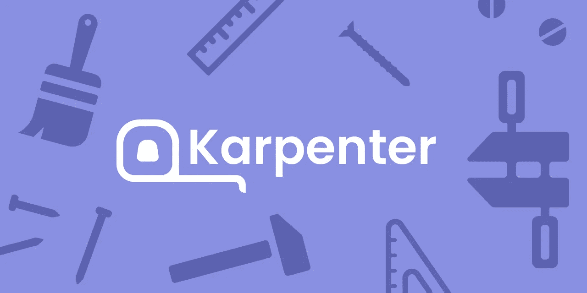
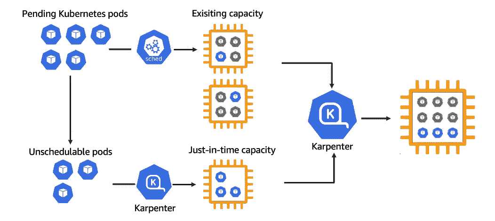

# Karpenter:开源、高性能的 Kubernetes 集群自动缩放器

> 原文：<https://itnext.io/karpenter-open-source-high-performance-kubernetes-cluster-autoscaler-d56e3ab06aae?source=collection_archive---------0----------------------->

根据 AWS，kubernetes-native cluster auto scaler 现在已经可以生产了。

图片来源:[卡尔彭特](https://github.com/aws/karpenter)

在 [re:Invent 2021](https://aws.amazon.com/blogs/aws/top-announcements-of-aws-reinvent-2021/) 上，AWS 宣布了 Karpenter 的 v0.5.0 版本，标志着其开源的 Kubernetes 节点供应项目已经准备好投入生产。借助 Karpenter，Kubernetes 用户现在可以根据 pod 规范动态配置底层计算节点，比现有的[Kubernetes cluster-auto scaler 项目](https://github.com/kubernetes/autoscaler/tree/master/cluster-autoscaler)更加高效。

那么 Karpenter 是如何工作的，它与 cluster autoscaler 有什么不同？

# 卡尔平特深潜

如果你熟悉 [GKE 自动驾驶的动态节点供应流程](https://cloud.google.com/kubernetes-engine/docs/concepts/autopilot-overview)，你可以将 Karpenter 视为该工具的开源版本，旨在与任何 Kubernetes 集群一起工作(*注意:目前 AWS 是唯一官方支持的云提供商*)。类似于 GKE 自动驾驶仪，Karpenter 观察不可调度 pod 的 pod 规范，计算聚合资源请求，并向底层计算服务(例如亚马逊 EC2)发送请求，请求具有运行所有 pod 所需的容量。在底层，Karpenter 定义了一个名为 Provisioner 的自定义资源，以指定节点配置配置，包括实例大小/类型、拓扑(例如区域)、架构(例如 arm64、amd64)和生命周期类型(例如现场、按需、可抢占)。

图片来源: [AWS 博客](https://aws.amazon.com/blogs/aws/introducing-karpenter-an-open-source-high-performance-kubernetes-cluster-autoscaler/)

另一方面，Karpenter 还可以在不再需要节点时取消供应。这可以通过节点到期配置(`ttlSecondsUntilExpired`)或在 Karpenter 配置的节点上运行的最后一个工作负载终止的时间来确定。这两个事件中的任何一个都会触发终结，终结节点、耗尽 pod、终止底层计算资源并删除节点对象。这种取消供应的特性也可以用来使节点保持最新的 AMI。

# Karpenter 与集群自动缩放

粗略地看一下，Karpenter 的工作方式类似于现有的 Kubernetes 集群 autoscaler 项目。毕竟，cluster autoscaler 也是云无关的，可以根据 pod 资源请求进行扩展或缩减。但是，经过仔细观察，Karpenter 比 cluster autoscaler 有几个优点:

*   **Kubernetes 本地缩放**:AWS 集群自动缩放器利用 [EC2 自动缩放组](https://docs.aws.amazon.com/autoscaling/ec2/userguide/AutoScalingGroup.html)来触发缩放事件。由于 ASG 是在 Kubernetes 之前设计的，这种集成既笨拙又缓慢。例如，[受管节点组用户仍然无法将其配置为将节点组扩展到 0](https://github.com/aws/containers-roadmap/issues/724) ，这使得批处理工作负载类型在 EKS 上运行的成本更高。
*   **不需要预配置节点组:** Cluster autoscaler 只能根据节点组提供的规范来配置节点，这些规范要求 worker 组具有特定的标记，并且最适合使用类似的实例类型。这意味着，如果您想要运行性能测试，您需要预定义一个具有更强大 EC2 机器类型的节点组，以便集群自动伸缩触发伸缩事件。使用 Karpenter，您可以按需利用所有 AWS 实例类型。由于 Karpenter 直接管理每个实例，无需节点组，因此当容量不可用时，请求新的计算实例也会快得多。
*   **更快的调度**:借助集群自动缩放，一旦新资源可用，pods 就依靠 kube-scheduler 为新节点创建 pods。由于 Karpenter 直接管理节点，它可以立即将 pods 启动到新节点，而不必等待调度程序。

对于那些希望直观比较 Karpenter 和 cluster autoscaler 的人来说，以下视频很好地展示了关键概念:

# 最后的想法

多年来，我觉得 EKS 被改造成使用 EC2，而不是平稳地运行容器和 Kubernetes。我最大的失望一直是[小托管节点组*如何代表我管理*节点，相比之下 GKE](https://medium.com/geekculture/state-of-managed-kubernetes-2021-43e8a4ca0207) 。有了 Karpenter，我可以卸载节点供应、自动扩展和升级，专注于运行我的应用程序。很高兴看到 Karpenter 将来作为托管插件与 EKS 捆绑在一起。