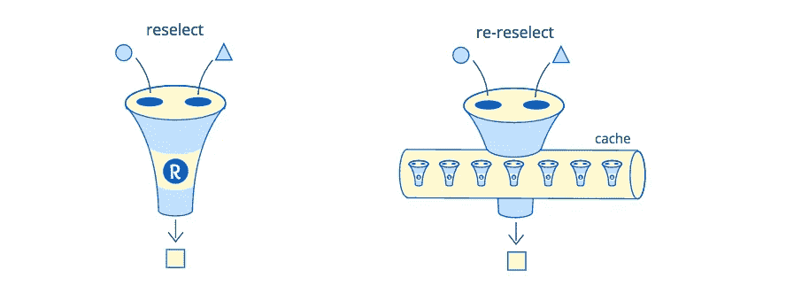
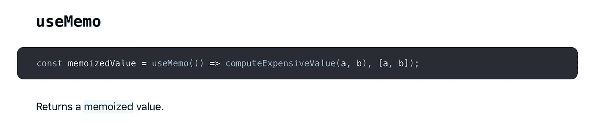

# 记忆勿忘我炸弹

> 原文：<https://itnext.io/kashe-memoization-forget-me-bomb-db14e9597e05?source=collection_archive---------3----------------------->


> 还记得吗？不要！

你听说过*记忆*吗？这是一件超级简单的事情。只需*记住*你从第一次函数调用中得到的结果，并使用它而不是第二次调用函数——不要毫无理由地调用真实的东西，不要浪费你的时间。是的，这只适用于纯函数，当相同参数的结果相同时。

> 如果结果是一样的，你为什么要做两次呢？

**跳过**一些**密集型操作**是一种很常见的优化技术。每次你可能**不** **做**某事——**不要做**。尽量使用缓存— `memcache`、`file cache`、`local cache` —任意缓存！这是高负载系统的必备组件，也是过去和现在任何后端系统的重要组成部分。

明白了吗？算了吧！


# 记忆与缓存

> 记忆化就像缓存。只是有点不同。不是**缓存**，姑且称之为**卡舍**。

长话短说，但是记忆化不是缓存，也不是永久缓存。记忆甚至听起来像是一瞬间。在服务器端这可能是相当长的一段时间，但在客户端不可能也不应该是真正的长期缓存。更多的是关于可用资源、使用模式和使用的理由。

## 问题—缓存需要一个“缓存键”

缓存使用一个**字符串** `cache key`存储和获取数据。构造一个唯一且可用的键已经是一个问题了，但是你必须对数据进行序列化和反序列化，然后再存储在基于字符串的介质中……简而言之，缓存可能没有你想象的那么快，尤其是分布式缓存。

## 记忆不需要任何缓存键

同时，记忆不需要钥匙。通常* 它按原样使用参数，不试图从它们中创建一个单独的键，也不像缓存通常做的那样，使用一些全局可用的共享对象，如`window.cache`来存储结果。

> 内存化和缓存的区别在于 API 接口！

**通常*不代表*总是*。默认情况下，`Lodash.memoize`使用`JSON.stringify`将传递的参数转换到字符串缓存中。因为他们要用这个键来访问一个内部对象，保存一个缓存的值。[快速记忆](https://community.risingstack.com/the-worlds-fastest-javascript-memoization-library/)、*、【最快的记忆库】*也是如此。两个命名库都不是*内存化*库，而是*缓存*库。

> 值得一提的是——`JSON.stringify`可能比你要*记忆*的函数慢 10 倍。

**显然，**这个问题最简单的解决方案就是不使用缓存键，并且不使用那个键访问一些内部缓存。所以，记住你被调用的最后一个参数，比如[memoizeric](https://github.com/thinkloop/memoizerific)，memoize-one 或者 reselect do。是的——所有最好的记忆库都是这样做的。

> memoizeric 可能是你唯一想使用的**通用**缓存库。

## 缓存大小

所有库之间的第二大区别是缓存大小和缓存结构。

你有没有想过——为什么`reselect`或`memoize-one`只持有一个，最后的结果？不是为了"*不使用缓存键能够存储多个结果"*，而是因为**没有理由存储比仅一个**最后结果**更多的**。

…它更多的是关于:

*   可用资源——单个缓存行是非常资源友好的
*   使用模式——记住“原地”的东西是一个好的模式。“就地”你通常只需要一个，最后一个，结果。
*   使用理由——模块化、隔离和内存安全是很好的理由。就缓存冲突而言，不与应用程序的其余部分共享缓存更安全。

# 单一结果？！

是的——唯一的一个结果。一个结果记忆了一些经典的东西，比如记忆的斐波那契数生成，你可以在每篇关于记忆的文章中找到这个例子。但是，通常，你在做别的事情——谁需要前端的斐波那契？在后端？真实世界的例子与抽象的 IT 测验相去甚远。

但是，关于单值记忆类型还有两个大问题。

## 问题 1——它很“脆弱”

默认情况下—所有参数都应该匹配，确切地说**是“===”相同的**。如果一个论点不匹配，游戏就结束了。即使这来自记忆化的想法——那可能不是你现在想要的东西。我的意思是——你想尽可能多地回忆，尽可能经常地回忆。

> 即使缓存未命中也是缓存擦除爆头。

“现在”和“过去”之间有一点点不同——不可变的数据结构，例如在 Redux 中使用的。

```
const getSomeDataFromState = memoize(state => compute(state.tasks));
```

好看吗？向右看？然而当`tasks`不变的时候`state`可能会改变，你只需要`tasks`来匹配。

**结构选择者**在这里用他们最强的战士**重新选择**在你的召唤下拯救世界。Reselect 不仅仅是记忆化库，它的力量来自记忆化**级联**，或者透镜(它们不是，但是把选择器想象成光学透镜)。

```
// every time `state` changes, cached value would be rejected
const getTasksFromState = createSelector(state => state.tasks);const getSomeDataFromState = createSelector(
  // `tasks` "without" `state`
  **getTasksFromState**,            
  // and this operation would be memoized "more often"
  tasks => compute(state.tasks) 
);
```

因此，在不可变数据的情况下——您总是必须首先"**关注**您真正需要的数据，然后——执行计算，否则缓存将被拒绝，所有记忆化背后的想法都将消失。

这实际上是一个大问题，尤其是对新手来说，但是作为不可变数据结构背后的思想，它有一个显著的好处— **如果某个东西没有被改变—它就没有被改变。如果某件事情发生了变化——很可能就是发生了变化**。这给了我们一个超级快速的比较，但有一些假阴性，就像第一个例子。

> 这个想法是关于“关注”你所依赖的数据

有两个时刻我应该提到:

*   `lodash.memoize`和`fast-memoize`正在把你的数据转换成一个字符串，用作一个键。这意味着它们 1) **不快** 2) **不安全** 3)可能会产生误报——一些不同的数据可能有相同的字符串表示。这可能会提高“缓存热率”，但实际上是一件非常糟糕的事情。
*   有一种 ES6 代理方法，关于跟踪所有使用的*给定的*个变量，并且只检查重要的键。虽然我个人想创建无数的数据选择器——你可能不喜欢或不理解这个过程，但可能希望开箱即用的适当的内存化——然后使用 [memoize-state](https://github.com/theKashey/memoize-state) 。

[](/how-i-wrote-the-worlds-fastest-react-memoization-library-535f89fc4a17) [## 我如何编写世界上最快的反应记忆库

### 实际上我已经试着写了最慢的一个，而“最快的 JavaScript 记忆库”是一年前写的…

itnext.io](/how-i-wrote-the-worlds-fastest-react-memoization-library-535f89fc4a17) 

## 问题 2—它是“一条缓存线”

无限的缓存大小是一个杀手。只要内存非常有限，任何不受控制的缓存都是杀手。所以——所有最好的库都是“一个缓存行长”。这是一个功能和强大的设计决策。我刚刚写了它是多么正确，相信我——这确实是一件**正确**的事情，但它**仍然是一个问题**。一个大问题。

```
const tasks = getTasks(state); // let's get some data from state1 (function was defined above)
getDataFromTask(tasks[0]); 
// 🚀equal(getDataFromTask(tasks[0]), getDataFromTask(tasks[0])) 
//🔥getDataFromTask(tasks**[1]**); 
// a different task? What the heck?
// oh! That's **another** argument? How dare you!?// TLDR -> task[0] in the cache got replaced by task[1]🤷‍♂️ you cannot use getDataFromTask to get data from different tasks
```

一旦**相同的**选择器不得不与**不同的**源数据一起工作，而且不止一个——一切都被打破了。而且很容易碰到这样的问题:

*   只要我们使用选择器从一个状态中获取任务，我们就可以使用相同的选择器从一个任务中获取某些东西。激烈来自于 API 本身。但它不工作，那么你只能记住最后一次调用，但必须与多个数据源。
*   多个 React 组件也有同样的问题——它们都是相同的，但都有一点不同，获取不同的`tasks`，擦除彼此的结果。

有 3 种可能的解决方案:

*   如果**重复**——使用`mapStateToProps`工厂。它将创建每个实例的记忆。

```
const mapStateToProps = () => {
   const selector = createSelector(...); 
   // ^ you have to define per-instance selectors here
   // usually that's not possible :)  
   return state => ({
      data: selector(data), // a usual mapStateToProps
   });
}
```

*   第二个变体几乎相同(对于 redux 也是如此)——它是关于使用[重新选择](https://github.com/toomuchdesign/re-reselect)。这是一个复杂的库，通过区分组件可以化险为夷。它可以理解，新的调用是针对“另一个”组件的，并且它可以为“前一个”组件保留缓存。



重新选择缓存桶

这个库可以帮助你“保留”记忆缓存，但不能删除它。尤其是因为它正在实现 5(五！)适合任何情况的不同缓存策略。那是一股难闻的气味。选错了怎么办？

你记住的所有数据——你迟早会忘记的。重点不在于记住最后一次函数调用——重点是在适当的时候忘记它。不要太快，破坏记忆，也不要太晚。

> 明白了吗？现在算了吧！

# 让我们暂停一下

停下来。放松点。做一个深呼吸。回答一个简单的问题——目标是什么？我们必须做些什么来达到目标？什么能拯救这一天？

> 提示:那个该死的“隐藏”在哪里！


那个该死的“贮藏库”在哪里？是的——这是个正确的问题。谢谢你的提问。答案很简单——它**位于一个封闭物**中。在内存函数内部的*隐藏点。举个例子，这是 memoize-one 代码:*

```
function(fn) {
  let lastArgs;  // the last arguments
  let **lastResult**;// the last result// the memoized function
const memoizedCall = function(...newArgs) {
    if (isEqual(newArgs, lastArgs)) {
      return lastResult;
    } lastResult = resultFn.apply(this, newArgs);
    lastArgs = newArgs;
    return lastResult;
  };return memoizedCall;
}
```

您将获得一个`memoizedCall`，它将保存附近的最后一个结果*，在其本地闭包内，除了`memoizedCall`之外，任何人都不能访问。一个安全的地方。这个“T23”是一个安全的地方。*

`Reselect`做同样的事情，唯一的方法是创建一个“分支”，用另一个*缓存*——创建一个新的内存化闭包。

> 但是(另一个)主要问题是，它(缓存)何时会“消失”？

> TLDR:当函数实例被垃圾收集器吃掉时，它就和函数一起“消失”了。

实例？实例！那么，什么是**每实例内存化？**React 文档中有一整篇关于它的文章:

[](https://reactjs.org/blog/2018/06/07/you-probably-dont-need-derived-state.html#what-about-memoization) [## 你可能不需要衍生的状态反应博客

### React 16.4 包含一个 getDerivedStateFromProps 的错误修复，该错误导致 React 组件中的一些现有错误…

reactjs.org](https://reactjs.org/blog/2018/06/07/you-probably-dont-need-derived-state.html#what-about-memoization) 

因此，如果您使用基于类的 React 组件，您可能会:

```
import memoize from "memoize-one";class Example extends Component {
  **filter = memoize**(
    (list, filterText) => list.filter(...);
  // ^ that is "per instance" memoization
  // we are creating "own" memoization function
  // with the "own" lastResultrender() {
    // Calculate the latest filtered list. 
    // If these arguments haven't changed since the last render, 
    // `memoize-one` will reuse the last return value.
    const filteredList = this.filter(something, somehow); return <ul>{filteredList.map(item => ...}</ul>
  }
}
```

那么“**last result”**存储在哪里呢？在内存化的**过滤器**的局部范围内，在**这个**类实例内。长话短说…

> 它什么时候会“消失”？

这一次，它将随着一个类实例“消失”。一旦组件被卸载，它就会消失得无影无踪。这是一个真正的“每个实例”，您可以使用 **this.lastResult** 来保存一个临时结果，具有完全相同的“记忆化”效果。

# 反应呢。钩住

我们越来越近了。Redux 挂钩有几个可疑的命令，可能是关于内存化的。比如— `useMemo`、`useCallback`、`useRef`

> [useMemo](https://reactjs.org/docs/hooks-reference.html#usememo) 只会在其中一个依赖关系改变时重新计算记忆值。



> 但问题是——这次它在哪里存储记忆值呢？

简而言之——它将它存储在“钩子”中，在 VDOM 元素的一个特殊部分，称为与当前元素相关联的`fiber`。在并行数据结构中。

没那么短——钩子改变了你程序的工作方式，将你的函数移到另一个函数中，一些变量在父闭包的隐藏点中。这样的函数被称为可挂起的，或可恢复的，或**协程**。在 JavaScript 中，它们通常被称为生成器或异步函数。

但这有点极端。简而言之— `useMemo`就是在**这个**中存储记忆值。只是“这个”有点不一样。

> 如果我们想创建一个更好的记忆库，我们应该找到一个更好的“this”。

> Zing！


# 孬种！

是啊！孬种！存储键值，其中`key`是`this`，只要 WeakMap 不接受除`this`之外的任何东西，即“objects”。

让我们创建一个简单的例子:

```
const createHiddenSpot = (fn) => {
  const map = new WeakMap(); // a hidden "closure"
  const set = (key, value) => (map.set(key, value), value); return (key) => { 
     return map.get(key) || set(key, fn(key))
  }
}const weakSelect = createHiddenSpot(selector);
weakSelect(todos);    // create a new entry
weakSelect(todos);    // return an existing entry
weakSelect(todos[0]); // create a new entry
weakSelect(todos[1]); // create a new entry
weakSelect(todos[0]); // return an existing entry!
weakSelect(todos[1]); // return an existing entry!!
weakSelect(todos);    // return an existing entry!!!
```

这非常简单，而且非常“正确”。所以“它什么时候会消失”？

*   忘记`weakSelect`,整个“地图”就会消失
*   忘记`todos[0]`和他们的*弱*条目就会消失
*   忘记`todos`——记忆数据将会消失！

> 很清楚什么时候会“消失”

> TL；DR —只在应该的时候。

神奇的是，所有的`reselect`问题都消失了。与*激进的*记忆化有关的问题——也是一去不复返了。

这种方法**记住**的数据，直到**忘记**为止。这是难以置信的，但要更好地记住一些事情，你必须能够更好地忘记它。

唯一持久的是—为这种情况创建一个更健壮的 API

# Kashe —是一个缓存

`kashe`是一个基于 WeakMap 的记忆库，可以拯救你的一天。

[](https://github.com/theKashey/kashe) [## theKashey/kashe

### 🤯有时缓存是 kashe。在 GitHub 上创建一个帐户，为 Kashey/kashe 的发展做出贡献。

github.com](https://github.com/theKashey/kashe) 

这个库公开了 4 个函数

*   `kashe`—用于记忆。
*   `box` —对于前缀记忆，增加记忆的机会。
*   `inbox` —嵌套前缀记忆化，以 _ 减少 _ 改变记忆化
*   `fork` — to _fork_(明显)记忆化。

## kashe(fn) => memoizedFn(…args)

它实际上是上一个示例中的 createHiddenSpot。它将使用第一个参数作为内部 WeakMap 的`key`。

```
const selector = (state, prop) => ({result: state[prop]});
const memoized = kashe(selector);
const old = memoized(state, 'x')
memoized(state, 'x') === old
memoized(state, 'y') === memoized(state, 'y') 
// ^^ another argument// but
old !== memoized(state, 'x') // 'y' wiped 'x' cache in `state`
```

**第一个参数**是一个键，如果你再次调用同一个函数`key`，但是不同的参数——缓存将被替换，它仍然是一个缓存行长的内存化。为了让它工作——你必须为不同的情况提供不同的`keys`,就像我用`weakSelect`例子做的那样，以提供不同的 this 来保存结果。重选瀑布 A 还是那个东西。

并非所有功能都是可记忆的。第一个参数必须是对象、数组或函数。它应该可以用作`WeakMap`的按键。

## box(fn) => memoizedFn2(box，…args)

这是同一个功能，只是**应用了两次**。一次用于`fn`，一次用于`memoizedFn`，为参数添加前导`key`。它可能会使任何功能*可记忆*。

> 这是相当声明性的-嘿功能！我将**将结果存储在这个** `**box**`中。

```
// could not be "kashe" memoized
const addTwo = (a,b) => ({ result: a+b }); const bAddTwo = boxed(addTwo);
const cacheKey = {}; // any objectbAddTwo(cacheKey, 1, 2) === bAddTwo(cacheKey, 1, 2) === { result: 3}
```

如果你`box`已经记忆了函数——你将增加记忆的机会，比如每个实例记忆——你可以创建**记忆级联。**

```
const selectSomethingFromTodo = (state, prop) => ...
const selector = kashe(selectSomethingFromTodo);
const boxedSelector = kashe(selector);class Component {
  render () {
    const result = boxedSelector(this, todos, this.props.todoId);
    // 1\. try to find result in `this`
    // 2\. try to find result in `todos`
    // 3\. store in `todos`
    // 4\. store in `this` // if multiple `this`(components) are reading from `todos` - 
    // selector is not working (they are wiping each other)
    // but data stored in `this` - exists. ...
  }
} 
```

## inbox(fn) => memoizedFn2(box，…args)

这个与 box 相反，但是做的几乎一样，命令嵌套缓存将数据存储到提供的`box`中。从一个角度来看，它降低了记忆化的可能性(没有记忆化级联)。但是从另一个角度来看——它消除了缓存冲突，并且有助于隔离进程，如果它们不应该由于任何原因相互干扰的话。

> 很有宣示性——嘿！所有人都进去！这里有一个`box`可以使用

```
const getAndSet = (task, number) => task.value + number;
const memoized = kashe(getAndSet);
const inboxed = inbox(getAndSet);
const doubleBoxed = inbox(memoized);memoized(task, 1) // ok
memoized(task, 2) // previous result wipedinboxed(key1, task, 1) // ok
inboxed(key2, task, 2) // ok// inbox also override the cache for any underlaying kashe calls
doubleBoxed(key1, task, 1) // ok
doubleBoxed(key2, task, 2) // ok
```

## fork(kashe-memo ized)= > kashe-memo ized

Fork 是一个真正的 fork——它获取任何 *kashe-memoized* 函数，并返回相同的结果，但带有另一个内部缓存条目。还记得 redux mapStateToProps 工厂方法吗？

```
const mapStateToProps = () => {
   // const selector = createSelector(...); // 
   const selector = fork(realSelector);
   // just fork existing selector. Or box it, or don't do anything
   // kashe is more "stable" than reselect. return state => ({
      data: selector(data),
   });
}
```

# 重新选

还有一件事你应该知道— **kashe 可以代替 reselect** 。字面上。

```
import { createSelector } from 'kashe/reselect';
```

它实际上是同样的`reselect`，只是用`kashe`作为记忆功能创建的。

> 全部测试完毕，准备就绪！

> PS:值得一提的是，这种方法的更简单的版本——[weak-memo ize](https://github.com/emotion-js/emotion/tree/master/packages/weak-memoize)——在 emotion-js 中使用了一段时间。没有抱怨。 [nano-memoize](https://medium.com/@anywhichway/nano-memoize-faster-than-fast-smaller-than-micro-c8a8d626bb82) 也将 WeakMaps 用于单参数情况。

明白了吗？“较弱”的方法会帮助你更好地记住一些东西，也更好地忘记它。是的，关于遗忘——你能看这里吗？

