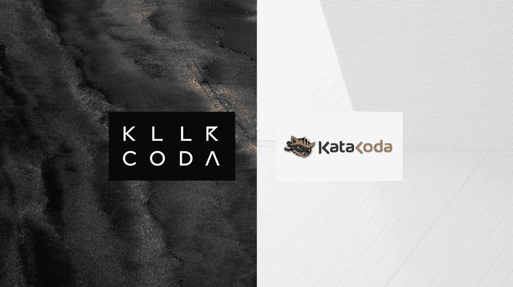
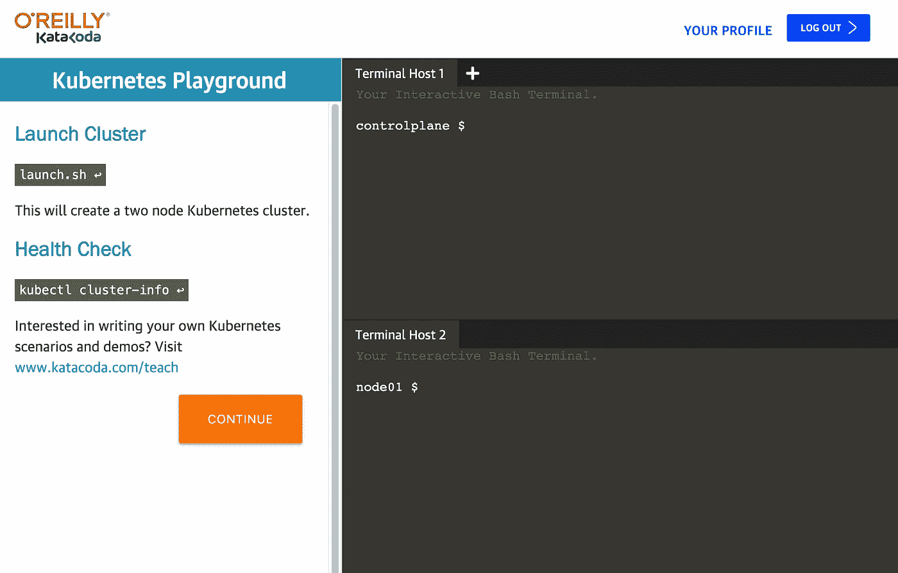

# 卡塔科达替代方案

> 原文：<https://itnext.io/katacoda-alternative-1d33599af75f?source=collection_archive---------0----------------------->

## 将您的场景导入 Killercoda 或从现有场景中学习

[如何迁移到 KILLERCODA](https://wuestkamp.medium.com/katacoda-to-killercoda-migration-guide-d21961fc0c9b?source=friends_link&sk=6e93c2194234f703454e3eb1438712c9)

# 你在寻找 Katacoda 的替代品吗？

*   导入现有的 Katacoda 场景
*   为任何技术创造新的场景
*   使用各种[现有场景](https://killercoda.com/areas)

killercoda.com 上[的一切可能:](https://killercoda.com)

https://killercoda.com

# 我们爱卡塔科达！

让我大声明确地说:我们(黑仔团队)认为 Katacoda 以一种不可思议的方式永远改变了交互学习的面貌！Katacoda 向我们展示了拥有易于访问的浏览器内环境的方法。

# 为什么 Katacoda 最初的想法如此神奇？

Katacoda 允许您只需打开浏览器，就可以获得一台 Linux 机器甚至整个 Kubernetes 集群的终端。

这大大减少了本地设置的时间和复杂性。这些环境都是一次性的，所以你只需重新加载你的浏览器就可以得到一个新的。因此，Katacoda 在学习基于 Linux 或 Kubernetes 的技术的学生中非常有名。

# 为什么我们需要一个替代品？

自从 Katacoda 被 O'reilly 收购后，事情发生了很大的变化。看起来 O'reilly 想把 Katacoda 和底层技术改造成自己的平台。没人知道接下来会发生什么，但看起来会少很多。

## 现在使用 Katacoda 有一些缺点:

*   过时的环境(例如旧的 Kubernetes)
*   没有积极开发，没有新功能
*   启动和加载时间长
*   过时或破碎的场景
*   商业/专业用途无法嵌入

# 杀手科达来救援了？

好吧，让我们不要在这里超越自己，Killercoda 仍然处于非常早期的阶段，仍然处于测试阶段。但是已经有可能的是:

*   导入现有的 Katacoda 场景并运行这些场景
*   创建新场景
*   使用各种现有场景
*   快速加载时间
*   最新的 Kubernetes 和 Ubuntu LTS 环境
*   Kubernetes 环境是即时可用的，不需要加载脚本
*   在新的浏览器窗口中打开终端
*   积极开发和即将推出的新功能
*   为企业/专业人士提供嵌入和品牌
*   使用忒伊亚的完整 IDE

还有很多事情要做，但我们渴望为每个人提供一个令人惊叹的互动学习平台。我们走着瞧！

# 我能看一些场景示例吗？

当然，只要看看我们现有的领域:

[https://killercoda.com/areas](https://killercoda.com/areas)

# 如何从 Katacoda 迁移到 Killercoda？

我们这里有一篇详细的文章。

# 下一步是什么？

我会在 Medium 上写更多关于 Killercoda 和新特性的文章。

# 跟着我们

https://twitter.com/killercoda

【https://www.linkedin.com/company/killercoda 

# 联系我们

如果您对[支架](https://killercoda.com/support)或[松弛](https://join.slack.com/t/killercoda/shared_invite/zt-16bc15b4j-0r5P4JSrp0c0CYqBRJaw7Q)有任何疑问，请联系我们