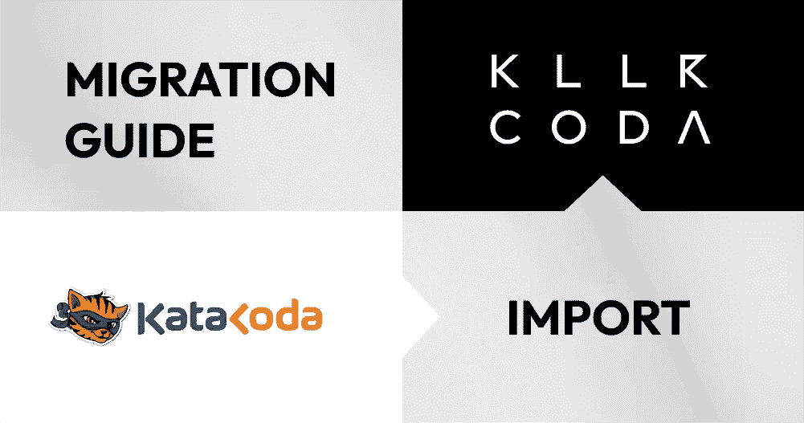
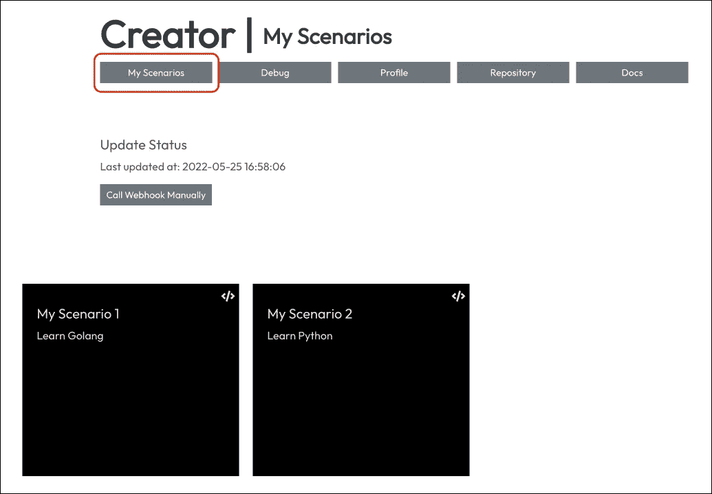
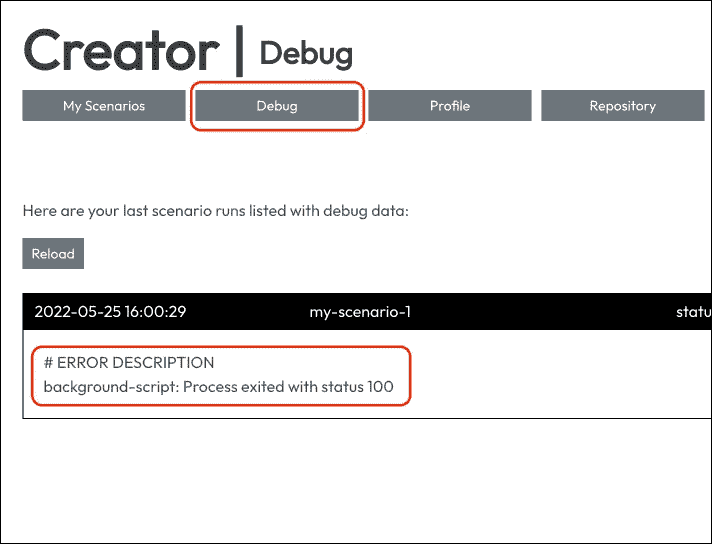
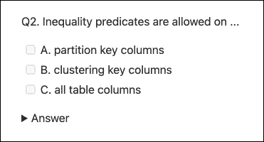
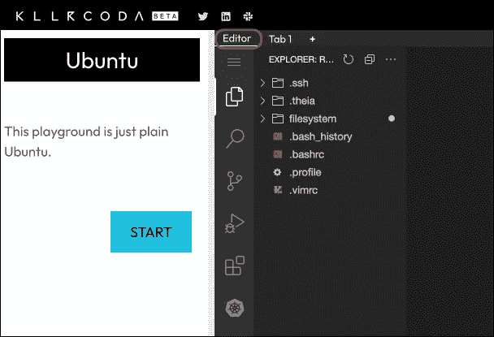

# Katacoda 到 Killercoda 迁移指南

> 原文：<https://itnext.io/katacoda-to-killercoda-migration-guide-d21961fc0c9b?source=collection_archive---------2----------------------->

## 如何轻松地将所有场景导入 Killercoda



**Katacoda 很遗憾地关闭了**,多年来，它为大量学生、教师和演示者提供了令人惊叹的按需简易浏览器互动学习环境。**感谢 Katacoda 的优质服务！**

…但现在所有人创建的所有场景都丢失了？幸好没有！因为您可以简单地将现有的 Katacoda 场景导入到 Killercoda 中，而无需任何更改(交叉手指)。让我们看看如何，好吗？

# TL；速度三角形定位法(dead reckoning)

如何迁移您的场景？

1.  [将您现有的 Github Repo 链接到您的 Killercoda 帐户](https://killercoda.com/creators/get-started)
2.  测试你所有的场景
3.  调整有误差的

# 1)链接您的 Github 资源库

前往 [Creator Repository 部分](https://killercoda.com/creator/repository)并在 Killercoda 上创建一个帐户。然后按照[入门](https://killercoda.com/creators/get-started)指南连接您现有的 Github 库，神奇地导入您所有的场景。

# 2)测试你所有的场景



在 [Creator My Scenarios](https://killercoda.com/creator/scenarios) 下，您可以看到您的所有场景。如果在导入过程中发现错误，这些错误也会显示在这里。现在开始每一个场景。

如果您的场景抛出一个错误，请看一下 [Creator Debug](https://killercoda.com/creator/debug) 部分。在这里，您可以看到更多的错误细节和后台脚本日志。



如果您的一些场景仍然不能 100%运行或正常工作，请运行接下来的部分，并检查 Killercoda 上的不同处理方式。

# 3)调整某些事情

Katacoda 和 Killercoda 是有区别的，尤其是当我们进入更复杂的环境时。让我们在这里看看它们。

## Imageid 更改

我们已经为 Katacoda `imageid`值创建了各种别名，所以大多数场景应该是开箱即用的。但最好还是直接跳到 killer corda`imageid`值之一:

```
**ubuntu**: Ubuntu 20.04 with Docker and Podman**kubernetes-kubeadm-2nodes**: Kubeadm latest (atm 1.24) cluster with one controlplane and one node, ready to schedule workload.**kubernetes-kubeadm-1node**: Kubeadm latest (atm 1.24) cluster with one controlplane, taint removed, ready to schedule workload. Loads faster then 2nodes!
```

> ***我们建议尽可能使用 k8s 1 节点*** `*imageid*` *，因为它加载速度比 k8s 2 节点快！*

如果你正在使用图像`git`、`python`或`golang`，那么你现在应该可以只使用`ubuntu`。对于其他的，比如`nodejs`或者`java`，你需要在前台或者后台脚本中安装必要的工具。

## Kubernetes:不要运行 launch.sh

从你的后台/前台脚本中删除任何对`launch.sh`的调用，否则会导致错误！

在 Katacoda 上(有时)需要运行一个神奇的`launch.sh`来让 Kubernetes 环境运行起来。这在 Killercoda 上已经没有必要了，因为所有 K8s 环境都一直在运行并准备就绪！

## Kubernetes 环境中的更多空间

控制面板和节点各有 2GB ram。您可以消除控制平面的污点，以便也调度工作负载:

```
kubectl taint nodes controlplane node-role.kubernetes.io/master:NoSchedule-kubectl taint nodes controlplane node-role.kubernetes.io/control-plane:NoSchedule-
```

## 自定义仪表板选项卡

尚不支持。但是用户可以使用网络流量降价链接打开内部运行的应用程序的链接，请参见下一节。

## 环境内部的网络流量

您需要使用与 Katacoda 不同的 markdown 变量，如下所示:

```
Link for traffic into host 1 on port 80
{{TRAFFIC_HOST1_80}}Link for traffic into host 2 on port 4444
{{TRAFFIC_HOST2_4444}}Link for traffic into host X on port Y
{{TRAFFIC_HOSTX_Y}}
```

更多详情请参见[文档](https://killercoda.com/creators)和[示例](https://killercoda.com/examples)中的章节。

## 获取本地虚拟机 IP 地址

虚拟机的本地 IP 地址从不改变，并且对于每个环境都是相同的，每个虚拟机可以相互联系。

```
host1: 172.30.1.2
host2: 172.30.2.2
host3: 172.30.3.2
...
```

## 课程/途径

不支持 Katacoda 路径，因为它们不必要的复杂。将场景分组到课程中很容易，只需将它们放入子目录中即可！

如果你喜欢控制排序顺序或其他细节，创建一个`structure.json`，如这里的[详细描述的](https://wuestkamp.medium.com/courses-on-killercoda-55657e459e6d?source=friends_link&sk=c2a7f805a377a5e00e432f4388abbe18)。还有例子 [in-action](https://killercoda.com/examples-courses) 和 [in-Git](https://github.com/killercoda/scenario-examples-courses) 。

## 盘问

尚不支持测验。一些用户将这些作为自我检查测验来实施，如:



感谢 DataStax 为[这个例子](https://github.com/clun/krscenarios/blob/main/queries/quiz.md)！

在降价中:

```
Q2\. Inequality predicates are allowed on ...- [ ] A. partition key columns
- [ ] B. clustering key columns
- [ ] C. all table columns<details>
  <summary>Answer</summary>
  <p><b>B</b></p>
</details>
```

## 使用 index.json 环境部分控制 UI

```
 **"environment": {
    "uilayout": "editor-terminal"
  },**
  "backend": {
    "imageid": "ubuntu"
  }
}
```

整个`environment`部分不受支持，将被忽略。未来有控制模板/布局的计划。

## 特定的 exec 命令

在 Katacoda 上，可以运行`{{execute interrupt}}`来发送 ctrl+c 并停止一个正在运行的进程，这将在未来的更新中得到支持。

对于`{{execute T1}}`在特定终端执行命令也是如此。由于没有不同的模板/布局，这还不支持自动柜员机。接下来阅读可视化编辑器中的行为。

## 使用可视化编辑器



每个环境都有可用的忒伊亚作为 IDE。集成仍在进行中，我们将在未来将它与更多功能连接起来。

例如 atm，现在还不能将`{{exec}}`编码到编辑器终端中，但是已经计划在将来更新。到那时，当使用可视化编辑器时，所有的`{{exec}}`将自动切换到`{{copy}}`。

更多关于编辑器集成的细节[在这里](https://wuestkamp.medium.com/kubernetes-and-ide-just-in-your-browser-killercoda-21ba309dd75c?source=friends_link&sk=bbabf9d1c270e5e1ecb64bf8daf666a5)。

## 为存储库中的方案指定子目录

在 Katacoda 中，可以用下面的内容来定义`katacoda.yaml`:

```
scenario_root: tutorials/katacoda
```

尚不支持此功能。你需要有一个单独的 Github 库，所有的场景都在顶层。我们计划在将来有一个设置，允许在你的存储库中标记一个特定的场景根。

# 文档和场景

您可以访问我们的创建者[文档](https://killercoda.com/creators)和[常见问题](https://killercoda.com/faq)。

atm 支持的一切都可以在示例 [in-action](https://killercoda.com/examples) 和 [in-Git](https://github.com/killercoda/scenario-examples) 中获得。

还有其他公开回购的场景，如 [Istio](https://killercoda.com/istio) 和 [Linkerd](https://killercoda.com/linkerd) 。

# 我们处于测试阶段！

如果您遇到问题，请告诉我们，我们会尽力及时解决！

> 我们还处于测试阶段的早期，我们也可以称之为阿尔法！([常见问题](https://killercoda.com/faq))

# 问题？

在[支架](https://killercoda.com/support)上联系我们，或在[松驰](https://join.slack.com/t/killercoda/shared_invite/zt-16bc15b4j-0r5P4JSrp0c0CYqBRJaw7Q)上联系我们及其他各方。

# 保持最新和通知！

[推特](https://twitter.com/killercoda)

[领英](https://www.linkedin.com/company/killercoda)