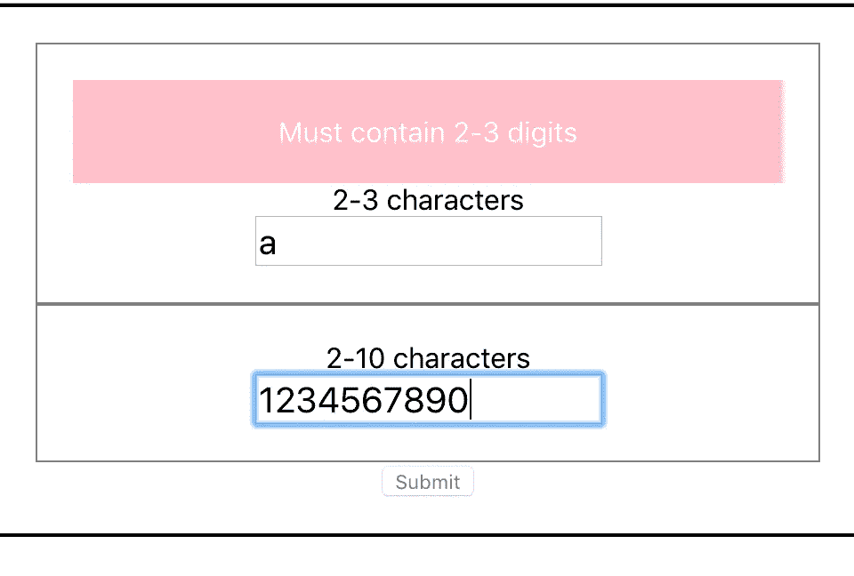

# 保持冷静，处理 React.js 中的表单

> 原文：<https://itnext.io/keep-calm-and-handle-forms-in-react-js-52c67eea340e?source=collection_archive---------1----------------------->

> 在大多数应用程序中，表单是不可避免的。我说邪恶是因为它通常是一场斗争，让他们按照你想要的方式行事，让他们尽可能地灵活。我们通常求助于使用库，因为面对它，表单通常不是那么有趣。

下面的图片代表了我希望你读完这篇文章后的平静心态，所以我希望你能喜欢它:)


当用户与表单交互时，表单的反应会有所不同，这里没有什么灵丹妙药，但是我见过的变体有:

*   **即时验证**，一旦你输入，一个元素的内容就会被验证，如果有任何错误，就会被立即指出
*   **焦点丢失**，当你移动到另一个元素时，一个元素首先被验证，这比第一个版本稍微少一些
*   **依赖验证**，一个元素的值依赖于一个或多个其他元素的值
*   **服务器端验证**，输入元素的有效性无法确定，除非你调用一个端点并得到一个响应
*   **禁用提交**，在这种情况下，如果一个或多个元素无效，您不能按提交按钮，因为它已被禁用
*   **隐藏提交**，在这个场景中，提交按钮根本不显示
*   **正在提交**，在这种情况下，你必须按下提交按钮才能发现你有验证错误，有点像老虎机:)

上面并不是一个详尽的列表，但是它显示了表单和输入元素可以以完全不同的方式运行。

# 建筑方法

您可以将所有元素及其验证放在一个巨大的组件中，该组件由表单及其所有输入元素组成，但是通常最好为表单和输入元素创建专用的组件。让我们来讨论一下表单中的输入元素:

它应该具有以下属性:

*   **呈现元素本身**，这意味着该组件将作为实际 HTML 输入元素的包装器，这将使我们能够更好地控制元素的呈现方式
*   **应该输出验证错误**，是的，你可以在表单的底部收集所有的错误，但是通常更好的方法是在元素旁边用红色边框和错误消息来指示，这样用户就知道他们需要修复什么元素
*   **监听变化**，元素应该能够捕捉击键或知道元素何时失去焦点，这样它的内容可以被验证
*   **向表单报告**，元素应该能够向表单报告，并说明哪个元素在验证中失败了，以及失败的方式，因此表单可以采取适当的措施，例如禁用或隐藏提交按钮

# 使用输入元素

好的，我们说过我们需要创建一个组件来包装 HTML 元素。这样做很简单:

```
import React from 'react'; class Input extends React.Component { 
  render() { 
    return ( 
      <input { ...this.props} /> 
    ); 
  } 
}
```

正如你在上面看到的，我们让`Input`组件呈现一个`input`元素标签。我们还通过键入`{ ...this.props}`来确保组件上设置的所有属性都进入底层输入。最后一种更为人工的版本是键入:

```
<input title={this.props.title} value={this.props.value} ... >
```

根据我们想要发送给底层输入的属性数量，可能需要大量的输入。

因为我们现在控制了`input`的渲染方式，我们可以做各种各样的事情，比如添加`div`元素，给它填充、边距、边框等等。最棒的是，我们可以在很多地方重用这个组件，我们所有的输入看起来都很好而且一致。

## 添加验证

现在我们将看到将我们的`input`元素包装在一个组件中是值得的。向我们的元素添加验证非常简单:

*   **添加一个错误占位符**，这只是在我们的组件中添加一个应该显示错误的地方
*   添加验证输入值的函数
*   验证每一个值的变化，我们需要添加一个回调到`onChange`

## 渲染错误

将`render()`方法更改如下:

```
render() { 
  const { error, data } = this.state;
  const { desc } = this.props; return ( 
  <InputContainer> 
    {error && 
    <ErrorMessage>{error}</ErrorMessage> 
    } 
    <div> 
    {desc} 
    </div> 
    <InnerInput 
      value={data} 
      onChange={this.handleChange} {...this.props} 
    /> 
  </InputContainer> 
  ); 
}
```

这里，我们有条件地显示错误消息，假设它处于以下状态:

```
{error && 
  <ErrorMessage>{error}</ErrorMessage> 
}
```

我们还将一个`handleChange()`方法连接到`onChange`。

## 添加验证功能

下一步是添加我们的验证功能:

```
const validate = (val, errMessage, pattern) => { 
  const valid = new RegExp(pattern).test(val); 
  return valid ? '' : errMessage; 
};
```

上面的函数只是测试我们的输入值是否匹配一个正则表达式模式，如果匹配，那么它是有效的，如果不匹配，那么我们返回错误消息。

## 管理国家

那么是谁在调用这个函数呢？嗯，`handleChange()`方法是这样的:

```
handleChange = (ev) => { 
  const { errMessage } = this.props; 
  const error = validate(ev.target.value, errMessage); this.setState({ data: ev.target.value, error, }); 
}
```

我们在这里做两件事，首先我们调用`validate()`来查看是否有错误，其次我们设置状态，这是我们的值和错误。如果错误为空字符串，则计为`falsy`。因此，我们总是可以安全地设置错误属性，任何错误消息只有在应该可见的时候才是可见的。

到目前为止，我们组件的完整代码如下所示:

```
// Input.jsimport React from 'react'; 
import styled from 'styled-components'; 
import PropTypes from 'prop-types'; const InnerInput = styled.input`
  font-size: 20px; 
`; const InputContainer = styled.div` 
  padding: 20px; 
  border: solid 1px grey; 
`; const ErrorMessage = styled.div` 
  padding: 20px; 
  border: red; 
  background: pink; 
  color: white; 
`; const validate = (val, errMessage, pattern) => { 
  const valid = new RegExp(pattern).test(val); 
  return valid ? '' : errMessage; 
}; class Input extends React.Component { 
  static propTypes = { 
    name: PropTypes.string, 
    desc: PropTypes.string, 
    errMessage: PropTypes.string, 
    pattern: PropTypes.string,
  };   state = { 
    error: '', 
    data: '', 
  }   handleChange = (ev) => { 
    const { 
      errMessage, 
      name, 
      pattern 
    } = this.props;    const error = validate(ev.target.value, errMessage, pattern);

   this.setState({ data: ev.target.value, error, }); 
  }   render() { 
    const { error, data } = this.state;
    const { desc } = this.props; return ( 
    <InputContainer> 
      {error && 
      <ErrorMessage>{error}</ErrorMessage> 
      } 
      <div> {desc} </div> 
      <InnerInput 
        value={data} 
        onChange={this.handleChange} {...this.props} 
      /> 
    </InputContainer> ); 
  } 
} export default Input;
```

# 与表单交流

通常，当您将输入元素放入表单时，您希望能够告诉表单存在一个或多个无效输入，并且您希望阻止表单被提交。为此，我们需要在每次值改变时向表单发送一条消息，如果有验证错误，表单会知道。为此，我们需要做到以下几点:

*   添加一个`notify`输入属性，这将是一个函数，一旦我们验证了最新的更改，我们就可以调用它
*   调用`notify`函数

因此，我们更新了我们的`handleChange()`方法，现在调用我们传入的`notify()`函数，就像这样:

```
handleChange = (ev) => { 
  const { errMessage, name, notify, pattern } = this.props; 
  const error = validate(ev.target.value, errMessage, pattern); 

  notify(name, error === ''); 
  this.setState({ data: ev.target.value, error, }); 
}
```

`notify()`用两个参数调用，`name`和是否有效。

## 设置表单

好极了，我们有一种方法将错误反馈给表单，那么表单本身呢，它需要做些什么才能工作呢？它需要以下内容:

*   **一个方法**，它可以挂接`notify`属性
*   **确定如何处理**，如果一个或多个元素*无效*，例如禁用提交按钮

我们还决定为我们的表单创建一个专用组件:

```
// Form.jsimport React from 'react'; 
import styled from 'styled-components'; 
import Input from './Input'; const FormContainer = styled.form` 
  border: solid 2px; 
  padding: 20px; 
`; class Form extends React.Component { 
  state = { isValid: true, }   notify = (name, isValid) => { /* to be defined */ }

  render() { 
    return ( 
      <FormContainer> 
        <div> 
          <Input 
            errMessage="Must contain 2-3 digits"
            pattern="^[0-9]{2,3}$" 
            desc="2-3 characters" 
            name="first-name" 
            notify={this.notify} 
            title="I am a custom inbox" /> 
       </div> 
       <button>
       Submit
       </button> 
      </FormContainer> 
    ); 
  } 
}export default Form;
```

此时，我们已经将 notify `input`属性连接到组件上名为`notify()`的方法，如下所示:

```
<Input 
  errMessage="Must contain 2-3 digits"
  pattern="^[0-9]{2,3}$" 
  desc="2-3 characters" 
  name="first-name" 
  notify={this.notify} 
  title="I am a custom inbox" 
/>
```

如您所见，我们的`notify()`方法还没做多少，但它会:

```
notify = (name, isValid) => { /* to be defined */}
```

那么我们需要通过调用`notify()`来完成什么呢？我们需要完成的第一件事是告诉表单您的一个输入无效。另一种是将整个表单设置为无效。基于此，我们将`notify()`代码定义如下:

```
notify = (name, isValid) => { 
  this.setState(
    { [name]: isValid, }, 
    () => { 
      this.setState({ 
        isValid: this.validForm(), 
      }); 
    }); 
}
```

我们在上面看到，在更新了输入元素的状态之后，我们为`isValid`设置了状态，并调用方法`validForm()`来确定它的值。这样设置`isValid`状态的原因是`setState()`不会立即发生，所以只有在回调时我们才能保证它的状态已经更新。

`isValid`是我们将在标记中用来确定表单是否有效的属性。接下来让我们定义方法`validForm()`:

```
validForm = () => { 
  const keys = Object.keys(this.state); 
  for (let i = 0; i < keys.length; i++) { 
    if (keys[i] === 'isValid') { 
      continue; 
    } 
    if (!this.state[keys[i]]) { 
      return false; 
    } 
  } 
  return true; 
}
```

上面我们循环了我们的状态，并寻找是否有一个输入元素无效。我们跳过`isValid`，因为它不是元素状态。

## 确定表单状态

我们现在已经做好了一切准备，以便于指示表单是否可以提交。我们可以用两种方式处理:

*   **禁用**，提交按钮
*   **提交并验证**，让用户按下提交按钮，但阻止提交通过

如果我们执行第一个变体，我们只需要将标记更改为以下内容:

```
render() { 
  return ( 
    <FormContainer onSubmit={this.handleSubmit}> 
     <div> 
       <Input 
         errMessage="Must contain 2-3 digits"
         pattern="^[0-9]{2,3}$" 
         desc="2-3 characters" 
         name="first-name" 
         notify={this.notify} 
         title="I am a custom inbox" 
       /> 
     </div> 
     <button disabled={!this.state.isValid}>Submit</button
    </FormContainer> 
  ); 
}
```

让我们放大有趣的部分:

```
<button disabled={!this.state.isValid}>Submit</button>
```

我们从我们的`isValid`属性中读取数据，并在需要时禁用我们的按钮。

阻止提交的另一个版本涉及到我们向方法`handleSubmit()`添加一些逻辑:

```
handleSubmit = (ev) => { 
  ev.preventDefault(); 
  if (!this.state.isValid) { 
    console.log('form is NOT valid'); 
  } else { 
    console.log('valid form') 
  } 
}
```

# 完整的代码和结果

如果您成功地正确输入了所有内容，您应该会看到以下外观:



完整的代码如下所示:

```
// Form.jsimport React from 'react';import styled from 'styled-components';import Input from './Input';const FormContainer = styled.form` border: solid 2px; padding: 20px;`; class Form extends React.Component { state = { isValid: true, } validForm = () => { const keys = Object.keys(this.state); for (let i = 0; i < keys.length; i++) { if (keys[i] === 'isValid') { 
// filtering away `isValid`, this belongs to the form, as we only want to look at input elements continue; } if (!this.state[keys[i]]) { return false; } } return true;} notify = (name, isValid) => { this.setState(
      { [name]: isValid, }, () => { // this happens after the first `setState` this.setState({ isValid: this.validForm(), }); }); } render() { return (
     <FormContainer onSubmit={this.handleSubmit}> <div> <Input 
           pattern="^[0-9]{2,3}$" 
           errMessage="Must contain 2-3 digits" 
           desc="2-3 characters" 
           name="first-name" 
           notify={this.notify} 
           title="I am a custom inbox" 
         /> <Input 
           pattern="^[0-9]{2,10}$" 
           errMessage="Must contain 2-10 
           digits" desc="2-10 
           characters" 
           name="last-name" 
           notify={this.notify} 
           title="I am a custom inbox" 
         /> </div> <button disabled={!this.state.isValid}>Submit</button> </FormContainer>
    ); }}export default Form;
```

以及输入组件:

```
// Input.jsimport React from 'react';import styled from 'styled-components';import PropTypes from 'prop-types';const InnerInput = styled.input`font-size: 20px;`; const InputContainer = styled.div` padding: 20px; border: solid 1px grey;`;const ErrorMessage = styled.div` padding: 20px; border: red; background: pink; color: white;`;const validate = (val, errMessage, pattern) => { const valid = new RegExp(pattern).test(val); return valid ? '' : errMessage;}; class Input extends React.Component { static propTypes = { name: PropTypes.string, desc: PropTypes.string, errMessage: PropTypes.string, }; state = { error: '', data: '', } handleChange = (ev) => { const { errMessage, name, notify, pattern } = this.props; const error = validate(ev.target.value, errMessage, pattern); notify(name, error === ''); this.setState({ data: ev.target.value, error, }); } render() { const { error, data } = this.state; const { desc } = this.props; return ( <InputContainer> {error && <ErrorMessage>{error}</ErrorMessage> } <div> {desc} </div> <InnerInput value={data} onChange={this.handleChange} {...this.props} /> </InputContainer>); }}export default Input;
```

此时，您可能会想，复选框元素、单选按钮、下拉框、异步验证呢？我只想用一个更小的例子来描述这个想法。请在评论中告诉我，我会把它添加到项目中，但希望我能传达这个想法:)

# 摘要

我们开始描述一种处理表单的方法。这包括围绕 HTML 输入元素和表单本身创建包装组件。此后，我们展示了如何将任何验证错误报告回表单，以便它能够以合适的方式进行操作。我确信有比这个更好的解决方案，但是希望你能理解如何处理表单。

## 进一步阅读

如果你正在做表单并且使用 Redux，我推荐你看一看 Redux 表单库

我还建议你看一下表格上的官方文件，写得很好

下面是一个运行上面代码的[示例项目](https://github.com/softchris/react-forms-demo)

[我的推特](https://twitter.com/chris_noring)