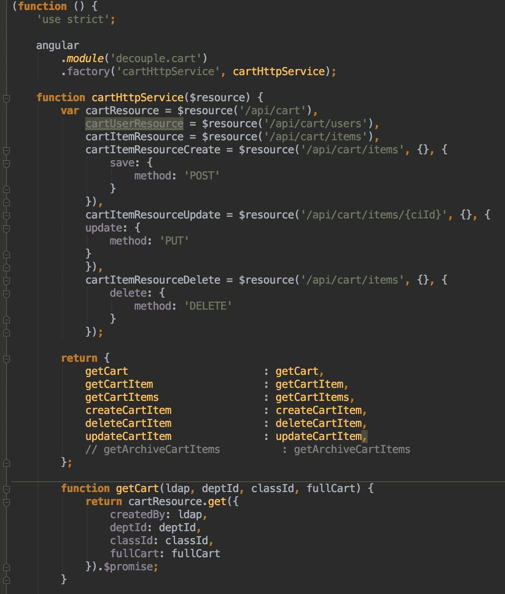
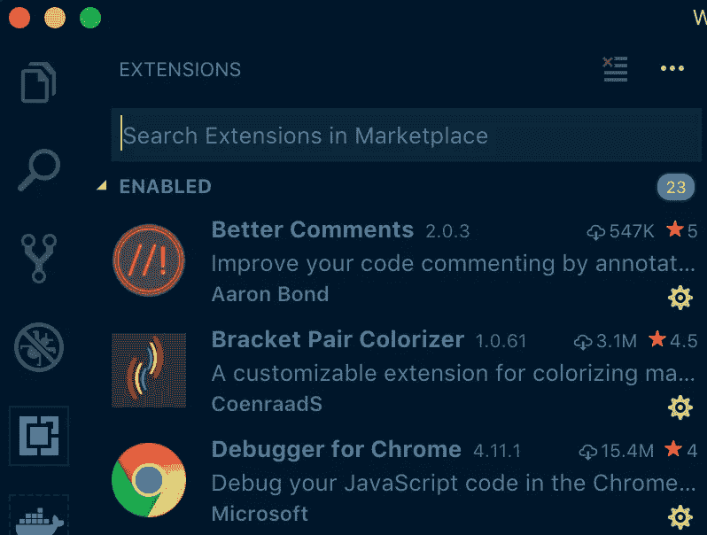
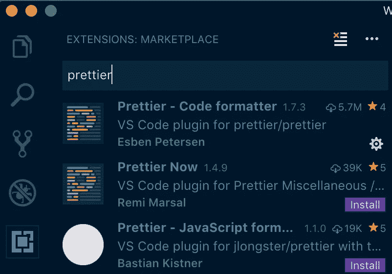
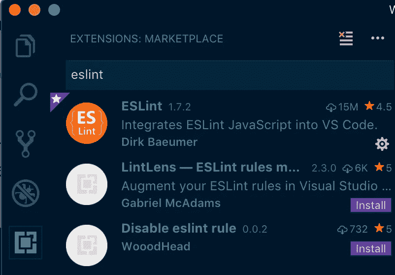
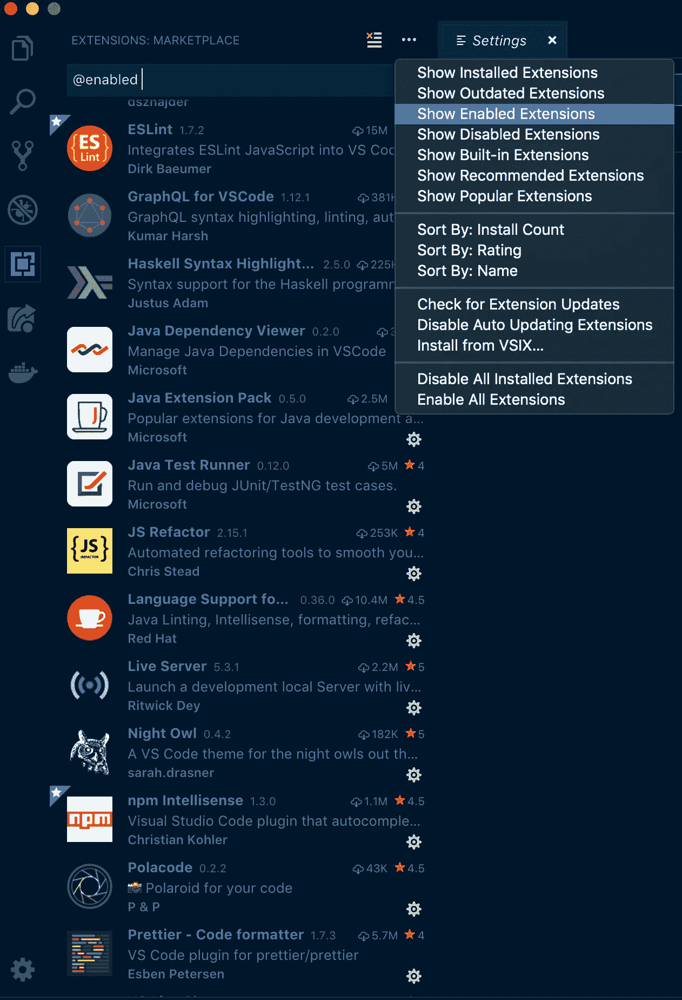
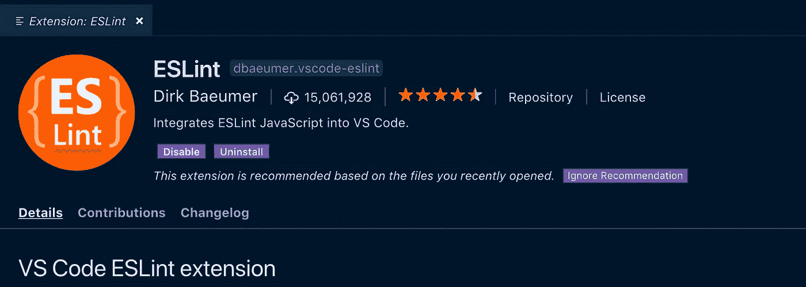
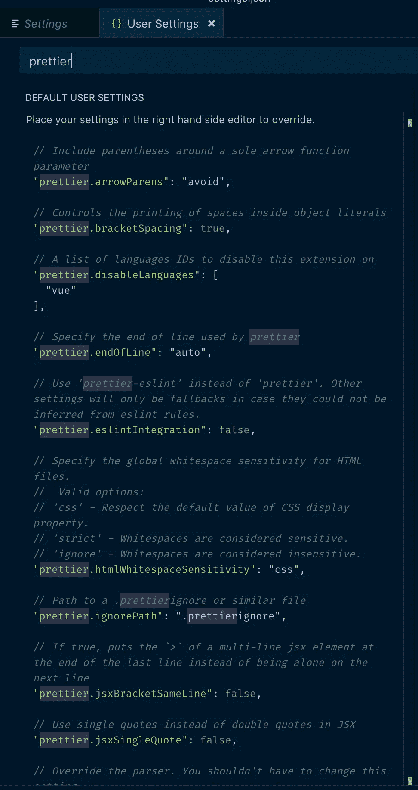
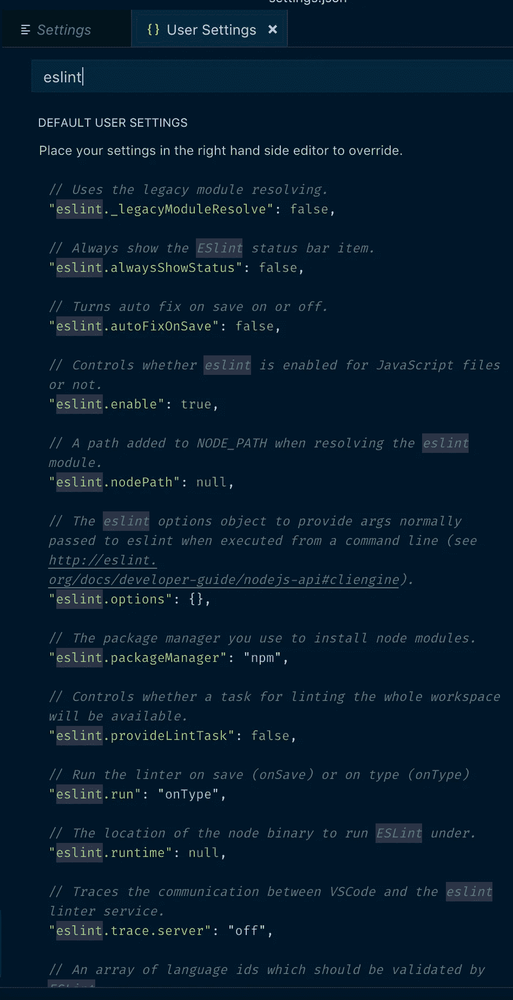
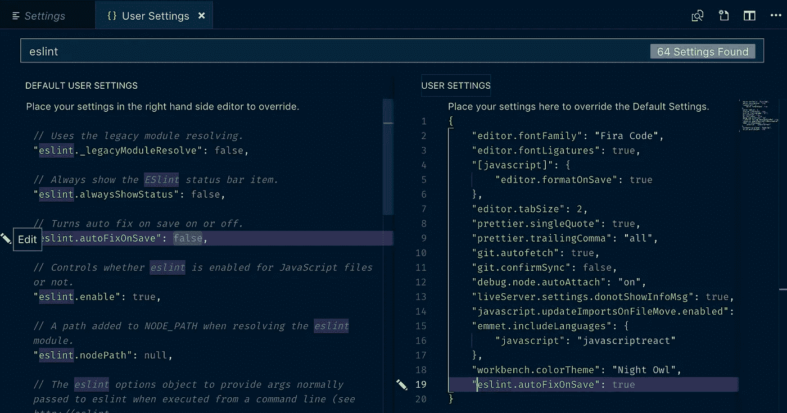
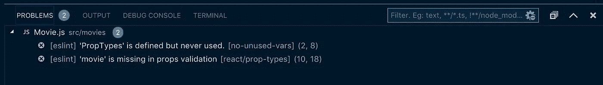

# 用更漂亮的& ESLint，用最简单的方法在开发者之间保持代码一致

> 原文：<https://itnext.io/keep-code-consistent-across-developers-the-easy-way-with-prettier-eslint-60bb7e91b76c?source=collection_archive---------0----------------------->

# 编写代码已经够难的了，不要让糟糕的格式变得更难


有点夸张，但你明白了。

# 代码格式化:这不仅仅适用于坚持己见的人和语法纳粹

他的文章是写给所有曾经和别人一起开发过应用程序(或者打算这样做)的 JavaScript 开发人员的。如果是你，继续读下去。如果你是一个 solo，摇滚明星，忍者开发者，你可以继续你的一天。

现在我已经引起了大家的注意，让我给你一个假设的(现实生活中的)例子，说明当你打开一个现有的 JavaScript 代码库时，你可能会遇到什么，这个代码库是由一个开发团队组合起来的。

您可能会看到以下部分(或全部)内容:

*   缺少分号，
*   一些行之间有大量空白，而另一些行之间没有空白，
*   运行那些让你向右滚动很长时间才能看到所有内容的行，
*   看似随机的压痕，
*   注释掉代码块，
*   已初始化但未使用的变量，
*   一些使用“严格”JS 的文件和其他不使用 JS 的文件，
*   没有空格或注释的代码块使得阅读和破译代码变得更加困难。

从我目前工作的代码库中取出这段代码:



这是一个格式不佳的代码的例子。看着不痛苦吗？是啊…

你觉得这听起来很熟悉吗？恭喜你，你在一个工作开发团队中，每个人都有自己喜欢的编码方式。

正如您可能已经能够想象的那样，一个开发人员完全可以接受的东西(任何地方都不能有空格)，可能会让另一个人抓狂。虽然一个开发人员可能每次都完美地缩进每一行，但另一个开发人员可能不在乎(并且知道 JavaScript 也不太在乎，所以她/他可以逃脱)。

这是一个难以遵循的代码库的秘诀，我不知道你怎么想，但是我发现理解和编写好的、功能性的代码已经足够困难了，而不必担心缩进、间距、跟踪变量和简单的标点符号修正。

更不用说，我讨厌成为那种对所有拉动请求发表评论，要求清理这类事情的人。没人想成为那样的人。

这也是我今天发帖的原因。

> 今天，我将借助 [Visual Studio Code](https://code.visualstudio.com/) 、[appearlier](https://marketplace.visualstudio.com/items?itemName=esbenp.prettier-vscode)和 [ESLint](https://marketplace.visualstudio.com/items?itemName=dbaeumer.vscode-eslint) 来神奇地消除一群不同开发人员的代码不一致性，并留给您美丽、统一的代码，您的开发团队甚至不必考虑格式化。

听起来好得难以置信？不是的。我保证。

# VS 拯救代码和插件

好的，让我们直接讨论代码格式问题的解决方案。如果你不熟悉的话——VS Code 是今天事实上的 [JavaScript IDE](https://2018.stateofjs.com/other-tools/) 。

理由很充分——它是免费的，很容易启动和运行，而且与它一起工作绝对是一种享受。这只是冰山一角，但是还有一百万篇其他的文章在阐述 VS 代码的神奇之处，所以我将把这些留给他们。

在此之前，我是 WebStorm 和 IntelliJ 等 JetBrains 的支持者，但在尝试了 Visual Studio 代码之后，我被说服了。

这导致…

**第一步**，如果你还没有下载，现在[下载 VS 代码](https://code.visualstudio.com/download)。解决这种格式和代码一致性问题是我们难题的关键部分。

**第二步**，是插件入门。我最喜欢 VS 代码的一点是它拥有非常健壮的插件生态系统，以及集成这些插件的便利性。你设置了一次，然后你可以忘记他们，他们只是继续工作，一个接一个的项目。

今天你的武器库中需要两个插件:[beautiful](https://marketplace.visualstudio.com/items?itemName=esbenp.prettier-vscode)和 [ESLint](https://marketplace.visualstudio.com/items?itemName=dbaeumer.vscode-eslint) 。

如果你打开 VS 代码窗口边上的 Extensions 标签，你会看到很多针对 VS 代码的扩展。



看到最左边那个方形的东西了吗？点击它来打开 VS 代码的插件搜索。

但是在我让你下载这些插件之前，让我给你一个这些扩展能为你做什么的快速概述。

## **更漂亮**


> 很简单，pretty 是一个“格式化你的 JavaScript / TypeScript / CSS 的 VS 代码包”——pretty 站点

实际上，Prettier 是一个固执己见的代码格式化程序，可以做各种有用的事情，比如:

*   将所有单引号改为双引号，
*   添加缺少的分号，
*   在花括号或方括号和变量之间放置空格，
*   设置标准制表符宽度。

这只是 Prettier 所关心的一小部分，在 VS 代码中，忽略任何你不喜欢的规则真的很容易，我稍后会谈到这一点。

更漂亮是为了保持代码格式的一致性，VS 代码插件，它可以在项目中有或没有`.prettierrc`文件的情况下工作(尽管这可能是对开发代码库的开发团队的一个很好的建议)。这将保持你的代码整洁易读，对团队中的所有开发人员都是一样的。

对我来说最大的卖点之一？

> *每次保存时，可以将漂亮器设置为自动格式化代码。*

我不需要考虑它，我不需要设置复杂的文件监视器任务，我在 VS 代码中改变一个设置，它就工作了。每次都是。句号。

我也会告诉你怎么做，但是在我到达那里之前，我需要你为 VS 代码下载更漂亮的。

在你的 VS 代码窗口中打开扩展市场(它是调试器下看起来像小方块的东西)。

这是你将在 VS Code 的扩展中搜索的第一个插件。如果你在搜索栏中输入“更漂亮”,你的搜索结果应该是这样的:



使用更漂亮的代码格式化程序。这是你想要的。

你看到第一个结果了吗？下载量 570 万还在统计的那个？那就是你要安装的。当有疑问时，寻找下载量最大的扩展，它与你认为的扩展名最接近，然后使用它。

如果你认为 VS 代码上的“安装”按钮看起来像标签或横幅，而不是完成的、可点击的按钮，我同意你的观点。但这是另一天的辩论。

一旦安装了更漂亮的扩展，我们就可以开始第二个插件了:ESLint。

## **ESLint**


> ESLint 背后的想法是:“JavaScript 是一种动态的、松散类型的语言，特别容易出现开发人员的错误。在没有编译过程的帮助下，JavaScript 代码通常被执行以发现语法或其他错误。像 ESLint 这样的林挺工具允许开发人员在不执行 JavaScript 代码的情况下发现问题。”— ESLint 网站

ESLint 非常适合您希望您的开发团队遵循的更具体、不太通用的代码风格。除非你专门设置了它，否则 ESLint 不会自动修复或重写你的代码，但它会以一种直接的方式让你知道有“规则”被破坏了。

这些规则是否包括注释掉的代码、未使用的变量或缺少的 prop-type 取决于您和您的团队，但是在您的项目中有了一个`.eslintrc`文件，它就在项目周围设置了防护栏，以确保编写的每个 JavaScript 文件都遵循与其他文件相同的标准，而不管是谁在处理它。

VS 代码的 ESLint 插件是官方的[开源 ESLint](https://eslint.org/) 工具的扩展，被谷歌、脸书、网飞等公司使用。

如果 ESLint 对他们来说足够好，那对我来说当然也足够好。

在 VS 代码扩展市场中搜索 [ESLint](https://marketplace.visualstudio.com/items?itemName=dbaeumer.vscode-eslint) 时，您会看到以下内容:



1500 万下载量的那个，就是你要的那个。

ESLint 最大的好处之一是，ESLint 中的每个“规则”集都是完全独立的。每一个都可以打开或关闭，可以添加新的规则，可以忽略不必要的规则，并且有大量的规则已经被记录为包含在一行代码中。

默认情况下没有启用任何规则，所以你可以自由添加你认为合适的规则，但很多开发团队喜欢从类似于 [Airbnb 的 ESLint 文件](https://www.npmjs.com/package/eslint-config-airbnb)这样的东西开始，它被打包成一个方便的 NPM 模块(`npm i eslint-config-airbnb`)，并根据他们的需要进行调整以适应他们的需求。

题外话:Airbnb 的整个[风格指南](https://github.com/airbnb/javascript)是如何编写 JavaScript 的一个很好的例子。我认为，Github 上的 79，000+颗星是一个很好的质量指标。但是，这是另一篇文章的题外话。

现在，让我们下载[更漂亮的](https://marketplace.visualstudio.com/items?itemName=esbenp.prettier-vscode)和 [ESLint](https://marketplace.visualstudio.com/items?itemName=dbaeumer.vscode-eslint) ，然后让它们在 VS 代码中运行。

# 设置和配置更漂亮和 ESLint

这是有趣的部分。这也是非常非常简单的部分。你会惊奇地发现这是多么的容易，而且 VS 代码的存在让我更加高兴。

一旦你下载了这些插件，是时候启用它们了。

要检查您的新插件是否已安装并启用，当仍在扩展屏幕中时，您可以单击搜索输入右上角的三个点，并从下拉列表中单击“显示已安装的扩展”或“显示已启用的扩展”,如果您的新扩展已下载/启用，ESLint 和 beauty 将显示在那里。



我的 VS 代码工作区安装并启用了 ESLint 和 appearlier。

如果没有启用，只需点击扩展并点击“启用”按钮(是的，它看起来像一个标签，但它是一个按钮)。然后重新启动 VS 代码程序，使更改生效。



如果 ESLint 没有启用，禁用按钮会显示“启用”,我可以在那里单击它来打开它。

## **默认用户设置**

太好了，现在两个插件都应该启用了，我们准备开始了。正如我之前所说的，Prettier 有很多默认设置，你可以看到启用/禁用了什么，并在这里进行任何你想全局生效的更改。

要获得这些设置，请转到**代码>首选项>设置**，然后在输入框中搜索“更漂亮”。一旦你进入常规设置，点击窗口右上角的花括号，它将带你到“默认用户设置”，在这里你可以看到所有更漂亮的设置和它们的默认设置。



在我的 VS 代码中默认漂亮的配置设置。

在这里，您可以通过在搜索框中输入“eslint”来做同样的事情，并查看默认情况下该扩展名的所有规则。



我的 VS 代码中的默认 ESLint 配置设置。

这是默认设置。很好，现在让我们稍微定制一下，因为我想让我的开发生活更加轻松。

## **自定义用户设置**

VS 代码提供了这种非常方便的方式，用它所谓的“用户设置”来覆盖特定扩展的任何默认设置。

所有这些都是一个文件，由 VS 代码使用特定于您的文本编辑器的设置生成。如果您想要覆盖特定的规则，只需将光标悬停在要修改的规则上，然后单击左侧出现的铅笔，一个名为“用户设置”的新窗口将会打开，并将该规则添加为可修改的设置。

下面是我的用户设置的一个例子，在下面截图的右边。我已经覆盖了几个更漂亮的设置:`singleQuote`和`trailingComma`，并且启用了 ESLint 的`autoFixOnSave`功能。

到目前为止，我启用的最好的东西是 Prettier 的`formatOnSave`，所以我甚至不用去想它。这是通过下面的代码片段完成的。

```
"[javascript]": {
    "editor.formatOnSave": true
}
```



单击左边的编辑铅笔，规则将被添加到右边的自定义“用户设置”中。

漂亮的`formatOnSave`是基于每种语言的，所以如果你想添加 CSS 或 HTML 或其他语言的格式，你只需要在这里添加。然后就整装待发了。

在一个 JavaScript 文件中进行更改，保存更改，代码会根据更漂亮的来重新格式化自己。很光荣。真的，到目前为止，我最喜欢的功能之一。

## **项目特定配置文件**

最后是项目特定的配置文件。这更适用于 ESLint，而不是 prettle(因为 prettle 的默认设置)，但是我会推荐一个针对团队项目的`.prettierrc`文件。

我发现当我为自己的项目编码时，直接通过 VS 代码扩展的默认设置对我来说已经足够了，但是对于开发团队来说，为了绝对确保每个人都按照相同的标准编码，可以包含那个文件以消除所有的猜测。

无论如何，为了让 ESLint 工作得最好，它需要一个位于项目根目录的`.eslintrc`文件。下面是该文件的一个示例。


`.eslintrc`文件的例子

这是一个精简的，但你得到的想法。任何要对照的规则都添加在文件的底部。

一旦这个文件存在，如果有一个规则被破坏，它将出现在内置终端在 VS 代码窗口中运行的“问题”部分。



埃斯林正在做林挺。

没有一个项目特定的`.eslintrc`文件，除非你有很多硬性的规则想要在你的自定义用户设置中设置，否则你不会从 ESLint 得到很多帮助。就我个人而言，我喜欢特定于项目的 ESLint 文件，它非常清楚地说明了规则和标准，不像 Prettier，默认情况下非常固执己见，ESLint 不会抱怨，除非你告诉它。

总结一下，VS 代码中的配置设置有点像 CSS 及其特殊性规则——设置文件越具体，VS 代码赋予它的优先级就越高。如果没有特定于项目的配置文件，VS 代码会退回到自定义用户设置，如果没有自定义用户设置，它会最后寻找默认设置。

# 结论

这就是了。您的开发团队现在已经为成功做好了准备——至少在一致的、格式良好的、干净的 JavaScript 代码方面。VS Code 使得开发人员只需很少的努力就可以实现彻底的代码林挺和自以为是的代码格式化。没有理由不同意这一点。

这些简单的技巧将加速开发，并保持每个人的代码看起来一致，即使他们都有自己独特的编码风格。

过几周再来看看，我将会写用 Java 阅读超大文件(这是我关于用 Node.js 阅读超大文件的[的两部分系列的后续)或其他与 web 开发相关的东西，所以请关注我，以免错过。](/using-node-js-to-read-really-really-large-files-pt-1-d2057fe76b33)

感谢您的阅读，我希望这能让您了解如何轻松地让您的代码与 Prettier 和 ESLint 保持一致。非常感谢鼓掌和分享！

**如果你喜欢读这篇文章，你可能也会喜欢我的其他一些博客:**

*   [调试 Node.js 最简单的方法——用 VS 代码](/the-absolute-easiest-way-to-debug-node-js-with-vscode-2e02ef5b1bad)
*   [使用 Node.js 读取非常非常大的文件(Pt 1)](/using-node-js-to-read-really-really-large-files-pt-1-d2057fe76b33)
*   [使用 Nodemailer 简化 React 应用程序中的密码重置电子邮件](/password-reset-emails-in-your-react-app-made-easy-with-nodemailer-bb27968310d7)

**参考资料和更多资源:**

*   Visual Studio 代码: [https://code.visualstudio.com/](https://code.visualstudio.com/)
*   打印机: [https://marketplace.visualstudio.com/items?itemName=esbenp.prettier-vscode](https://marketplace.visualstudio.com/items?itemName=esbenp.prettier-vscode)
*   ESLint: [https://marketplace.visualstudio.com/items?itemName=dbaeumer.vscode-eslint](https://marketplace.visualstudio.com/items?itemName=dbaeumer.vscode-eslint)
*   ESLint 文件: [https://eslint.org/](https://eslint.org/)
*   Airbnb ESLint, NPM: [https://www.npmjs.com/package/eslint-config-airbnb](https://www.npmjs.com/package/eslint-config-airbnb)
*   Airbnb 风格指南: [https://github.com/airbnb/javascript](https://github.com/airbnb/javascript)
*   JavaScript 2018 状态: 其他工具: [https://2018.stateofjs.com/other-tools/](https://2018.stateofjs.com/other-tools/)