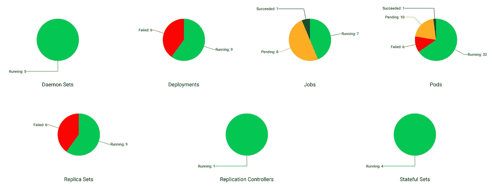

# 保持简单 K8s

> 原文：<https://itnext.io/keep-it-simple-k8s-c0c68c46eabb?source=collection_archive---------1----------------------->

使用 Jabos 的 Kubernetes GitOps

# TL；速度三角形定位法(dead reckoning)

您是否只需要在提交时将 K8s 代码自动部署到集群中，而不想读取所有代码？

[参见演示](https://www.youtube.com/watch?v=616aMiKHtks&list=PLyUsGHNHHAYx728GNeU3wFvfRJBjn3XVt&index=1)

# 但是为什么呢？

Kubernetes 和 GitOps 似乎是这些天的流行语，理论上它们听起来很棒——这就是为什么我认为“这对我们团队来说很棒！”

不幸的是，当我开始研究它时，我发现实现它需要大量的努力和对超出团队范围的概念的理解，更糟糕的是，它需要基金会团队的批准和工作，而基金会团队总是捉襟见肘。像 [Spinnaker](https://spinnaker.io/) 和 [ArgoCD](https://argo-cd.readthedocs.io/) 这样的系统可能非常好，但是它们也需要很大的努力才能开始使用，并且可能会迫使你使用特定的工具/框架。

我们最终利用现有的公司资源构建了自己的 CI/CD 管道，在一定程度上模仿了 GitOps。这种方法效果很好，但不够稳健。

这就是为什么我决定理解为什么从 Git repo 自动构建和部署代码到 K8s 集群会如此复杂，Jabos 就是这样开始的。

我真正需要的是一个工具，它可以安装在我的 K8s 集群中，访问我的 Git 存储库来获取代码，从代码中构建映像，最后将使用这些映像的新清单部署到我的 K8s 集群中。

简而言之，我只想确保我的集群状态总是尽可能接近特定分支中的最新 git 提交，而无需用户的任何干预。

我不需要验证和授权用户，因为我希望整个过程是自动化的(没有用户干预)，这也意味着我不需要任何 GUI 界面，事实上根本不需要界面。

我不需要任何关于入口的安全措施，因为唯一的交互是向外连接到我的 Git 库。

我不需要任何结构来控制部署，因为除了可以安装的任何其他扩展之外，我很乐意使用 K8s 允许的任何东西。

这就是为什么 Jabos 只会为你处理三件简单的事情:

1.  任何新的提交都会自动从 Git 中获得
2.  Docker 图像将从新提交中构建并自动推送
3.  新的清单版本将自动部署

# 但是怎么做呢？

要使用 Jabos，你只需要三样东西，如果你使用 K8s，你可能已经有了:

1.  对 K8s 集群的访问
2.  Jabos 和任何其他存储库部署的名称空间
3.  Dockerfiles 存储任何 Git 存储库
4.  清单文件存储在任何 Git 存储库中

无需配置网络、证书或访问控制列表，无需任何特权运行者、外部可见的端点或任何集群入口。

通过部署一个可以从 GitHub 下载的 yaml 文件，Jabos 将被安装到您的集群中。

安装之后，您需要告诉 Jabos 哪些映像和哪些清单需要部署到集群中，当然还要告诉他们应该从哪个 Git 存储库中取出。

然后，Jabos 将开始轮询最新的提交、拉取更改、构建和部署—所有这一切都无需任何人工干预。

# 关于内部的一些情况…

Jabos 使用 K8s 名称空间来隔离不同的环境，并提供多租户。

Jabos 不会暴露任何外部端点来降低安全风险。

Jabos 不提供任何部署策略——它只是使用“kubectl apply”来部署您的清单。因此，可以使用任何可用的策略或扩展的 K8s APIs。

Jabos 支持从公共存储库克隆 Git，也支持对私有存储库使用 SSH。这允许从 GitHub、GitLab 和任何托管的私有安全 Git 库进行克隆。

Jabos 支持多种格式的清单:Yaml/Json(纯文本)， [Helm](https://helm.sh/) 模板， [Kustomize](https://kustomize.io/) 模板和 [Jsonnet](https://jsonnet.org/) 模板。

Jabos 使用 [Kaniko 项目](https://github.com/GoogleContainerTools/kaniko)来构建和推送映像，并允许将映像推送至不安全注册中心以及安全注册中心、任何托管注册中心以及 Docker Hub(公共和私有)、AWS (ECR)和 GCP (GCR 和工件注册中心)。

# 更多信息

你可以在这里找到关于如何设置和使用[的文档。](https://github.com/srfrnk/jabos)

API 文档可以在[这里](https://srfrnk.github.io/jabos/)找到。

演示视频可以在这里找到:

1.  [Minikube 设置](https://youtu.be/616aMiKHtks)
2.  [jabo 和先决条件](https://youtu.be/Ex5hi3GOkjg)
3.  [配置 CRDs](https://youtu.be/PqMUliEHx60)
4.  [推送变更并触发构建](https://youtu.be/OlB6qybsqng)