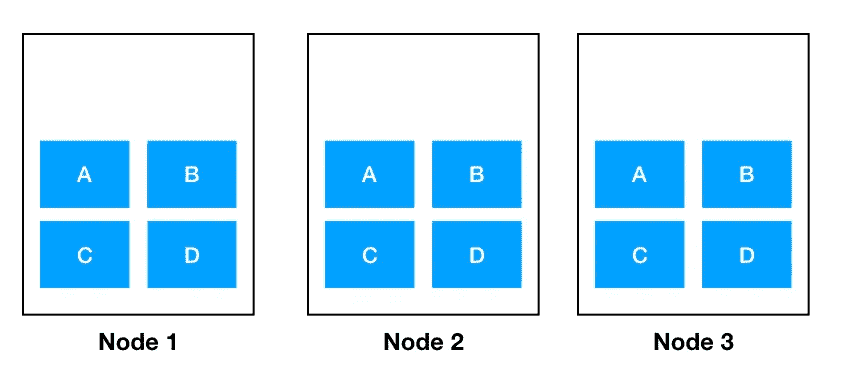
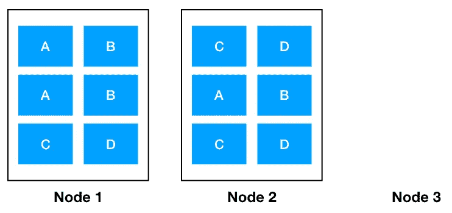
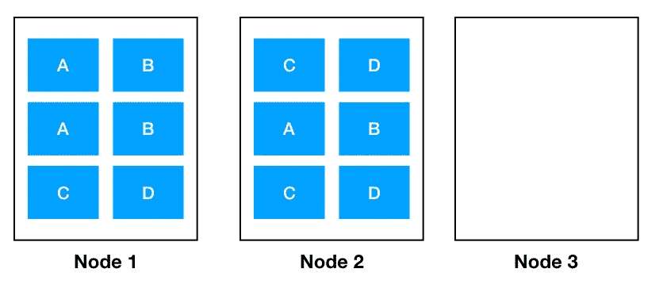
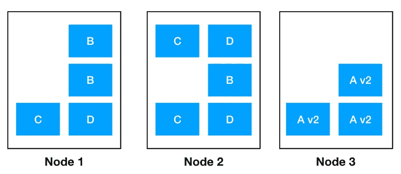
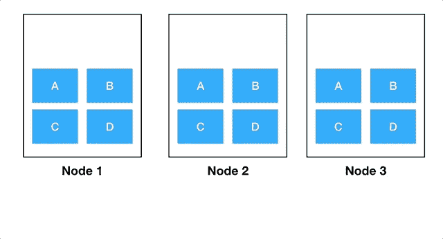

# 保持 Kubernetes 集群的平衡:高可用性的秘密

> 原文：<https://itnext.io/keep-you-kubernetes-cluster-balanced-the-secret-to-high-availability-17edf60d9cb7?source=collection_archive---------0----------------------->


那些 photoshop 技巧有什么用处

# Kubernetes 调度程序

您可能知道，Kubernetes 集群由主节点和工作节点组成。**调度器**是主节点中的一个组件，它负责决定哪个工作节点应该运行给定的 pod。

> 调度是一项复杂的任务，就像任何优化问题一样，你总会发现这样一种情况，在人眼看来，结果可能是次优的。

尽管如此，默认调度程序做得相当不错。它遵循常识性策略，例如避免在同一节点上调度 pod 的多个副本，或者避免在其他节点分配不足时使一个节点过载。

我不熟悉默认调度程序背后的代码，但是我的观察告诉我，平衡节点工作负载比防止在同一个节点上重复运行更重要。

> 这意味着您可能会发现自己处于这样一种情况:一个 pod 的所有副本都在同一个节点上。

因此，如果节点停机(您应该假设它会停机)，可用性将会受到影响。

有趣的是，Kubernetes 通常通过严格执行某种状态来工作。例如，如果你说你想要三个 pod`A`，Kubernetes 会立即产生新的 pod，如果这个数字低于三。**这不是调度的情况。** Kubernetes 在创建 pod 时会尝试智能地展开它们，但不会在之后主动执行良好的展开。

> 调度仅发生在 pod 创建时。

# 高可用性

运行一个 pod 的多个副本不能保证高可用性，但是没有它就无法实现高可用性。出于显而易见的原因，您不应该在同一个节点上拥有一个 pod 的所有副本。

高可用性不是一个绝对的概念；你永远不可能 100%高可用。如果所有节点同时停止运行，您的应用程序如何可用？

因此，您通常需要选择一个您满意的可用性级别。例如，如果您在三个独立的可用性区域中运行三个节点，您可以选择对单个节点故障进行恢复。失去两个节点可能会使您的应用程序停止运行，但是在不同的可用性区域失去两个数据中心的可能性很低。

> 底线是没有通用的方法；只有你能知道什么对你的企业有效，以及你认为可接受的风险水平。

# 当平衡成为一个问题时

让我们来看一个场景，其中调度可能危及可用性。



理想调度

假设我们从一个理想的调度状态开始。我们有四个服务`A`、`B`、`C`和`D`，每个都可以运行三个副本。

如果节点 3 发生故障，主节点将会注意到我们只有两个服务单元。主节点将立即在剩余的健康节点上重新调度其中一个。这可能会导致:



节点 3 失效，其余节点分担负载

一段时间后(通常是几分钟)，您的云提供商将注意到一个节点关闭，并将旋转另一个节点。当该节点准备就绪时，我们最终会得到这样一个群集:



不平衡的集群


这里没什么要补充的

群集是不平衡的，但是可用性没有丧失，但是…如果我们失去任何节点，我们仍然有每个 pod 的至少一个副本在运行。

然而，让我们看看当我们通过发布新版本的服务`A`开始请求调度程序时会发生什么。这通常通过**滚动部署**来完成。

Kubernetes 将启动一个新的 pod 进行服务`A`，等待 pod 准备好，并杀死一个旧的 pod。它继续这样做，直到所有的旧荚已被取代。

因此，调度程序被要求放置一个新的`A v2`pod——唯一可以这样做的地方是节点 3。到目前为止一切顺利。但是，它应该把另外两个放在哪里呢？如上所述，调度器试图避免在同一节点上有重复，但是在这种情况下，与其他节点相比，节点 3 被严重利用不足。因此，所有新的`A v2`pod 都将被安排在节点 3 上的可能性**很高**，这将导致这种情况:



现在我们有一个问题:所有的`A`吊舱都在一个节点上。如果节点 3 再次发生故障，我们将失去服务`A`的可用性。

整个过程用这张宏伟的 GIF 来描述:



# 取消调度程序

恢复秩序的一个方法是做一点混乱工程。调度程序只能在创建 pod 时修复平衡问题。所以让我们用杀戮来强迫创造新的豆荚吧！

进入[解调度器](https://github.com/kubernetes-incubator/descheduler)。这个项目作为 Kubernetes [作业](https://kubernetes.io/docs/concepts/workloads/controllers/jobs-run-to-completion/)运行，目的是当它认为集群不平衡时杀死 pod。您可以运行它一次，或者作为 [Cron 作业](https://kubernetes.io/docs/concepts/workloads/controllers/cron-jobs/)定期运行它。

安装非常简单，在 GitHub 页面上有很好的解释。

您可以使用多种策略来删除 pod，这些策略在[配置图](https://kubernetes.io/docs/tasks/configure-pod-container/configure-pod-configmap/)中定义。我们来回顾其中的两个。

```
apiVersion: "descheduler/v1alpha1"
kind: "DeschedulerPolicy"
strategies:
  "RemoveDuplicates":
     enabled: false
```

使用`RemoveDuplicates`策略，解调度器将在一个节点上找到相同的 pod。然后它会杀死其中的一些，希望调度程序会将 pod 调度到另一个节点上。

请注意，它不适用于上面概述的场景。这是因为我们还没有解决工作负载平衡的问题。

然而,`LowNodeUtilization`策略对此有所帮助:

```
apiVersion: "descheduler/v1alpha1"
kind: "DeschedulerPolicy"
strategies:
  "LowNodeUtilization":
     enabled: true
     params:
       nodeResourceUtilizationThresholds:
         thresholds:
           "cpu" : 20
           "memory": 20
           "pods": 20
         targetThresholds:
           "cpu" : 50
           "memory": 50
           "pods": 50
```

您必须定义节点利用不足和过度利用的含义。在本例中，如果一个节点的 CPU 利用率**低于 20%,内存利用率**低于 20%**并且**的 pod 少于 20 个，则认为**未充分利用**。如果某个节点的 CPU 利用率超过 50%**或内存利用率超过 50%**或**超过 50 个 pod，则认为**过度利用**。**

为了使该策略起作用，解调度器将需要找到至少一个未充分利用的节点和一个过度利用的节点。

和往常一样，没有放之四海而皆准的通用利用率参数。你需要调整它们，找出最适合你的。

如果你真的对自己的可用性有信心，你可以每小时运行一次这个任务。否则，您可以在夜间运行，此时对交通的影响较小。在后一种情况下，连续运行几次可能会很有用。例如，您可以在每天凌晨 3 点、3 点 15 分和 3 点 30 分运行它。

总之，请记住，如果不进行积极的测试，高可用性是不可能实现的。如果您不终止节点并测试灾难场景，您的系统**将会经历停机**。

保持集群的平衡并不能保证高可用性，但肯定有助于实现这一目标。

如果有必要，您还可以尝试高级的日程安排技术。你可以在这里和这里找到关于这个[和](https://kubernetes.io/blog/2017/03/advanced-scheduling-in-kubernetes/)[的信息。也值得看一看](https://thenewstack.io/implementing-advanced-scheduling-techniques-with-kubernetes/) [pod 亲和反亲和](https://kubernetes.io/docs/concepts/configuration/assign-pod-node/#affinity-and-anti-affinity)。

https://twitter.com/cesarTronLoza 我