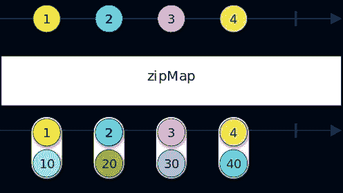
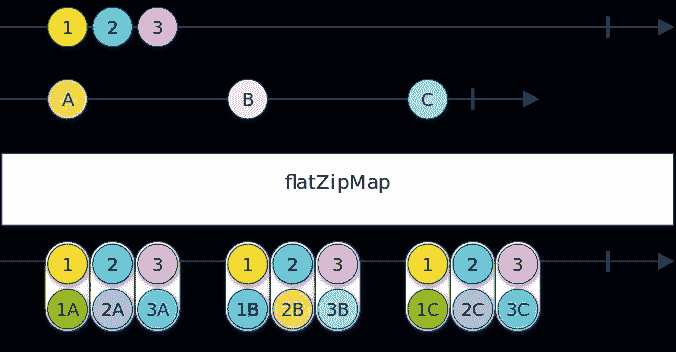

# 在 RxJS 中转换时保持原始值

> 原文：<https://itnext.io/keeping-original-value-when-transforming-in-rxjs-f4650e12c4cf?source=collection_archive---------3----------------------->

## 来自“方便的 RxJS 操作符”系列

2022 年 2 月 28 日最新更新:更新代码以支持 RxJS 7 等。

异步流是新时代编程最可爱的地方。当我用 Java 开发的时候，RxJava 是唯一让 Java 变得可以忍受的东西。当我开始在 Angular 上开发时，我很高兴一切都是原生的 RxJS。然后，当我在新工作岗位上开始创建 Node.js 后端项目时，我把所有东西都做成 RxJS。但是，有时候 API 会让你的代码看起来乏味或者混乱。

在许多情况下，当使用`map`(或`mergeMap`)转换一个可观察对象时，您也想访问原始值。使用当前的 RxJS API，有几种方法可以做到这一点。

# 不良做法

一种方法是将值存储在局部变量中，然后对其进行转换:

清单 1。将可观察值存储在局部变量中

这样做有很多缺点。一般来说，变异会伤害你的代码。当你在异步语言/范式/平台中变异你的变量时，你创造了[自杀的超级变种人](https://fallout.gamepedia.com/Super_mutant_suicider)，它们发出嘟嘟声等待爆炸。


下面是一个很好的例子:

清单 2。使用这种方法的缺点是:整型和字符串型值不同步

如果转换需要一些时间来完成(例如，当在数据库中存储一些东西并检索更新的文档时)，访问存储的原始值可能太晚了。在清单 2 中，`value`在第一次被访问之前被覆盖。

# 良好实践

更好的做法是将值转换为包含原始值的元组:

```
map(v => ([v, `${v}`]))
```

但是，当转换返回一个可观察值时，它看起来会很乏味:

```
flatMap(id => zip(of(id), repository.getById(id)))
```

下面是一个活生生的例子:

清单 3。使用 zip 进行转换并保持原始值

# 更好的实践

两个操作符`zipMap`和`flatZipMap`提供了现成的“转换结果的压缩”。

```
zipMap(x => `${v}`)
```



图一。zipMap 的大理石图

此外，当转换返回一个可观察值时，它看起来很简洁:

```
flatZipMap(repository.getById)
```



图二。flatZipMap 的大理石图

使用清单 3 中的`flatZipMap`，代码如下所示:

清单 4。使用 flatZipMap 来转换

# 结论

要使用可观察对象的原始值，将可观察对象的值转换为元组，并将原始值保留为坐标之一。操作符`zipMap`和`flatZipMap`使得这样做很容易。此外，当其中一个值不再需要时，可以使用操作符`projectToFormer`和`projectToLatter`轻松地将其删除:

清单 5。使用 projectToLatter

要了解更多信息，请参考以下链接:

*   [《13 个得心应手的 RxJS 操作者》](/13-handy-rxjs-operators-ab5a9a1db60)中篇
*   [RxJSx GitHub 库](https://github.com/rxjsx/rxjsx)
*   在 Twitter 上关注[我，获取关于该主题的更多更新](https://twitter.com/MohammadAliEN)