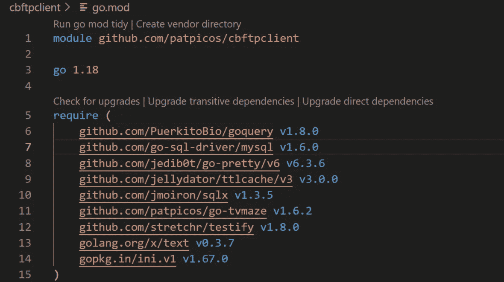
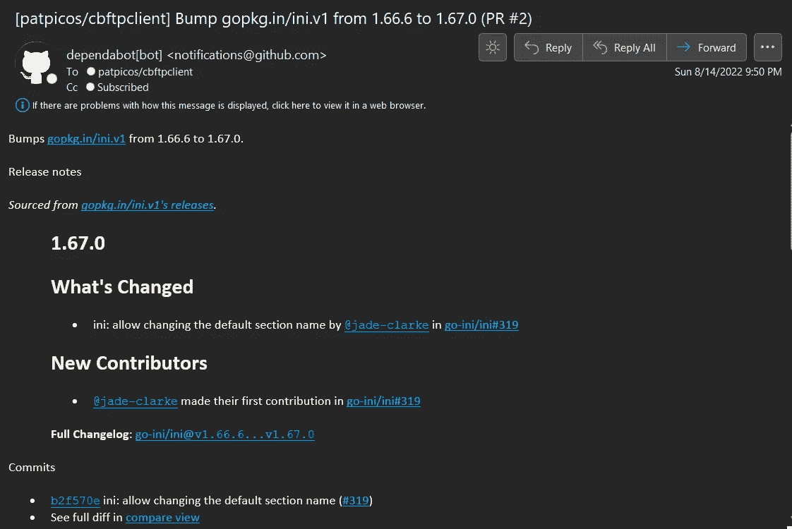

# 使用 Dependabot 保持软件依赖关系最新

> 原文：<https://itnext.io/keeping-software-dependencies-up-to-date-with-dependabot-79e0f17bcf18?source=collection_archive---------3----------------------->

最近，我找到了一个长期以来一直想做的兼职项目，将我用 Perl 编写的一个应用程序替换成 Golang(是的，我知道……Perl！).随着我的代码库的增长，我对第三方库的使用也在增加。

首先，我会使用 VSCode 并检查 go.mod 文件中的更新，并经常更新它们。当您积极开发解决方案时，这是一种非常有效的方法。但是一旦进入运行和稳定模式，应用程序通常会落后于保持依赖关系的更新。让软件保持最新，就像操作系统补丁一样，可以解决安全漏洞、错误和性能改进。



更新依赖关系的 VSCode 方法

我浏览了一下 GitHub 的功能，想看看我的项目能得到什么样的统计数据(纯粹出于好奇)，注意到了标签“安全”→“代码安全和分析”。维护项目/存储库中安全性的一个选择是使用 Dependabot。[dependent bot](https://github.com/dependabot)是一个 GitHub 动作，它按计划运行，检查你对上游资源的依赖性。如果它发现新版本，它可以提交一个针对您的项目的请求！

Dependabot 能够管理大多数编程语言的第三方依赖性。它的配置是一个简单的 YAML，大约有 5 行配置。结果是一个 YAML 文件。github/dependent bot . yml。

下面是我的 golang 项目的配置:

```
# To get started with Dependabot version updates, you'll need to specify which
# package ecosystems to update and where the package manifests are located.
# Please see the documentation for all configuration options:
# [https://docs.github.com/github/administering-a-repository/configuration-options-for-dependency-updates](https://docs.github.com/github/administering-a-repository/configuration-options-for-dependency-updates)version: 2
updates:
  - package-ecosystem: "gomod" # See documentation for possible values
    directory: "/" # Location of package manifests
    schedule:
      interval: "weekly"
```

下面是一个样本拉请求电子邮件，其中包含有用的信息，从依赖关系的变化



拉取请求电子邮件

这个动作负责一个简单的家务，并且做得很好。将这与自动化测试和发布结合起来，你就有了“自我维护”的软件。