# 开发人员的键盘快捷键

> 原文：<https://itnext.io/keyboard-shortcuts-for-a-developer-e6d1203774f6?source=collection_archive---------0----------------------->

欢迎光临！今天我们将学习开发人员的键盘快捷键

 [## boring 开发者

### 欢迎回到 Instagram。登录查看您的朋友、家人和兴趣爱好捕捉和分享了什么…

www.instagram.com](https://www.instagram.com/theboringdeveloper/) 

别忘了看看*现场模板-*

 [## 实时模板— Flutter

### 欢迎光临！今天我们将学习 flutter 的实时模板。

medium.com](https://medium.com/swlh/live-templates-flutter-6e48683e14e0) 

# 让我们来谈谈键盘快捷键

如果你正在看这个博客，那么很可能你是一个开发者。

今天，我将向你展示键盘快捷键，这将提高你的键盘技能。

***学习的关键是-***

> 练习！练习！练习！

你将会到达一个点，键盘快捷键对你来说会很容易，你会开始自然地使用它们。

**现在够理论了！！让我们跳到实际部分。**

## 0.主页键

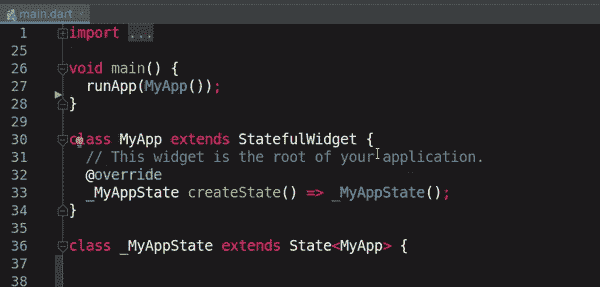

> 将光标移动到行首

这是我最喜欢的钥匙之一:)很神奇

## 1.结束键

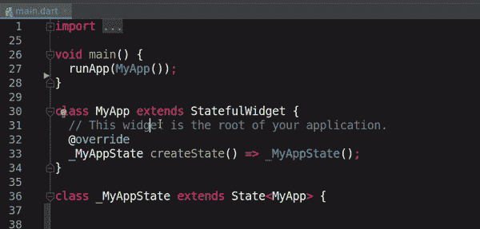

> 将光标移动到行尾

另一把神奇的钥匙。

## 2.Shift + Home

> 从当前光标位置选择到行首

## 3.Shift + End

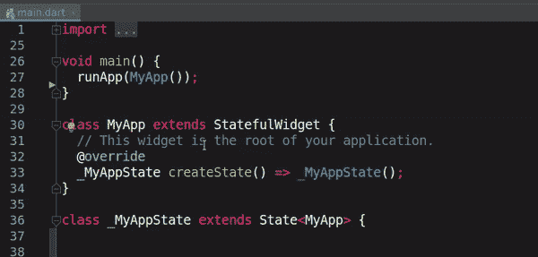

> 从当前光标位置选择到行尾

## 4.Ctrl + Home

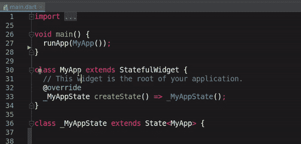

> 将光标移动到当前文档的开头

## 5.Ctrl + End

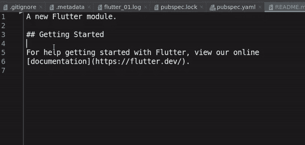

> 将光标移动到当前文档的末尾

## 6.Ctrl +右箭头键

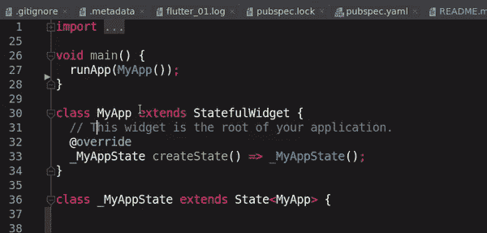

> 将光标移动到下一个单词或当前单词的末尾

## 7.Ctrl +向左箭头

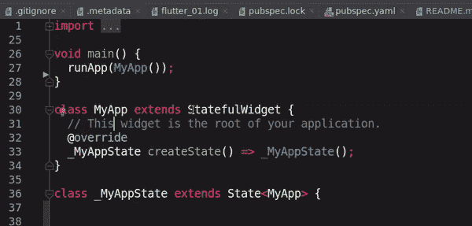

> 将光标移动到当前单词的开头

## 8.下一个错误(F2)

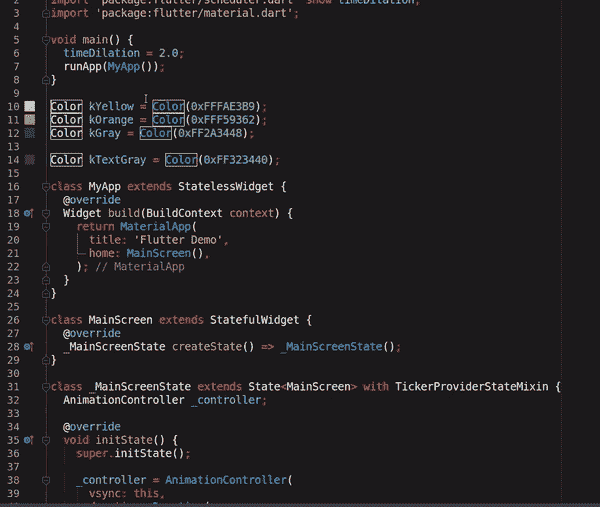

> 将光标移动到下一个错误

## 9.上一个错误(Shift + F2)

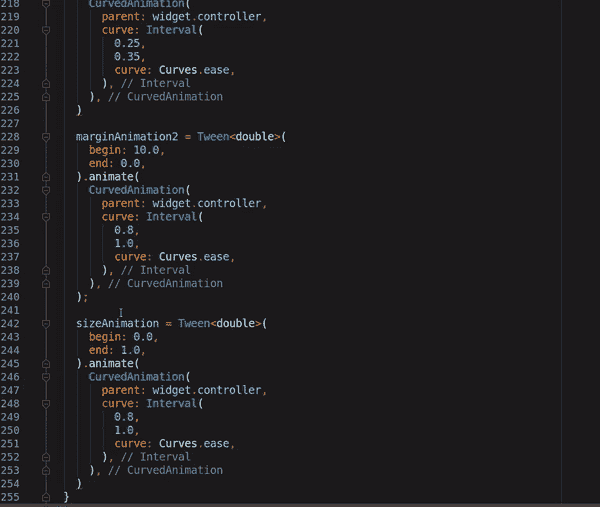

> 将光标移动到上一个错误

## 10.重复行(Ctrl + D)

## 11.展开选择(Ctrl + W)

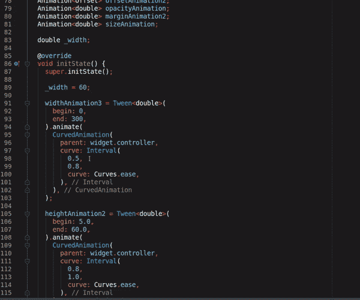

## 12.转到文件(Ctrl + N)

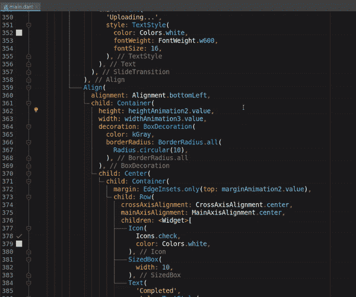

## 13.**转到类(Ctrl + Shift + N)**

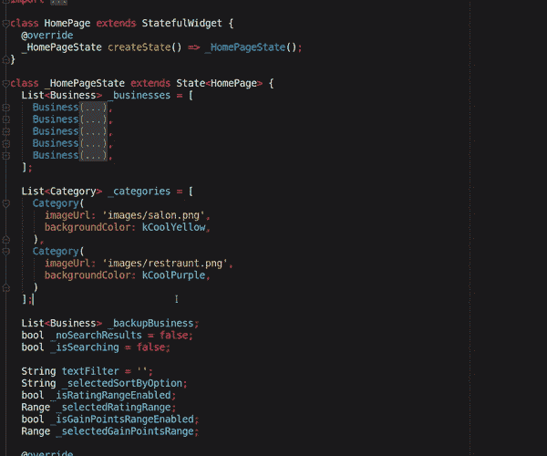

## 14.添加 Dart 文件(Alt + A，Alt + D)

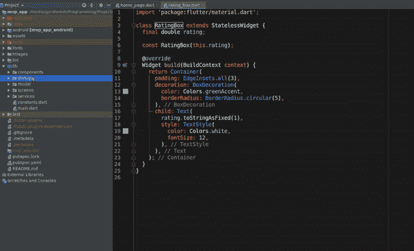

> 根据自己的喜好改吧，可能是 Android 的 Kotlin 或者 Java

## 15.添加包(Alt + A，Alt + P)

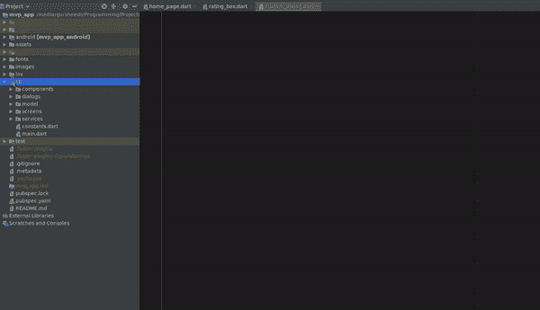

## 16.重构(Shift + F6)

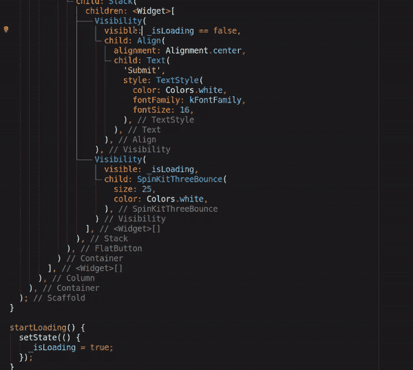

## 17.转到声明(Ctrl + B)

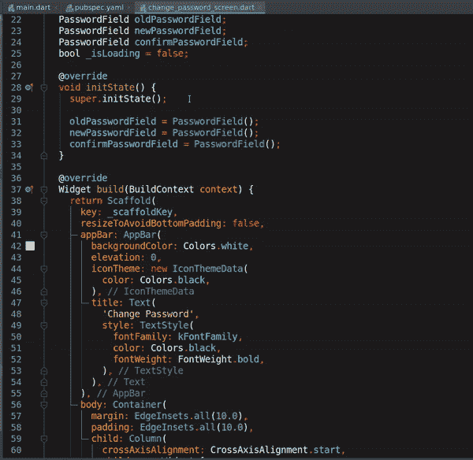

## 18.显示快速操作(Ctrl + Shift + A)

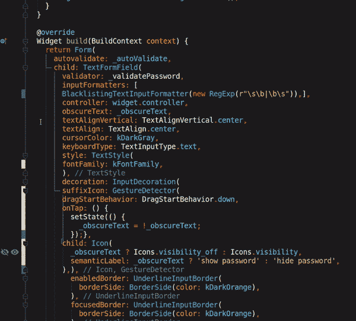

> 当你忘记任何快捷方式时使用它，你会在这里找到它们中的大多数

## 19.将光标移动到下一个驼峰(Alt +右箭头键)

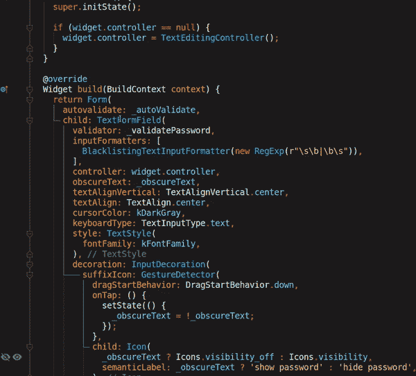

## 20.选择直到下一个驼峰(Shift + Alt +右箭头键)

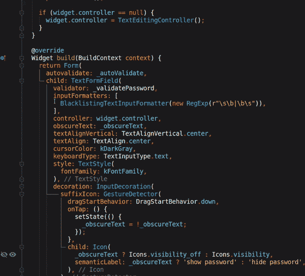

## 21.将光标移动到上一个驼峰(Alt +左箭头键)

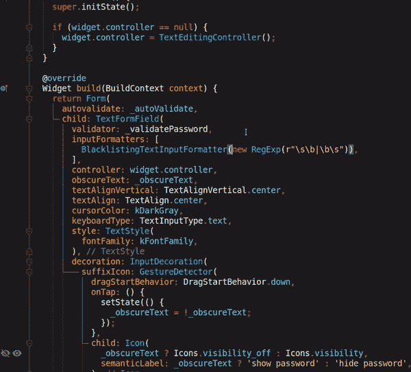

## 22.选择直到上一个驼峰(Shift + Alt +右箭头键)

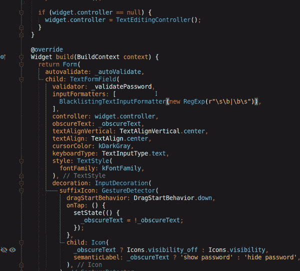

## 23.删除到上一个驼峰

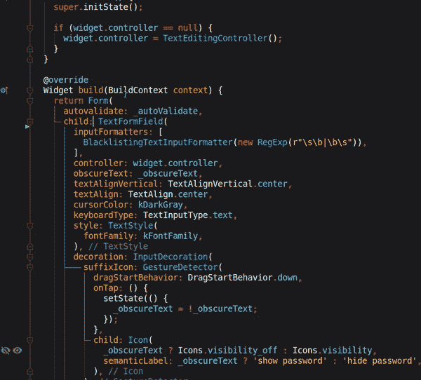

这是你现在应该有的感觉-

> 谢谢你坚持到最后

# 扑博客-

 [## 实时模板— Flutter

### 欢迎光临！今天我们将学习 flutter 的实时模板。

medium.com](https://medium.com/swlh/live-templates-flutter-6e48683e14e0)  [## Instagram stories swiper — Flutter

### 欢迎使用本教程创建像 swiper 一样的 instagram 故事！

levelup.gitconnected.com](https://levelup.gitconnected.com/instagram-stories-swiper-flutter-bb53f9377431)  [## 信用卡滑块—颤动

### 欢迎来到本教程，创建一个可怕的信用卡滑块。

levelup.gitconnected.com](https://levelup.gitconnected.com/credit-card-slider-flutter-1edec451103a)  [## 更新应用程序— Flutter

### 欢迎来到本教程，为你的 flutter 应用程序添加更新应用程序

medium.com](https://medium.com/swlh/update-app-flutter-402c528235e4)  [## 颤动:TabBar 的自定义标签指示器

### 欢迎学习本教程，为 Flutter 中的 TabBar 创建一个自定义的标签指示器。

medium.com](https://medium.com/swlh/flutter-custom-tab-indicator-for-tabbar-d72bbc6c9d0c)