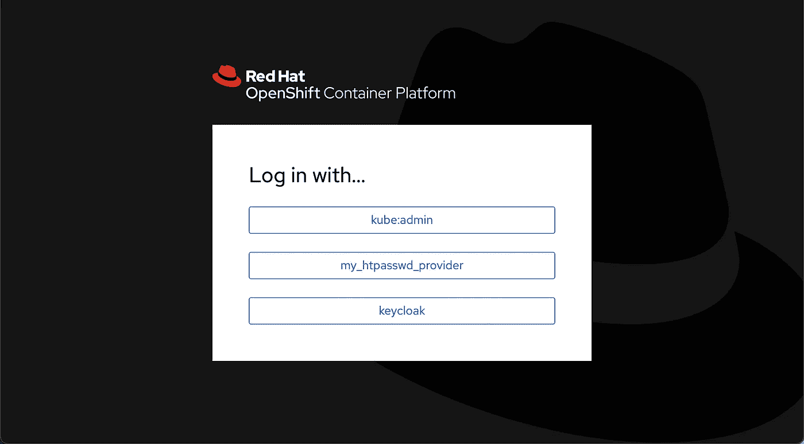
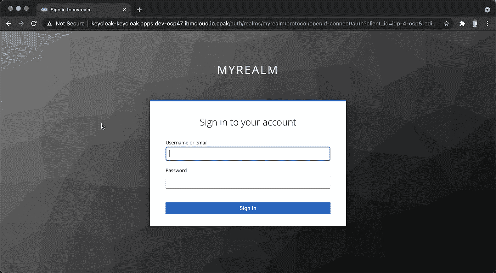
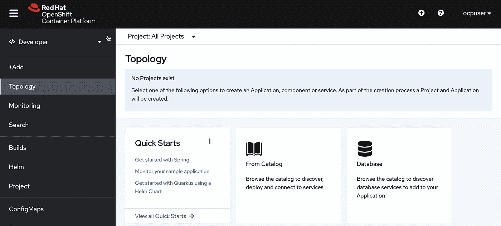
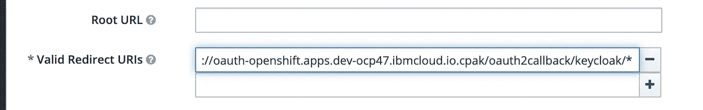

# 用于 OpenShift 的 Keycloak OIDC 身份提供程序

> 原文：<https://itnext.io/keycloak-oidc-identity-provider-for-openshift-156a2ae75b9c?source=collection_archive---------3----------------------->


让我们探索一下如何集成一个 OpenID Connect (OIDC)实现 keycloak，作为 OpenShift 的身份提供者，而不是常见的 HTTPasswd、LDAP。

## OpenShift 上的设置键锁

从 OperatorHub 安装 Keycloak 操作符，在 keycloak 的名称空间中创建一个 keycloak 实例。一旦 pod 运行，我们就可以访问管理 web 界面。从名称空间中相应的 Secret 对象获取 admin 用户及其密码。

创造我们自己的境界，`myrealm`，第一。

其次，创建名为`idp-4-ocp`的客户端。在“设置”选项卡中，将“访问类型”选择为“机密”。出于测试目的，将“验证重定向 URIs”设置为“https://*”。保存后，您将看到凭据选项卡。记录为此客户端创建的密码，例如`909e58f1-d373–4af3-ab65-de073a54322a`

创建一个测试用户 ocpuser，在 credential 选项卡中设置密码。

## 创建 OIDC 身份提供者

首先，使用上一步中记录的值在`openshift-config`名称空间中创建一个客户机秘密。

```
oc -n openshift-config create secret generic keycloak-client-secret --from-literal=clientSecret=909e58f1-d373–4af3-ab65-de073a54322a
```

现在捕获用于 kyecloak https 访问的 CA 证书。在操作员版本中，创建了一条 OpenShift 路线。为了让身份提供者信任此路由中使用的证书，我们需要提取 CA 并将其添加到提供者的配置中。路由的证书由 route-ca 签名，提取出来并保存为文件。

```
oc -n openshift-ingress-operator get secret router-ca -o jsonpath="{ .data.tls\.crt }" | base64 -d -i > ca.crt
```

在`openshift-config`名称空间中创建一个配置映射，

```
oc -n openshift-config create cm keycloak-ca --from-file=ca.crt
```

请注意，密钥是文件名 ca.crt。

最后，我们可以在 oauth 集群配置中添加新的身份提供者。我已经有了 HTPasswd ID 提供程序。添加如下的 keycloak OpenID 定义，

```
apiVersion: config.openshift.io/v1
kind: OAuth
metadata:
  name: cluster
spec:
  identityProviders:
  - htpasswd:
    .... - name: keycloak 
    mappingMethod: claim 
    type: OpenID
    openID:
      clientID: idp-4-ocp
      clientSecret:
        name: **keycloak-client-secret**
      ca:
        name: **keycloak-ca**
      claims: 
        preferredUsername:
        - preferred_username
        name:
        - name
        email:
        - email
      issuer: https://keycloak-keycloak.apps.dev-ocp47.ibmcloud.io.cpak/auth/realms/myrealm
```

注意发布者是下面这个命名的 https:// <router url="">/auth/realms/<realm name=""></realm></router>

## 使用 Keycloak 身份验证登录

再次确认 open shift-authentic ation-operator 和 key-cover 的 pod 日志中没有错误。

现在登录到 OpenShift Web 控制台，



选择 keycloak，弹出 Keycloak 的登录页面，



使用 ocpuser 及其密码登录，默认的 OCP 页面出现



这样，您可以使用 oc 命令进一步分配权限。

***一些小技巧:***

检查 open shift-authentic ation-operator 和 keycloak 的 pod 日志，以调试 OCP 和 keycloak 之间的集成。

检查 openshift-authentication 名称空间下的 pod，以了解用户登录问题。

为了使验证 URL 更紧密，可以基于从上面的测试中捕获的重定向 URL，使用以下内容更新 URL。

```
https://keycloak-keycloak.apps.dev-ocp47.ibmcloud.io.cpak/auth/realms/myrealm/protocol/openid-connect/auth?client_id=idp-4-ocp&redirect_uri=https%3A%2F%2Foauth-openshift.apps.dev-ocp47.ibmcloud.io.cpak%2Foauth2callback%2Fkeycloak&response_type=code&scope=openid&state=Y3NyZ...
```

