# Kibana 7.x —定制、过滤、共享和保存选项

> 原文：<https://itnext.io/kibana-7-x-options-to-customize-filter-share-and-save-120b8ca5d9a8?source=collection_archive---------0----------------------->

**定制、过滤、分享&保存**

Kibana 是一个开源分析和可视化平台，旨在与 Elasticsearch 合作。Kibana 可用于搜索、查看和交互存储在 Elasticsearch 索引中的数据。然而——Kibana UI 是如此健壮和详尽，以至于有多个选项可以定制、过滤(KQL vs Lucene vs DSL)、共享和保存

本文旨在介绍如下可用功能:

1.  自定义时间范围
2.  自定义显示
3.  Kibana 搜索类型(自由形式、基于字段和基于过滤器的搜索类型)
4.  对已定义过滤器的可用操作
5.  基于过滤器的搜索—可点击的选项
6.  使用 Lucene 语法的高级搜索(通配符与模糊性)
7.  KQL vs Lucene 语法
8.  DSL 匹配与多匹配
9.  共享日志—永久链接与 CSV 报告

为了使文章具有互动性，json 文档样本张贴在 https://github.com/sandeepmanchi/kibana-7x 的[。下载内容并按照自述文件的说明将这些内容发布到 elasticsearch，并使用这些文档在整篇文章中获得互动体验](https://github.com/sandeepmanchi/kibana-7x)

# 自定义时间范围:

*   默认— Kibana 始终显示 15 分钟前的数据，但这可以自定义
*   有两种选择:
*   相对:例如，24 小时前、30 分钟前、10 年前
*   绝对:10 月 5 日凌晨 01:00 到 10 月 5 日凌晨 03:00

## 示例:

*   **例 1:相对设置**

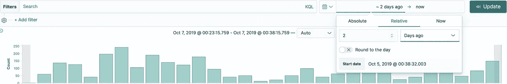

**相对设置—例如:2 天前**

*   **示例 2:绝对设置**

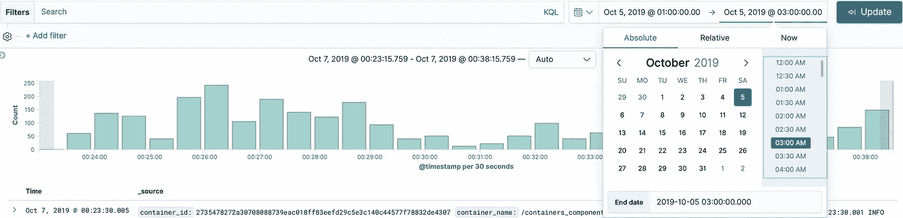

**绝对设置—示例:选择特定时间段**

# 自定义显示:

通过将“可用字段”部分的字段添加到“选定字段”部分(在左侧)，可以自定义用户的查看显示

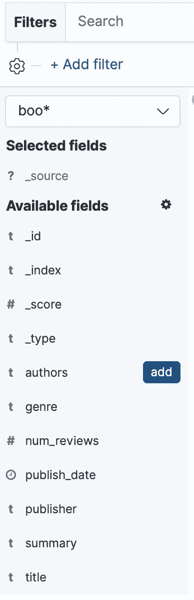

**点击“添加”将使该字段可用**

# 基巴纳搜索类型:

1.  自由格式文本
2.  基于字段的搜索
3.  基于过滤器的搜索

# 自由格式文本:

*   在文档中所有可能的字段中执行搜索
*   效率极低；尤其是在搜索大量文档或更长的时间范围时

## 示例:

*   **示例 1:搜索单词“system”(不带单引号)**

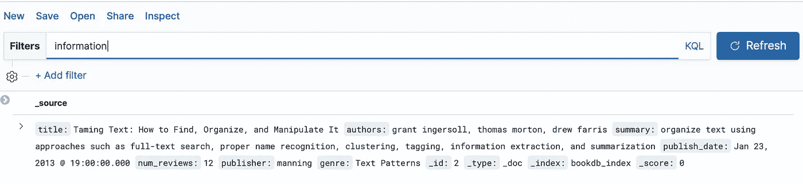

**针对整个文档搜索单个单词**

# 基于字段的搜索:

*   可以使用文档中指定的字段(一个或多个)启动搜索—有点类似于针对表编写具有特定字段的选择查询
*   在字段之间可以使用 AND 或 OR 运算符
*   搜索机制可以针对特定领域的全部或部分价值

## 示例:

*   **示例 1:搜索值为“弹性”的字段“流派”**

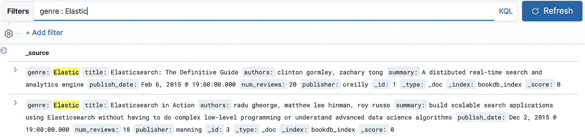

**根据特定字段搜索特定值**

*   **示例 2:使用 AND 运算符**搜索多个字段

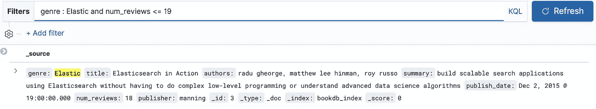

**使用 AND 运算符和数字比较搜索多个字段**

*   **例 3:用 or 运算符搜索多个字段**

如果需要，搜索也可以包括相同的字段类型

**用 OR 运算符搜索相同字段但不同的值**

# 基于过滤器的搜索:

一种直观的搜索特定字段的方式，用户可以即时访问文档中所有可用的字段，而不必记住或参考示例文档来获取字段名

更多可应用于单个字段的运算符选项:

*   是
*   不是
*   是以下之一
*   不是其中之一
*   存在
*   不存在

如果应用了基于多个过滤器的搜索，则该搜索将作为增量搜索。例如，如果有 100 条记录，并且用户应用了检索 30 条记录的过滤器 1。现在，如果用户同时应用过滤器 2 和过滤器 1，那么将在检索到的 30 条记录中进行搜索

自定义标签可以应用于特定的过滤器类型，以便更直观地阅读

可以对定义的过滤器执行多种操作，如包括、排除、禁用、启用等。

## 示例:

*   **示例 1:直观的字段特定选择**

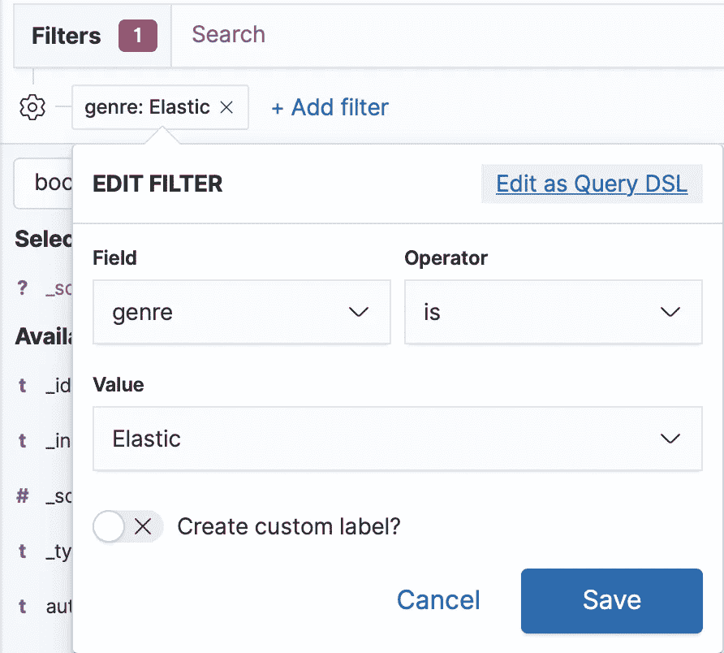

**搜索特定字段**

*   **示例 2:增量搜索—多个过滤器—正面示例**

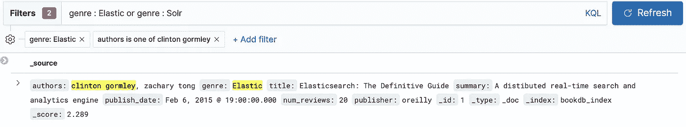

**多重过滤器——加法方法**

*   **示例 3:增量搜索—多个过滤器—否定示例**

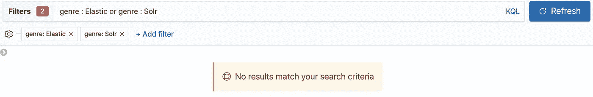

**多重过滤器—加法方法—否定示例**

*   **示例 4:为特定过滤器分配自定义标签，以便更直观地阅读**

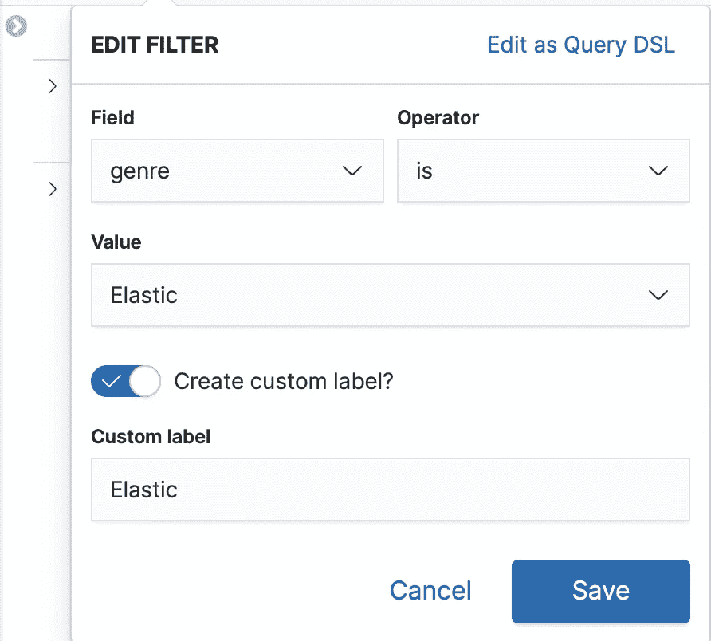

**为过滤器分配自定义标签以提高可读性**

*   **示例 5:使用自定义过滤器的示例 2(增量搜索)**

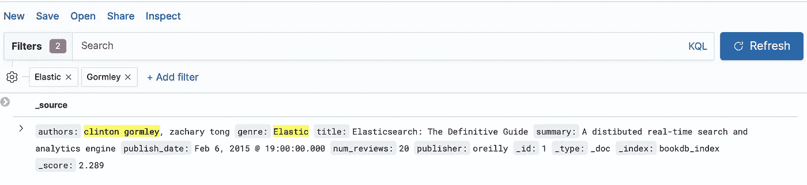

**使用自定义过滤器的增量/累加搜索**

# **已定义过滤器的可用动作:**

*   排除结果-将作为 NOT 运算符工作
*   一旦排除-将启用“包括结果”选项(这实际上可以删除“非”运算符)
*   暂时禁用-这将从结果中删除过滤器，但从视觉角度来看，过滤器仍然存在(这是为了在尝试不同的搜索时提供更多的可用性，而不是重新创建过滤器)
*   一旦禁用，启用选项将被启用

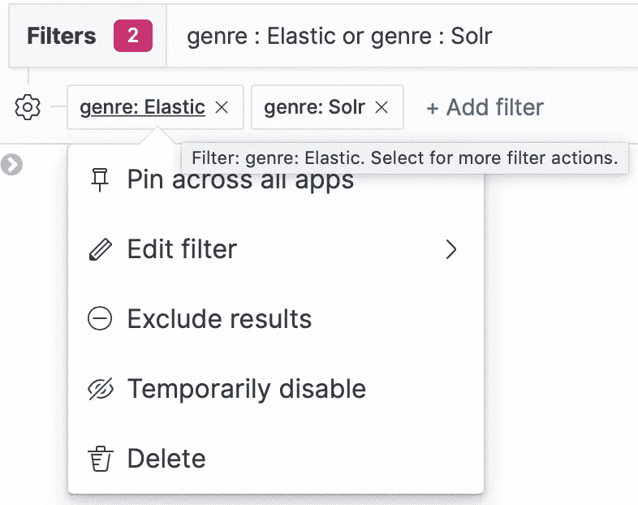

**特定过滤器的可用选项**

# 基于过滤器的搜索—可点击的选项:

除了通过选择字段和输入特定值来创建过滤器之外，Kibana 还提供了两种方式来执行基于过滤器的搜索，只需点击即可

# 选项 1:单击展开的文档

有 4 个选项(从左到右):

1.  值过滤器-相当于 IS 运算符
2.  筛选出值-相当于 IS NOT 运算符
3.  切换表中的列-将指定字段作为列添加到用户视图中
4.  筛选存在的字段—筛选具有指定字段名的所有文档。当有多个文档结构并且只有一些文档结构具有特定字段时，这很有用

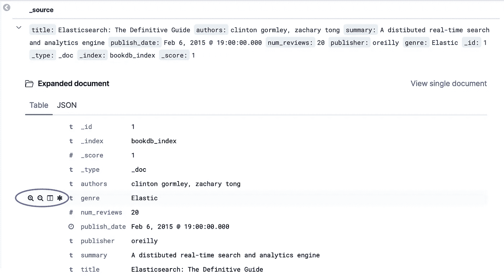

**展开文档的可点击选项**

# 选项 2:单击“可用字段”面板(在左侧)

*   选择任意一个字段，然后使用“筛选值”或“筛选出值”

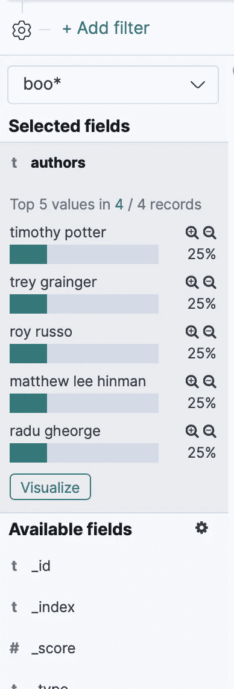

**可用字段——过滤进去或过滤出来**

# KQL vs Lucene 语法

版本 5 之前的 Kibana 只支持 Lucene 查询语法(Apache Lucene 专有的→【https://lucene.apache.org/core/2_9_4/queryparsersyntax.html )。从 Kibana 第 6 版开始，引入了 KQL (Kibana 查询语言),从最终用户的角度来看，KQL 更加直观，并且不再需要学习显式的编程查询语法。

这里有一个简单的例子来说明区别

**KQL** :

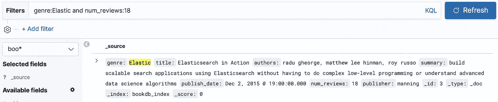

**KQL 示例——“与”运算符的用法**

**Lucene** :

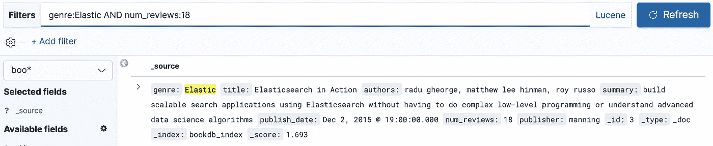

**Lucene 示例——“AND”运算符的用法**

说明高层次差异的有用博客:

[https://www . BMC . com/blogs/elastic search-Lucene-ki Bana-query-language/](https://www.bmc.com/blogs/elasticsearch-lucene-kibana-query-language/)

# Kibana 搜索—使用 Lucene 语法的高级搜索

# 通配符/模糊性:

1.  可以只使用通配符或在开始/中间/结尾使用通配符来搜索字段
2.  字段可以搜索模糊算子，该模糊算子本质上基于用户指定的距离搜索远离原始单词的单词

## 示例:

*   **示例 1:字段中的通配符**

**使用通配符搜索**

*   **示例 2:搜索文本中字段的通配符**

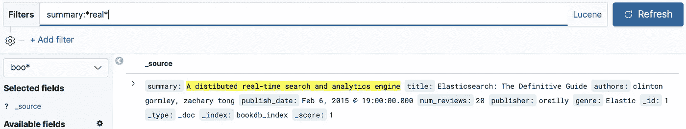

**使用通配符与字符串匹配进行搜索**

*   **例 3:用模糊算子进行搜索**。当实际信息中有拼写错误时很有用。例如:单词 distributed 被拼错为 distributed。下面的模糊搜索将过滤掉拼写错误的单词

**距离为> 0** 的模糊搜索

如果模糊运算符距离设置为 0，则我们无法找到拼写错误的单词

**距离= 0 的模糊搜索**

# 基巴纳搜索—使用 DSL(领域特定语言)

使用 DSL 搜索是另一种可能的选择。下面是两个通过 DSL 进行搜索的流行示例:

# 使用火柴

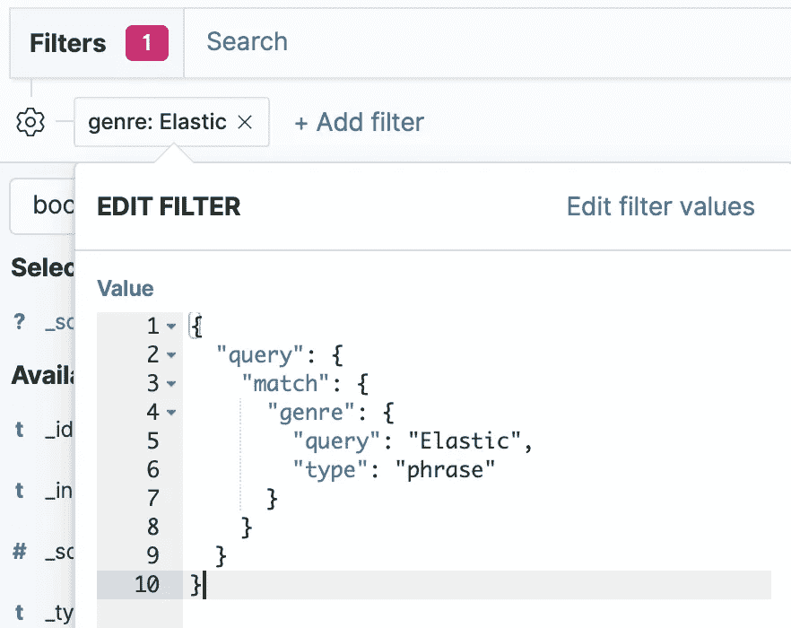

匹配示例:使用 DSL 搜索特定字段的文本

# 使用多重匹配

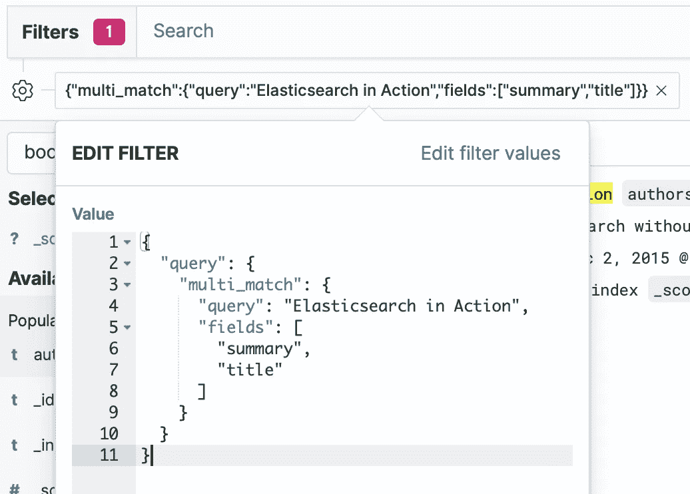

多匹配示例:使用 DSL 在多个字段中搜索文本

# 共享日志:

# 永久链接:

*   用户可以通过 URL 共享搜索过滤器的当前实例。它可以是一个复杂的 URL，也可以是一个简短的 URL

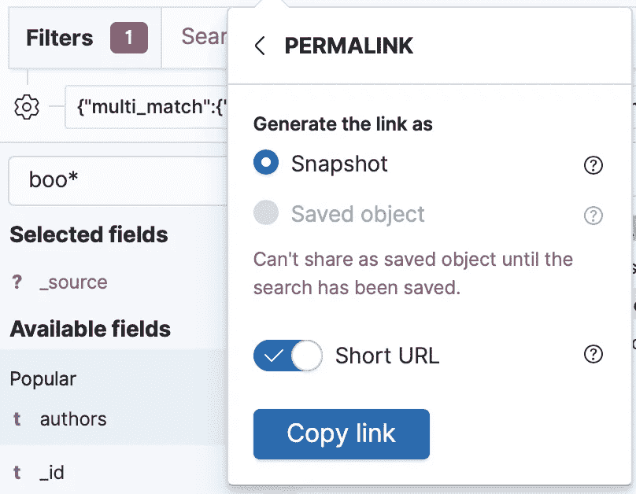

通过短 URL 共享结果的选项

# CSV 报告:

*   保存当前搜索
*   共享→生成 CSV 报告
*   默认情况下，最大大小为 10 MB。要将限制增加到 10 MB 以上，应更改服务器端属性(Kibana.yml 上的“xpack . reporting . CSV . maxsize bytes ”)

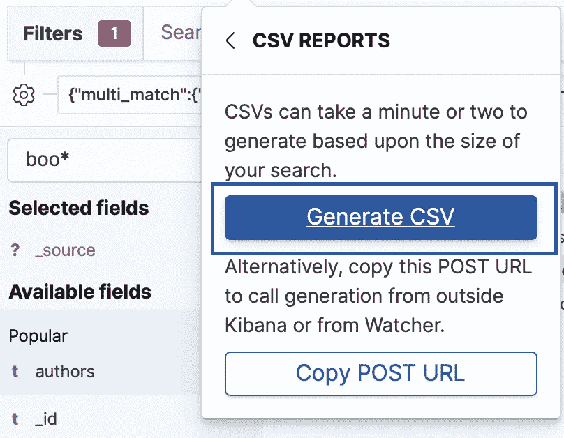

生成 CSV 的选项—允许共享日志以进行问题报告