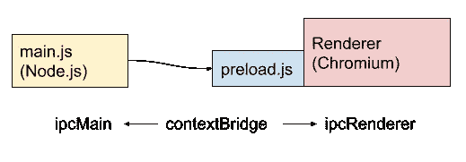

# 使用 BrowserView 启动您的电子开发

> 原文：<https://itnext.io/kick-start-your-electron-development-with-browserview-4d1044e69088?source=collection_archive---------1----------------------->


# 介绍

使用`<webview>`标签和`nodeIntegration`电子标签已经变得很流行，但是它们也带来了深层次的问题，比如安全问题和铬依赖。所以它正迁移到`BrowserView`去解决这些问题。让我们看看我们能用它做什么。

# 开始之前

事先准备好`main.js`和`index.html`，以便正式快速启动。本文主要关注这两个脚本如何相互作用。

[](https://www.electronjs.org/docs/latest/tutorial/quick-start) [## 快速启动|电子

### 本指南将引导你在电子版中创建一个准系统 Hello World 应用程序，类似于…

www.electronjs.org](https://www.electronjs.org/docs/latest/tutorial/quick-start) 

# 盒子里有什么？

当你用电子制作一个应用程序时，主要有三个部分。

*   主流程(`main.js`)
*   `preload.js`
*   渲染器进程(`index.html`)

`main.js`在托管 Node.js 的主进程中运行，管理应用的生命周期、渲染器进程等。你可以使用 Node.js 的全部特性，但是没有`window`或`document`对象。

渲染器进程通过`new BrowserWindow`从主进程创建。它是一个独立于主进程的浏览器进程。为了连接这两个进程，您可以附加 preload.js，它在加载渲染器之前运行。



我如上所述是因为`preload.js`是在渲染器进程中执行的。

> 预加载脚本包含在其 web 内容开始加载之前在渲染器进程中执行的代码。

详见[官方流程模型页面](https://www.electronjs.org/docs/latest/tutorial/process-model)。

# 创建渲染器过程

要使用`preload.js`启动渲染过程，必须按如下方式传递`webPreferences`选项。

```
app.whenReady().then(async () => {
  mainWindow = new BrowserWindow({
      webPreferences: {
        nodeIntegration: false,
        preload: path.join(__dirname, 'preload.js')
      }
  }); mainWindow.loadFile('index.html') mainWindow.on('closed', () => {
    mainWindow = null;
  });
});
```

# preload.js 怎么办？

在`preload.js`中，您可以在渲染器进程运行之前访问`window`或`document`对象。

要定义`window`对象的特殊属性，应使用`exposeInMainWorld`。您可以查看[官方上下文隔离页面](https://www.electronjs.org/docs/latest/tutorial/context-isolation)了解更多详情。它被命名为“在主世界中公开”,但与主进程无关。

这里有一个例子，

```
const { contextBridge, ipcRenderer } = require('electron')contextBridge.exposeInMainWorld(
  'electron',
  {
    sendMessage: (body) => ipcRenderer.send('message', body),
    onResponse: (listener) =>
      ipcRenderer.on(
        'response',
        (event, resp) => listener(resp)
      )
  }
);
```

# 渲染器进程中的消息传递

要向主进程发送消息，可以使用`preload.js`中定义的函数，如下所示:

```
window.electron.sendMessage({ message: 'Hello!' });
```

同样，您可以通过处理函数来接收主进程的响应，

```
window.electron.onResponse(({ message }) => {
  document.querySelector('#response').innerText = message;
});
```

# 主进程中的消息传递

主进程可以通过`webContents.send`向渲染器内容发送消息，

```
mainWindow.webContents.send('response', { message: 'Greeting!' });
```

要接收来自渲染进程的消息，`ipcMain`可以如下使用:

```
ipcMain.on('message', (event, { message }) => {
  console.log('receive message: ' + message);
})
```

# 结论

编写运行在不同进程中的多个 js 文件是令人困惑的，但是当我们使用消息传递时，这是不可避免的。你可以试试[电子还原](https://www.npmjs.com/package/electron-redux)或者其他一些好的框架:)