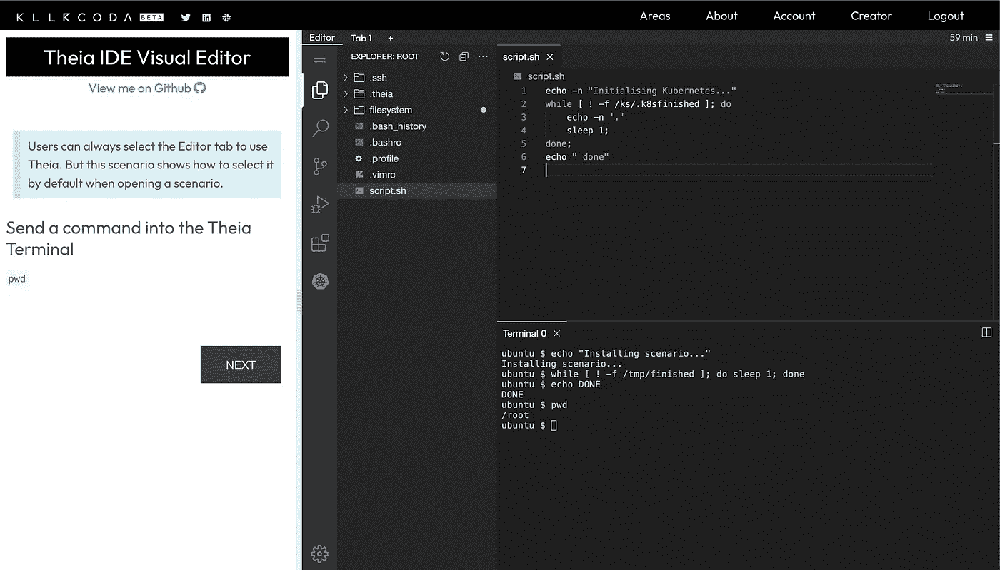
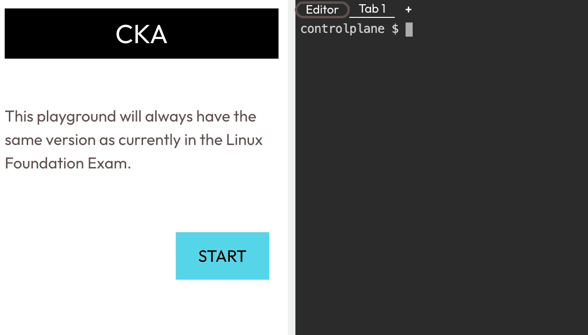

# 忒伊亚更深层次的融合

> 原文：<https://itnext.io/killercoda-ide-theia-deeper-integration-71cb52d0044c?source=collection_archive---------1----------------------->

## 创作者现在可以使用浏览器中的忒伊亚 IDE 作为默认界面



# Killercoda？

Killercoda 是一个交互式学习平台，允许每个人只需在浏览器中访问基于 Linux|Kubernetes 的环境。[阅读更多](https://wuestkamp.medium.com/katacoda-alternative-1d33599af75f?source=friends_link&sk=853df1e3537cdd19dfcf4cfc0bcd1bff)

# 如果我们有 vim，为什么还需要 IDE？

听着，我们甚至不要去那里；)大家都要用自己最熟悉的编辑器！如果你正在准备 CKS|CKA|CKAD 考试，确保使用 Vim 或 Nano 等控制台编辑器，因为没有可视化编辑器。

# 什么是忒伊亚 IDE？

[忒伊亚](https://theia-ide.org/)太神奇了！它自称为

> 一个开放、灵活、可扩展的云和桌面 IDE 平台。忒伊亚是一个可扩展的平台，利用最先进的 web 技术来开发成熟的多语言云和桌面 IDE 类产品。

它允许您在浏览器中拥有一个成熟的 IDE，您甚至可以加载和使用 VSCode 扩展。

**但请确保您了解**它的实际范围:

> 建立一个平台来构建类似 IDE 的产品

…就是这样！您可以使用忒伊亚来构建自己的 web 或桌面 IDE。开箱即用，您也将获得一个工作版本，但您可能需要一些开发工作来适应您的需求。为此做好准备。

# 忒伊亚作为默认接口

如果你在 Killercoda 上创建一个场景，那么默认情况下它会激活第一个终端标签。然后，用户可以选择编辑器链接切换到忒伊亚:



这是可以改变的，所以忒伊亚(编辑器标签)是默认选中的，如果你把它添加到你的`index.json`:

```
{
  "title": "Theia",
  "backend": {
    "imageid": "ubuntu"
  },
 **"interface": {
    "layout": "ide"
  }**
}
```

这里是一个示例场景和 Github 上的[代码。](https://github.com/killercoda/scenario-examples/tree/main/theia-ide-visual-editor)

# 代码执行脚本和前台脚本

代码执行和使用前台脚本运行自动命令的工作方式和以前一样。Github 上有一个[扩展示例](https://killercoda.com/examples/scenario/foreground-background-scripts-multi-step-ide)展示了它的[代码。](https://github.com/killercoda/scenario-examples/tree/main/foreground-background-scripts-multi-step-ide)

# 基勒科达是如何管理忒伊亚的？

如果你想知道更多关于我们如何在 Killercoda 上运行忒伊亚的信息，请点击这里查看我们的文章。

# 你希望看到什么样的整合？

我们应该实施什么来让忒伊亚更紧密地融入 Killercoda 工作流？让我们知道关于[支持](https://killercoda.com/support)或[懈怠](https://killercoda.com/slack)！