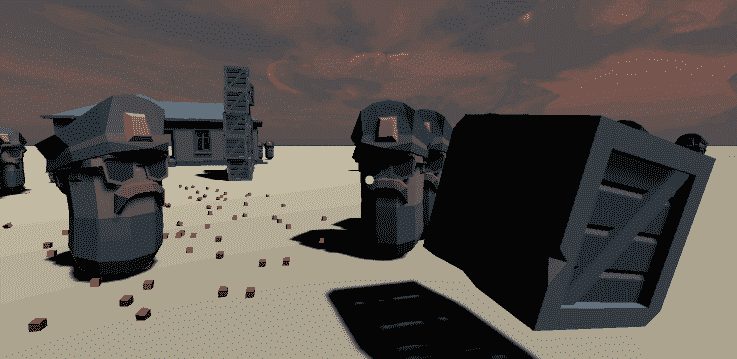
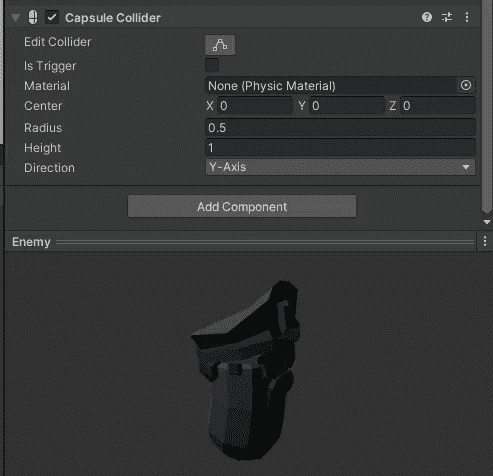
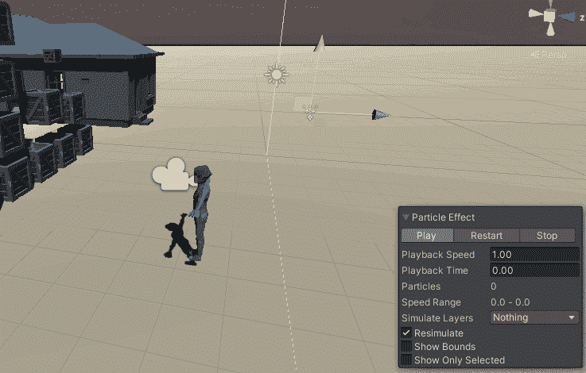
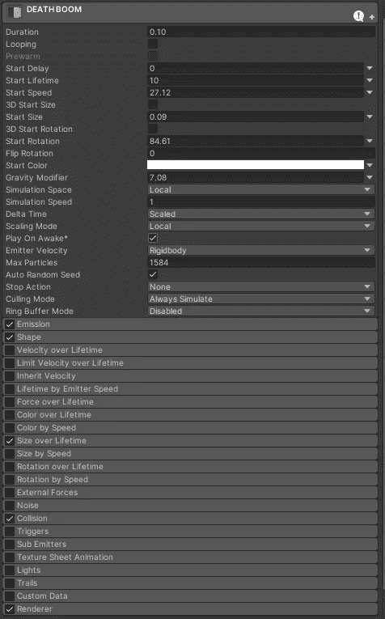
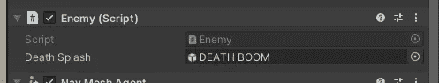

# (第六部分。)在 Unity 中用隔空传送砖块杀死敌人

> 原文：<https://itnext.io/killing-enemies-with-telekinetic-bricks-in-unity-gamedev-tutorial-part-6-4d43874eae29?source=collection_archive---------5----------------------->

在本教程中，我将向你展示如何用砖块杀死敌人，使用统一碰撞。我的 github 上有整个项目。



对于以前的零件，请访问:

[](https://medium.com/@janjilecek/integrating-yarnspinner-conversation-system-into-your-unity-game-part-5-of-my-gamedev-series-bdc61b9d3bf7) [## 将 YarnSpinner 对话系统集成到您的 Unity 游戏中[我的 gamedev 系列的第 5 部分]

### 纱线编辑器和纱线纺纱机是一个框架，创造对话很容易，由作者创造的夜在…

medium.com](https://medium.com/@janjilecek/integrating-yarnspinner-conversation-system-into-your-unity-game-part-5-of-my-gamedev-series-bdc61b9d3bf7) [](/telekinesis-in-unity-part-4-gamedev-series-8cc110b8ab55) [## 统一中的心灵遥控[第四部分游戏开发系列]

### 每个人小时候都想过拥有心灵遥感。为什么不实现那个幻想，并真正给自己那种力量…

itnext.io](/telekinesis-in-unity-part-4-gamedev-series-8cc110b8ab55) 

添加一个*胶囊碰撞器*到敌人预设中，并检查*是否被触发。被扔出的盒子会与它互动*。**



创建新的血溅效果/粒子效果。从它制作一个预置(只要把它拖进资产)。



在敌人. cs 中制作一个新的变量 deathSplash，以及 OnTriggerEnter，如果击中敌人的箱子有足够高的速度(velocity)，那么这个变量将摧毁游戏对象并实例化血液预设。

```
using System;
using UnityEngine;
using UnityEngine.AI;

[RequireComponent(typeof(NavMeshAgent))]
public class **Enemy** : MonoBehaviour
{
    private NavMeshAgent pathfinder;
    private Transform target;
    public GameObject **deathSplash**;

    void **Start**()
    {
        pathfinder = GetComponent<NavMeshAgent>();
        target = GameObject.Find("Player").transform;
    }
    void **Update**()
    {
        pathfinder.SetDestination(target.position);
    }

    private void **OnTriggerEnter**(Collider other)
    {
        if (other.CompareTag("Box"))
        {
            if (Mathf.Abs(other.attachedRigidbody.velocity.x) > 5f ||
                Mathf.Abs(other.attachedRigidbody.velocity.y) > 5f ||
                Mathf.Abs(other.attachedRigidbody.velocity.z) > 5f)
            {
                Instantiate(deathSplash, transform.position, Quaternion.identity);
                GameObject.Destroy(gameObject);    
            }

        }
    }
}
```

将血液预设与变量相关联:



运行它，我们就完成了！

Github 回购与项目:

[](https://github.com/janjilecek/unity_tutorial) [## janjilecek/unity_tutorial

### 在 GitHub 上创建一个帐户，为 janjilecek/unity_tutorial 开发做贡献。

github.com](https://github.com/janjilecek/unity_tutorial) 

如果你刚刚开始学习如何开发游戏，你可以关注我的 udemy 初学者 Unity 开发课程:

[](https://www.udemy.com/course/make-a-3d-game-in-unity-2020-from-scratch-with-free-assets/?referralCode=8B96F6C67527AEEA39D9) [## 完整指南:Unity 2020 中的动作恐怖 3D 游戏

### 大家好，我叫 Jan Jileč ek，是一名拥有计算机科学硕士学位的专业游戏开发人员，我…

www.udemy.com](https://www.udemy.com/course/make-a-3d-game-in-unity-2020-from-scratch-with-free-assets/?referralCode=8B96F6C67527AEEA39D9)