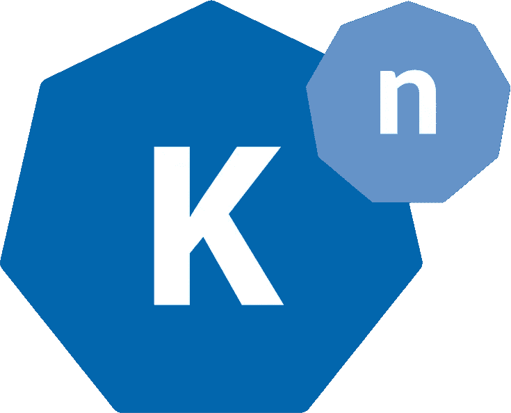

# knative 构建原语

> 原文：<https://itnext.io/knative-build-primitive-32b69c3974a1?source=collection_archive---------2----------------------->



今天 [Google 宣布了 knative](https://cloudplatform.googleblog.com/2018/07/bringing-the-best-of-serverless-to-you.html) 一个新的开源项目，它定义了一组从源代码到 Kubernetes 操作的原语。

knative 是 Kubernetes 的扩展，或者我应该说是扩展(复数)，这意味着它使用 Kubernetes 自定义资源定义来定义一组新的 API，使构建、部署、扩展和路由流量到应用程序变得更容易。

knative 的目标肯定是无服务器领域，在接下来的几天/几个月里，你会读到很多关于这方面的内容。一个非常有趣的功能是，它可以根据访问您的微服务的请求数量，将您的副本缩小到 0，或者从 0 扩大到 0(目前通过 Istio)。

在接下来的几天里，我会写更多关于 knative 的细节，它是一个复杂的系统。但是现在:)knative 带来的一个非常有趣的 API 是`Build` API 对象。如果您需要将编译语言函数投入生产，构建是必要的，但是`Build`也可以用于定义您的 CI 管道。

我有机会预览它，所以让我分享一下`Build` API 的要点。对于了解 Kubernetes 的人来说，这是一个带有自己控制器的 CRD，您可以在集群中使用它:

```
kubectl create -f [https://storage.googleapis.com/knative-releases/build/latest/release.yaml](https://storage.googleapis.com/knative-releases/build/latest/release.yaml)
```

knative `Build`几乎是[谷歌容器构建器](https://cloud.google.com/container-builder/)的开源。它定义了一组作为 Pod 中的 init-containers 实现的`steps`。

# 步伐

这是一个执行`/bin/date`的玩具`Build`清单。

```
 apiVersion: build.knative.dev/v1alpha1
kind: Build
metadata:
 name: test
spec:
 steps:
 — name: date
   image: debian:stable-slim
   args: [‘/bin/date’] 
```

它有一个基于`debian:stable-slim` Docker 映像的单个`step`，并运行`/bin/date`。

在一个构建中，每个步骤共享一个`/workspace`目录，并且每个步骤都在 Docker 容器中执行，正如前面提到的,`step`是一个 Kubernetes[init-container](https://kubernetes.io/docs/concepts/workloads/pods/init-containers/)。当您创建这个对象时，knative build controller 将创建一个带有适当的 init-containers 和 volumes 设置的 Pod。

# 来源

但是构建需要源代码，所以一个`Build`对象也定义了一个`source`。通常，您可以克隆一个存储库，然后对其执行步骤，如下所示:

```
 apiVersion: build.knative.dev/v1alpha1
kind: Build
metadata:
 name: test
spec:
 source:
   git:
     url: [https://github.com/sebgoa/functions.git](https://github.com/sebgoa/functions.git)
     revision: master
 steps:
 — name: ls
   image: busybox
   args: [‘ls’] 
```

到目前为止，构建是基于源代码和一组最有可能在源代码上执行操作的步骤。

# 模板

为了简化构建清单，您可以将[模板](https://github.com/knative/build-templates)定义为另一个 API 对象。我邀请你去看看模板库，因为这是了解`Build`对象的好方法。例如，要在 Kubernetes 中构建 Docker 图像并推送结果图像，可以使用 [Kaniko](https://github.com/GoogleContainerTools/kaniko) 。我向你展示了如何用一个标准的 Kubernetes 工作来做这件事。它的主要好处是你可以在一个非特权容器中进行 Docker 构建。

以下是使用 Kaniko 构建和推送 Docker 映像的基本模板:

```
 apiVersion: build.knative.dev/v1alpha1
kind: BuildTemplate
metadata:
 name: kaniko
spec:
 parameters:
 — name: IMAGE
   description: The name of the image to push
 — name: DOCKERFILE
   description: Path to the Dockerfile to build.
   default: /workspace/Dockerfile
 steps:
 — name: build-and-push
   image: gcr.io/kaniko-project/executor
   args:
   - --dockerfile=${DOCKERFILE}
   — --destination=${IMAGE}
   — name: fail
     image: busybox
     args: [‘foo’] 
```

注意，我保留了一个`fail`步骤用于调试，否则我们看不到构建步骤的日志(新的零日软件 FWIW:)。

定义了模板后，您的`Build`变得更加简单:

```
 apiVersion: build.knative.dev/v1alpha1
kind: Build
metadata:
 name: kaniko-test
spec:
 serviceAccountName: build
 source:
   git:
     url: [https://github.com/sebgoa/functions.git](https://github.com/sebgoa/functions.git)
     revision: master
 template:
   name: kaniko
 arguments:
 — name: IMAGE
   value: docker.io/runseb/bazbaz 
```

需要使用`serviceAccountName`才能正确推送至您的 Docker hub repo。详细文档见[*https://github . com/kna tive/build-templates/tree/master/kaniko*](https://github.com/knative/build-templates/tree/master/kaniko)。

# 与 Google 容器构建器的连接

如果你一直在用 GCB 的话，和 GCB 的联系就相当清楚了。实际上是很棒的服务。一个`Build`对象的模式基本上就是你的`cloudbuild.yaml`文件。

例如，要构建一个 Go 应用程序，您可以在源代码的根目录中放置以下`cloudbuild.yaml`:

```
 steps:
- name: ‘gcr.io/cloud-builders/go’
  args: [‘install’, ‘.’]
  env: [‘PROJECT_ROOT=hello’]
- name: ‘gcr.io/cloud-builders/go’
  args: [‘build’, ‘hello’]
  env: [‘PROJECT_ROOT=hello’] 
```

你现在可以在 Kubernetes 中使用 Knative 构建来做一些事情。耶！！！！

# 结论

当然，GCB 不仅仅是新的 knative `Build`,但是 knative 的开源让我们非常接近它，并给了我们一个工具来构建 CI 管道，并更快地将我们的代码投入生产。

Knative 不仅仅是`Build`，我将在接下来的几周内谈论其他部分。我并没有故意谈论无服务器组件，但是你可以想象如何使用它来打包所有的函数依赖和处理编译语言函数。