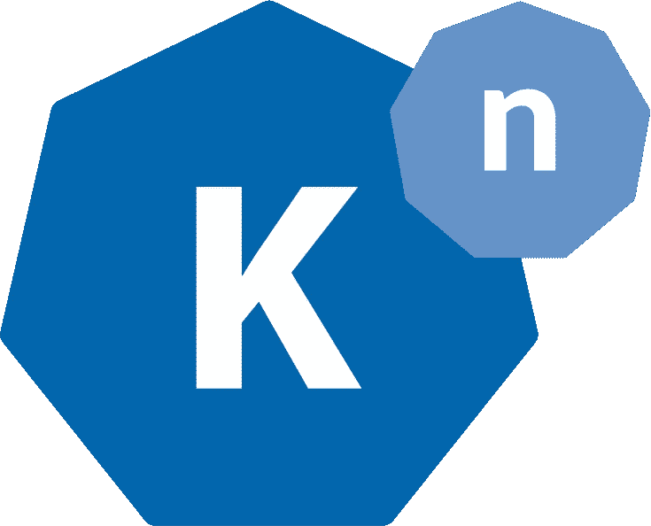

# knative—Kubernetes—无服务器的本地 PaaS

> 原文：<https://itnext.io/knative-kubernetes-native-paas-with-serverless-a1e0a0612943?source=collection_archive---------2----------------------->



knative——Kubernetes PaaS 使用 Gloo API Gateway 实现无服务器体验

Kubernetes 无疑已经成为部署容器的主导平台。Kubernetes 通过其核心 API 和定制控制器提供了编排几乎任何东西的能力，定制控制器通过 [Kubernetes 定制资源](https://kubernetes.io/docs/concepts/extend-kubernetes/api-extension/custom-resources/)扩展其 API。

然而，Kubernetes 仍然将控制权留给用户，让他们来决定如何部署、配置、管理和扩展应用程序。关于应用如何扩展、保护和暴露给流量的决策留给用户来配置。因此，Kubernetes 与传统的平台即服务(如 Cloud Foundry 和 Heroku)截然不同。

PaaSes 面向应用程序开发人员，具有简化的用户体验，主要关注单个应用程序的配置。PaaS 后端对用户透明地管理路由、部署和遥测。

PaaS 处理从源到部署的工作流，构建用户的容器映像，推出新的部署，并配置新的路由和 DNS 子域，以允许流量到达部署的容器。这一切都由一个`git push`引发。

Kubernetes(有意地)只提供了这类平台的构建模块，把弥合差距的工作留给了它的社区。正如凯尔西·海塔尔所说:

作为回应，我们已经看到 Kubernetes 发行版和托管解决方案的爆炸式增长，这些解决方案试图向 Kubernetes 提供 PaaS，如 OpenShift 和 Rancher。随着对 Kube-PaaS 市场份额的争夺越来越激烈，谷歌和 Pivotal 已经通过 2018 年 7 月宣布的 Knative 进入了这个圈子。

Knative 由 Google 和 Pivotal 合作构建，IBM、Red Hat 和 Solo.io 等公司也有少量贡献，它为 Kubernetes 提供了类似 PaaS 的体验，并为无服务器应用程序提供了一流的支持。与 Kubernetes 发行版不同，Knative 可以作为附加组件安装到任何兼容的 Kubernetes 集群中，并通过自定义资源进行配置。

## 什么是 Knative？

Knative 自我描述为“基于 Kubernetes 的平台，用于部署和管理现代无服务器工作负载”。Knative 将自己标榜为“无服务器工作负载”的平台，主动地根据并发 HTTP 请求的比例自动缩放容器。不使用的服务最终会缩减到零，提供“无服务器”式的按需扩展。

Knative 由一组控制器*组成，这些控制器可以安装到任何 Kubernetes 集群*上，这些集群提供以下功能:

*   从源代码构建容器化的应用程序(由 Knative 的 *Build* 组件提供)
*   将应用程序暴露给外部流量(由*服务*组件提供)
*   基于需求部署和自动扩展应用程序(由*服务*组件提供)
*   定义可以触发应用程序执行的事件源(由*事件*组件提供)

*服务*是核心项目，管理托管应用的部署、自动伸缩和流量路由。安装 Knative 后，仍然可以访问完整的 Kubernetes API，允许用户以“传统”方式管理应用程序，以及通过使用他们习惯的相同 API 原语(pod、服务等)来调试他们的 Knative 服务。).

*Serving* 还可以在用户推送更新版本的应用程序时自动执行蓝绿色流量路由，在新旧版本的应用程序之间分流流量。

Knative 本身依赖于安装的兼容入口控制器。在撰写本文时， [Gloo API 网关](https://gloo.solo.io)和 [Istio 服务网格](https://istio.io)是唯一可用的兼容入口控制器。Knative 将配置可用入口，以将流量路由到 Knative 管理的应用程序。

因为 Knative 仅依赖于网关，所以对于希望使用 Knative 而不必安装和管理 Istio 控制平面的用户来说，Istio 服务网格可能是更大的依赖性。

由于这个原因，许多用户选择 Gloo 作为他们的 Knative 网关，提供与 Istio 同等的功能(用于 Knative ),同时大大减少了资源占用和操作开销。

让我们通过一个快速演示来看看 Knative 的实际应用。我将使用在 GKE 上运行的新集群:

```
kubectl get namespaceNAME          STATUS   AGE
default       Active   21h
kube-public   Active   21h
kube-system   Active   21h
```

从部署 Knative 和 Gloo 开始。这可以按任何顺序进行:

```
# deploy Knative-Serving
kubectl apply -f \
 [https://github.com/knative/serving/releases/download/v0.8.0/serving-core.yaml](https://github.com/knative/serving/releases/download/v0.8.0/serving-core.yaml)namespace/knative-serving created
# ...# deploy Gloo
kubectl apply -f \
  [https://github.com/solo-io/gloo/releases/download/v0.18.22/gloo-knative.yaml](https://github.com/solo-io/gloo/releases/download/v0.18.22/gloo-knative.yaml)namespace/gloo-system created
# ...
```

验证所有单元都在运行:

```
kubectl get pod -n knative-servingNAME                              READY   STATUS    RESTARTS   AGE
activator-5dd55958cc-fkp7r        1/1     Running   0          7m32s
autoscaler-fd66459b7-7d5s2        1/1     Running   0          7m31s
autoscaler-hpa-85b5667df4-mdjch   1/1     Running   0          7m32s
controller-85c8bb7ffd-nj9cs       1/1     Running   0          7m29s
webhook-5bd79b5c8b-7czrm          1/1     Running   0          7m29skubectl get pod -n gloo-systemNAME                                      READY   STATUS    RESTARTS   AGE
discovery-69548c8475-fvh7q                1/1     Running   0          44s
gloo-5b6954d7c7-7rfk9                     1/1     Running   0          45s
ingress-6c46cdf6f6-jwj7m                  1/1     Running   0          44s
knative-external-proxy-7dd7665869-x9xkg   1/1     Running   0          44s
knative-internal-proxy-7775476875-9xvdg   1/1     Running   0          44s
```

Gloo 现在准备开始路由。让我们创建一个自动缩放的 Knative 服务(kservice)并将一些流量路由到它。

Knative Services 提供了一种比传统的部署+服务+入口模式更简单的方式将应用部署到 Kubernetes。我们将使用以下示例:

```
apiVersion: serving.knative.dev/v1alpha1
kind: Service
metadata:
 name: helloworld-go
 namespace: default
spec:
 template:
   spec:
     containers:
       - image: gcr.io/knative-samples/helloworld-go
         env:
           - name: TARGET
             Value: Knative user
```

我将把它粘贴到一个文件中，然后部署到我的 Kubernetes 集群中，如下所示:

```
kubectl apply -f ksvc.yaml -n default
```

我们可以看到在部署我们的“hello world-go”*KService*之后，Knative 在我们的集群中创建了哪些资源:

```
kubectl get pod -n defaultNAME                                              READY   STATUS    RESTARTS   AGE
helloworld-go-fjp75-deployment-678b965ccb-sfpn8   2/2     Running   0          68s
```

带有我们的 *helloworld-go* 映像的 pod 在部署 kservice 时冷启动。最终，如果没有流量到达我们的 pod，支持这一点的部署将缩减到零。相反，如果并发请求超过一个可配置的阈值，pod 实例将被扩大。

```
kubectl get ingresses.networking.internal.knative.dev -n defaultNAME            READY   REASON
helloworld-go   True
```

Knative 使用内部 Knative API 中的特殊“ingress”资源配置其入口。Gloo 使用这个 API 作为自己的配置，以便提供类似 PaaS 的功能，包括蓝绿色部署、自动 TLS 终止、超时和其他高级路由功能。

一段时间后，我们会看到我们的豆荚消失(除非我们用流量撞他们):

```
kubectl get pod -n default           

No resources found.kubectl get deployment -n defaultNAME                             DESIRED   CURRENT   UP-TO-DATE   AVAILABLE   AGE
helloworld-go-fjp75-deployment   0         0         0            0           9m46s
```

最后，我们可以用一些流量来打击他们。使用`glooctl`获取 Knative 代理的 URL 特别容易:

```
glooctl proxy url --name knative-external-proxy[http://35.190.151.188:80](http://35.190.151.188:80)
```

如果没有安装`glooctl`，我们可以从 kube 服务中查找地址/端口:

```
kubectl get svc -n gloo-system knative-external-proxyNAME                     TYPE           CLUSTER-IP     EXTERNAL-IP      PORT(S)                      AGE
knative-external-proxy   LoadBalancer   10.16.11.157   35.190.151.188   80:32168/TCP,443:30729/TCP   77m
```

使用 cURL 发送一些流量:

```
curl -H "Host: helloworld-go.default.example.com" [http://35.190.151.188](http://35.190.151.188)Hello Knative user!
```

Knative 使用 Gloo 作为高性能、全功能的 API 网关，在开箱即用的 Kubernetes 之上为开发人员提供了类似 PaaS 的体验。这篇文章仅仅触及了 Knative 的皮毛；在定制和附加特性方面有更多的功能可用。它也仅仅触及了 Gloo 的表面！

虽然 Knative 还很年轻，但 Knative 团队已经达到了六周的发布节奏，并且更多高级功能已经开始从管道中出现，如自动 TLS 配置和控制平面自动缩放。作为多家重量级云公司之间的合作以及谷歌新的 Cloud Run 产品的支柱，Knative 几乎肯定会成为将无服务器和 PaaS 引入 Kubernetes 的卓越选择之一。敬请关注！

要了解更多信息:

*   查看 [**Knative 文档**](https://knative.dev/docs/) 并了解更多关于 Knative 和
*   [**阅读 Gloo 文档**](https://gloo.solo.io) 了解更多关于它所运行的基于 Envoy 的 API 网关的信息
*   [**加入 8 月 29 日的在线聚会**](https://www.meetup.com/Solo-io-Online-Meetup/events/263828132/) 观看现场演示并加入讨论