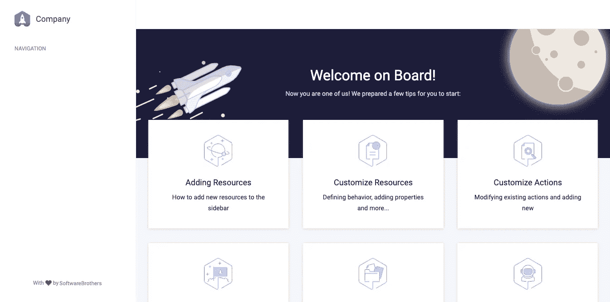
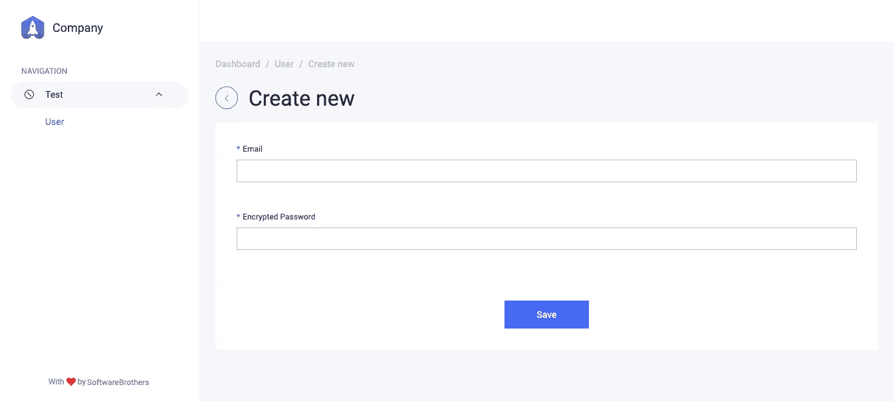

# koa 刚刚得到了一个漂亮的自动生成的管理面板。

> 原文：<https://itnext.io/koa-just-got-a-beautiful-auto-generated-admin-panel-f5f89d83e892?source=collection_archive---------0----------------------->

## 在这篇短文中，我将向您展示如何在您的 koa 应用程序中添加一个全功能的管理面板。


这是一篇 5 分钟长的文章，可以帮你省下几周的工作。

按照本教程，你将有一个认证，漂亮的界面和你的数据的整个 CRUD 应用程序。此外，您可以根据自己的具体需求对其进行调整。

# 堆栈

显然，我们将使用 koa 及其部分模块。但是作为一个管理面板界面，我们将使用 [AdminBro](https://github.com/SoftwareBrothers/admin-bro) ，它在上周获得了官方 [koa](https://adminbro.com/module-@admin-bro_koa.html) 支持。

所以这是热点新闻。^^^

# 装置

如果从头开始，首先初始化 repo 并安装 [koa](https://koajs.com/) :

```
mkdir koa-admin
cd koa-admin
yarn init 
yarn add koa
```

现在安装设置管理面板所需的以下依赖项:

```
yarn add admin-bro @admin-bro/koa @koa/router koa2-formidable
```

# 管理员设置-基础

现在我们必须启动管理界面。创建一个`index.js`文件并插入以下内容:

我们所做的:

*   创建一个常规的`koa`应用程序
*   用一些默认设置初始化 AdminBro
*   使用`buildRouter`方法附加管理员

现在，让我们用`node`命令运行应用程序。(也可以用`nodemon`)

```
node index.js
```

并访问[http://localhost:3000/admin](http://localhost:3000/admin)页面。您应该会看到类似这样的内容:



好吧，它很漂亮，也很管用，但没什么用。让我们改变这一点。

# 用你的数据填充它

这是与 [koa](https://koajs.com/) 本身不完全相关的部分。 [AdminBro](https://adminbro.com/) 赋予你管理各种数据的能力。它支持以下适配器:

*   [@admin-bro/sequelize](https://adminbro.com/module-@admin-bro_sequelize.html)
*   [@admin-bro/typeorm](https://adminbro.com/module-@admin-bro_typeorm.html)
*   [@ admin-bro/猫鼬](https://adminbro.com/module-@admin-bro_mongoose.html)
*   @admin-bro/firebase(测试版)

在本文中，我将向您展示一个用 mongoose 适配器显示来自 [MongoDB](https://www.mongodb.com/) 的数据的最简单的例子，但是首先，请确保您已经在本地运行了 [MongoDB](https://www.mongodb.com/) 。

现在安装 mongoose 依赖项:

```
yarn add @admin-bro/mongoose mongoose
```

并更改我们的`index.js`文件。

1.  需要新的依赖项，并向 AdminBro 注册 mongoose 适配器，这样它就知道如何处理传递的模型。
2.  创建一个新的 mongoose 模型:拥有一个`email`和`encryptedPassword`的用户。
3.  我们必须先用`await`对蒙哥用`connect`的方法。这就是为什么我们需要用一个`async`函数来包装整个设置。
4.  在设置中，我们将用户传递给 AdminBro 中的`resources`数组。

这是一个更新的`index.js`文件

这就是创建新用户的样子:



对于用户模型，AdminBro 已经生成了一个带有验证的完整 CRUD。

# 密码哈希

问题出在密码字段，每当用户传递信息时，都应该对其进行哈希处理。幸运的是，AdminBro 附带了可安装的代码块，称为 [AdminBro 特性](https://adminbro.com/tutorial-features.html)。猜猜看，密码哈希有一个特性。

首先用 [argon2](https://www.npmjs.com/package/argon2) 安装该功能，它将用于加密密码。

```
yarn add @admin-bro/passwords argon2
```

并将该特性传递给 AdminBro 选项，如下所示

基本上就是这样了。现在您可以创建用户，他们的密码将被自动散列。很酷——对吧？

在继续之前，至少创建一个具有已知电子邮件和密码的用户。我来建议:`admin@example.com:password`

# 证明

由于我们在数据库中有用户，使用适当的密码散列，让我们添加一个认证机制。

为了做到这一点，我们必须将`buildRouter`改为`buildAuthenticatedRouter`，并定义`async authenticate`方法。

在此之前，我们还必须设置 koa `app.keys`,因为身份验证使用的是 cookies。

```
app.keys = ['super-secret1', 'super-secret2']
```

> *现实世界中最有可能的例子是* `*process.env*`

接下来，将`buildRouter`改为`buildAuthenticated`路由器:

所以我们首先寻找一个现有的用户，然后用`argon2`检查她的密码。如果一切都是正确的，我们返回用户对象，该对象转到会话。然后可以在 AdminBro 内部使用它。

这是我们再次运行应用程序后看到的情况:


填入你刚刚创建的邮箱和密码(PS:我建议`admin@example.com:password`:)——你就进去了。

# 总结，下一步是什么

呃，我们做到了。我们在几分钟内启动了整个应用程序、身份验证、密码哈希和用户管理(CRUD)。这一切都归功于惊人的 [koa](https://koajs.com/) 框架和高超的 [admin-bro](https://adminbro.com/) 管理面板。

从这里你可以做很多事情:

*   修改用户界面的外观
*   添加新资源
*   定义操作(如批准、不批准用户等)
*   添加基于角色的访问控制
*   还有很多很多

要查看所有可用的选项——参见[adminbro.com](https://adminbro.com/)文档页面——它是巨大的。

AdminBro 经常被 SoftwareBrothers 的开发者更新，所以确保[启动回购](https://github.com/SoftwareBrothers/admin-bro)来激励他们:)。用 [koa](https://github.com/koajs) 做同样的事情。

我希望你喜欢这个简短的教程。下次我想描述一些更高级的 AdminBro 主题。

如果你愿意，你可以下载一个服务器代码为[的文件，你可以在这里](https://gist.github.com/tadeuszkora/3aff4bf07d279dc7d1c31af57ddf6466)下载。