# Kotlin 协同程序 vs Java 虚拟线程——一个好故事，但仅此而已…

> 原文：<https://itnext.io/kotlin-coroutines-vs-java-virtual-threads-a-good-story-but-just-that-91038c7d21eb?source=collection_archive---------0----------------------->


在这篇文章中，我们将对 **JVM** 中的**协程**也称为**延续**的两种不同实现进行反复试验。这些是 **Java 虚拟线程**，它们是 **Project Loom** 和 **Kotlin 协程**的一部分，作为**DSL**在 **JVM** 上运行。由于这篇文章的性质，它将受到频繁的审查。支持代码位于 [GitHub](https://github.com/jesperancinha/good-story) 上。

# 一点历史

在最近几年，如果你在 **JVM** 周围工作，你一定会注意到一个新的玩家来到了 **JVM** 世界。输入**科特林**。长话短说，**科特林**始于**杰特布雷恩 R & D 部，**因**科特林**岛**岛**位于**圣彼得堡附近而得名。**

这是目前为止简短的**科特林**故事。但是为了理解今年(2022 年)我们在哪里以及我们已经走了多远，我们需要沿着记忆的轨迹，理解 **Java** 是如何发展的，以及从 **Java** 衍生的其他语言是何时以及如何繁荣的。这样，我们可以有一个更好的画面，并得出更明智的结论。


**Java/kot Lin/Scala 的简短年表**

在我们继续之前，我们必须向那些负责任的人致敬，根据扩展文档，是他们开始了这场 JVM 革命。许多人认为詹姆斯·高斯林是 **Java** 和 **JVM** 的发明者。没有他，在 JVM 之上的任何后来的发明都是不可能的。同理，**马丁·奥德斯基**差不多就是 **Scala** 的发明者。最后，对于**科特林**，我们只能说负责进一步开发的 **JetBrains** 团队的组长是**德米特里·杰梅罗夫**。

上面的表格是一个简短的概述，总结了三种语言历史上的主要亮点，这三种语言共享一个共同的生态系统，即 **Java 虚拟机**。 **Java** 存在于 **1995** 之前， **Scala** 存在于 **2001 年，**和 **Kotlin** 存在于 **2010** 年。 **Java** 是最古老的****JVM 语言**，最新的**是 **Kotlin** 。 **Java** 比 **Kotlin** 早开始至少 **15** 年，而 **Scala** 比 **Kotlin** 早开始 **9** 年。****

**我找不到确切的位置，但是检查项目**的提交时**我可以看到第一次提交发生在 **2007 年**。这告诉我们的是，**织机**的想法很可能是在今年前后开始的。 **Loom** 是一个项目，非常像 **Kotlin** 中的**协程**，专注于通过将**系统线程**分割成单独的独立进程来最大限度地利用它们。Loom 调用这些进程**虚拟线程**。在 **Kotlin** 中，一个用**协程**支持同样想法的实验版本在 **2018** 中发布。**项目织机**在 **Java** 计划在 **2022** 发布。**

**关于科特林，很难确定创造一种新语言的动机到底是什么。我能找到的最好的是“ ***需要添加的新功能*** ”。在本文中，我想与你分享我对 **Kotlin 协同程序**和 **Java 虚拟线程**的发现，然后揭示我得出的一个伟大结论。**

**我本人从来没有加入过 Java Loom 团队，也没有加入过 Kotlin Coroutines 团队。我在源代码信息、国际会议视频和论文的基础上完成了这篇文章。**

**在我们继续之前，协程很久以前就被发明了，但是，如果你还不知道的话，这里有一个伟大的启示。他们确实很老了，实际上比 **1958** 还要老。这只是这个术语由[唐纳德·克努特](https://en.wikipedia.org/wiki/Donald_Knuth)和[梅尔文·康威](https://en.wikipedia.org/wiki/Melvin_Conway)创造的一年。在这里，人们已经创建了自己的实现，例如，[this](https://github.com/codecop/Conways-Squasher-Coroutine)by***codecop***。**

# **动机**

**多年来，软件工程已经发生了变化，毫无疑问，每个人都在努力让一切变得更好。我们希望更容易地创建软件并使我们的代码工作。为了做到这一点，我们创造了语法和语义，使我们的开发更加简单。当 **Kotlin** 出现的时候，我几乎立刻就被它在许多层面上优于 **Java** 的想法所打动。这就是 Kotlin 社区所提倡的。几个月后，我意识到一些事情挫败了我兴奋的原因。随着时间的推移，我越来越觉得科特林语只是另一种语言，这可能是它令人兴奋的真正原因，因为它与众不同。**新事物**打破常规，为创造力腾出空间。有一件事我没有改变主意，那就是用正确的方法，Kotlin 可以产生比 Java 漂亮得多的代码。但是美是我不想在这篇文章里讨论的。这篇文章真正关注的是性能。我们不打算单独讨论 **Kotlin** 和 **Java** 。我们将讨论两个实现，它们利用了**系统线程**和一个叫做协程的非常古老的概念。在 **Java 中，**这在 **project Loom** 中被称为**虚拟线程**，在 **Kotlin** 中，这被称为……嗯……**协程**。当我们在两边的代码中前进时，我们会停下来，相互比较代码，看看有什么不同。但首先，让我们深入一点理论，以准确理解我们在谈论什么，讨论为什么这不是一场革命，以及为什么花了这么多时间让语言开发接口和语义，以便能够更有效地使用系统线程。**

# **协程是什么？**

**如果我们取**协程**的字面意思，纯粹在语义层面上，我们得到**协同**和**例程**。所以，一个例程就是一些运行的指令。一个**协程**是**一起运行的东西。**运行，在这种情况下，字面意思是**暂停**原始程序，并允许一个完全不同的程序开始，然后恢复**原始程序**。**

**为了说明这一点，我回到了 1985 年，在互联网的帮助下，我用 **C++** 创建了一个小程序，显示了一些关于用环氧树脂创建桌子的说明**(如果你想创建一个真正的环氧树脂桌子，请不要遵循这些说明，用环氧树脂创建桌子需要安全装置和保护，所以先获得通知**)。为什么 **C++** ？为什么不呢？此外，我认为从一个中立点开始是非常重要的。如果我们把这些基本的东西做对了，那么我们就能一帆风顺！这是主程序:**

**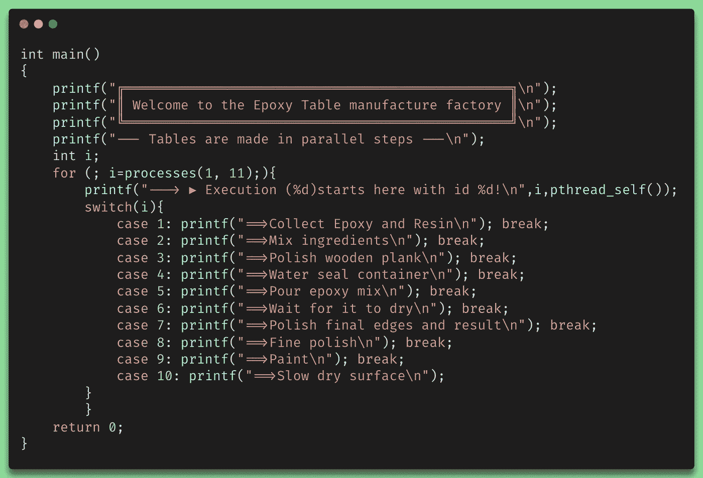**

****主环氧工作台程序****

**现在，我们有一堆案例(确切地说是 10 个)，这段代码看起来并没有显示太多。目前我们确实有一些东西应该引起你的注意，那就是***pthread _ self()***。另一件事是***【1，11】****，这些都包含在 **for-loop** 的验证检查中。让我们深入研究这种方法:***

***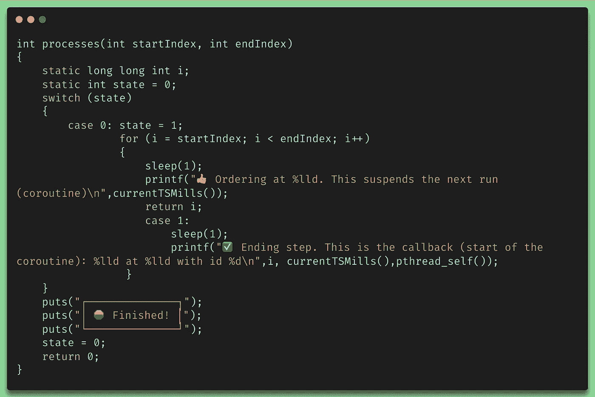***

*****流程*****

***S o，在这里，我们有一个奇怪的`**switch-case**`。我们将 **1** 赋值给 **0 的情况条件内的状态。**这导致主线程在返回之前分裂。从技术上来说，它没有分裂成 2 个，但是它在运行时挂起，以允许另一个启动。这意味着当程序运行到 `***return i***`时，它将暂停自己，`***thread***`将首先运行主 ***for 循环*** 中的内容，然后它将结束运行 ***case 1*** 中的内容。在 **C++中看到这一点，**这可能看起来非常违反直觉，但如果我们运行代码，我们会看到这种现象发生，我们还可以看到，尽管主线程已经挂起和恢复了不同的例程，但它们都挂在同一个线程上:***

***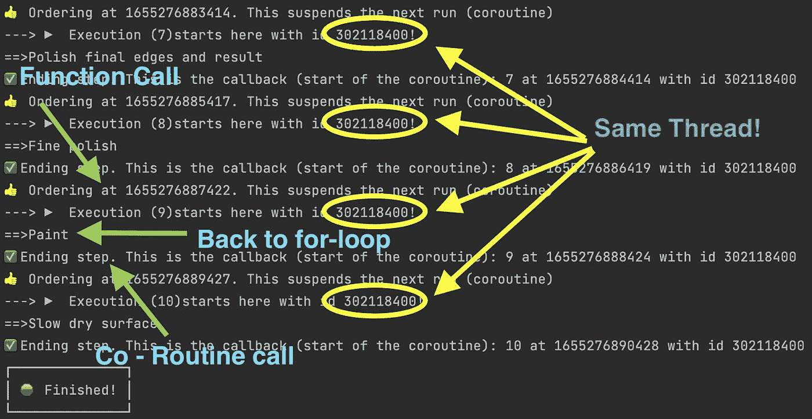***

*****深度代码分析*****

***所以这就是一个**协程**的本质。在这个 **C++** 的例子中，一切都是异步运行的。也有许多方法来实现协程。什么项目**织机**和 **Kotlin 协同程序**在**2000 年代**十年的下半年被视为金矿，是为了探索这一点并以一种*的异步方式实现*。这两种语言都已经发展了，并且在它们各自的实现上仍然运行着实验性的特性。然而， **Java** 仍然处于 **EAB(早期访问构建)**阶段，尽管它在本世纪后五年已经开始了它的开发**。*******

# *****Java 虚拟线程*****

*****为了讨论 Java 虚拟线程，我们必须熟悉一些基本概念:纤程、延续，当然还有虚拟线程。*****

*   *******纤程**:非常明确的说，**纤程**只是虚拟线程的另一种说法。这没什么神奇的*****
*   *******虚拟线程**:这样命名是为了更好地指代它们的实际行为。对于开发人员来说，线程(**平台或系统线程**)和**虚拟线程**(由独立执行的载体线程运行，允许更多进程运行)之间没有明显的区别*****
*   *******载体线程**:这个术语最初似乎是由 hip 和 occurrence 使用的，看起来是指**平台线程**或**系统线程的另一种方式。然而，它确实有比这重要得多的作用。一个**载体线程**是一个**虚拟线程**执行的地方。当我们研究代码时，这变得更加明显，我们将在下面进一步讨论。*******
*   *******延续:纤程**和**虚拟线程**为`***continuations***`。延续就是在产生一个结果后，允许我们继续的东西。这是所有虚拟线程及其工作方式的最底层。我们之前已经看到了协程是如何工作的。这正是**延续**的工作方式。事实上，**协程**只是**延续**的另一个名字。在本文开头示例的代码中，有两个虚拟线程。一个在执行开始时，另一个在我们以文本开始时:“**结束步骤**”。*****

# ****什么是 Java 虚拟线程？****

****在这一点上，从上面，我想你已经非常清楚这整个**延续**和**协程**是关于什么的了。同样的事情，对不对？理论看似一样，实现却不一样。在这个阶段，让我们来看看**虚拟线程**实现的一些亮点(至少在我看来是这样的):****

****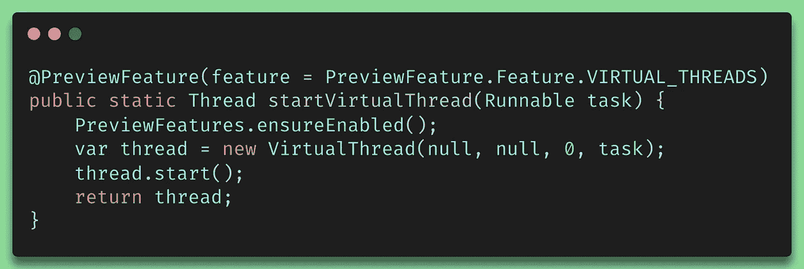****

******启动织机 JDK19 中的虚拟线程******

****在这一点上，什么也没有发生。我们接收一个普通的 runnable，然后进入这个方法。我们已经在`JDK19`中执行了，这个代码只是`JDK19`代码。一旦到达那里，Loom 就创建一个 ***虚拟线程*** 并启动它。当我们以这种方式启动一个虚拟线程时，我们通过使前两个参数为空，第三个参数为 0，第四个参数为我们的**任务**。让我们先深入到 ***虚拟线程*** 中，看看我们是否看到了与我们所看到和了解到的什么是延续有丝毫相似之处的迹象:****

****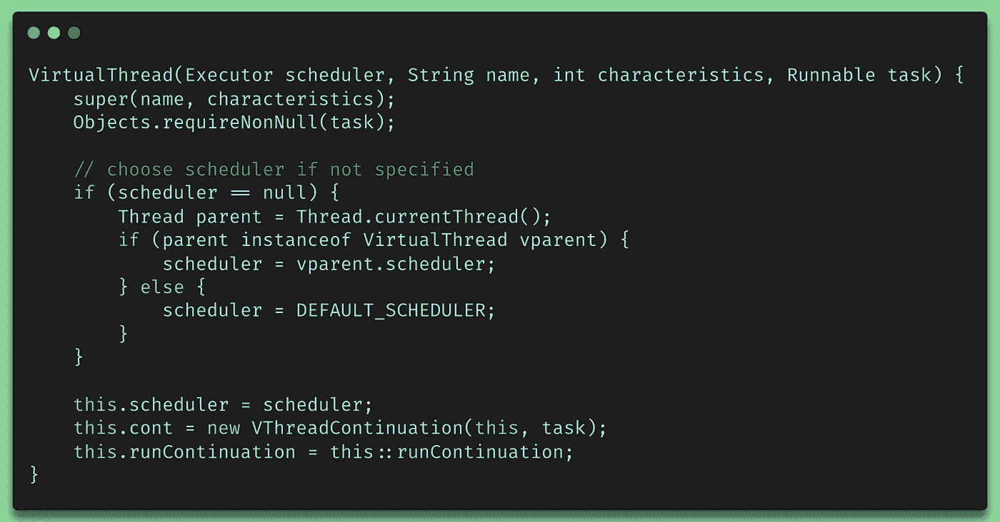****

******JDK 织机 19 中静态调用的虚拟线程构造器******

****在这种情况下，这意味着我们创建一个虚拟线程，没有调度程序，没有名字，没有特征。当然，这意味着什么？也许在这里我们可以跳过一些步骤，但是线程初始化会给它分配一个 ***id*** 而没有 ***特征*** 。因为我们没有给它一个名字，我们的 ***线程*** 将不能用一个名字来标识。至少默认情况下没有。在启动我们的线程之前，我们得到一个 ***调度器*** 。在这一部分中，我们将遇到一些代码，它们确保我们从**系统线程**中获得一个合适的 ***调度程序*** ，或者从 ***虚拟线程*** 中获得一个合适的线程。我们似乎有两种类型的调度程序。一个用于虚拟线程，另一个用于系统线程。这些看起来实际上是可以重用的。新的 ***调度器*** 只有在构造函数中没有给出 ***调度器*** 的情况下才会被赋值，它是基于父线程即当前线程来赋值的。一旦我们有了调度器，我们就可以最终用当前的 ***虚拟线程*** 创建一个延续(***vthread continuation***),并传递我们给定的可运行的 ***任务*** 。最后，我们给`***runContinuation***`属性分配了`***runContinuation***` lambda，以便稍后能够执行它。****

****所以现在我们已经创建了一个**虚拟线程**，它带有**平台线程**的**调度器**，没有名称，一个 **id** ，以及 0 个特征，我们已经为它分配了一个**延续**，并且已经为`**runContinuation**`属性分配了`**runContinuation**`λ。我们刚刚创建的调度器是一个`***ForkJoinPool***`，默认创建的`***parallelisation***`级别相当于机器提供的`***CPU’s***`的数量，还有一个`***maximum worker pool of 256***`。****

****从这里开始，描述发生了什么变得相当复杂，因为这涉及到相当多的本机代码调用，我对此了解不多，并且与本文无关。然而，与本文相关的是虚拟线程在其生命周期中所经历的状态。虚拟线程可能会经历以下状态(它们都是 **int** 值):****

*   ******新 0** :线程开始状态。****
*   ******启动 1** :虚拟线程**已经启动。******
*   ******Runnable 2** :线程**卸载**，这个状态可以分配给一个状态**产出**的线程。线程此时没有运行。****
*   ******运转 3** :螺纹为**运转**并**安装******
*   ******暂停 4** :开始禁用线程进行调度，除非线程有**许可**。****
*   ******停 5** :在状态**停**和**让出**后，螺纹得到**停**。**停放**换句话说，就是等待调度。****
*   ******钉住 6** :当被**同步**进程延迟，或者执行一些虚拟线程**不支持** **操作**时，如一些 **IO** 操作的情况，线程得到**钉住**。其他 **IO** 操作以非阻塞方式执行。更准确地说，钉住是一种不允许虚拟线程卸载的方法，如果它正在等待一个尚不可用的对象。****
*   ******放弃 7** :线程得到**卸载**以便**放弃**它对**处理器**的控制，然后当它被允许再次这样做时，它再次得到**装载**。换句话说，它只是返回了**载体线程。**这也是语境切换的一种形式。用(0)睡觉会立即触发这种状态。****
*   ******终止 99** : **虚拟线程的最终**状态。不会再用了。****
*   ******挂起 256** :卸载后虚拟线程可以**挂起**。****
*   ******可运行暂停**:螺纹可以是**可运行**和**暂停**。****
*   ******停悬**:螺纹可以**停**和**悬**。****

****当一个虚拟线程需要睡眠时，它会执行一个`***delay***`操作。这需要一种叫做**的东西产生**。通过执行**产生**，我们从当前系统线程中卸载当前虚拟线程，并将其控制权让给另一个虚拟线程。****

****如果我们正在执行一个阻塞操作，而线程正在阻塞，一个系统线程将被阻塞，但其他的不会。这意味着，比如说。如果您有 12 个内核，其中 11 个将用于管理虚拟线程，但只有 1 个会被阻塞等待。当使用一些在本机代码中阻塞的操作时，会发生阻塞操作，例如使用`***synchronized***`和`***Object.wait()***`会导致线程被锁定****

****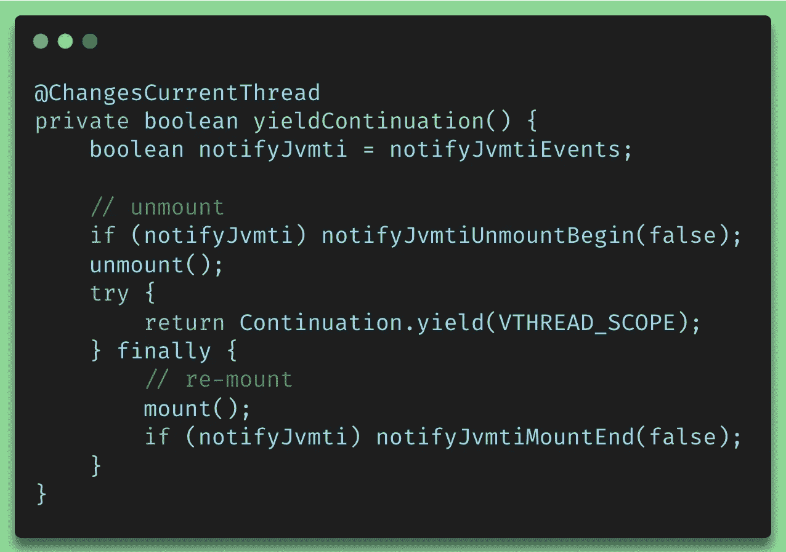****

******织机中延续产量*JDK 19*******

****T4:休眠是虚拟线程暂停执行的一种方式。它的行为与运行在`***synchronised***`代码上的另一个虚拟线程不同。对于这种组合，我们需要另一个叫做`***VirtualThread.java***`停车的概念:****

****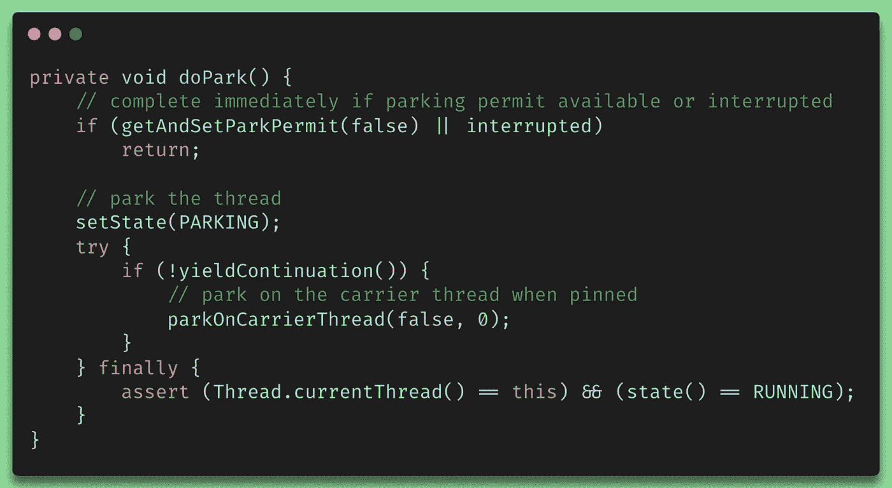****

******织机 JDK19** 停车****

****当我们使用某种被调度的进程时，例如，一个队列或某些 IO 操作，就会发生阻塞。如果它们不能运行并且不得不阻塞本地进程，如提到的`**synchronised**`测试用例，它们将从**停止**状态变为**固定:******

****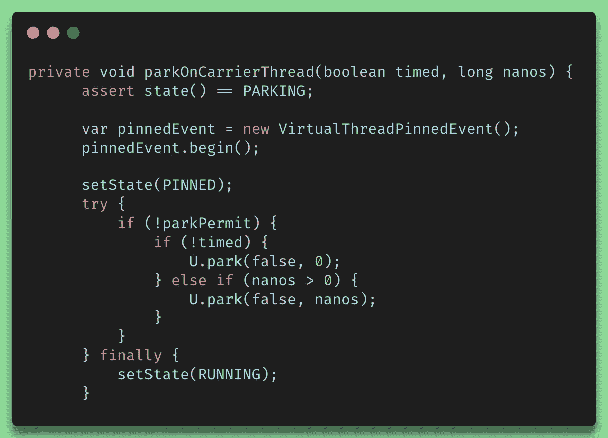****

******织布机中的固定 JDK19******

****我用测试用例 ***提供了一个例子*******

****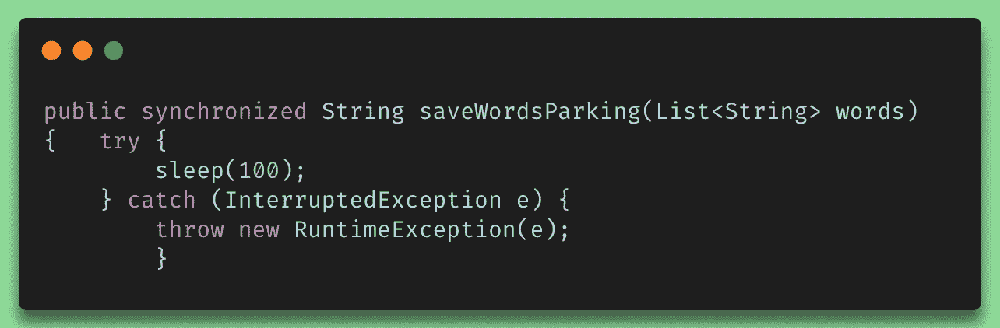****

******在 JDK19** 中诱发牵制的例子****

****然而，停车是一种很奇怪的状态，我无法再现它。这与这个变量***notifyJvmtiEvents***有关，这个变量显然对使用原生方法的 ***挂载*** 和 ***卸载*** 做了一些事情。根据文献记载， **Parked** 是一种状态，标识调度程序中不做任何事情并等待轮到 **Unparked** 并被**调度程序**获取的线程。这应该是 **JVM** 可以管理的解除阻塞操作的情况，即本机独立。****

# ****科特林协程****

****正如我们之前看到的一样，**协程**与**虚拟线程**非常相似。两者理论上其实没有太大区别。然而，它们的实现确实不同。但是在像我们之前使用虚拟线程一样深入研究它们之前，让我们先熟悉一下 ***Kotlin*** 世界的一些术语:****

1.  ******挂起**:指创建协程的行为。一种称为挂起的方法，只在协程上下文中运行。在执行过程中，此上下文可能会切换到另一个上下文。****
2.  ****延迟:延迟有点像睡眠，但是只要我们告诉它，它就会暂停或中止正在运行的协程****
3.  ******协程:**就像**虚拟线程**一样，**协程**运行在平台线程上。它还可以自动**切换内容**。****

# ****什么是科特林协程****

****正如你现在可能已经发现的，otlin 仍然只不过是一个简单的 DSL，它支持一些新的语法，目的是让程序员更容易构建他们的应用程序。当第一次解释**代码**和**字节码**时，这会带来一点混乱。因此，在我们最喜欢的 IDE 上点击***startVirtualThread***而不是 **Java** 这样的东西，在 **Kotlin 的情况下，**我们需要找到一种方法来输入 **suspend** 代码。我们先看一个这样的例子:****

****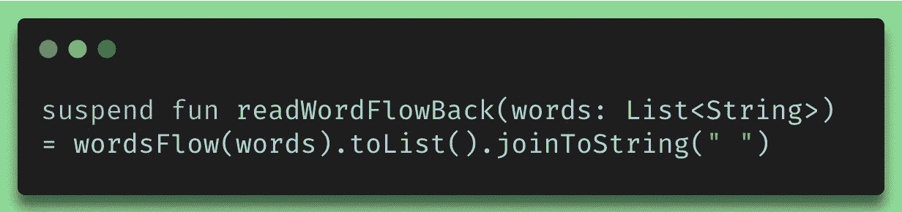****

******协程的例子******

****根据你的 IDE，你会找到不同的方法来做下面的事情。在 **Intellij** 中，幸运的是，有一个工具允许我们查看编译后的**字节码:******

********

******IntelliJ 中的 Kotlin 工具******

****从这里开始，我们可以点击按钮**反编译**:****

****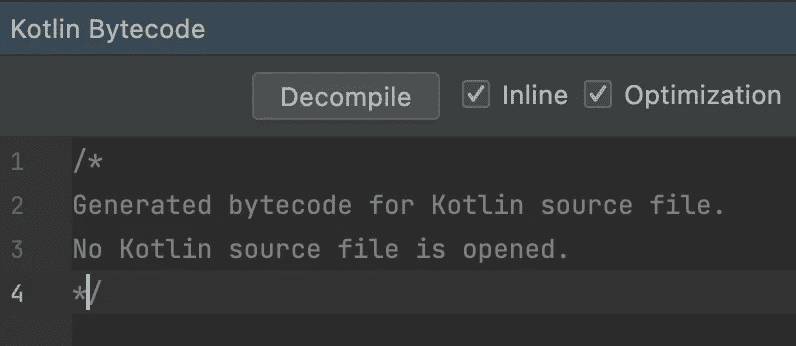****

******反编译代码******

****答我们终于得到了这种代码:****

****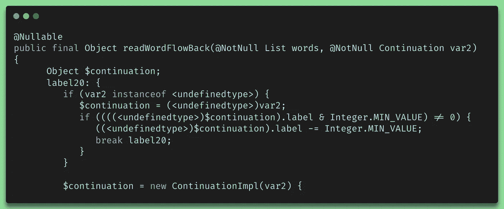****

****P 莱蒂凌乱对吗？嗯，这是我们目前的方式，在 2022 年，把 **Kotlin** 代码反编译成 **Java** 代码。它本质上并不是真正的 Java 代码，但是它给了我们一个窗口，让我们了解事情是如何被真正翻译成 JVM 的。如果我们想跳过这些步骤，看看代码是如何编译的，那么你可能需要使用命令行。出于好奇，如果您确实在命令行中列出了**目标**目录中的文件，您会看到比您通常在编译后的 **Java** 类中看到的更多的文件:****

****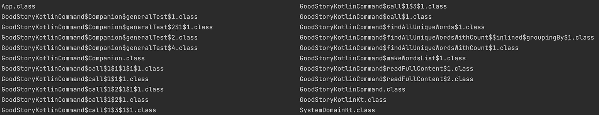****

****N 注意到我们有**相当**一个**少数**类和一些带有实际**方法**名称的类。看起来不太好，但是 **Kotlin** 这样做是因为 **Kotlin** 是在 **Java** 之上的一层。换句话说，它是一种 **DSL** ( **领域特定语言**)。这意味着我们不会像从 Java 代码中得到的那样得到 T21 字节码类。最后，你不需要 Java 代码，因为字节码是编译时生成的。另一个奇怪的事实是，当你用**默认**使用 **Intellij** 时，你并没有真正看到所有这些文件。你唯一看到的是以一种**解读**的方式与他们相对应的科特林人。****

****无论如何，让我们回到反编译的代码。你注意到我们正在使用一个**延续**吗？我们以前在 **Java** 中见过，对吗？让我们像在 **Java** 中一样深入研究它:****

****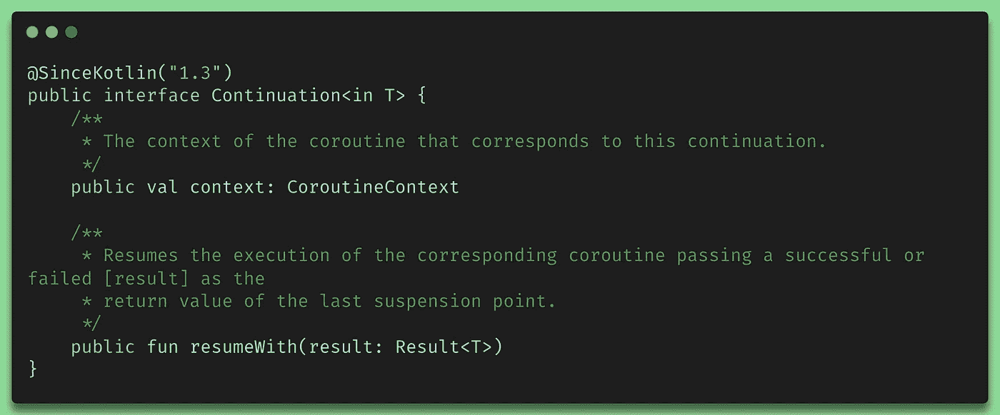****

******延续在科特林******

****我们看到一个`***Continuation***` 是一个接口，它有一个`***CoroutineContext***`和一个`***resumeWith***`函数。****

****A 这确实是我们在评估协程时所能做到的最大限度，因为整个库都是用 **Kotlin** 源代码开发的，这使得我们很难看出这些代码是如何被翻译成 **Java** 的。我想我想说的是，在这一点上，Kotlin 协同程序看起来与 Java 虚拟线程没有太大的不同。但是，另一方面，仅仅因为源代码是用 **Kotlin、**编写的，并不意味着我们不能阅读它。所以让我们试试。****

****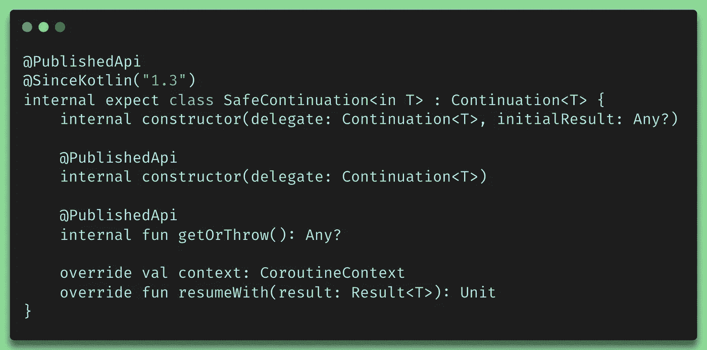****

******安全延续******

****S **afeContinuation** 是 ***Continuation*** 的实现。 ***expect*** 是一个关键字，在 Kotlin 中的使用方式与 **native** 相同。换句话说，在 **Kotlin** 中，这仅仅意味着实现依赖于平台，当然，也不容易访问它。在**协程**代码中，理解任何东西都变得相当困难。在 **Java** 中，我可以调试整个 **JDK** ，而在 **Kotlin** 中，这变得相当困难，我假设这与这样一个事实有关，即 **suspend** 被解释为 **Intellij** 中的关键字，而不是普通代码。因此，我们并没有那么容易调试像 ***延续*** 这样的东西。**但是坚持住**！当然，我们可以！。使用 **Kotlin** ，就像使用 **Java 一样，**我们有时需要猜测代码将落入何处。所以我们采取一个**的胡乱猜测**通过打开 ***运行*** 的方法在***dispatched task . kt:*******

********

******DispatchedTask 运行方法******

****如果你运行我的例子，你会看到代码在这里。这个分派的任务允许我们的**协程**运行。****

****在 Kotlin 中，我们可以用几种方式启动**协程**。我们可以在一个函数中使用 ***挂起*** 并得到调用它的东西，我们可以用`***withContext***` 启动一个协程上下文，我们可以使用`***runBlocking***` ***，*** 加上许多其他方式来实现它们。在我们的测试示例中，我们使用了如下内容:****

****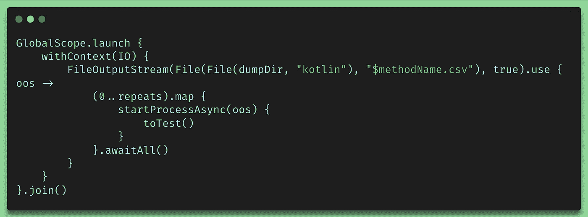****

******创建科特林协程的例子******

****我可以帮助你找出协程从哪里开始。在本例中，我们实际上创建了 3 个协程:****

*   ****`***suspend***` 用调用者的上下文创建一个协程****
*   ****`***GlobalScope.launch***`，将在全局上下文中启动协程(强烈建议不要)。总是建议使用 ***协程范围*** 来代替。****
*   ****`***withContext(IO)***`将在 IO 环境中创建一个协程。****

****T he 关键字`***suspend***` **，**创建一个协程。我们在例子中看不到它。它与父函数`***suspend fun generalTest()***`相关联。为此，请在代码中查找这个示例。然后我们开始新的`***GlobalScope***`。`***GlobalScope***` 将用全局上下文启动一个协程。当然，在它下面，我们可以用`***withContext(IO)***` **启动另一个协程。******

****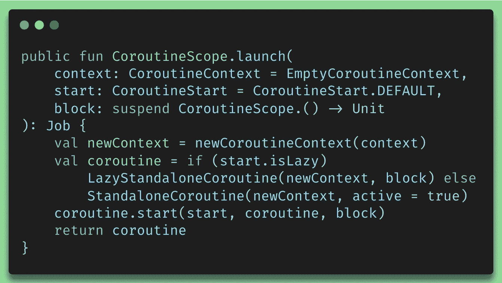****

******在 Kotlin 协同程序库中启动代码******

****对`***Tasks.kt***`处协程实现的深入探究，让我们知道协程有一个**模式**和一个**状态**。****

****一个协程可以有这些**模式**:****

*   ******TASK_NON_BLOCKIN 0:** 任务是 CPU 绑定的，不会阻塞。****
*   ******任务 _ 大概 _ 阻塞:1** :任务大概会阻塞。这就像一个提示，就像我们在虚拟线程中看到的一样，这将让调度程序知道可能需要一个系统线程。****

*   ******CPU_ACQUIRED** :获取一个 CPU 令牌，用它尝试以非阻塞的方式执行一个任务。****
*   ******阻塞:**任务正在阻塞，唯一允许阻塞的 ***模式*** 是**任务 _ 可能 _ 阻塞。******
*   ******暂停:**它暂停一个线程，就像我们之前看到的，暂停发生在线程不能被临时执行的时候。****
*   ****休眠:它保持休眠状态，直到它可以执行另一个任务。这与**停车**不同，因为**停车**意味着工人已经负责一项任务。****
*   ******终止:**这是工作者的最后状态****

****F 最后，**协程**在***dispatchedcoroutine . kt***中有这些状态:****

*   ******恢复 2:** 仅在协程仍未**决定**时可能设置。协调官正在执行死刑****
*   ******暂停 1:** 仅在协程仍未**决定**时可能设置。协程被挂起。****
*   ******未定 0:** 协程的初始状态(在源代码中也称为 ***_decision*** )****

****这些是我们启动协程时常见的状态。在设计时，我们并不真正关心**工人**如何做它的事情，我们也绝对不关心**模式**。然而，了解这些关于**协程**的**基本** **概念**或者至少意识到它们的存在会非常有帮助。****

****作为的概括，协程可以从 ***暂停*** 功能、`***withContext***`或**启动开始。** `***withContext***`和`***launch***`不能在协程上下文之外工作。如果你需要创建这样的上下文，那么你需要使用类似于`***runBlocking***`或者`***suspend***` 的函数。****

# ******虚拟线程和协程的相似性******

****现在我们已经检查了代码，让我们通过深入理论来理解它。关于**协程**和 **java 虚拟线程**的理论几乎可以在互联网上的任何地方找到，我进行测试的 repo 包含了许多关于它的信息的链接。在这一点上，我们需要知道的关于这两种实现的最基本的东西是:****

1.  ****两者都是基于 **1958** 发明的原始协程原理。这确实不是什么新概念****
2.  ****两者都是基于这样的想法，你可以**挂起**一个**函数运行时**来为另一个**函数运行时****让路。******
3.  ******两者都使用**钉住、休眠、**和**停放**等概念在主线程上实现了`***suspend***`和`***waiting***`的思想。******
4.  ******两者都由 **JVM** 管理，而不是由**系统**管理******
5.  ******两者都避免创建全新的**平台**线程，并利用已经运行的线程。它们是在线程池中启动的。**用于 Java 虚拟线程的 ForkJoinPool**和**协同程序调度器**用于 **Kotlin 协同程序**。******
6.  ******尽管我们只能拥有与我们的 **CPU 内核**一样多的**平台** **线程**，但我们可以启动不同的进程，其**并行化水平**最高可达我们拥有的**内核数量**，并同时启动我们想要的尽可能多的进程，直到我们的机器能够处理的极限。我们更多地并行执行的错觉是通过不允许系统线程尽可能阻塞而产生的。******
7.  ******严格来说，两人都不睡觉。最起码他们不会在`***blocking***` 状态下睡觉。在 Java 中，这是通过`***Thread.sleep***`无缝完成的，它使用非阻塞技术，给线程一个**暂停**状态，并给它一个**许可**。**停车**意味着睡眠，而**解锁**意味着**醒来**。在 Kotlin 中，延迟确保当前执行得到调度**稍后执行。但是深入探究让我们看到**停车**和**解锁**也是实现的一部分。********
8.  ****两者有不同的方式来做**牵制**。在 Java 中，钉住是为了将一个线程紧紧地固定在它的载体线程上。这发生在同步方法中。在 Kotlin 协同程序中，执行**被固定**到一个 CPU 线程上。挂起和恢复操作将确保协程将在同一线程上运行，直到结束。同样，Kotlin 也有同步方法，当然，他们也使用**牵制******
9.  ****在这两种情况下，线程都是本机线程的薄薄的包装。****

# ****Java 虚拟线程测试实现****

****为了执行这些测试集，我创建了一个框架，它允许我在时间和空间上测量具有不同复杂性的不同方法的运行时间。这个想法是给不同种类的进程足够的变化，并看看当同时部署几个虚拟线程时所有的变化是如何进行的。对于这些测试，我对测量一个特定虚拟线程执行所花费的时间不感兴趣。相反，我想衡量整体，看看它是如何发挥出来的。用于性能测量的代码还包含报告代码、文件管理代码和 CSV 文件生成算法，以帮助确定一个时间点允许部署多少 java 虚拟线程。让我们看一下接收 lambda 作为参数的方法，该参数包括其他参数，以便执行、实施和测量每个单独测试的持续时间:****

****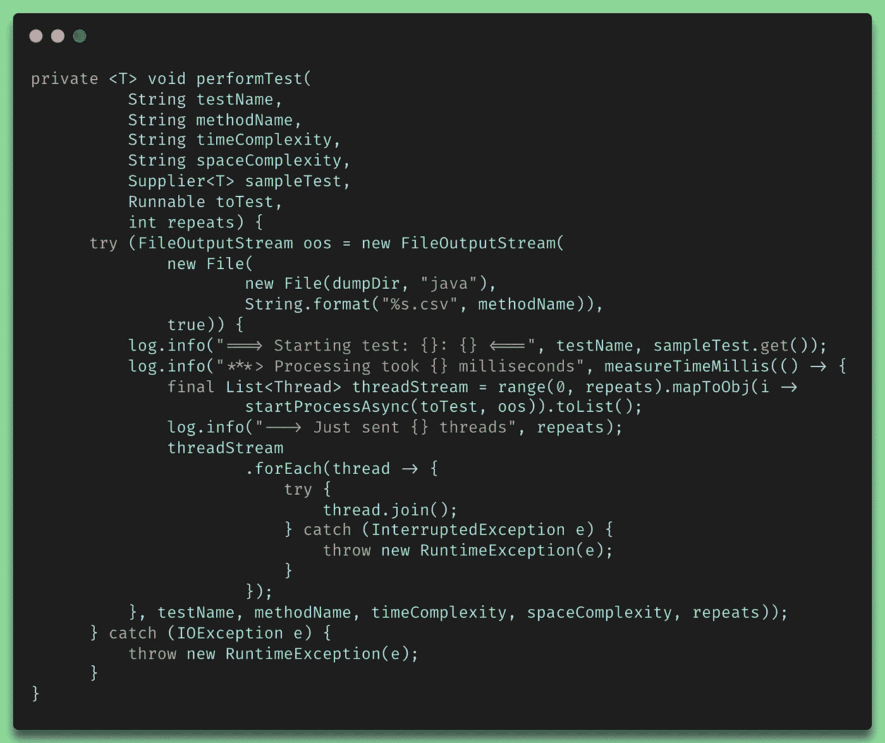****

******在 Java 中执行单独测试******

****所以我在这里创造的只是一种方法，灵感来自我从**科特林**那里学到的一些东西。让我们分别来看看它们****

*   ****`***testName***` 只是一种方法的名称****
*   ****`***methodName***`是一个参数，它让我们知道我们正在测试什么方法。在 **Kotlin** 中，我们将在后面看到，我们可以通过反射轻松地获得方法名，而没有太多麻烦。但是在 Java**中，我仍然不得不硬编码方法名，并把它作为一个输入参数，这是一个快速的双赢解决方案。******
*   ****`***timeComplexity***` 实际上是一个**字符串**，您可以在其中放置您想要的任何内容，但是它是用来表示被测试方法的**大 O 符号**。这对于了解方法复杂性是否会对性能产生影响非常重要****
*   ****`***spaceComplexity***` 也是字面上的一个**字符串**但是在这里，是用来表示空间复杂度的****
*   ****`***sampleTest***`只是一个供应商，所以我们在日志中看到了单个测试的输出片段****
*   ****`***toTest***`是要运行的实际测试吗****
*   ****`***repeats***`是它将运行的次数****

****J 为了清楚起见，`***timeComplexity***`和`***spaceComplexity***`应以渐进的方式进行测试，从小输入到缓慢增加的输入。将来的某个时候，我的网站[http://joaofilipesabinoesperancinha . nl](http://joaofilipesabinoesperancinha.nl)将会提供这一进展。由于个人电脑的限制，进行进展测试有点困难，所以这两个因素在本文的结果中并没有起到重要作用。在我为本文创建的[项目中，每个方法的单独实现应该很容易阅读。](https://github.com/jesperancinha/good-story)****

*******startProcessAsync***是调用 startVirtualThread 方法的地方:****

****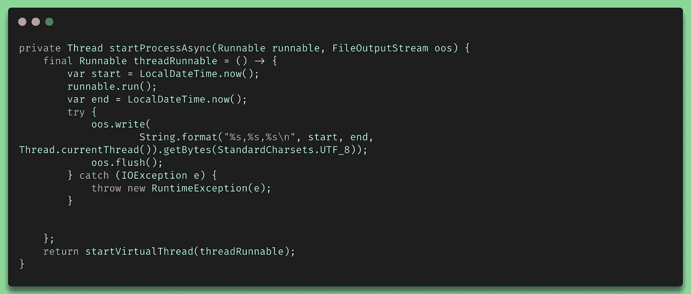****

*******startProcessAsync 测试虚拟线程*******

# ****空降到科罗特斯****

****与 **Java 虚拟线程**相比，C oroutines 有一个稍微复杂一点的范例。这是因为它为你提供了不同的**选项**来启动它们。 **Java 虚拟线程**也有这个功能，但是 **Kotlin** 更进一步，通过改变自己的语法来适应这些变化。然而它的**复杂性**使得它相当**复杂**。对我来说，这非常有趣，但是对于一般的开发人员来说，这可能有点过了。简而言之， **Kotlin** **协程**允许你异步启动一个**执行，等待返回对象**，同样的事情**不等待返回对象**，**挂起当前的协程，转而执行另一个**，在**不同的**或**相同的**上下文中，它有 **4 个不同的抽象**用于运行 它允许你以**延迟**的名义**睡眠**，这是**调度**一个最终的睡眠动作，它允许你创建特殊的 **IO 特定上下文**并启用协程功能。 这些是我们在这一部分将要学习的基础知识。现在，让我们看看以下内容:****

****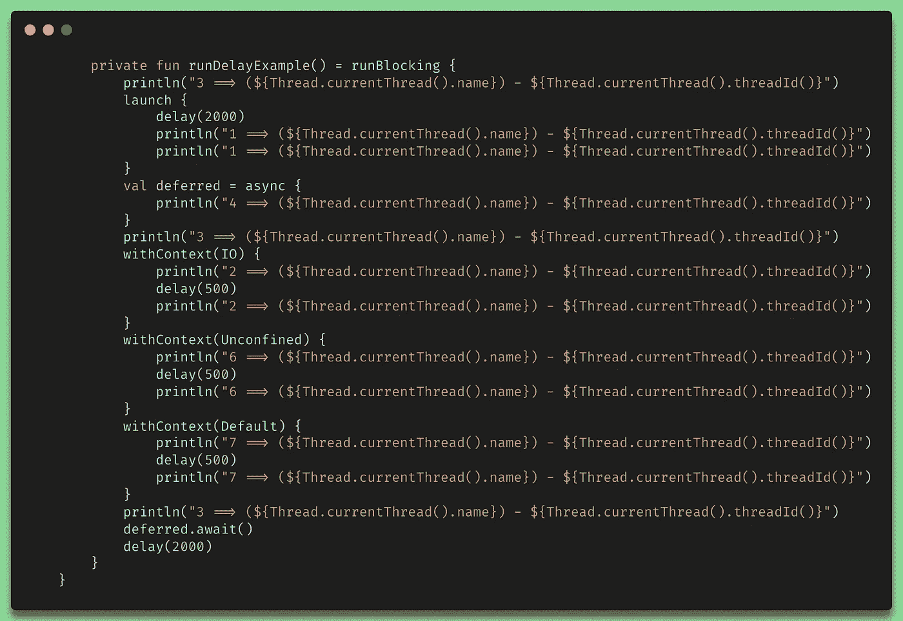****

******运行协程的多种方式******

****Y 你会在许多教程中发现，人们使用**线状曲线**来表示协程的工作方式。我以前也这样做过，但在我看来，这可能有点误导。或者你可以争辩说，这只是对初学者的介绍。然而，协程并不像 ***线程*** 那样工作，尽管在代码的某些地方你可能会有这样的印象。在这一点上，如果你读了上面所有的内容，你可能已经明白我为什么这么说了。如果你运行位于类***coroutineshortexplained . kt****，*中的上述代码，你会看到这些代码大部分运行在线程 **main** 上。所以你可能会问自己，为什么在一个线程中，我们可以等待 **2 秒**然后 **2 秒，**然后整个过程正好需要 **2 秒来执行**？这是因为与`***Thread.sleep***` (对于协程)不同的是，`***delay***` 操作将当前的协程安排在稍后执行，而**将它驻留在**中。这将释放主线程以继续执行。当 **2 秒**过去后，协程**解锁**并再次启动。对于 ***async，*** 我们做的和 **launch** 一样，但是在这种情况下，无论接收者返回什么，我们都返回。在这种情况下，只是一个**单元**，因为它不返回任何内容。最后，我们遇到了`***withContext***`，它的作用是将 **500** **ms** 加到这个函数的总等待时间上。原因是`***withContext***`执行上下文切换。它挂起调用的协程并运行它的执行，在执行结束时返回给调用者。不管运行它的系统线程是什么，都会发生这种情况。这就是为什么当我们运行整个代码时，我们在运行时得到大约**3500**ms:****

****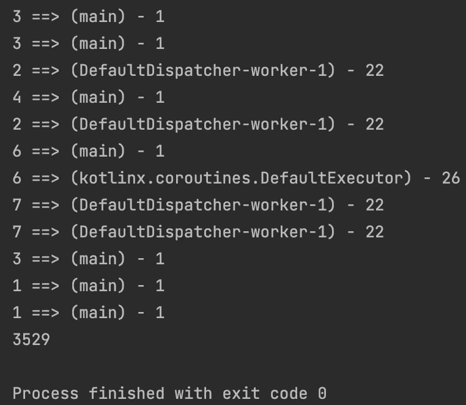****

******运行简短协程的结果示例******

****这些是基本的，但是了解不同的上下文有什么作用也很重要:****

*   ******IO** :这个上下文在阻塞操作期间管理协程的方式与 Java 虚拟线程在**钉住**期间的方式相同。你可以在执行结果 2 中看到这一点。它专门用于 **IO** 操作期间，以便在可能的情况下，允许 **IO** 操作以非阻塞方式执行。****
*   ******默认**:它至少使用 2 个内核才能工作，并且默认使用一个线程池，其中包含的线程数与可用内核数一样多。您可以在 7 号执行结果中看到这一点。如果可能的话，它将使用来自可用 JVM 线程池的不同线程。否则，它将使用第一个。****
*   ******未受限**:表示调度器不一定会继续在同一个线程上执行。您可以在执行结果 6 中看到这一点。它的标准是使用第一个可用的线程，使它非常快。这个线程和`***Default***` **，**的细微区别在于`***Default***`如果可能的话会选择第一个不同的线程，而`***Unconfined***`允许调度程序选择任何第一个可用的线程。****
*   ******Main:** 这个是平台相关的，不一定要存在。它有时被称为特定于 **Android 的上下文**，但实际上，它只是指运行它的平台定义它的**实现。******

****在项目织机中，`***Thread.sleep***`，不能再被认为是阻塞操作。至少不是严格意义上的。然而，当运行 Kotlin 协同程序时，执行线程是**而不是**被认为是**虚拟线程**。它反而是由**kot Lin****coroutines**核心库提供的一个 ***Worker*** 。`***Worker***`是`***Thread***` 接口的一个实现，因此`***Worker***`是一个协程，它也是`***Thread***` **，**但是因为它不是`***VirtualThread***`的类型，所以它不会被**安排**休眠，而是仍然阻塞整个执行:****

****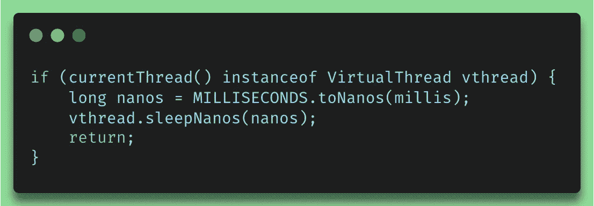****

******在织布机项目中休眠一个虚拟线程——JDK 19******

# ****协程测试实现****

****协程测试函数的实现与它的 java 方法对应物非常相似，但是我们快速浏览一下它是很重要的:****

****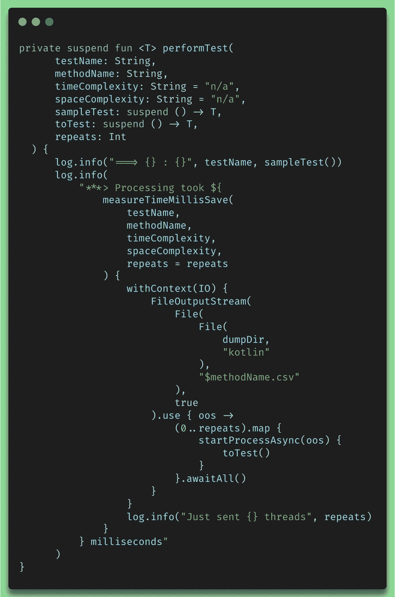****

******在 Kotlin 中执行单独测试******

****Al 虽然这位看起来一样，但是有一点小区别。因为我们希望将数据保存到一个文件中，并且我们希望这些数据都是非阻塞的，所以我们在 **IO** 上下文下用一个协程开始整个过程。一旦我们做到了这一点，我们就可以开始在异步上下文中测试这个方法了:****

****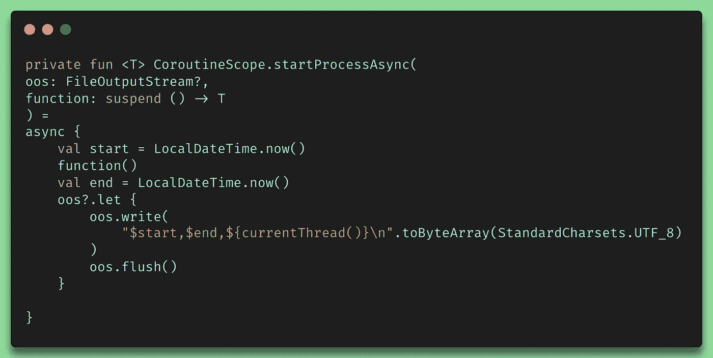****

******在 Kotlin 执行个人测试******

# ****测试前****

****让这篇文章很难写的一个原因是要清楚地解释这里的目标。我是否在尝试测量虚拟线程相对于**协程**的性能，反之亦然？绝对的！**虚拟线程**和**协程**是用来解决性能问题的吗？简短的回答是一个巨大的**不**！**长回答**是**复杂**。延续组织正在解决的问题是我们的资源短缺。通过让 **JVM** 处理**并发**，我们现在可以用**结构化并发**的方式编写代码，我们被允许**同时触发几个进程**，我们可以[封装它们](http://libdill.org/structured-concurrency.html)。****

****解释为什么 **Java 虚拟线程**和 **Kotlin 协同程序**允许我们以结构化并发方式编程，这本身就是一篇全新的文章，但我认为如果我们在简短的定义中使用我们的常识，我们就可以立即明白为什么会这样:****

> ****[**结构化并发意味着并发函数的生存期被干净地嵌套**](http://libdill.org/structured-concurrency.html)****

****我们**触发它们**，但是我们不一定开始**运行它们**。**平台线程**是非常昂贵的进程，会占用**空间**、**和启动时间**，并且它们受限于你的机器的**内核**的数量。这在实践中意味着什么，并且作为延续的任何实现的结果，是我们突然有了如此多的资源，以至于现在已经有人在谈论并发和异步编程是否值得努力。我的测试所做的是允许我**耗尽资源**直到讨论双方的实现都受到挑战。这就是性能测试的用武之地。**当资源耗尽时，管理延续**需要以智能的方式完成，这就是为什么我强调这两个实现。我可以发现**协程**比**虚拟线程**好得多，或者我可以发现**虚拟线程**好得多。或者，也许我会发现实际上没有什么不同，因为我们已经看到这两种实现之间似乎没有什么大的不同。****

****当然，为了能够生成这样的测试，这里构建了许多代码。如果您在应用程序的根目录下运行`**make clean build-run**`，您将会看到一个`**dump**`目录被生成。在里面你会发现两个目录`**java**`和`**kotlin**`。这是我们测试结果的来源。在每种情况下都会生成两种类型的文件。有一个可读的`**mardown**`文件和几个相当不可读的`**csv**`文件。这些`**csv**`文件是成对创建的。一个文件包含方法名，另一个包含方法名但以 **-ms.** 结尾，第一个文件的前两列包含**开始**和**结束**时间戳，每个`**virtual-thread**` **/** `**coroutine**`。第三列包含执行该进程的**运行线程**的名称。****

****F 最后，在**根**上，生成另一个`**markdown**`文件，里面有一个简短的比较报告，尽可能的在`**Java**`和`**Kotlin**`中，关于以相同方式实现的不同方法。这个文件叫做`**Log.md.**`****

****但是我们仍然要看看这两种技术理论背后的另一种可视化。这个想法是你可以在暂停之前的执行的同时执行其他的东西。虚拟线程的工作方式有点像这样，这只是一个过于简化的表示:****

****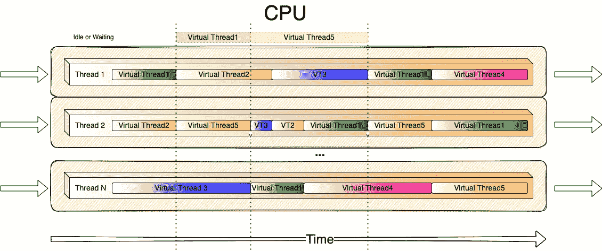****

******解释虚拟线程******

****协程程序实际上给出了相同类型的结构，这也只是另一个过于简化的例子:****

****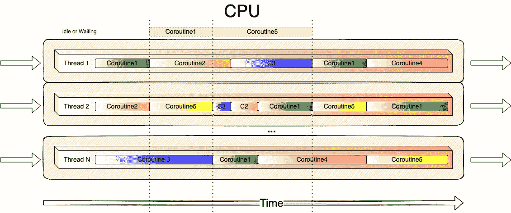****

******解释协程******

****T 在这两种情况下唯一发生的事情是在可用线程之间进行**切换**，而不管它们是如何在一个**低级别**上实现的。在仅使用**平台** **线程**的并发环境中，没有上下文切换，因此进行阻塞调用总是意味着在被允许继续之前等待阻塞调用完成。**协程**或**延续**通过确保我们尽可能避免任何阻塞来最大限度地探索**线程**。如果我们正在等待一个阻塞调用，那么当我们完成时，我们将返回到那个协同程序，但是同时我们只是让另一个协同程序在另一个线程中或者甚至在同一个线程上移动。这使得我们现在能够以一种**结构化并发**的方式来实现，如果我们愿意的话，这是我们仍然需要在代码中显式地做的事情。****

****它们在低层次上可能是不同的，但我看到的是，在高层次上， **Kotlin 协同程序**和 **Java 虚拟线程**(过去也称为**纤程**)是完全一样的东西。****

****为了让这篇文章更有趣一点，我把所有这些算法都会遇到的数据源做成一个小的发展中的小说。时间越长，这两种不同的实现就越难工作。这部小小说讲述了一个名叫露西的女人，当生活变得对她来说太艰难时，她努力回到积极的生活中，并面对她留下的挑战。这些都可以在[项目库](https://github.com/jesperancinha/good-story)中的`**GoodStory.md**` 文件中找到。****

> ****这个故事的灵感来自我自己的个人生活。这个故事围绕着露西展开，她是一个寻找生命意义的年轻女人，仍然肩负着整个世界的重量，但仍然有着强烈的心跳，提醒她还没有结束。生活仍然有很多东西可以提供给露西。这个故事是用虚构的神和人物以隐喻的方式讲述的。它包含了感觉的物化以及它们如何显化。****

# ****试验结果****

****正如我之前提到的，运行这些测试的最佳方式是通过命令行，但是您也可以通过 ***IntelliJ*** 来运行它们。****

****如果你通过 ***Intellij*** 运行它们，你将需要运行至少两个主类。一个用于 **Java** ，另一个用于 **Kotlin** 。它们分别是**GoodStoryJava.java**和 **GoodStoryKotlin.kt.** 我们需要用这些参数运行它们:****

```
****-f docs/good.story/GoodStory.md -lf Log.md  -dump dump****
```

****特别是对于 Java，我们必须启用 JDK19 特性:****

```
****--enable-preview****
```

****如果你有 **VisualVM** 请让它同时运行。我能够在**虚拟虚拟机**崩溃之前抓拍这些快照:****

********

******Java 虚拟线程捕获******

****我能够用同样的方式为 Kotlin 协同程序项目捕捉到这一点:****

****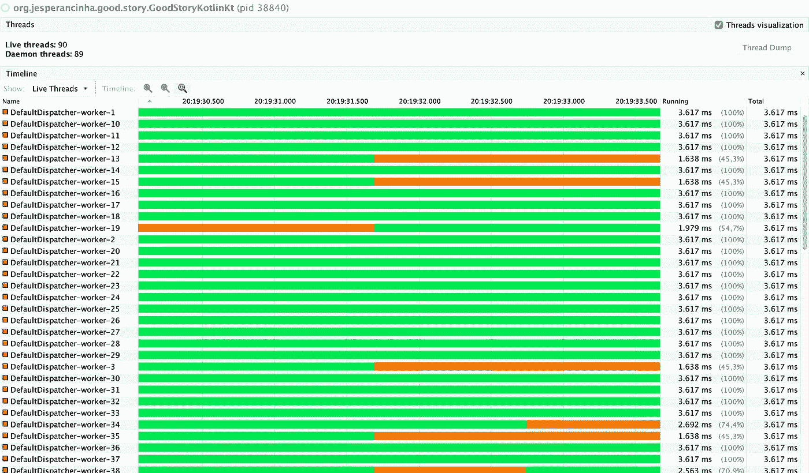****

******科特林协程俘获******

****这里有几个区别，但那只是名字上的区别。在两次捕获之间，我们为 Java 虚拟线程获得了**ForkJoinPool-1-worker-N**，为 **Kotlin** 协程获得了**default dispatcher-worker-N**。这些工作器负责协调协程、协程上下文、上下文切换，并将协程分配给系统线程。Java **ForkJoinPool** 开始设置最大 **256** 个工人。**协同程序调度器**从 **2097150** 工人的最大设置开始。****

****我已经创建了一些 CSV 文件来了解在任何给定时间有多少虚拟线程或协程在执行。这是不准确的，原因是因为他们假设这两种过程连续运行，并且每次连续运行时从不切换上下文。然而，我们现在知道这并不总是正确的。不管怎样，值得努力去研究它们。如果我们看看我们在这两个项目中运行的最繁重的流程之一。例如，让我们检查方法/函数发生了什么:`***repetitionCount***`。这个方法检查有多少单词重复了不止一次。这意味着如果我们发现两个单词“狗”,那么这就是 1 次重复。每发现一只“狗”,我们就在计数上加一。如果我们查看 Java 的计数生成，我们会发现在任何给定时间活动虚拟线程的数量是 **12** :****

****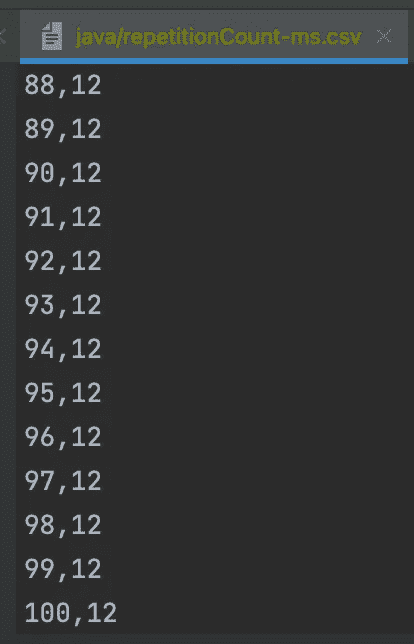****

******Java 虚拟线程的重复计数******

****或者科特林我们发现了一些东西。我们看到，在任何给定的时间，活动协同程序的数量上升到 **63** :****

****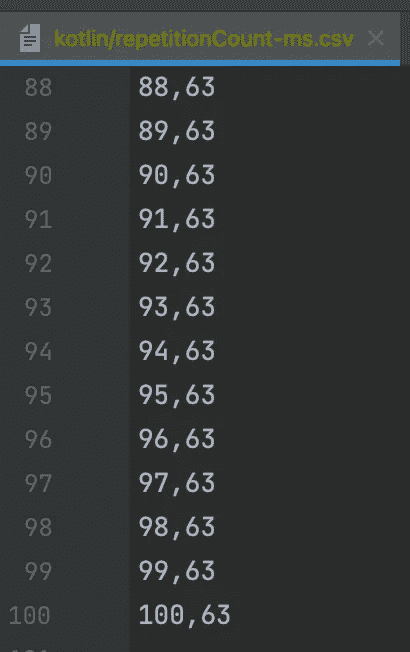****

******科特林协程的重复计数******

****这是如何发生的？嗯，对于 **Java 虚拟线程**，在一个给定的时间只有 **12 是活动的**是完全合理的。对于科特林协同程序来说，这很奇怪。在这种情况下，我真的不清楚发生了什么，但我猜测这个 **63 号**只是一个误导性的结果，因为如果协程在运行过程中改变上下文，或者如果出于某种原因它得到了**挂起**，那么，当然，开始和结束**时间戳**将包含比通常更长的**增量**，并且该结果将不适用于最初的假设，即**异步**处理我们应该告诉已经得到 **12** 或更少，因为这是我的机器有多少核心。不是 **63** ！此时此刻我只能祈祷。****

****F 最后，让我们来看看一般的结果，我们可以比较每一个实现的算法的 **10000** 次重复的不同运行:****

****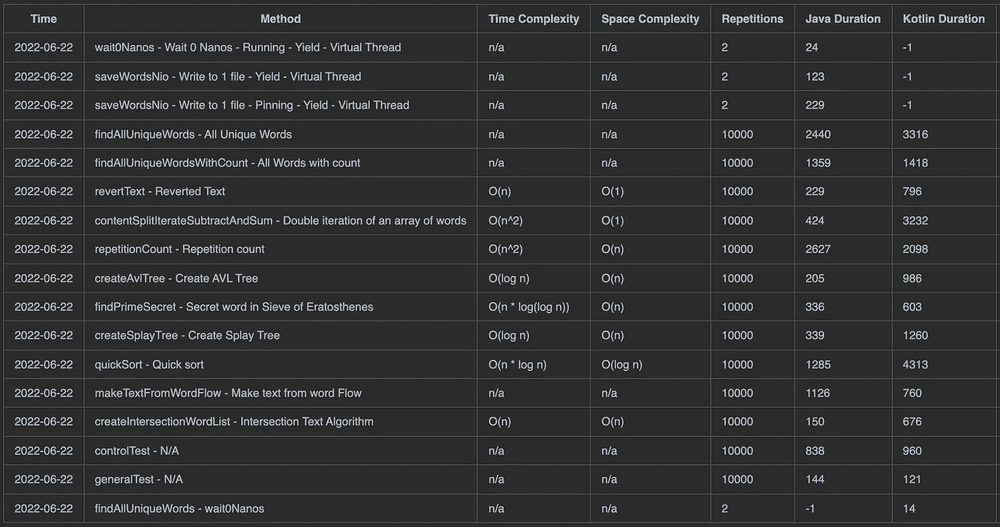****

******某一时间点的结果帧******

****查看表格我们会发现，在几乎所有的情况下，在**方法/函数**中投入一万个**虚拟线程**或**协程**的时间并没有太大的不同。事实上，拉近镜头几乎让我们认为 **project Loom** 在性能方面似乎更好。反正还不足以下结论。此时，我已经用尽了我的本地机器的极限，它在这些测试中已经足够工作了。在我的整个测试中，有迹象表明 **Project Loom 的虚拟线程**似乎确实比**协程**执行得更好，但是，正如我之前提到的，这并不是一个明确的结论。这只是一种关联，一种想法。我仍然不能肯定地证明一个比另一个更好。我能够证明的是，在我目前的当地环境中，没有任何事情，绝对没有任何事情让我怀疑这些解决同样问题的方法。这两者在同一水平上看起来都不错，这一点表明 Java 虚拟线程做得更好仍然只是一个迹象。这只是一个指示的另一个原因是，我已经能够在其他场合运行这些相同的测试，所有的**协程实现**都比 **Java 虚拟线程**做得更好。只是频率似乎更有利于 **Java 虚拟线程**，但这不是得出任何结论的材料。也许，不能得出任何结论本身就是一个结论，但我让你决定。****

# ****结论****

****当我比较**延续**这一相同思想的两种实现时，我实际上并没有看到任何重大的不同。我发现 Kotlin 协同程序和 Java 虚拟线程都是伟大的技术。当用**协程**耗尽系统，并迫使各种算法开始行动来**优化**时，我没有看到任何性能上的重大差异。****

****事情是这样的。**科特林**会留在这里**爪哇**也会留在这里。我写这篇文章的目的是引导双方进行讨论，以更好地了解两种语言都有什么。 **Kotlin** 是 **2010** 的**发明**而 **Java** 自 **1995** 就存在。同理， **Scala** 被创建， **Kotlin** 也被创建来“ ***提供*** 之前没有的特性”。嗯，这对我来说是一颗难以下咽的药丸。你知道为什么吗？因为在 Kotlin 中可用的一切，以及我们在 kot Lin**中所说的**需要的**，我总是发现在 Java**中也可以得到！只是风格不同而已。这从我们现在所说的**惯用 Kotlin** 到我们现在所说的**惯用 Java** 。********

**从 2014 年**到 2014 年**Java 8 我们已经开始担心缺乏更好的解决方案。 **Lambdas** 做与**完全相同的事情，而**和**做{} while，**以同样的方式，**接收器**在 **Kotlin** 中做。他们让一切都慢得要命！只有在为**高可用性**应用程序实现算法时，或者在**黑客**网站上做关于**大 O 符号的练习时，你才会意识到这一点。**这可能有点夸张，但嘿，我也喜欢这两者带来的**优雅**，所以**我也大量使用它们**，说实话，但我的观点是它们不是一切。当我们投资于**序列、** **lambdas、接收器和 map-reduce 操作时，**我们在某种程度上惩罚了性能。有关系吗？它只在重要的时候才重要，所以我最好的建议是成为这方面的专家。我们都真心喜欢 **Lambdas** 和**receiver**，但是不要让它们成为你日常编码生活中的一个愤怒点，因为有时候，老一套的**可以带来真正的不同。****

**如果我们谈论，例如，Java 中的**扩展函数**比**静态方法**更好，那也不是一个很好的观点。当我看到这些讨论或者当我把**拖进**时，我通常观察到的是一方对其选择的语言极其热衷，但在我看来，真正发生的只是人们捍卫他们的个人偏好。对我来说，我更倾向于客观，我看不到任何客观的关于这些语言的东西。他们只是不同而已。太棒了！**

**从很多方面来说，J **ava** 都是 **Scala** 和 **Kotlin** 的父代。我认为想要或希望科特林接管 Java 有点愚蠢。我个人认为所有的语言都应该存在，我们应该向所有的语言学习，因为它们不同但最终做得一样的原则正是让我们保持活跃并让我们理解关于代码的不同观点的相同原则。我不希望 **Java、Kotlin、**或者 **Scala** 消失。我希望所有这些语言和其他语言也能进化。我想向他们所有人学习。嘿，还记得我在一台 **ZX-Spectrum 48K 机器上用橡胶键**开始用磁带编程吗？那是在我 80 年代末。这可能与当今世界无关，但有了这一参考，我就能更好地理解我们所处的位置，我们过去和现在面临的问题，以及我们将来可能会发现的问题。更多的语言给世界带来的丰富多彩经常被忽视。**

**我可以一直写下去，但是我真正想对这篇文章说的是简单明了的。Kotlin 是一个新玩家，而**协程**实现**也是。我们都爱他们。但是无论如何，我看不到这些技术相对于 Java 虚拟线程的工程附加值。我认为 **Kotlin** 与众不同，这给 **JVM** 增添了新的味道。然而，我所知道的每一个关于科特林的评论家，事实证明我也能看到同样的事情发生在 Java 和 T21 身上。同样，对于每一个关于 Kotlin 的赞美，我都能在 Java 中找到完全相同的。只是好像风格不太一样。当然，许多东西没有集成到 **Java SDK、**中，但是 **Kotlin** 仍然只是在 **JVM** **之上的 **DSL** 。这意味着如果我在 **Java** 中使用类似 **Lombok** 的东西，我可能会拥有同样的权利？只是另一个 **DSL** ，就像**科特林**一样。嗯，很多读到这里的人会竭力反对说 **Lombok** 是“一个糟糕的想法”，然后我会说“但是我们现在已经在 **Java** 中有了`**record’s**`”然后你会说“是的，但是**数据类**一起做所有这些，你可以让一切**不可变**，它看起来好多了！”。这太棒了，我同意最后一句话。科特林**确实更好看。是吗？也许我更喜欢使用注释，也许我更喜欢使用`@Builder`而不是`data class`，也许我想被提醒，在单个**数据**关键字后面，我得到一个**散列实现**，一个**等于**，**getter**和**setter，**，如果我在我的所有属性上使用`***val***` **it** ，那么我得到一个**不可变的**这就是我认为 **Kotlin** 是天才语言的地方。我仍然不清楚它给代码增加了什么工程上的好处，然而，通过依靠我们的直觉和当前的趋势，它找到了一个黄金机会来填补许多开发人员和工程师目前面临的一个可感知的差距。**样板、重复代码、困难代码、工程费用等**等。此外，在确保结构化并发性方面，它提供了一种令人惊叹的编程风格。当然还有我们想做一些刺激和新奇的事情的愿望。新的语法和新的语义创造了一个全新的游戏场，这是一件积极的事情。****

**在我看来，从严格的工程意义上来说， **Kotlin** 和 **Java** 都比对方好。你当然可能不同意。我认为如果你来自一个 Android 背景的人，那么你会比我有更多的话要说。我非常清楚 **Kotlin** 已经被 **Android** 开发者广泛接受。我觉得不错。我的观点(或缺乏观点)来自于**仅服务实现**的角度。Android 确实有更多的功能，所以我不得不放弃对它的评论。就目前而言，是这样。**

**如果你必须选择一项新技术，我的建议是，选择你最喜欢的。我很怀疑你能从语言本身中找到任何性能上的好处。也要和你的团队保持一致。如果他们对科特林有热情，那就去吧。如果他们对 Java 有热情，那就去做吧。在激情中，你会发现最大的生产力。如果你想追求一些高效的东西，而**是你唯一关心的**，那么**在这个**上有一个非常广泛的共识，你可能想要**远离任何一开始就与 JVM 相关的东西**。在 **JVM** 中启动和运行可能很困难，这就是为什么许多人转向**本地**解决方案的原因。我还想指出的是，协程有时会在多线程和提供更多线程的**上下文中讨论。那只是**而不是**的情况。围绕**协程**的范例本质上与**反应式编程**更相关，而不是其他任何东西。我这样说的原因是因为协程更有效地利用了**系统/平台线程**。然而，这听起来可能与**多线程**有关，但事实并非如此。这只是一种避免线程无缘无故暂停的方法，如果你愿意的话，就像过去那样。无论你决定使用 **Kotlin 协程**还是即将到来的**虚拟线程，这完全取决于你。******

**认为 **Java** 必须抵御 **Kotlin** 或 **Kotlin** 可能代表着对 **Java** 的威胁的想法是我写这篇文章的最初动机，这是因为，就像 **Lucy** 的故事有一天会展现出来一样，有时我们只是互相讲述非常好的故事，但它们最终毫无意义。当我醒来的时候，我个人会继续用我喜欢的任何语言编程。在工作中，我坚持按计划行事。在我的**空闲时间，尽管**，我只是选择**我当时想做的任何事情**，这包括 **Java、Kotlin、Scala、Go、Rust、Python、Ruby、PHP、Javascript 等等。****

**正如我在引言中提到的，鉴于这篇文章的实验性质，它将会受到更频繁的评论。**

**我已经将这个应用程序的所有源代码放在了 GitLab 中**

**我希望你能像我喜欢写这篇文章一样喜欢它。**

**我很想听听你的想法，所以请在下面留下你的评论。**

**感谢您的阅读！**

# **参考**

**[](https://blogs.oracle.com/javamagazine/post/going-inside-javas-project-loom-and-virtual-threads) [## 走进 Java 的项目织机和虚拟线程

### 下载本文的 PDF 让我们谈谈 Project Loom，它正在探索新的 Java 语言特性、API 和…

blogs.oracle.com](https://blogs.oracle.com/javamagazine/post/going-inside-javas-project-loom-and-virtual-threads)  [## 主要的

### x86-64 上的 Mac 和 Linux 此时最有价值的贡献方式是尝试当前的原型和…

wiki.openjdk.java.net](https://wiki.openjdk.java.net/display/loom/Main)  [## 织机提案. md

### Project Loom 的任务是使并发应用程序的编写、调试、分析和维护变得更加容易

cr.openjdk.java.net](https://cr.openjdk.java.net/~rpressler/loom/Loom-Proposal.html) [](https://kotlinlang.org/docs/coroutines-overview.html) [## 协同程序|科特林

### 异步或非阻塞编程是开发领域的一个重要部分。创建服务器端时…

kotlinlang.org](https://kotlinlang.org/docs/coroutines-overview.html) [](https://paluch.biz/blog/183-carrier-kernel-thread-pinning-of-virtual-threads-project-loom.html) [## 虚拟线程的载体内核线程锁定(Project Loom)

### 在我之前的博文中，我开始了一个使用 Project Loom 的实验。这篇文章概述了利用…

paluch.biz](https://paluch.biz/blog/183-carrier-kernel-thread-pinning-of-virtual-threads-project-loom.html) [](https://blog.devgenius.io/java-virtual-threads-715c162c6c39) [## Java 虚拟线程

### 我们将不再编写丑陋的异步代码。也许吧。

blog.devgenius.io](https://blog.devgenius.io/java-virtual-threads-715c162c6c39)**