# 科特林土著和 GraalVM——到目前为止的故事

> 原文：<https://itnext.io/kotlin-native-and-graalvm-the-story-so-far-e10d7e9cfc91?source=collection_archive---------1----------------------->


T 今天有很多`**buzz**`关于一项我们倾向于称之为**本土**的技术。**原生技术**或**原生代码**通常是指用 **C** 编写的代码，编译后无需**虚拟机**就可以直接在一个特定的系统中运行。例如，所有的 **JVM** 语言代码(即 Java、Kotlin、Scala、Groovy)都需要一个**虚拟机**来运行。我们首先将我们的**源文件**编译成能够被**虚拟机**读取的**字节码**，然后我们用我们的**字节码**启动**虚拟机**。Javascript 代码也需要虚拟机来运行，许多其他语言也需要虚拟机。然而，当我们原生编译任何代码**时，甚至是 C 代码，它实际上意味着代码是以这样一种方式编译的，我们可以从命令行调用这些生成的**可执行文件**，而不需要参考其他任何东西。我们不需要 **NodeJS** 来运行它们，我们不需要最新的 **JRE** 来运行它们，我们也不需要任何 **SBT** 、 **Gradle** 或 **Python** 工具来运行它们。我们只需运行**可执行文件**。当然，有一个问题是我们不能在任何系统中运行这些文件。我们只能在理解这些文件的系统中运行这些文件，我们在编译时定义了这些文件。这就是为什么我们不能在没有任何支持的情况下在 Linux 中运行 windows 文件，反之亦然。因此，举例来说，如果我们想在 **MAC-OS** 中运行任何 **windows 可执行文件**，我们将需要类似 [**Wine**](https://www.winehq.org/) 的东西。**

**如果你是几年前的人，我指的是软盘时代，你可能熟悉 **EXE、COM、**和 **BAT** 文件的概念。像 **AUTOEXEC 这样的东西。BAT** 应该会想到。对于那些认识这些东西的人，我已经可以给你们举个例子，你们可能已经知道了，这些都不能在 MAC-OS 或 LINUX 上运行。这些文件特定于旧的 MS-DOS 系统和一些旧的 Windows 版本。无论如何，这里的要点是我们现在知道当我们谈论**本机**时，我们指的是一种独立运行我们代码的方式。我们编译的代码将在本地工作。它将尽可能地使用低级资源和直通抽象，以便在非常低的级别上执行命令，并且最好是不需要预安装的命令。**

# **1.介绍**

**我们要用 Kotlin Native 和其他编译原生代码的变种和形式做一些实验。为此，我们需要数据，我的小说《好故事》第二章提供了这些数据。对于这篇文章，我们来看看 [**第二章——帮助露西的猫**](https://github.com/jesperancinha/whiskers-kotlin-native/blob/main/docs/good.story/good.story.chapter.2.md)**

# **2.要求**

**对于本文来说，我提供的库是在只考虑运行安装了 Linux 的容器的 Linux 系统的情况下创建的。我最初没有对 MAC-OS 进行测试。我打算提供对 MAC-OS 机器的全面支持，也许以后还会提供对 Windows 的支持。如果你真的需要我的仓库也支持 Windows 和 MAC-OS，请向我的 repo 或我的任何其他仓库开放问题。然后我会觉得有必要帮助你，并且会增加我这样做的动力。正因为如此，如果你能在这里公开你的问题，我会非常感激。**

**你还需要考虑的是你的机器的容量。我做了几次测试，我的机器在编译时被阻塞了，直到我最终提高了文件侦听器的数量:**

```
echo fs.inotify.max_user_watches=33554432 | sudo tee -a /etc/sysctl.conf && sudo sysctl -p
cat /proc/sys/fs/inotify/max_user_watches
```

**`**inotify**` **手表** **编号** **3354432** 是我最后使用的，但是如果你的机器可以的话，请多尝试一下。你可以在我的所有云回购中找到更多关于这个[的信息。](https://github.com/jesperancinha/jeorg-cloud-test-drives)**

**如果您打算运行我将在下面描述的所有示例，请记住，在本地环境中编译也意味着从强类型语言(如我们正在使用的语言 **Kotlin** )进行的转换非常慢，因此您必须预料到编译时间会非常慢**。它与您的机器、硬件或您可能正在使用的任何操作系统都没有任何关系，进行编译可能会非常令人沮丧。作为预防措施，请不要在执行下面指示的安装步骤之前使用您的 **IDE** 。****

# ****3.科特林本地人****

****对于纯 Kotlin 原生用户，我们只打算用命令行创建一些有趣的东西。Kotlin Native 提供了几个命令行指令的包装器，我们可以很容易地使用它们。我们将在水下有效地使用 C，并使其与 GCC 一起运行。****

# ****3.1.什么是 Kotlin Native，它是如何工作的？****

****奥特林土著在它所能做的方面仍然非常有限，它也有一种非常不同的运行和工作方式。因此，我们需要首先从基础开始深入了解使用 Kotlin native 的实际情况，然后在此基础上建立我们的知识。****

****当我们第一次使用初始 IntelliJ 布局创建 Kotlin 原生初始解决方案时，我们可能会认为我们将使用一个普通的环境，在这个环境中，我们只需添加库并配置 **Gradle** 即可工作。相反，我们将使用可用于**本机**代码生成的库。因此，在我们做任何事情之前，我们先启动一个本地多平台应用程序项目:****

****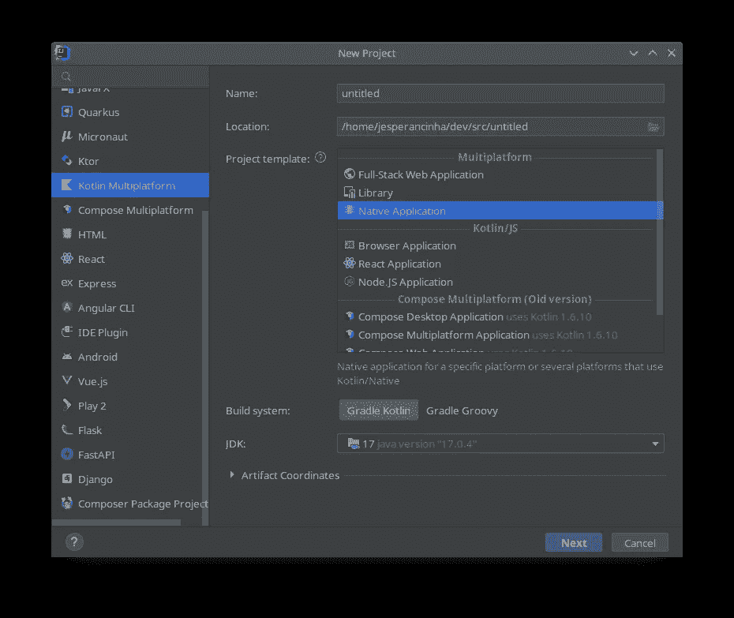****

******在 IntelliJ 中启动本地应用******

****当我这样做的时候，我意识到最终的项目是一个 **Gradle** 项目。比如先来看看 [**手感好的**](https://github.com/jesperancinha/whiskers-kotlin-native/tree/main/good-feel) 项目。这个项目是一个简单的基于控制台的项目，它简单地输出一个随机的正面信息到屏幕上，给你一个美好的感觉。如果我们看看正在使用的基本插件，只有一个叫做**多平台**:****

```
**plugins {
    kotlin("multiplatform") version "1.7.22"
}**
```

****一旦这个插件就位，Intellij 还会配置 Kotlin 本地编译:****

```
**plugins {
    kotlin("multiplatform") version "1.7.22"
}

group = "org.jesperancinha"
version = "1.0-SNAPSHOT"

repositories {
    mavenCentral()
}

kotlin {
    val hostOs = System.getProperty("os.name")
    val isMingwX64 = hostOs.startsWith("Windows")
    val nativeTarget = when {
        hostOs == "Mac OS X" -> macosX64("native")
        hostOs == "Linux" -> linuxX64("native")
        isMingwX64 -> mingwX64("native")
        else -> throw GradleException("Host OS is not supported in Kotlin/Native.")
    }

    nativeTarget.apply {
        binaries {
            executable {
                entryPoint = "main"
            }
        }
    }
    sourceSets {
        val nativeMain by getting
        val nativeTest by getting
    }

}**
```

****这意味着编译器会判断出你在哪个机器上运行它，然后如果可能的话，把你的代码编译成本机代码。该代码包括与 **Windows** 、 **Mac OS X、**和 **Linux** 的可能兼容性。正如我之前提到的，在本文中，我们将只看一下在 Linux 生态系统中实现**原生**代码。****

****让我们看看实际的代码。它非常简单，我这样做是为了提供某种杠杆来理解本机代码是如何工作的:****

```
**fun main() {
    println("*.*.*.*.*.*.*.*.*.*.*.*.*.*.*.*.*.*")
    println(randomMessage())
    println("*.*.*.*.*.*.*.*.*.*.*.*.*.*.*.*.*.*")
}

fun randomMessage(): String {
   return listOf(
       "Good Morning!",
       "You are looking great today!",
       "What a great day today!",
       "Good job!",
       "I really appreciate what you just did! Thank you!",
       "Thanks for bringing me coffee!",
       "You are the best pal ever!",
       "I love working with you!",
       "Rise and shine!"
   ).random()
}**
```

****因此，在本模块中，我们只打印出几个字符串，这是两个分隔符，它们之间有很好的信息。如果我们点击这些资源，我们会很快意识到并没有什么真正的改变。这只是标准的 **Kotlin** 库**代码。如果我们用命令`**make b**`编译该文件夹中的代码，我们将在`**build/bin/native/releaseExecutable/plus.kexe**` 中得到一个可执行文件。我们可以通过这个精确的链接手动调用这个文件，或者运行脚本`**make run**` **。**您将在输出中得到类似这样的内容:******

```
*.*.*.*.*.*.*.*.*.*.*.*.*.*.*.*.*.*
Good job!
*.*.*.*.*.*.*.*.*.*.*.*.*.*.*.*.*.*
```

**这个项目的想法仅仅是为了说明在科特林本土启动一个项目是多么容易。我们也将看到它会变得多么困难。这就是我创建项目 **plus、**的原因，它本质上只是项目 **good-feel** 的扩展。当点击时，特别是 **Map** 类，特别是源代码在哪里，我们很快意识到我们并没有真正地使用普通的 jar 库。事实上，我们根本没有在使用 Java 库。我们正在研究的是。 **knm** 文件。这些是本机编译的库，IntelliJ 可以部分解释并提供对它们的简单的**接口**访问。这一切都发生在设计阶段，这意味着**智能感知**正在为您工作:**

**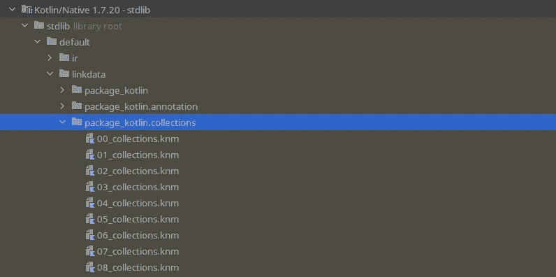**

****科特林原生** `**stdlib**` **布局****

**我们当然仍在使用标准库，但不是我们习惯使用的那个。在这种情况下，标准库是本机运行的代码。但首先，让我们看看我们在新代码中使用了什么:**

```
fun main() {
    println("*.*.*.*.*.*.*.*.*.*.*.*.*.*.*.*.*.*")
    println(randomMessage())
    println("*.*.*.*.*.*.*.*.*.*.*.*.*.*.*.*.*.*")
    val groupBy: Map<String, List<Int>> = allMessages().groupBy({ it }, { it.length })
    val hashMap = allMessages().groupBy({ it }, { it.length }).entries.fold(HashMap<String, List<Int>>()) { a, b ->
        a[b.key] = b.value
        a
    }
    println(groupBy::class.qualifiedName)
    println(hashMap::class.qualifiedName)
    val toTypedArray: Map<String, String> = allMessages().toTypedArray().associateBy { it }
    println(toTypedArray::class.qualifiedName)
}

fun randomMessage(): String {
    return allMessages().random()
}

private fun allMessages() = listOf(
    "Good Morning!",
    "You are looking great today!",
    "What a great day today!",
    "Good job!",
    "I really appreciate what you just did! Thank you!",
    "Thanks for bringing me coffee!",
    "You are the best pal ever!",
    "I love working with you!",
    "Rise and shine!"
)
```

**在这种情况下，我只是创建一些地图，然后我使用实体来重新创建它们，本质上我只是创建地图。超级简单代码的有趣之处在于它看起来和感觉上都像 Kotlin。在很多方面都是 Kotlin，但这段代码会提前编译。我们称这种情况下的编译器为 **AOT(提前编译器)。**这意味着生成的代码不仅仅是可执行文件。当我们运行它时，它将以一个性能峰值开始，因为没有**即时编译过程**。在 JVM 中，当我们制作我们所谓的可执行 jar 时，编译过程并没有就此停止。这足以让我们在 JVM 中启动 jar。**完整编译**将在应用程序启动期间优化进程时发生。这通常是我们谈论 JIT 时所指的。在我们继续深入时，请记住这一点，因为我们将在本文的其余部分讨论这两个概念。**

**例如，如果我们分析其中一个生成的`**knm**` 文件，我们将看到以下内容(`***00_collections.knm***` ***)*** ):**

**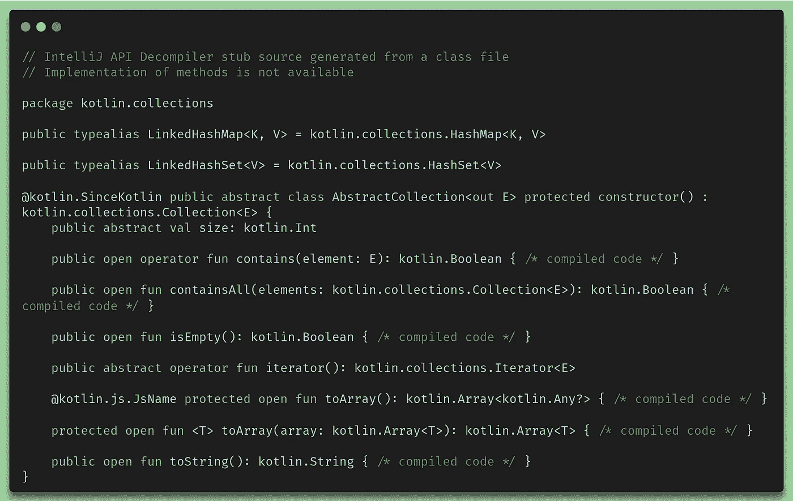**

*****00 _ collections . knm of*包 kotlin.collections****

**我们可以在顶部看到，与我们通常在 SDK 的 **Kotling 标准库中看到的不同，我们只看到类似接口和不可读函数体的引用。我们也看到一些声明的变量，但是我们从来没有看到任何实现。目前，至少不容易在 Kotlin 本地标准库中看到这些方法的实际实现，这是不可能的。原生库当然是原生的，我们看不到这一点，就像我们看不到使用 Java 中的原生绑定在 C 中实现的函数一样。这也是用**Kotlin**native**SDK 实现的实际意思的一个侧面。我们现在在将 JVM 代码与本机代码分开的灰色区域编程，我们这样做当然是因为我们希望我们的最终产品不再与 JVM 有任何关系。另外，请注意反编译器的第一条注释，它基本上陈述了我们刚刚讨论的内容:**

```
// IntelliJ API Decompiler stub source generated from a class file
// Implementation of methods is not available
```

**这就是 Kotlin Native 最纯粹、最简单的工作方式。我们当然可以将我们的 Kotlin 代码与 C 代码结合起来，这允许我们探索更多的可能性，看看我们能用本机代码和我们的最终汇编做些什么。**

# **3.2.[科特林本地运行器实现](https://github.com/jesperancinha/whiskers-kotlin-native/tree/main/whiskers-runners/whiskers-runners-knative)**

**正如我们将进一步看到的，我们将使用一个例子，我们将创建一个 runnable，它将进行非常简单的操作。它将分割一个文本，并立即连接它回来，没有检查。这是一个分割耗时 O(n ),连接耗时 O(n)的操作，导致总时间复杂度为 O(n)。就空间而言，分割的复杂度也是 O(n ),连接的复杂度也是 O(n)。代码实现非常简单，如下所示:**

**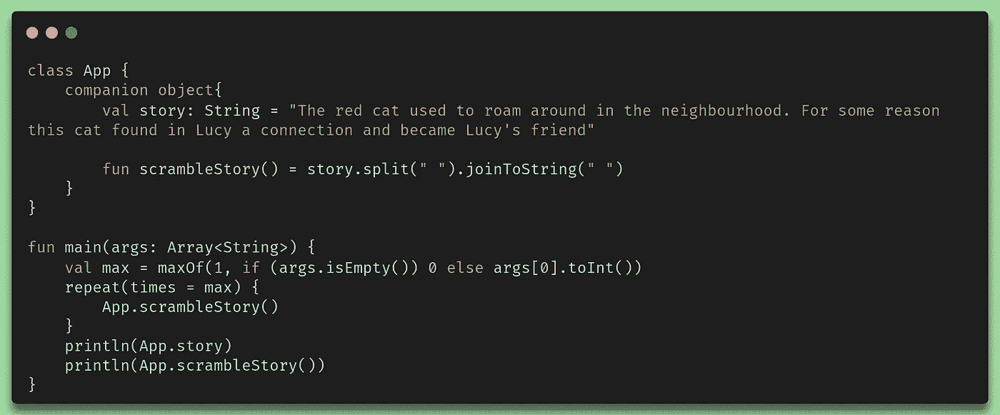**

****没有 C 互操作性绑定的本地运行器****

**该示例的创建方式与创建**良好体验**示例的方式相同。**

# **3.3.[带 C 互操作绑定的 Kotlin 本机运行程序运行程序](https://github.com/jesperancinha/whiskers-kotlin-native/tree/main/whiskers-runners/whiskers-runners-native)**

**B 在解释 Kotlin 本地运行程序如何与 **C** 互操作性一起工作之前，考虑一下为什么在这种特殊情况下运行代码会有意义可能是很重要的。如前所述，在 **C** 中创建代码提供了一种通过 Kotlin 代码创建本机代码的替代方法。这可以为创建新软件提供多种可能性。在这种情况下，我们想要测试的是当运行同一个 runnable 时会有什么样的影响，特别是我们使用 C 代码而不是 **Kotlin** 代码。现在我们可以继续有趣的部分，这就是 C 绑定的创建。但在我们开始之前，我想分享一些我在做这件事时很快意识到的事情:**

*   **很难将 **Kotlin 原生编译 C 代码**配置到最终编译的 runnable 中，使其适用于每台机器。**
*   **在这个例子中，我发现单独编译 **C 代码**，然后用 Kotlin native 将编译后的本机代码引入程序集中会更好。**

**所以首先我们创建我们的小图书馆。这是头文件:**

**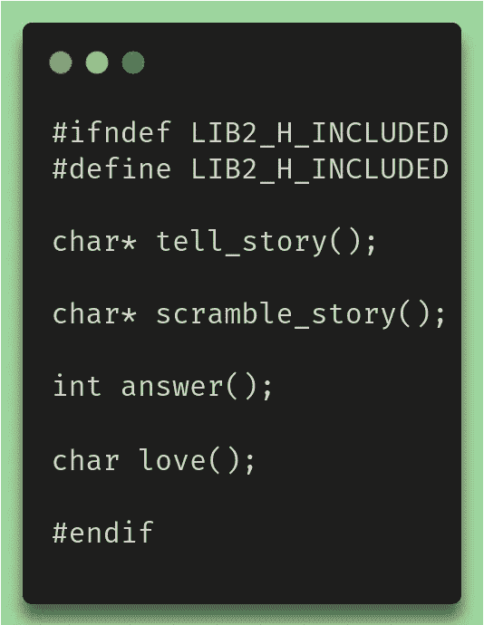**

****redcat.h****

**现在我们需要实现文件 **(** `**redcat.c**` **)** :**

```
#include "redcat.h"
#include <stdio.h>
#include <string.h>

static char c[255] = "The red cat used to roam around in the neighbourhood. For some reason this cat found in Lucy a connection and became Lucy's friend\0";
static char str[sizeof(char*)*256];
static char delim[] = " ";
static char result[sizeof(char*)*256];
static char array[sizeof(char*)*256];

char* tell_story() {
    char *namePtr;
    namePtr = c;
    return namePtr;
}

char* scramble_story() {
 char* story = tell_story();
 memcpy(str, story, sizeof(char*)*256);
 int init_size = strlen(str);
 char *ptr = strtok(str, delim);
 while (ptr != NULL)
 {
  memcpy(array, ptr, sizeof(char*)*256);
  strcat(result, array);
  strcat(result, delim);
  ptr = strtok(NULL, delim);
 }
 strcat(result, "\0");
    char *namePtr;
    namePtr = result;
 return namePtr;
}
int answer() {
  return 42;
}

char love() {
    return 'L';
}
```

**在我的例子中，我想要的只是一个**静态库。**这最终是 **Kotlin 本机编译器**访问我们用 c 开发的代码所需的。这是我们代码的二进制本机版本，我们也可以将其注入 Kotlin 代码。在该项目的 **Make** 文件中，我们将看到这组指令，以便能够将我们的代码编译成我们需要的二进制文件:**

```
gcc -c "-I$(PWD)" src/nativeInterop/cinterop/code/redcat.c -o src/nativeInterop/cinterop/code/redcat.o

ar rcs src/nativeInterop/cinterop/code/redcat.a src/nativeInterop/cinterop/code/redcat.o

./kotlin.native/bin/cinterop -def src/nativeInterop/cinterop/redcat.def -compiler-options "-I$(PWD)/src/nativeInterop/cinterop/code" -o src/nativeInterop/cinterop/code/redcat.klib

./kotlin.native/bin/konanc -l src/nativeInterop/cinterop/code/redcat.klib src/nativeMain/kotlin/Main.kt -linker-options src/nativeInterop/cinterop/code/redcat.a -o main
```

**用`**gcc**` 我们得到构建我们的 o 文件。简而言之，`.**o**`文件是`**.h**`和`**.c**`文件的合并。这就是所谓的**对象**文件，编译器可以用它来链接所有需要的**对象**，以创建最终的可执行文件或二进制文件。`**ar**` 命令从指定的**对象**文件创建一个静态库。**

**下面我们使用的命令是`**cinterop**`命令。`**Cinterop**`属于**科特林-原生库**。我提供了在本地安装它的方法。有一个关于这个的脚本叫做`**install-kotlin-native-linux**` 但是现在，这并不重要。`**cinterop**` 所做的正是它名字中的内容。C 表示 C 语言的 **C** ，而 **interop** 代表**互操作性**。生成的文件是一个`**readcat.klib**`文件。如果我们在命令行中键入这个文件，我们将得到类似这样的结果:**

**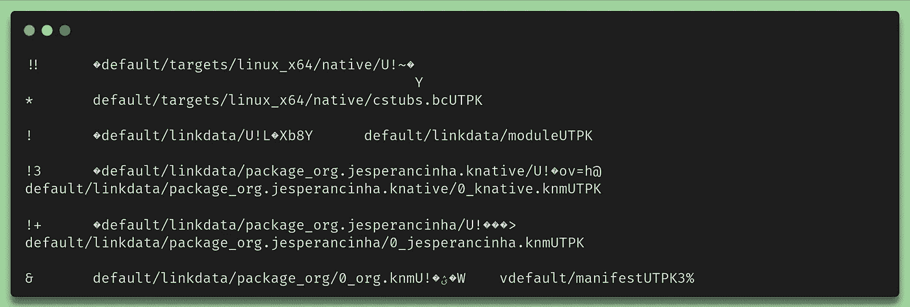**

****文件内容的最后一行** `**redcat.klib**` **库****

**看着眼熟？如果不是的话，这不是问题，但是请记住我们在查看 **Kotlin 原生 SDK** 的内容时上面的几段话。我们自己的图书馆也是如此。`**Klib**` 文件是 **Kotlin** 原生世界中的**jar**，`**knm**`文件与`**Klib**` 文件几乎相同，但在 **SDK 中。**最后我们有了`**Klib**` 文件，可以导入到我们的项目中。方法是使用`**.def**` 文件。这些文件需要默认位于`**src/nativeInterop/cinterop**` **、**中，但不一定。我们将明确地做所有这些，这样我们就知道它是如何工作的了。所以在我们进入`**.def**` 文件的细节之前，让我们先来看看`**build.gradle.kts**` 是如何工作的:**

**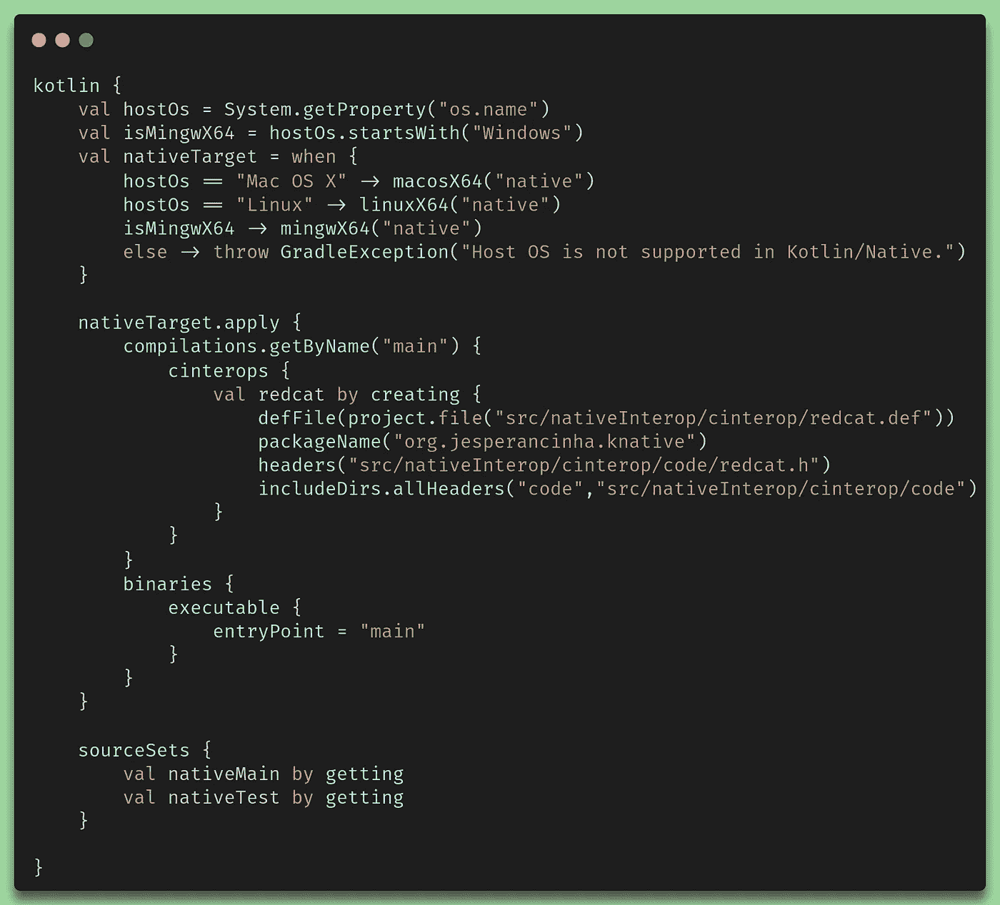**

****提供与 C 互操作性的梯度定义****

**我们之前已经介绍过多平台插件的用法。对于这种配置，我们将更深入地了解一下`**cinterops**` 配置。在那里，我们发现我们创建了一个名为 redcat **的变量。**这个变量是我们**red cat**library**的配置。`**defFile**` 是一个接受包含我们之前提到的`**.def**`文件的**文件**的方法。`**packageName**`是我们想要通过`**C**`代码生成的包。**头文件**是用来配置我们需要的所有头文件的方法，最后，我们包括了编译器应该找到所有头文件的目录。我们之前提到过，我们手动进行编译，以避免编译时出现问题。这最后两个属性`**headers**` 和`**includeDirs**`对于我们的具体情况是不必要的。****

**最后，让我们看看我们的**。def** 文件！**

**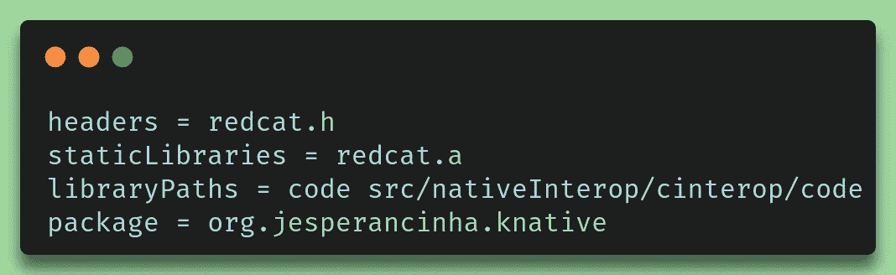**

****。def 文件** `**redcat.def**`**

**`**staticLibraries**`属性是我们在这个文件中感兴趣的一个属性。还有更多属性可以使用，包括编译器的路径、您可能使用的编译器以及扩展的配置量。对于本文，正如我们之前提到的，现在担心这个还没有意义，因为编译时没有使用**。def** 文件只是更容易。然而，这可以在另一篇文章中讨论，同时在这里[你可以找到更多关于如何](https://kotlinlang.org/docs/native-c-interop.html)[配置的信息。更高级别的 def 文件](https://kotlinlang.org/docs/native-c-interop.html)。**

**最后，我们可以检查我们的代码:**

**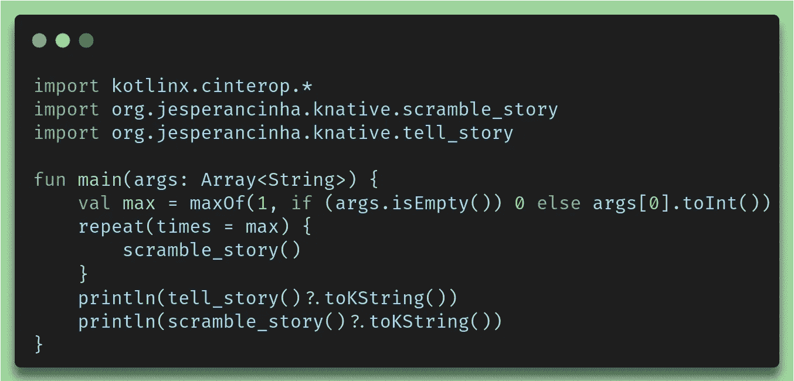**

****kot Lin 代码中的 C 互操作性****

**如果我们仔细看看，我们会看到我们的包`**org.jesperancinha.knative**`。我们可以看到我们得到了`**tell_story**`和`**scramble_story**`方法。这太棒了！我们可以就命名方法进行长时间的讨论，但是我认为约定的讨论不应该出现在本文中，因为我们要看一下 Native 在不同框架的性能方面的表现。**

**也许提及`**toKString()**`方法的作用也很重要。我们在代码中看不到它，但是`**tell_story**`和`**scramble_story**` 都返回了类型`**CPointer<ByteVar>**` 。这只是一种在内存中表示一个指向字符串开始的指针的方式。如果你不知道什么是指针，先[查一下什么是 c 指针可能是个更好的主意](https://www.guru99.com/c-pointers.html)。因此，通过互操作性， **Kotlin** 将返回的**字符串**解释为**字节流**流。既然这是**科特林**那么我们当然有一个方便的方法来为我们做一切事情，这个方法叫做`**toKString()**` **。****

# **3.4.[企业 Kotlin 原生 Ktor 服务实现](https://github.com/jesperancinha/whiskers-kotlin-native/tree/main/whiskers-ktor)**

**Okot Lin Native 让它如此有趣的一个方面是，它允许我们以创纪录的启动时间和最小的资源内存使用来创建服务。还可能有其他好处，如性能。这里我们将使用 Ktor 生态系统中唯一可能的替代品，即 **CIO(基于协程的 I/O)** 引擎。**

**对于本节，我们将使用我们在以上所有章节中已经建立的知识来创建一个服务。如果你习惯于`**Spring**`、`**Micronaut**`或任何其他 **web 服务框架**，你会发现这很容易理解。如果没有，我会尽量说清楚。**

**让我们回顾一下我们在这个阶段想要构建 Ktor 服务的原因。我们想比较一下**科特林人**和**格拉尔姆人**。我们还想检查它们的异同。 **GraalVM** 主要用于将 jar 转换成可执行文件，而 **Spring Native Cloud** 用于创建我们可以在云中运行的容器。Spring Native 之所以是本地的，是因为它要么使用 GraalVM 要么使用容器化版本来运行。后者还使用表面下的 **GraalVM** 。Kotlin native 没有办法创建本地服务，除非使用由 **Ktor** 提供的 **CIO** 替代，它独立于 **GraalVM** 。**

**现在我们来讨论一下这些服务的另一个方面。为了让数据库工作，我不得不在互联网上寻找替代方案。有一个名为 [**SQLDelight**](https://github.com/cashapp/sqldelight) 的项目，它提供了我在 [**GitHub**](https://github.com/cashapp/sqldelight) 上的这个项目所需要的一些有用的绑定。在`**Philip Wedemann**`的另一个[项目](https://github.com/hfhbd/postgres-native-sqldelight)中，有允许连接到数据库的代码。于是我用 [**SQLDelight**](https://github.com/cashapp/sqldelight) 和来自[**postgres-native-SQL delight**](https://github.com/hfhbd/postgres-native-sqldelight)**的一些提示，创建了一个位于 **Database.kt** 类的小驱动。驱动程序的实现方式非常复杂，对本文来说没什么用处。重要的是，CIO 允许服务在本地编译，而不需要借助转换。尽管如此，理解我们如何从本机代码访问对象还是很重要的。****

****在这个实现中，我们只是下载 Postgres 驱动程序，提取它，编译它，然后我们使用下面的`**.def**` 文件创建链接:****

****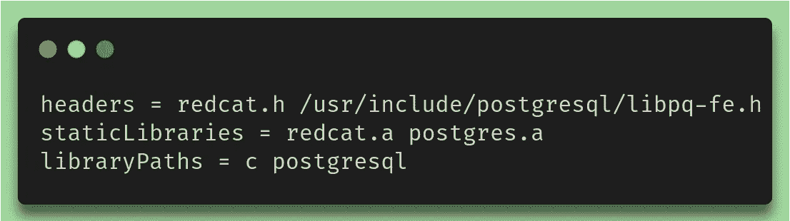****

******Redcat 定义******

****正如我们在上面的脚本中看到的，我们仍然需要从通用的 **postgresql** includes 中访问一个 **libpq-fe.h** 文件。为此，我们还需要在本地安装一些库:****

********

****【Linux 必需的 Libpq 库****

****完成后，我们仍然需要编译我们之前下载的整个驱动程序目录，这是使用以下命令序列完成的:****

```
**./configure
make all**
```

****[**postgres**](https://github.com/jesperancinha/whiskers-kotlin-native/tree/main/whiskers-ktor/postgresql) 目录包含我添加的脚本，用于自动执行所有必要的操作。在我对这个设置的调查中，我还发现成功编译`**libpq**` **还需要一个文件`**explicit_bzero_chk.c**` 。有很多关于如何更好地做这件事的建议，但是我找到了我做这件事的方法，一个完美的执行我的测试的方法。这可能不是我们在生产中应该做的，但是当我们等待 PostgreSQL 的可靠的本地库发布时，除了寻找实现它的最佳方式，我们没有太多的选择，因为目前，关于如何本地使用 SQL 没有太多的规则，也没有太多的替代方法。******

**让我们最后快速浏览一下`**build.gradle.kts**`文件:**

**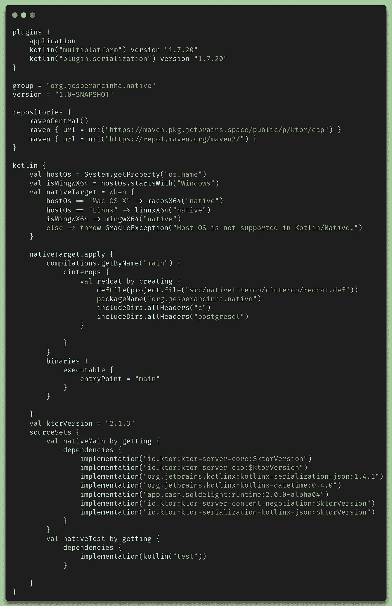**

****为 Ktor 服务建立 gradle 文件****

**我发现在实现原生服务时有一点非常限制，那就是一切都需要通过插件激活才能工作。如果我们仔细想想，这确实是有意义的，因为与科特林本地人合作是完全不同的事情。我们使用的所有库都需要能够支持**本机**，这也意味着，在 **Kotlin** 端，我们只能看到接口，而看不到实现。这意味着，为了能够使用一些 jar，我们需要标准支持。这在很大程度上限制了这个 **CIO** 服务器的实现。这也是我没有导入 **Philip Wedemann 提供的[库](https://github.com/hfhbd/postgres-native-sqldelight)的部分原因。**本地库很难配置，并且这个特定的库仍然非常依赖于特定的本地配置。我这样做，允许我们使用 **Libpq** 链接到为本地 Linux 机器优化的编译库。**

**最后，我们可以看看 **CIO** 服务器是如何实现的。它基本上遵循了许多企业解决方案所遵循的典型的**洋葱**模式，例如 **Spring** 、 **JEE** 、 **KumuluzEE** 、 **Micronaut** 等。它本质上只是一个 MVC 实现。但是，让我们来看看端点实现:**

```
embeddedServer(CIO, port = configuration.server.port) {
    routing {
        install(ContentNegotiation) {
            json()
        }
        get {
            call.respondText("Welcome to the Cat Ktor Service!")
        }
        route("/cat") {
            route("/sayings") {
                get {
                    call.respond(listOf<CatSaying>())
                }
                get("/encoded") {
                    call.respondWithEncodedFlow(status = OK, listOf<CatSaying>())
                }
            }
            route("/saying") {
                post {
                    val catSaying = call.receive<CatSaying>()
                    call.respond(status = Created, catSaying)
                }
            }
        }
        route("/story") {
            route("/paragraph") {
                post {
                    val paragraph = call.receive<Paragraph>()
                    call.respond(status = Created, paragraph)
                }
                post("/encoded") {
                    val paragraph = call.receive<Paragraph>()
                    call.respondWithEntity(status = Created, paragraph)
                }
            }
            route("paragraphs") {
                delete {
                   call.respond(status = Accepted,"")
                }
                post("/encoded") {
                    val paragraphs = call.receive<List<Paragraph>>()
                    call.respondWithEncodedFlow(status = Created, paragraphs)
                }
                get {
                    call.respond(listOf<Paragraph>())
                }
                get("/encoded") {
                    call.respond(listOf<Paragraph>())
                }
            }
        }
    }
}.start(wait = true)
}
```

**这个`**CIO**`实现是我们对所有服务进行测试的方式。本质上，我们将对 cat 语句执行`**GET’s**`，我们将`**POST’s**`将段落插入数据库，我们将`**GET**`它们，并且还将测试算法以编码的方式`**GET**`它们。我们将进一步了解将进行哪些测试。**

# **4. [GraalVM](https://github.com/jesperancinha/whiskers-kotlin-native/tree/main/whiskers-graalvm)**

**G **raalVM** 是一个高性能的运行时，它支持许多不同的语言，如 **Java** 、 **Javascript** 、 **LLVM** 语言等。在这一节中，我们将了解的特定功能是 **GraalVM** 创建本机映像和可执行文件的方式。这个想法是，我们选择一个可运行的 jar 文件，然后将它转换成可在命令行中使用的可执行文件或在云中使用的 docker 映像。对于 GraalVM，我们将使用市场上最受欢迎的框架之一 Spring Framework。我们将使用其反应形式，这是 Ktor 的首席信息官的工作方式。然而，我们需要记住，在本节中，我们并没有将 Spring 与 **CIO** 一起使用。相反，我们将使用 Netty，它通常是 Spring 的反应式实现的默认服务。我们还需要考虑这可能会对我们的结果产生影响，因为简单地说， **CIO** 不是 **Netty** 。**

**在这一点上，我应该给你一个警告(如果以前没有给过的话),用 GraalVM 构建东西的资源消耗和用 Kotlin Native 构建一样高。请准备好**内存不足问题**、**机器挂起**，不得不重启**、**等。执行构建有时会非常困难和令人沮丧。**

# **4.1.[可运行的 jar 实现](https://github.com/jesperancinha/whiskers-kotlin-native/tree/main/whiskers-runners/whiskers-runners-graalvm)**

**借助 GraalVM，我们可以轻松地将 jar 转换成可执行的本地应用程序。在本文后面的内容中，我们将看到用 GraalVM 实现事情是多么容易，但是首先让我们看一下我们的`**gradle.build.kts**`文件:**

**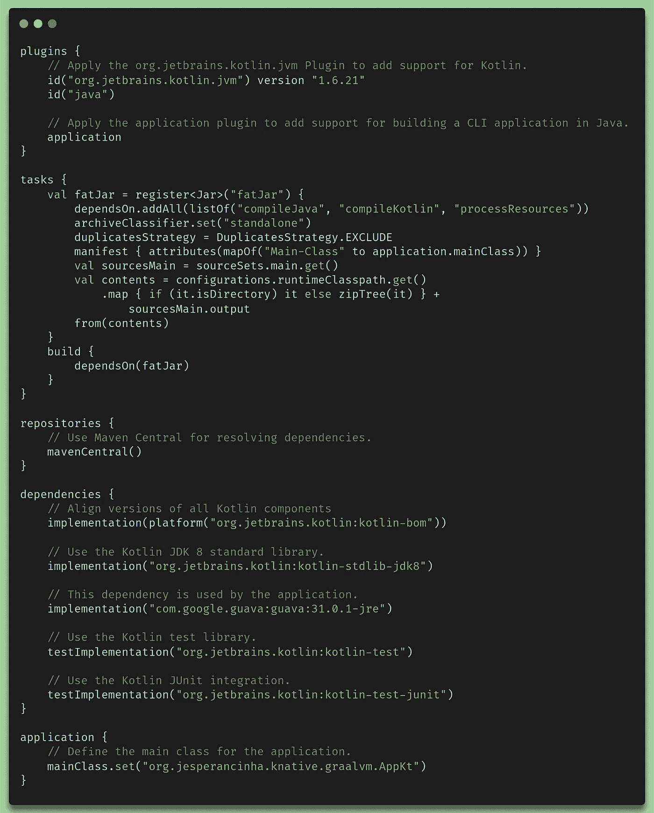**

**`**gradle.build.kts**` **配置文件进行编译****

**您可能刚刚意识到，无论如何都没有对 **GraalVM** 的引用。这是因为这只是一个普通的 **GraalVM** 项目。但是，我们将通过发出以下命令来生成一个本地 runnable:**

```
$(JAVA_HOME)/bin/native-image -jar build/libs/whiskers-runners-graalvm-standalone.jar
```

**这样做的目的是在根目录中创建一个生产就绪的本机映像。**

**这将创建一个名为`**whiskers-runners-graalvm-standalone**` 的程序，它将包含与本机对应的 **Kotlin** 完全相同的代码。**

**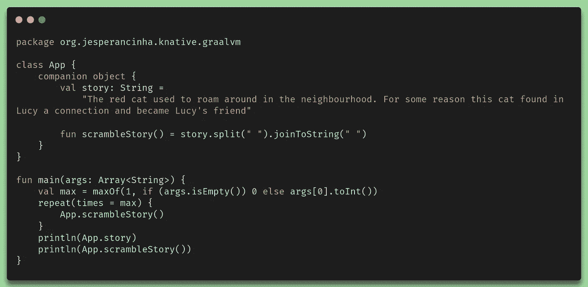**

**可运行的 GraalVM 本机应用程序的 Kotlin 代码**

# **4.2.[企业 Spring 原生服务实现](https://github.com/jesperancinha/whiskers-kotlin-native/tree/main/whiskers-graalvm)**

**pring 为我们提供了实现本地解决方案的不同方法。其中之一是一个独立的解决方案，它本质上允许我们在一个本地包中创建一个已编译的服务，该服务可以在我们选择的操作系统中运行。对于这种情况，我们的 **Gradle** 文件需要考虑一种配置来允许这种情况发生。让我们来看看:**

****

**`**gradle.build.kts**` **为 GraalVM 可运行****

**花一点时间来找出在这种配置中可能与 GraalVM 相关的内容。如果您没有找到它，这真的不是问题，因为它在文件的任何地方都不可见。它就是`**org.springframework.experimental.aot**` 插件。它的 [**已经包含了**](https://docs.spring.io/spring-native/docs/current/reference/htmlsingle/#_linux_and_macos)[**spring-native**](https://github.com/spring-projects-experimental/spring-native)插件。要生成一个可运行的文件，我们只需运行以下命令:**

```
./gradlew nativeCompile
```

**在展示生成可执行文件的位置之前，让我们先看看代码。它是按照**洋葱**设计模式实现的，创建了大多数 **Spring 框架 MVC** 环境；**

**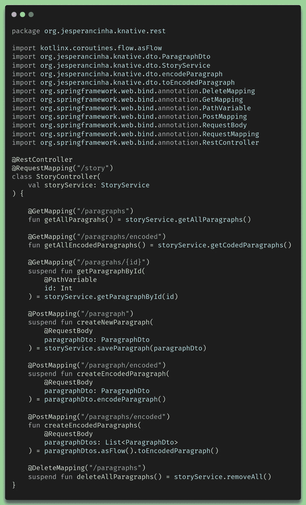**

****故事控制器****

**对于应用程序的其余部分，一切都以这种方式完成。**

**构建完成后，可运行的将从模块的根目录开始在这个位置可用:**

```
./build/native/nativeCompile/whiskers-graalvm
```

# **4.3.[企业 Spring 云原生服务实现](https://github.com/jesperancinha/whiskers-kotlin-native/tree/main/whiskers-cloudnative)**

**云原生实现允许我们创建一个优化的映像，在 Spring Cloud Native 创建的容器中运行我们的可执行原生包。它是如何工作的，它调用哪个图像，以及它创建的容量对我们来说不再重要，不再是一个问题。我们只需创建云原生映像，然后就可以在容器中运行我们的原生解决方案。现在，让我们来看看 Gradle 构建文件:**

**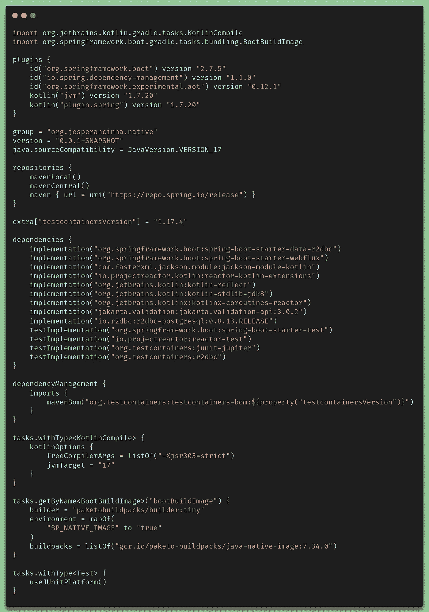**

**`**gradle.build.kts**` **为 GraalVM 云原生映像****

**在这个`**gradle.build.kts**`文件中，很容易看出[与](https://docs.spring.io/spring-native/docs/current/reference/htmlsingle/#getting-started-buildpacks)的不同之处。你能看见它吗？**

**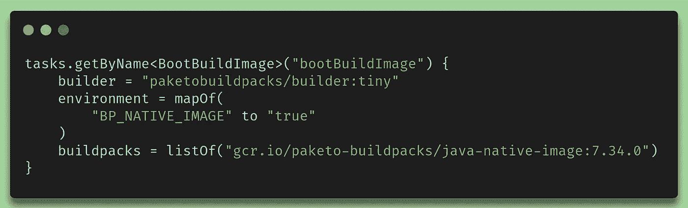**

****本地云映像构建的 bootBuildImage 脚本****

**因此，使用这个`**BootBuildImage**` 任务，我们可以轻松地构建一个映像，该映像将被推送到我们的本地 Docker repo，它将被命名为:`**whiskers-cloudnative:0.0.1-SNAPSHOT**` **。****

**这使得用一个简单的命令行运行变得很容易:**

```
**docker run whiskers-cloudnative:0.0.1-SNAPSHOT**
```

# **5.运行应用程序**

**为了能够运行这些应用程序，我在项目的根目录和各个模块的根目录下创建了大量的脚本。很难保证这能在你的 Linux 机器上运行，但是我已经在两台 Linux 机器上测试过了，它看起来运行得很完美。所以分步骤来说，这就是我们需要做的。**

1.  ****安装环境:运行****
2.  ****安装所有必要的软件包:运行****
3.  ****手动安装所有必要的可再发行软件:运行** `**. ./init.sh**`**
4.  ****生成构建:运行** `**make b**`**
5.  ****运行所有测试:运行** `**make measure-all**`**

**所有这些运行都需要一些时间来完成。我建议您在运行构建时不要打开 IntelliJ。构建会消耗资源，但也会创建大量的**增量文件**，这将使 **IntelliJ** 完全混乱。如果你遇到问题，你可能会，请打开我的回购问题。我很乐意帮助你。支持本文的 repo 可能永远也不会支持这个星球上的每一台机器，因为它与生俱来的特性，但是我会尽我所能尽可能接近这个目标，有了您的投入，我会更快地达到这个目标。**

# **6.性能测试**

**如果您成功运行了所有测试，您应该会在[**results . MD**](https://github.com/jesperancinha/whiskers-kotlin-native/blob/main/Results.md)**f**文件中获得最终结果:**

**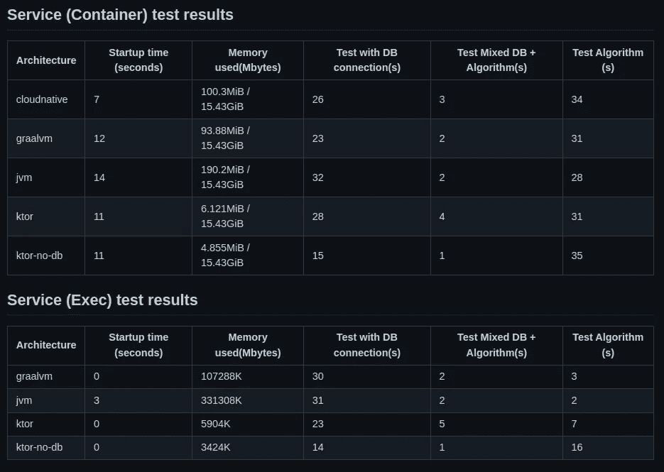**

**运行服务结果**

****

**跑步者结果**

# **7.结论**

**在研究 Kotlin Native 及其工作原理时，我们已经在这篇文章中看到，现实总是比宣传的差一些。我真的很喜欢 Kotlin Native 的想法，我认为这是一个很好的扩展，让我们走出自己的舒适区，简单地说就是尝试一些新的东西。**

**这就是我想要的，也正是我在写这篇文章和实现这个案例来支持它时所实现的。我确实看到了更快的启动时间，我也确实看到了这方面的未来，也就是因为我们节省了大量资源。**

**不幸的是，就性能而言，并不是一切都很清楚。在 80 年代，我们习惯于在直接使用 C 和 C++时手动处理内存。然后 Java 在 90 年代后期成为主流。Java 的初始阶段进行得非常顺利，因为大多数开发人员并不想为内存而烦恼，而且大多数开发人员想要一种更高级的语言。科林在 2010 年左右来到现场，想法是一样的。简而言之，科特林想把 Java 带到一个更高的水平。这一点确实已经实现。JVM 一直在不断发展，变得更高效、更好。在我个人看来，本地化的想法与所有这些相矛盾，因为在某种程度上，我们对本地代码的工作方式给予了信任，并且在软件开发方面真正回到了我们的根本。这实际上可能是一个好迹象。在大学时，我的一位老师一直告诉我“你必须学习 C，Java 只是一种时尚”。几年后，科特林本地人相信了我老师最初说的话。但是不幸的是，回到 C 语言或者让 Kotin 编译成本地代码也意味着 C 语言背后的人，甚至普通的开发人员也需要知道 C 语言是如何工作的，这也意味着回到学习内存分配是如何工作的。这也意味着学习`**pointers**`如何工作、`**memory references**`如何工作、`**string** **terminators**`、`**pointers**`的`**pointer**`、`**pointers**`、`**struct**`等的内容。这可能是我们在测试性能时看到的有趣现象的原因。看起来，对于一个已经运行的进程来说，本机代码实际上会降低性能。如果 JVM 如此复杂，以至于它比我们几分钟内能想到的任何东西都要好，那么它可能是比本地化更好的选择。**

**因此，这篇文章的关键点是，当涉及到一般的本地化时，有几个优点和缺点，这两个优点和缺点同样适用于科特林本地人和 T21 本地人。所以我们来列举一下:**

****优点**:**

*   ****极快的启动时间**——但不要忘乎所以。我们说的是几秒钟的差别。对于没有耐心的人来说，这可能是一件好事。如果你正在考虑多次启动多个进程，那么这也是一件值得你关注的事情。**
*   ****低内存使用率**——毫无理由地继续使用 JVM 会对你的预算产生巨大的影响。对于多次运行的服务器或服务，它们执行的任务不需要高性能，也不需要符合苛刻的 SLA 和高可用性要求，这可能是一个理想的选择。**
*   ****即时峰值性能** —这是本机应用程序的一个通常不太好解释的属性，这意味着 **JIT** 在运行的应用程序中不起作用，因为应用程序所需的一切都已经提前编译好了( **AOT** )。这只是意味着一旦应用程序启动，它将不会执行任何优化任务，因为它发生在**即时**编译器( **JIT** )中。这就是为什么多个短时间运行比**本地**和**JVM**中的长时间运行性能更好的原因。**
*   ****不需要运行 JVM —** 我们可以在任何我们想要的地方运行可执行文件，而不需要担心 JDK 是否可用或者版本是否正确**
*   **安全问题——因为我们正在使用本地编译的代码，而且我们已经在线运行了，大多数与 JVM 相关的安全问题都不再是问题。与运行中的 jar 可执行文件相比，本地编译的可执行文件在运行时更难更改。**

****缺点**:**

*   ****缓慢的性能风险**——正如我们在结果中看到的，无论我们以何种形式尝试，本机代码的性能似乎都比在 **JVM** 中运行的常规代码差得多。**
*   ****编译时间—** 在本机编译时，编译时间可能是一场噩梦。这对 **GraalVM** 和 **Kotlin Native** 有效。它还消耗了如此多的资源，以至于开发人员可能会发现他们的机器刚刚被阻塞，内存刚刚用完，他们不得不重新启动他们的机器。关键是，等待代码编译这么长时间并没有那么有用。这会影响开发时间和开发成本。**

**如果我们分析一下**和**的利弊，我们可能会相信**《原生》**也是一个不错的故事，但它还没有入围。对我来说，它真的很重要，但不是大多数情况下。有了这篇文章和它的案例，我已经可以保证这一点，正如我之前提到的，如果我们想要启动几个独立的有限进程， **Kotlin** native 目前是最好的选择。对于服务，我相信我们仍然需要等待 **CIO** 的发展或者 **Netty** 最终也支持**原生**。目前，我仍然看不到原生使用服务的明显好处。恰恰相反。**

**就数据库的使用而言，每次运行的结果差异如此之大，以至于我无法做出任何结论。 **Netty** 和**PostgreSQL****Native****Support**for**kot Lin**仍在开发中，所以我对得出任何有意义的结论的期望并不高。然而，一旦**本地支持最终可用**，项目已经准备好执行测试。需要指出的另一件事是，尽管 CIO 支持协程，但我不能被动地访问数据库。这意味着数据库访问测试是以对数据库非反应性的方式进行的，这对我们回复客户端的方式有不利影响。**

**说到可运行测试，我确实看到了一些线索，表明在 **C** 中使用我们自己的实现可能比使用 **Kotlin-Native 的**自己的实现性能好一点。准确地说，在我们的示例中，相差 **161** 到 **28** 秒。无论如何，互操作配置本身似乎根本不会影响性能。**

**最后，我只想提一下，这篇文章不会有大的更新，只会有修改。当最终本地服务在运行性能方面优于普通服务时，我会再写一篇文章。这一个因为历史原因留了下来。**

**我希望这篇文章能增加你对 T2 科特林语母语的兴趣。很明显， **Kotlin Native** 由于其性质仍然有相当多的限制，并且可能永远如此，但它确实显示了独立执行的好处。它的工作方式与 GraalVM 的工作方式完全相同。我在 **Kotlin** 中编写了整个代码，因为我不想通过采用另一种语言如 **Java** 或 **Scala** 来包含更多的差异，但是我想说的是关于 **Kotlin vs Java** 的观点。GraalVM 做了很多令人惊奇的事情，它已经可以兼容更多的东西。它本身已经可以使用已经在 **netty** 上运行的服务来创建**可执行文件**，并且我们对我们可以实现的内容没有任何限制。我们不必将 **GraalVM** 与 **Java** 一起使用，因为它基本上是独立于语言的。那么，为什么是科特林本地人呢？我不知道！我不知道为什么科特林本地人。在本文中，我找不到一个清晰的迹象来说明为什么 **Kotlin-Native** 与使用 **GraalVM 有任何不同。目前 **GraalVM** 确实提供了更多的可能性，但是从长远来看，我不知道 Kotlin-Native** 会发生什么。它们似乎是两种技术，很快将再次以某种受网飞启发的怀旧方式相互竞争，我已经准备好了解这种怀旧方式，并用一桶爆米花来消化。但是老实说，像 **Java vs Kotlin** ， **GraalVM vs Kotlin-Native** 这又是一种令人惊讶的`**good-story**` 并且仅此而已。`**Goed verhaal**` 反正用荷兰语。**

**我已经把这个应用程序的所有源代码放到了 [GitHub](https://github.com/jesperancinha/whiskers-kotlin-native) 上**

**我希望你能像我喜欢写这篇文章一样喜欢它。**

**我很想听听你的想法，所以请在下面留下你的评论。**

**感谢您的阅读！**

# **8.参考**

**[https://kotlinlang.org/docs/native-get-started.html](https://kotlinlang.org/docs/native-get-started.html)**

 **[## SQLDelight

### SQLDelight 从您的 SQL 语句中生成类型安全的 kotlin APIs。它验证您的模式、语句和迁移…

cashapp.github.io](https://cashapp.github.io/sqldelight/)** **[](https://github.com/hfhbd/postgres-native-sqldelight) [## GitHub-HF hbd/postgres-native-sqldelight:一个用于 SQL delight 的 Kotlin 原生 Postgres 驱动程序。

### SqlDelight 的本机 Postgres 驱动程序。您需要在您的$PATH 中安装并提供 libpq。此包已上传…

github.com](https://github.com/hfhbd/postgres-native-sqldelight) [](https://github.com/kotlin-orm/ktorm) [## GitHub - kotlin-orm/ktorm:一个用于 kotlin 的轻量级 orm 框架，具有强类型 SQL DSL 和…

### Ktorm 是一个直接基于纯 JDBC 的轻量级高效的 Kotlin 框架。它提供了强类型和…

github.com](https://github.com/kotlin-orm/ktorm) [](https://discuss.kotlinlang.org/t/kotlin-native-as-a-go-alternative-in-2021/23665) [## Kotlin(原生)作为 2021 年的围棋替代方案

### 大家好，我最近在 2019 年的这个论坛上读了一个比较 Kotlin/Native to Go 的帖子，我想知道是否…

discuss.kotlinlang.org](https://discuss.kotlinlang.org/t/kotlin-native-as-a-go-alternative-in-2021/23665) [](https://learn.microsoft.com/en-us/dotnet/core/deploying/native-aot/) [## AOT 本地部署概述。网

### 将您的应用程序发布为 AOT 本地应用程序会生成一个独立的应用程序，并且已经提前(AOT)进行了编译…

learn.microsoft.com](https://learn.microsoft.com/en-us/dotnet/core/deploying/native-aot/) [](https://en.wikipedia.org/wiki/Ahead-of-time_compilation) [## 超前编译-维基百科

### 在计算机科学中，超前编译(AOT 编译)是编译一个(通常)更高级别的…

en.wikipedia.org](https://en.wikipedia.org/wiki/Ahead-of-time_compilation) [](https://www.graalvm.org/why-graalvm/) [## 为什么选择 GraalVM？

### GraalVM 是为 Java 和其他 JVM 语言编写的高性能 JDK 发行版，同时支持…

www.graalvm.org](https://www.graalvm.org/why-graalvm/) [](https://blogs.oracle.com/java/post/simplifying-the-cloud-native-journey-with-graalvm-and-helidon) [## 使用 GraalVM 和 Helidon 简化云原生之旅

### Unsplash 渣打银行是一家国际银行和金融服务公司

blogs.oracle.com](https://blogs.oracle.com/java/post/simplifying-the-cloud-native-journey-with-graalvm-and-helidon)**