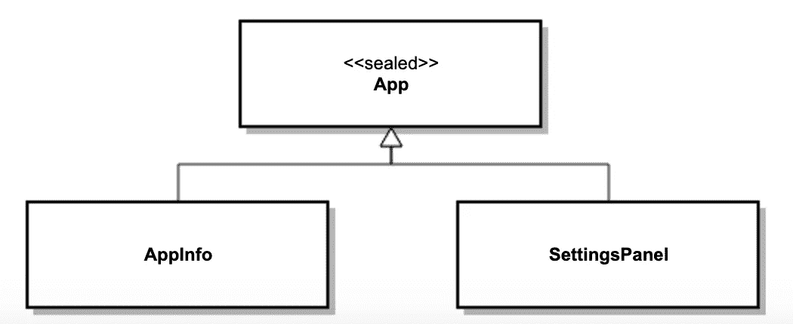

# Kotlin:密封类

> 原文：<https://itnext.io/kotlin-sealed-classes-70f83d6ab567?source=collection_archive---------6----------------------->

## 通过实例学习

## Android 中何时使用密封类的一个具体例子

密封类，不是密封类！

这里已经有[很多关于 Kotlin 密封类](https://medium.com/search?q=kotlin%20sealed%20classes)的文章，所以我不打算在这里重复我认为其他人已经充分涉及的内容。相反，本文将展示一个在 Android 代码中使用密封类的实际例子，以便您可以更好地了解如何以及何时利用它们。

在我们的例子中，我们将基于我上个月写的 [*创建一个 Android 应用启动器*](https://medium.com/swlh/creating-an-android-app-launcher-20519adcda10) 的文章。在那篇文章中，我展示了如何在自己的应用中创建一个功能来启动其他第三方应用。如果你还没有看过那篇文章，那么你可能想跳过去快速阅读一下。如果您已经阅读了这篇文章，并且查看了 GitHub 示例项目附带的[，那么您可能已经注意到在](https://github.com/ThomasSunderland/demo_applauncher)[appancherviewmodel](https://github.com/ThomasSunderland/demo_applauncher/blob/master/app/src/main/kotlin/com/babybillssoftwarefactory/applauncherdemo/viewmodel/AppLauncherViewModel.kt)类内部有一个名为 *App* 的内部密封类和一个名为 *AppInfo* 的 *App* 的具体子类。为了方便起见，它们又出现在这里:

有了我们的密封类 *App* 及其唯一的具体实现类 *AppInfo* 之后，我们现在能够在我们的[*appan cheradapter*](https://github.com/ThomasSunderland/demo_applauncher/blob/master/app/src/main/kotlin/com/babybillssoftwarefactory/applauncherdemo/view/adapters/AppLauncherAdapter.kt)*类[**中执行以下操作，当**](https://kotlinlang.org/docs/reference/control-flow.html#when-expression) 确定如何在我们的小 app launcher 对话框中呈现和处理 *App* 的实例时，如下所示:*

*现在这已经足够好了，但让我们继续想象我们的产品负责人后来对我们说*嘿，<在这里插入你的名字>，如果除了第三方应用程序之外，我们还可以直接从我们的应用程序启动对话框中显示一些新奇的* [*Android Q 设置面板*](https://developer.android.com/preview/features#settings-panels) *，这肯定会很酷。**

*有趣的想法假设产品所有者！我们知道当前的 *AppInfo* 类允许我们指定一个标签和一个图标，这两个标签和图标可能也是我们显示设置面板的快捷方式所需要的，但不幸的是，当前为我们的 *AppInfo* 对象调用的点击处理程序导致我们使用底层应用程序包的启动意图来启动应用程序，而这根本不是我们显示设置面板所需要的。*

*那么我们该如何着手实施呢？让我们扩展我们的密封类层次结构，好吗？现在，不仅仅是 *App* 的一个子类，我们将有如下的类层次结构:*

**

*代表上述类层次结构的更新代码在以下要点中详细显示:*

*正如你所看到的，我们简单地创建了 *App* 的第二个子类，名为 *SettingsPanel* ，它接受一个标签和图标，类似于 *AppInfo* ，但也接受一个表示要显示的设置面板的字符串。该字符串应该是设置之一。由 Android SDK 提供的面板常量在这里找到[。还要注意，app icon 字段被移到了 *App* 类中，因为它已经被证明是两个子类中的一个公共属性。](https://developer.android.com/reference/android/provider/Settings.Panel.html#constants_2)*

*有了这个更新的类层次结构，我们现在可以更新我们的适配器类，以支持应用程序和设置面板，如下所示:*

*值得注意的是，如果我们事先知道我们唯一支持的设置面板是音量设置面板，那么我们可以只创建一个继承自*应用*的*设置面板音量* [**对象**](https://kotlinlang.org/docs/reference/object-declarations.html#object-expressions) (singleton ),而不是更通用的*设置面板*数据类。在本例中，我们采用了数据类的方式，这样我们就可以支持现在和将来都支持的任何设置面板。*

*结论
Kotlin 密封类不仅允许类设计者有效地限制类的层次结构，还允许开发者进一步利用非常强大的 Kotlin [when](https://kotlinlang.org/docs/reference/control-flow.html#when-expression) 表达式。希望这个利用 Kotlin 密封类的具体例子能让你超越理论，进入实践。*

*编码快乐！托马斯·桑德兰*

* [## 托马斯·桑德兰-安卓开发者| LinkedIn

### 加入 LinkedIn 我叫 Thomas Sunderland，是一名软件工程师，专注于原生 Android 开发。我…

www.linkedin.com](https://www.linkedin.com/in/thomas-sunderland/)*