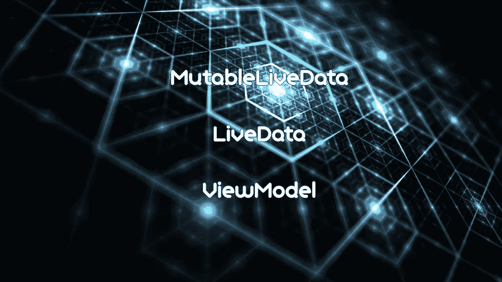
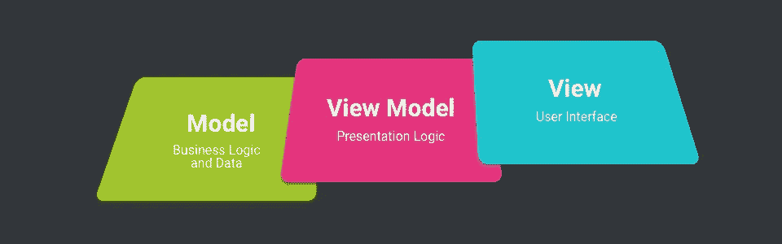
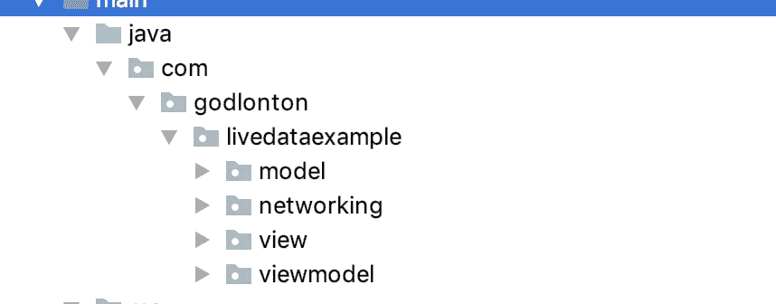

# 科特林:用 MVVM 来思考实时数据、可变实时数据、协同程序网络和视图模型——一个实际的例子

> 原文：<https://itnext.io/kotlin-wrapping-your-head-around-livedata-mutablelivedata-coroutine-networking-and-viewmodel-b552c3a74eec?source=collection_archive---------1----------------------->

L [iveData](https://developer.android.com/topic/libraries/architecture/livedata#java) 被创建为一个**生命周期感知数据** **容器，并考虑了观察者
模式。**所以基本上当数据改变时它会自动通知视图并改变它。当我们创建一个 LiveData 对象时，我们的视图，无论是活动还是片段，都将作为这个数据的观察者，然后更新，但仍然考虑生命周期状态。使用 LiveData，我们可以编写代码来观察这些数据变化，并相应地更新视图。

**使用 LiveData 的优势如** [**此处:**](https://developer.android.com/topic/libraries/architecture/livedata)

> **-确保您的用户界面与您的数据状态相匹配
> -无内存泄漏
> -不会因停止的活动而崩溃
> -不再需要手动处理生命周期
> -始终保持最新数据
> -适当的配置更改
> -共享资源** _ _ _ _ _ _ _ _ _ _ _ _ _ _ _ _ _ _ _ _ _ _ _ _ _ _ _ _ _ _ _ _ _ _ _ _ _ _ _ _ _ _ _ _ _ _ _ _ _ _ _ _ _ _ _ _ _ _ _ _ _ _ _ _ _ _ _ _ _ _ _ _ _ _ _ _ _ _ _ _ _ _ _ _ _

L 让我们从 *Kotlin* 中的一个**简单演示项目开始深入了解 LiveData、ViewModel、MutableLiveData 和 Coroutines。**

我们将使用 Retrofit2 进行 Rest API 调用，该调用将从服务器获取数据，并在 ViewModel 和 LiveData 的帮助下显示在 RecyclerView 上。

这个示例应用程序将演示以下组件。

*   LiveData
*   可变数据
*   视图模型
*   翻新 2
*   魔石
*   协程网络
*   滑音

## 创建新项目:

在 Android Studio 中使用 EmptyActivity 模板创建一个新项目，并将其命名为 LiveDataExample。现在将这些依赖项添加到 app/build.gradle 文件中。

MVVM 图

## 创建您的包/文件夹 MVVM 架构:

我们正在创建一个 [**MVVM 架构**](https://en.wikipedia.org/wiki/Model%E2%80%93view%E2%80%93viewmodel) ，因此为我们的 REST API 接口创建如下的文件夹结构*模型、视图、视图模型*和*网络*。

体系结构

## 创建您的模型:

我们将创建两个数据模型来匹配我们的[端点](https://androidwave.com/api/feed.json)，即 Blog 和 BlogWrapper。将这些放入您的模型文件夹包中:

## 创建 Rest API 接口服务:

将 Retrofit2 实例与协程端点设置为一体(为简单起见)。我们已经为 okHttp 客户端添加了一个超时，还注意到了 Moshi 转换器。:)

创建完成后，将它放入你的*网络*包文件夹。

## 为 LiveData 交互创建存储库:

把这个放到你的*视图模型*包文件夹中。

## 创建您的视图模型:

我们的 viewmodel 初始化我们的 BlogRepository，并用 getter 检索我们的 blog 数据。

## 现在让我们开始创建我们需要的所有 UI:

我们将创建 blog_item 和 activity_main.xml。

## 添加我们的 BlogAdapter:

## 最后，我们的主要活动:

现在，让我们将整个应用程序整合在一起。

正如您所看到的，LiveData 和 MutableData 处理数据在 UI 上显示的方式，并被动更新，这是一种比以前更好的处理 API 数据的方式。

我希望你喜欢这个教程，并对谷歌的架构组件有了更好的理解。

你可以在这里查看和下载最终完成的项目。

编码快乐！:)

 [## rgodlontonshaw/kot Lin-实时数据-MVVM-示例

### 演示应用程序，展示协程，实时数据和可变实时数据的使用…

github.com](https://github.com/rgodlontonshaw/Kotlin-Live-Data-MVVM-Example)